## Prerequisites
 - This tutorial is designed for SAP HANA on premise and SAP HANA, express edition. It is not designed for SAP HANA Cloud.
 - **Proficiency:** Beginner

## Details
### You will learn  
How to clone the SAP HANA `INteractive` Education source code from Git Hub, generate the dependencies and deploy the applications using Web IDE for SAP HANA.

### Time to Complete
**25 Min**

---


[ACCORDION-BEGIN [Step 1: ](Clone SHINE from GitHub)]

Open SAP Web IDE for SAP HANA and log in with a developer user.
>Note: By default, the URL for Web IDE in SAP HANA, express edition is `https://hxehost:53075`. You can use command  `xs apps` in space SAP in the Command Line Interface to find out the right

Right-click on the **Workspace** and click on **Git-> Clone Repository**:

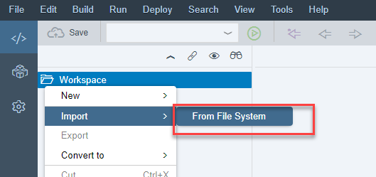

Copy the URL `https://github.com/SAP/hana-shine-xsa` into the `Clone Git Repository` prompt and click on **Clone**

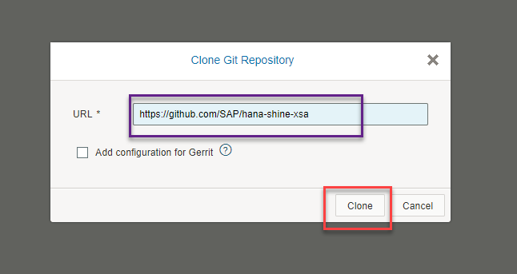

Wait until the repository is cloned. If you receive a dialog about `Git Ignore System Files`, please choose **Do it later**. You will see a success message on the top right corner of Web IDE and the folder in your workspace:

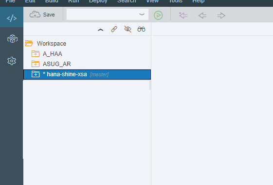

[DONE]
[ACCORDION-END]


[ACCORDION-BEGIN [Step 2: ](Set the project space )]

Right-click on the imported project and go to `Project Settings`:

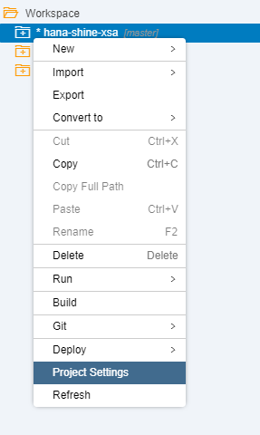

Set the space `development` to the project:

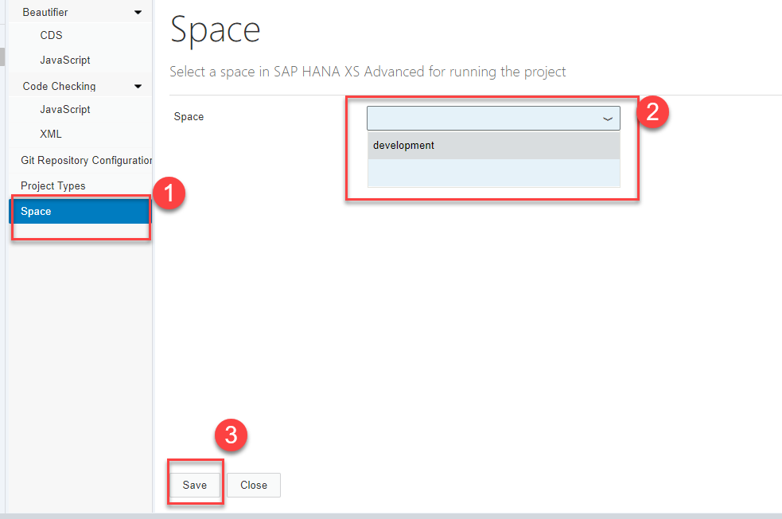

**Close** the settings dialog.

[DONE]
[ACCORDION-END]

[ACCORDION-BEGIN [Step 3: ](Edit deployment configurations)]

You will need to complete some configurations in the deployment descriptor with the proper endpoints.

Open the `mta.yaml` file and click on the **Resources** tab in editor mode. Select the `uaa` resource

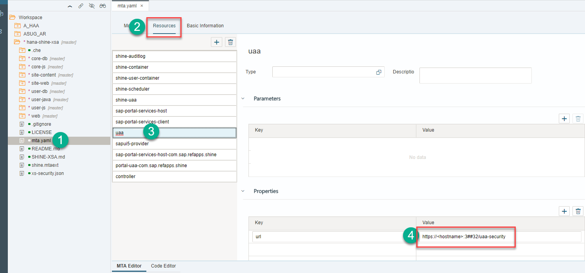

Replace the hostname and instance number with the right value for your system.

>Note: The default hostname for SAP HANA, express edition instances is `hxehost` and the default instance number is `90`.

For example:

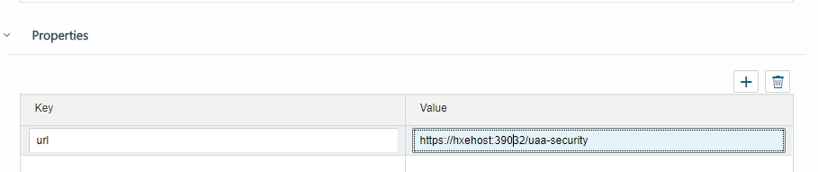

Click on the `controller` resource and replace the hostname and instance number again:

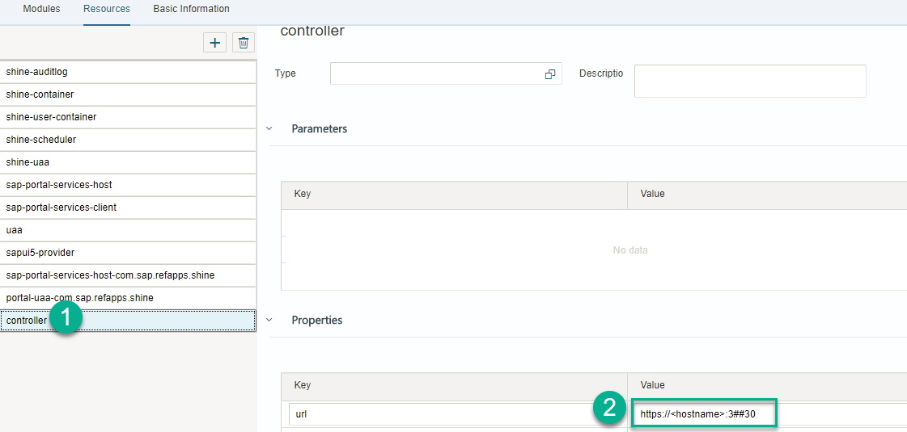

Finally, you will change the name of the service for the shine-container so you can access it from your own multi-target application later. Click on the `shine-container` resource and add a parameter called `service-name` and the value `shine-container`

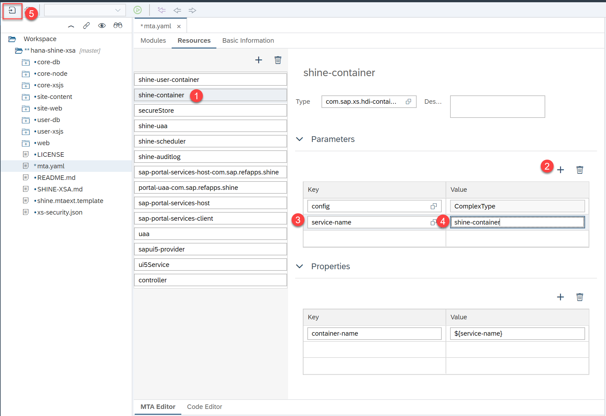

[DONE]

[ACCORDION-END]

[ACCORDION-BEGIN [Step 4: ](Create additional services)]

If you look at the list of resources in the `mta.yaml` file, you will find instances of the User Account and Authentication, the audit log and the job scheduler services. In order to meet the dependencies, these services need to be created. You can use the Command Line Interface for this, available in the server by default in SAP HANA, express edition instances. You can also install it locally using the download manager after you register in the [SAP HANA, express edition site](https://www.sap.com/products/hana/express-trial.html)

First, locate the file `xs-security.json` that was cloned with the SHINE Git repository from an SSH console. Alternatively, you can export it from Web IDE and upload it to the directory from which you will be issuing the commands.

```
sudo find / -name xs-security.json
```

Copy the result as you will need it later when creating the UAA service:

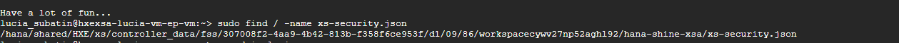

Log in to the XS CLI using command  `xs login` or `xs-admin-login`.


Make sure the job scheduler service is running using command `xs a | grep scheduler` in space SAP. If it is not running, start the necessary services using the following commands:

```
xs st jobscheduler-service
xs st jobscheduler-broker
```
For example:

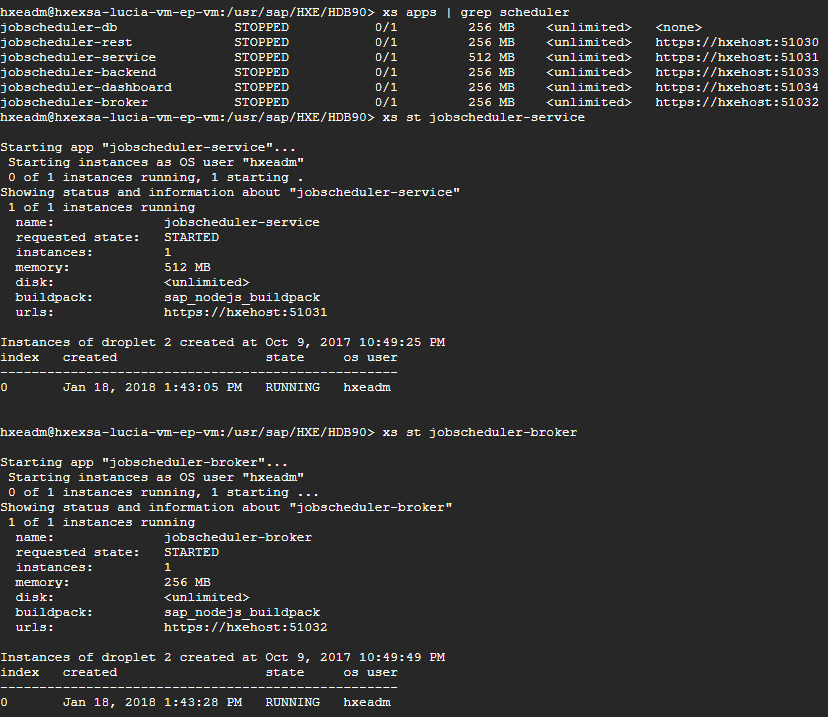

You can now create the services. Make sure you create them in the same space in which you will deploy the SHINE application. In this case, the space is `development`.

```
xs t -s development
xs create-service xsuaa default shine-uaa -c <<path to xs-security.json>>
xs cs jobscheduler default shine-scheduler
xs cs auditlog free shine-auditlog
xs cs hana securestore secureStore
```
For example:

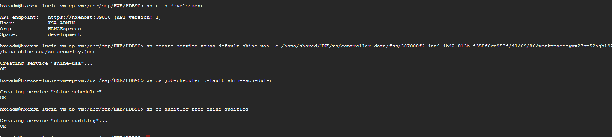

You will now make sure the proper services have been created. Run the following commands using CLI and copy the results in the validation below.

```
xs t -s development
xs s | grep shine
```

[VALIDATE_1]

[ACCORDION-END]

[ACCORDION-BEGIN [Step 5: ](Build the SHINE database modules)]

You will build the database modules first.  

Start with the module `user-db`. Right click on its folder and then on **Build**:

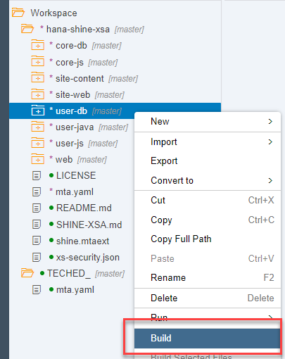

And make sure the build is successful.

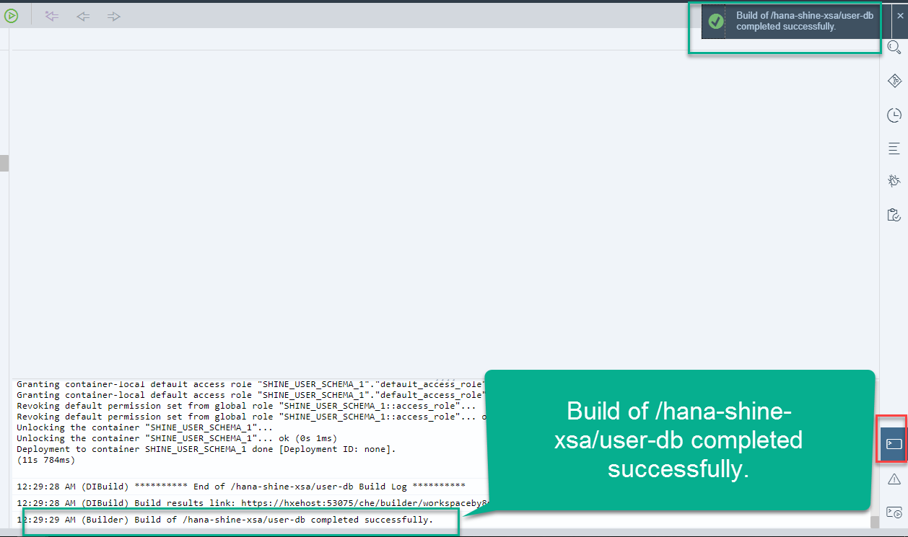

Repeat the steps with the `core-db` module.

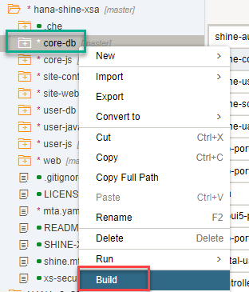

The rest of the modules will be built automatically before they are run in the next step.

[DONE]
[ACCORDION-END]

[ACCORDION-BEGIN [Step 6: ](Run the SHINE applications)]

You will now run the modules in an order that satisfies dependencies between them. They will be built automatically before running. If you encounter an error stating `No compatible version found`, use the latest version quoted in the error to update the `package.json` file in the module that is failing.

For example, right-click con the `user-xsjs` module and then click on `Run->Run as->Node.js Application`

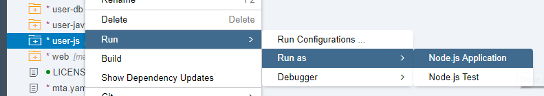

If you get a build error, click on the link to the **Logs**

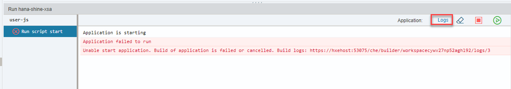

And take note of the versions suggested by `npm`

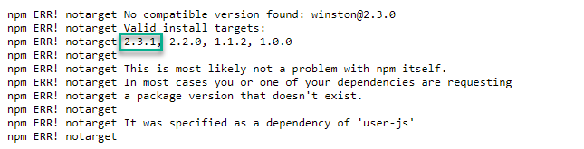

Open the `package.json` file for this module and update any dependencies that are needed according to the previous error log:

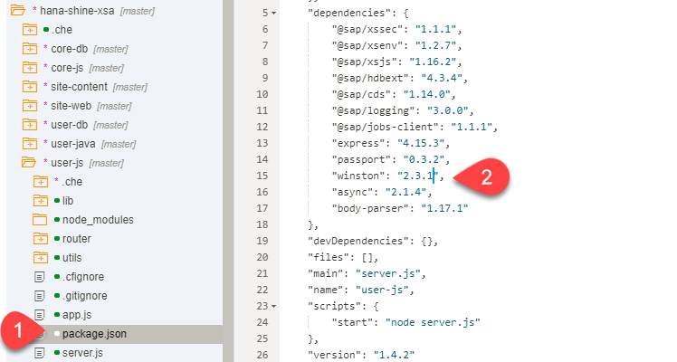

You can also get a hint of the dependencies you will need to adjust by right-clicking on each module and selecting **Show dependency updates**:

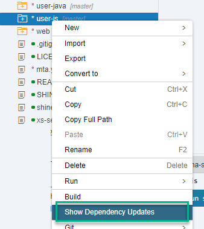

**Save** the `package.json` file with the updated dependencies and run the module.

Once the `user-xsjs` module is running, run the `core-xsjs` module:

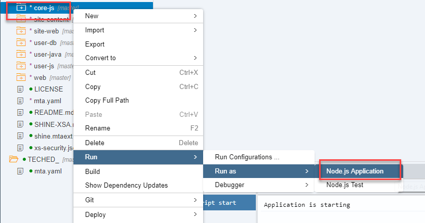

Then run the `core-node` module:

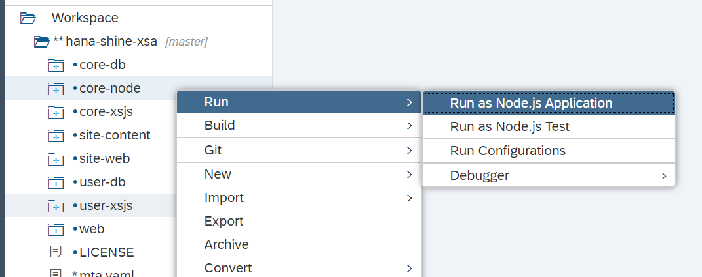

Check all the modules are running. You can quickly verify because you will see a green tick next to each one of them:
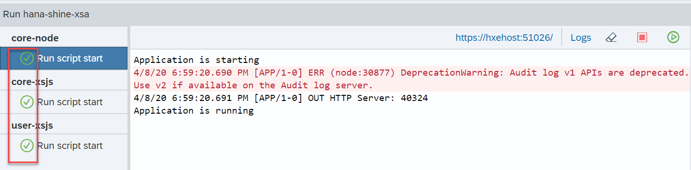

Finally, run the web module. Right-click on the `web->resources->launchpad->index.html` and click on **Run as Web Application**:

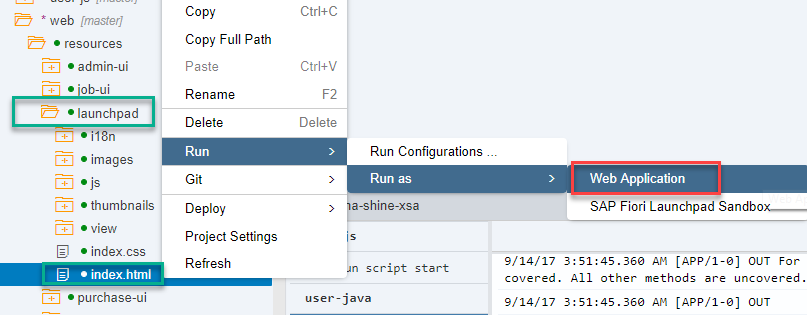

A new tab will open in the browser. You can click on the generated URL if the pop-up blocker did not allow the application to start.

>Note: If you get an error related to the version of SAP UI5, update the version of the resource `sapui5-provider` in the `mta.yaml` file. Switch to the SAP space first with command `xs s -t SAP` and take note of the version informed by command `xs mtas` in the CLI for the UI5 library.

[DONE]
[ACCORDION-END]

[ACCORDION-BEGIN [Step 7: ](Check prerequisites)]

You may need to log in again. Use **`XSA_DEV`** and the password you set up.

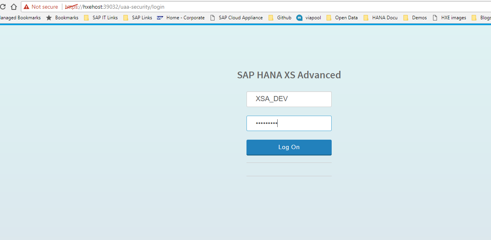

The first execution of the SHINE `launchpad` will help you make sure the technical prerequisites are fulfilled. Click on the **Check Prerequisites** button:

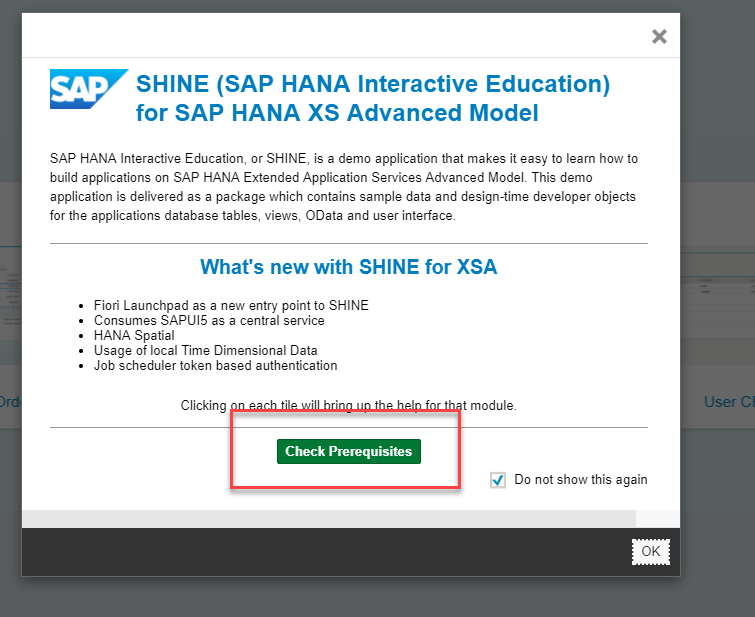

Any missing dependencies will be marked for you. Click on each of the buttons for them to be automatically corrected:

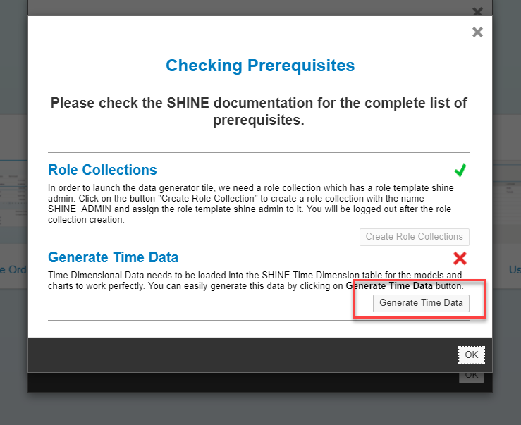

[DONE]
[ACCORDION-END]

[ACCORDION-BEGIN [Step 8: ](Generate data)]

You are finally presented with different options in the `launchpad`. Click on `Generate Data`:

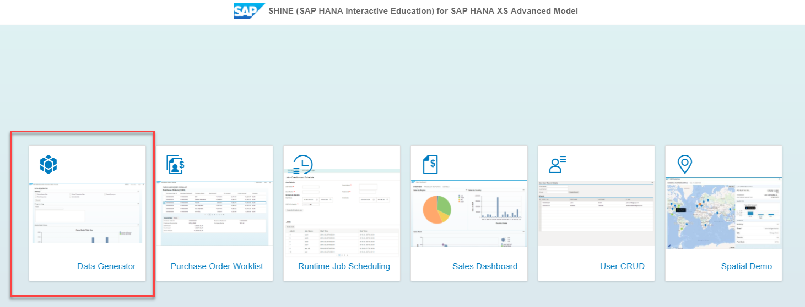

You can increase the number of transactions in your database or reload master data:

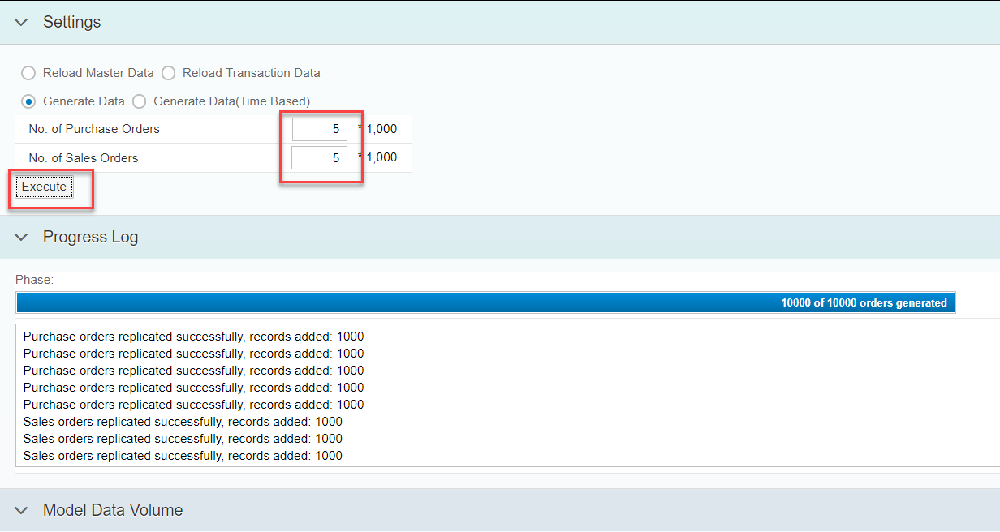


[VALIDATE_3]
[ACCORDION-END]
