## Prerequisites
 - **Proficiency:** Beginner

## Details
### You will learn  
You will create a database module with Core Data Services artifacts to combine your own data with data from the SHINE model.

### Time to Complete
**15 Min**

---

[ACCORDION-BEGIN [Step 1: ](Create a database module)]

Back to your project, right click on your project and then click on `New->SAP HANA Database Module`:


Name your module `db` and click on **next**


Remove the namespace, add a name to the schema, click on **Build module after creation** and the click on **Finish**

 

[DONE]
[ACCORDION-END]

[ACCORDION-BEGIN [Step 2: ](Create a CDS artifact)]

You will now use Core Data Services to create a table. The design-time artifact will be an Entity that will then be combined with the SHINE model.

Begin by creating a folder under `db->src`:


Call it `data`:


Create a CDS artifact in your new folder


Call it `PO`


The graphical editor will open automatically. **Close it** so you can create a context first.

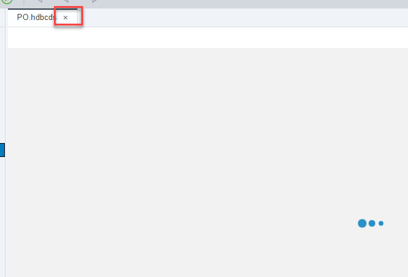

[DONE]
[ACCORDION-END]


[ACCORDION-BEGIN [Step 3: ](Create a Context)]

Open the file using the **Code Editor** by right-clicking on it:

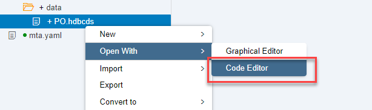

Enter the following code into it:

```
context PO   {

};

```

**Save** and call the graphical editor:

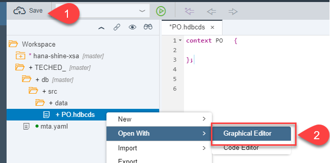

[DONE]
[ACCORDION-END]

[ACCORDION-BEGIN [Step 4: ](Create an Entity using the CDS graphical editor)]

You can now explore the graphical Core Data Services editor briefly.

**Click** on an entity and drop it in the editor:


Call it `APPROVAL_STATUS`:


Double click on the node you have just added (inside the white rectangle) and click on the **+** sign to add a new field for your entity:


Create two fields as follows:


**Save** and close the Graphical editor. Open the **Text Editor** again.


Copy the definition of the entity and click on **Validate**:

[VALIDATE_1]
[ACCORDION-END]

[ACCORDION-BEGIN [Step 5: ](Load data into your entity)]

You will now add data into your new entity. **Build** the db module first:


Create a comma-separated values file called `status.csv` in the `data` folder:


Add the following contents to it:

```
ID,TEXT
I, In process
A, Approved
R, Rejected
```

**Save** the file.


Now you need to add a new file to indicate how that file loads your new table. Create a file called `load.hdbtabledata` with the following contents on it:

```json
{
    "format_version": 1,
    "imports": [
        {
            "target_table": "PO.APPROVAL_STATUS",
            "source_data": {
                "data_type": "CSV",
                "file_name": "status.csv",
                "has_header": true
            },
            "import_settings": {
                "import_columns": [
                    "ID",
					          "TEXT"
                ]
            }
        }
    ]
}     
```

**Save**:


 **Build** the module.


[DONE]
[ACCORDION-END]

[ACCORDION-BEGIN [Step 6: ](Check the database explorer)]

Go into the database explorer using the button in the middle of the left side bar:

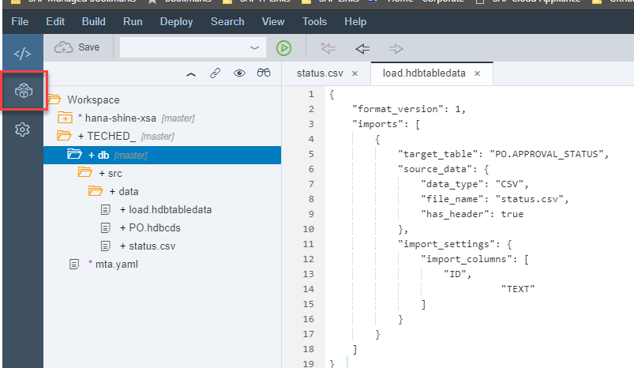

You will be asked if you want to add a Database. Click on **Yes**


Choose your container. You will know because it will have your username (`XSA_DEV`) and the name of our project (in this case,  `TECHED`).

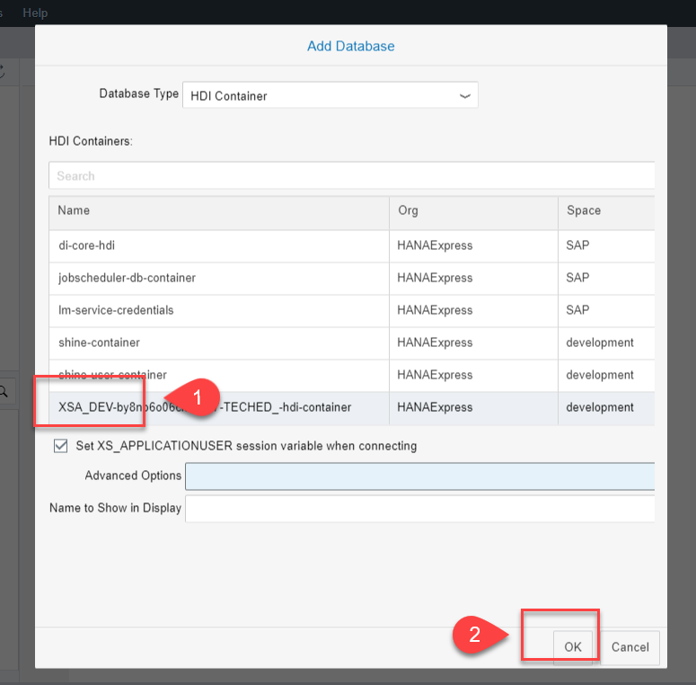
Once your database container appears, click on the **Tables**. You will see your entity converted into a run time object. Right-click on it and choose Open Data:

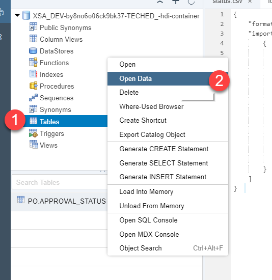

You will see the data from the CSV file is now loaded:

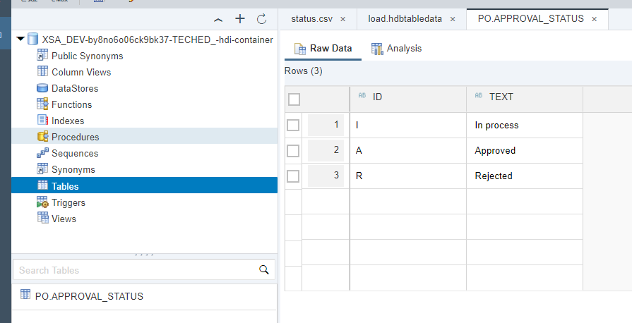

[DONE]
[ACCORDION-END]


[ACCORDION-BEGIN [Step 7: ](Grant permissions to the SHINE container)]

If you look into the SHINE model, there are roles created to grant the proper CRUD access to the data. You will assign those privileges to your user so you can access the data in the SHINE HDI container using synonyms.

Create a file called `shine.hdbgrants` in the `src` folder with the following content

```json
{
  "shine-container": {
    "object_owner" : {
      "container_roles":[
    	"core-db#"
      ]
    }
  }
}

```

As follows:

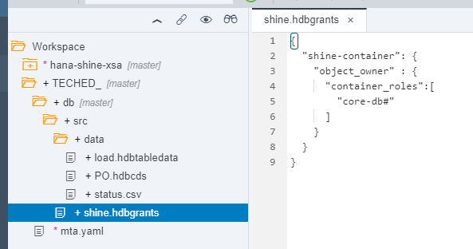

This means your database module will also be dependent on the SHINE HDI container, just like your `db` module has a dependency on your own HDI container. Add the dependency in the `mta.yaml` file. Add the resource first, by clicking on the `Resources` folder and adding a resource called `shine-container`:

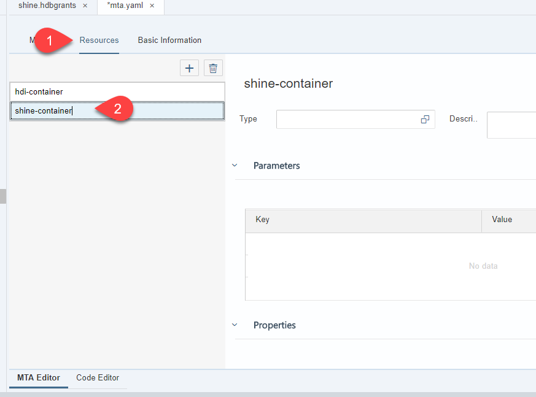

Add type `org.cloudfoundry.existing-service` and the following key-value pairs:

In Parameters:

```
- service-name : shine-container
```

In Properties:

```
- container-name : '${service-name}'
```


As follows:

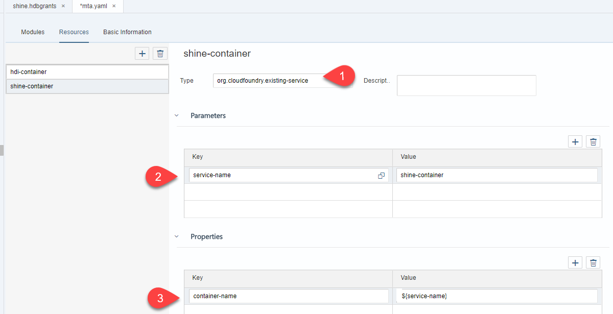

Click on the **Modules** tab. You now need to add the new resource, the SHINE HDI container, as a dependency to the db module.

**Choose** the `shine-container` value from the options under `Requires`.

Select `hdi-container` and add the following key-value pair in the `Properties of hdi-container`:

```
TARGET_CONTAINER : ~{hdi-container-name}
```

As follows:

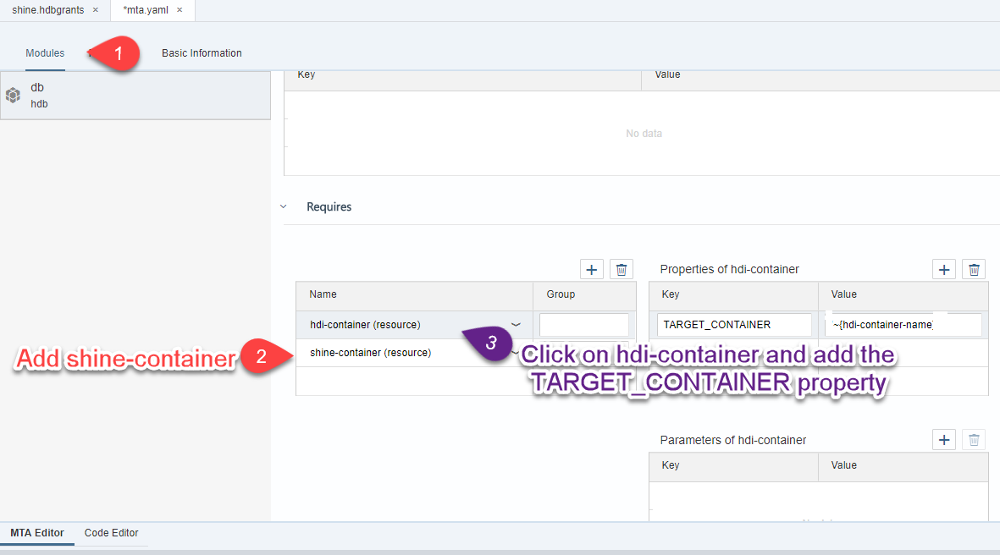

Go into the **Code Editor** and make sure the file has the following new additions:

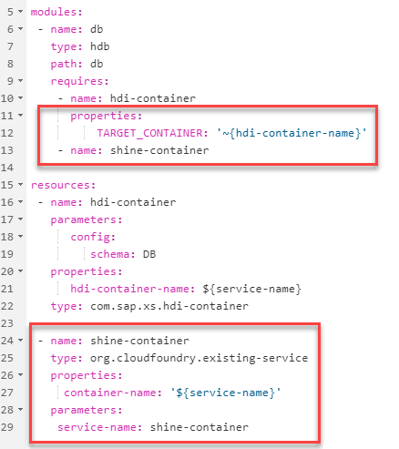

**Save** the `mta.yaml` file.

**Build** the grants file:


[ACCORDION-END]

[ACCORDION-BEGIN [Step 8: ](Create a Synonym)]

In the `src` folder, create a file called `shine.hdbsynonym`. Add the following content to it by opening it in `Code Editor`:

```json
{
  "PO_HEADER": {
    "target": {
      "object": "PO.Header",
      "schema": "SHINE_SCHEMA_1"
    }
  },
  "PO_ITEM": {
    "target": {
      "object": "PO.ItemView",
      "schema": "SHINE_SCHEMA_1"
    }
  }
}

```

**Build** the synonym file:

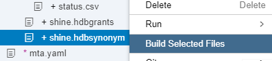

[ACCORDION-END]


[ACCORDION-BEGIN [Step 9: ](Access the data from SHINE)]

You can now extend the Core Data Services definition to incorporate the entities in SHINE. Replace the content of the file `PO.hdbcds` with the following code:

```sql
using PO_HEADER as PO_H;
using PO_ITEM as PO_I;

context PO {
    define view PO_VIEW as
        select from PO_H join APPROVAL_STATUS as A on "A"."ID" = "PO_H"."APPROVALSTATUS"
        {
            "PO_H"."PURCHASEORDERID" as "PURCHASEORDERID",
            "PO_H"."APPROVALSTATUS" as "APPROVALSTATUS",
            "PO_H"."GROSSAMOUNT" as "GROSSAMOUNT",
            "PO_H"."CURRENCY" as "CURRENCY",
            "A"."TEXT" as "TEXT"
        };
    define view PO_ITEM_VIEW as
        select from PO_I

        {
        	"PurchaseOrderItemId",
            "ItemPos",
            "ProductID",
            "Quantity",
            "QuantityUnit",
            "Amount",
            "CurrencyCode"
        };

    Entity APPROVAL_STATUS {
    	key ID : String(1);
    	TEXT : String(200);
    }
};
```

**Save and build** the `db` module.  Wait until the build finished to answer the following question.


[VALIDATE_2]
[ACCORDION-END]
