## Prerequisites
 - This tutorial is designed for SAP HANA on premise and SAP HANA, express edition. It is not designed for SAP HANA Cloud.
 - **Proficiency:** Beginner

## Details
### You will learn  
You will create a database module with Core Data Services artifacts.

### Time to Complete
**15 Min**

---

[ACCORDION-BEGIN [Step 1: ](Create a database module)]

Back to your project, right click on your project and then click on `New->SAP HANA Database Module`:

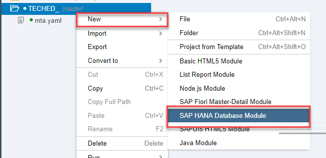

Name your module `db` and click on **next**

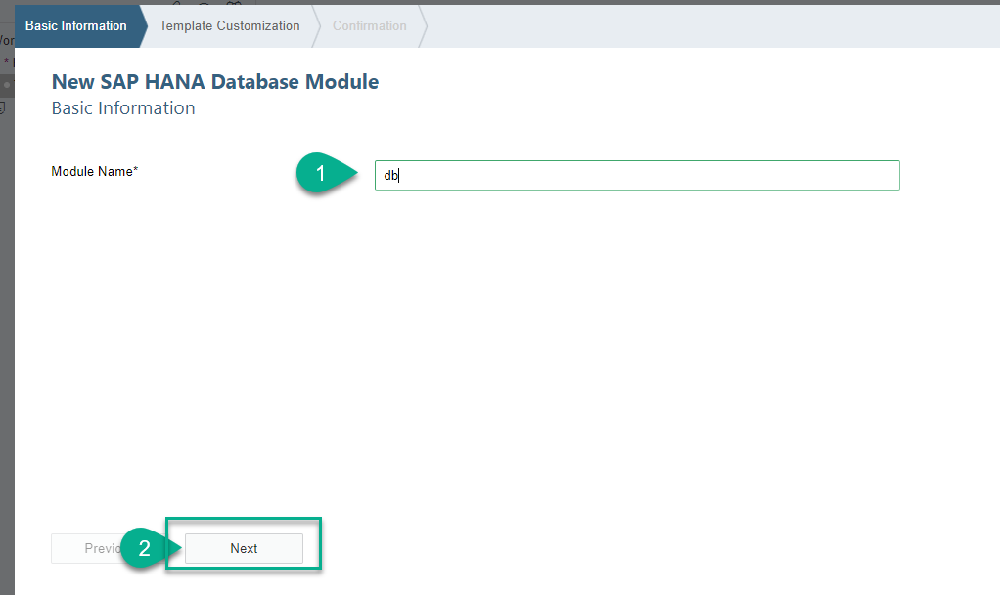

Remove the namespace, add a name to the schema, click on **Build module after creation** and the click on **Finish**

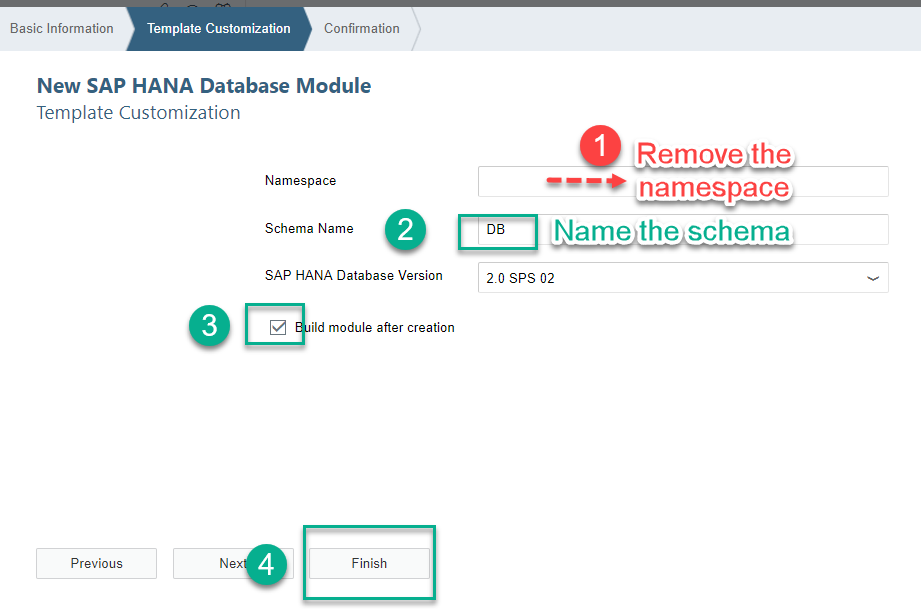

[DONE]
[ACCORDION-END]

[ACCORDION-BEGIN [Step 2: ](Create a CDS artifact)]

You will now use Core Data Services to create a table. You will then use other entities to combine the data.

Begin by creating a folder under `db->src`:

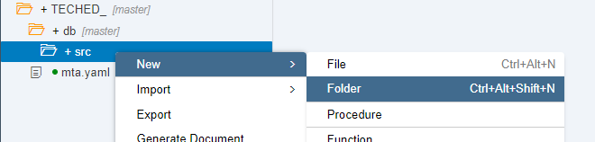

Call it `data`:

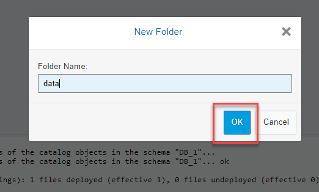

Create a CDS artifact in your new folder


Call it `PO`

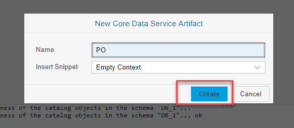


[DONE]
[ACCORDION-END]


[ACCORDION-BEGIN [Step 3: ](Create your Entities using the CDS graphical editor)]

You can now explore the graphical Core Data Services editor briefly.

Right-click on the entity and choose **Graphical Editor**.

Double-click on the context to create an entity:

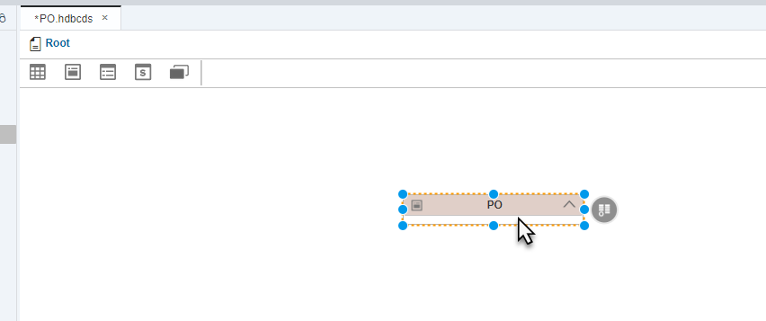

**Click** on an entity and drop it in the editor:


Call it `APPROVAL_STATUS`:

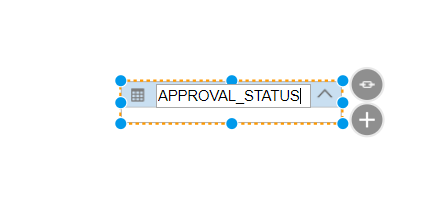

Double click on the node you have just added (inside the white rectangle) and click on the **+** sign to add a new field for your entity:

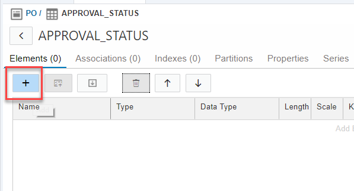

Create two fields as follows:

>Hint: If you haven't already, close the `Git` pane.

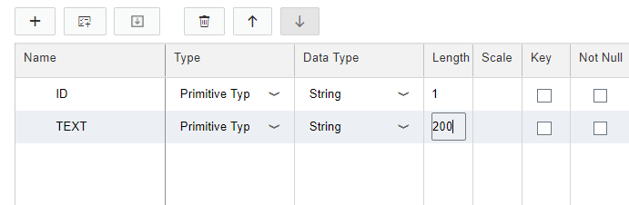

**Save** and close the Graphical editor.

Open the **Text Editor** again by right-clicking on `PO.hdbcds`

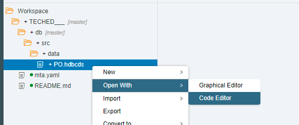

Copy the definition of the entity (blurred out below) and click on **Validate**:

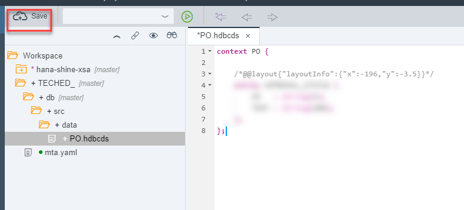

[VALIDATE_1]
[ACCORDION-END]

[ACCORDION-BEGIN [Step 4: ](Load data into your entity)]

You will now add data into your new entity. **Build** the db module first:

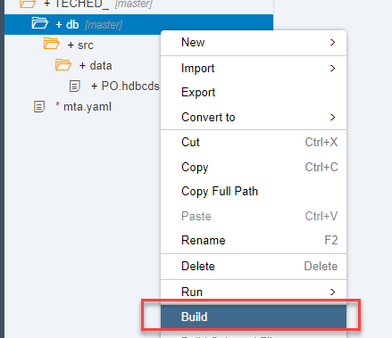

Create a comma-separated values file called `status.csv` in the `data` folder:

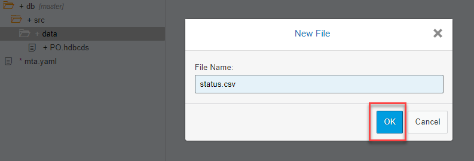

Add the following contents to it:

```text
ID,TEXT
I, In process
A, Approved
R, Rejected
```

**Save** the file.


Now you need to add a new file to indicate how that file loads your new table. Create a file called `load.hdbtabledata`


Add the following contents to it:

```json
{
    "format_version": 1,
    "imports": [
        {
            "target_table": "PO.APPROVAL_STATUS",
            "source_data": {
                "data_type": "CSV",
                "file_name": "status.csv",
                "has_header": true
            },
            "import_settings": {
                "import_columns": [
                    "ID",
					          "TEXT"
                ]
            }
        }
    ]
}     
```

**Save**:

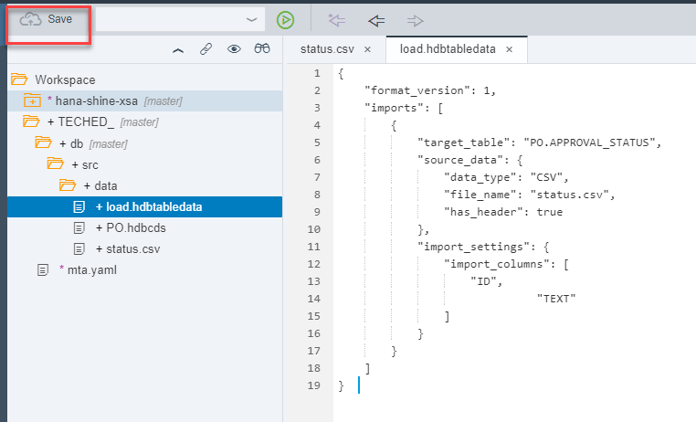

 **Build** the module.

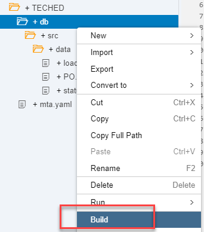

**Save and build** the `db` module.  Wait until the build finished to answer the following question.


[VALIDATE_2]

[ACCORDION-END]
