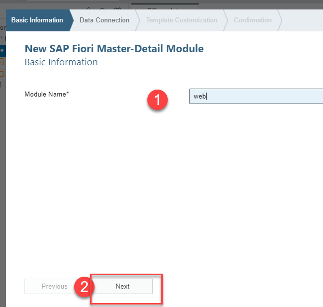
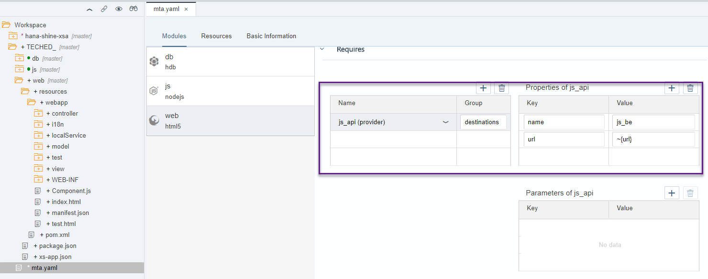
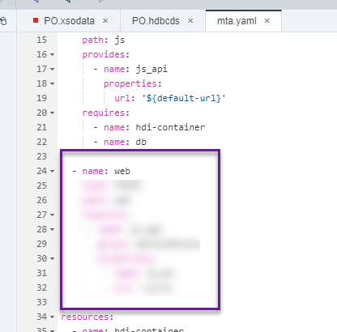
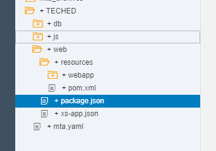
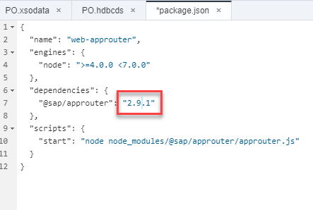
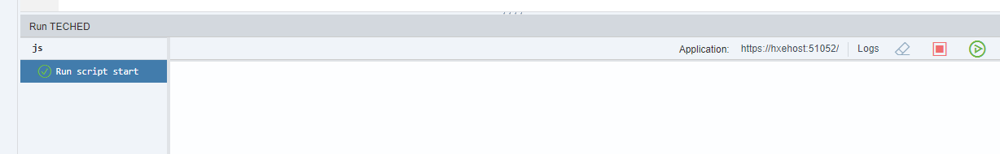
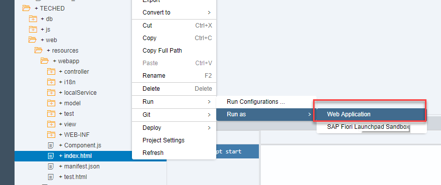
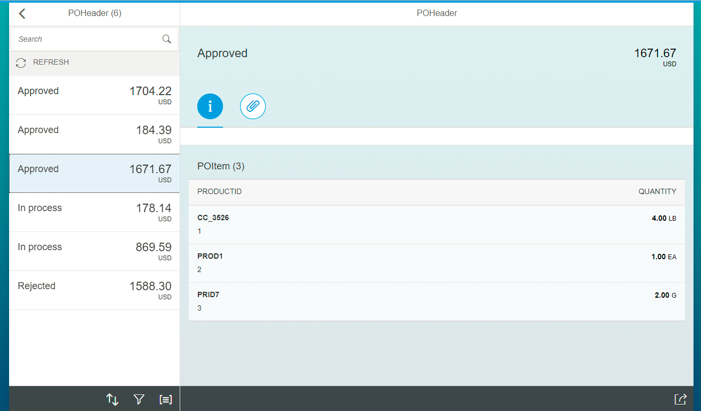
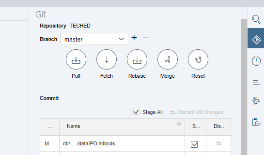

## Prerequisites  
 - This tutorial is designed for SAP HANA on premise and SAP HANA, express edition. It is not designed for SAP HANA Cloud.

## Details
### You will learn  
  - How to create a user interface with a Fiori Master-Detail template

---

[ACCORDION-BEGIN [Step 1: ](Create a UI5 module)]

Create a new module using the `Fiori Master-Detail Module`

Name it `web`

The wizard will present with options to bind the web interface to a data provider. In your case, you have created an OData service. Choose it from the list:

[DONE]

[ACCORDION-END]

[ACCORDION-BEGIN [Step 2: ](Map the OData fields with the user interface)]

You will first provide general information about the application:

Scroll down and complete the binding for the header:

Keep scrolling down and complete the binding for the items:

[DONE]

[ACCORDION-END]

[ACCORDION-BEGIN [Step 3: ](Check dependencies)]

The web module depends on the Node.js module to fill the interface with data. This time, Web IDE has added the dependencies automatically in the `mta.yaml` file:

Locate the dependency in the **Code Editor**.

Paste the entire web module definition, including its requirements and no resources. Then click on **Validate**

[VALIDATE_1]

[ACCORDION-END]

[ACCORDION-BEGIN [Step 4: ](Modify the dependencies)]

Open the `package.json` file in the web module.

And change the version of the  `@sap/approuter` module to `2.9.1` to match the version delivered in your virtual machine:

**Save** and **close** the file.

[DONE]

[ACCORDION-END]

[ACCORDION-BEGIN [Step 5: ](Run the module)]

**Build** the entire project.

Make sure the `js` module is running first (remember, it's a dependency).

Run the web module:

A new browser tab will open.

Click on any Purchase Order and check the URL to respond to the question below.

[VALIDATE_2]

[ACCORDION-END]

[ACCORDION-BEGIN [Optional: ](Sync to GitHub and check next steps)]

If you want to take the code with you, remember you can **Stage All** and sync to GitHub.

The application you have created can be enhanced to add more functionalities or features, such as user authentication. Here are some links if you want to get your own system or continue learning for free:

- Get your own SAP HANA, express edition, instance: <https://developers.sap.com/topics/hana.html>
- Tutorials for Development in XS Advanced : <https://developers.sap.com/group.hana-xsa-get-started.html>
- XS Advanced Development for (not so) dummies (blog): <https://goo.gl/vsuy2H>
- Intro to Core Data Services (SAP `CodeTalk`): <https://goo.gl/Fpm4JT>
- Intro to XS OData (SAP `CodeTalk`): <https://goo.gl/hQHmeK>

Visit **`developers.sap.com`** to check the tutorials on XS Advanced and to get your own instance of SAP HANA, express edition.

[DONE]
[ACCORDION-END]
