## Prerequisites
 - This tutorial is designed for SAP HANA on premise and SAP HANA, express edition. It is not designed for SAP HANA Cloud.
 - **Proficiency:** Beginner

## Details
### You will learn  
Create a Multi Target Project by cloning a repository from GitHub.

### Time to Complete
**15 Min**

---

[ACCORDION-BEGIN [Step 1: ](Create a GitHub Repository)]

[Log in or create an account in Git Hub](https://github.com/). Create a new repository:

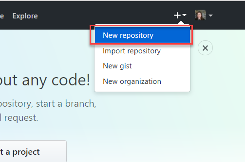

You can choose any name you want and click on **Create Repository**:

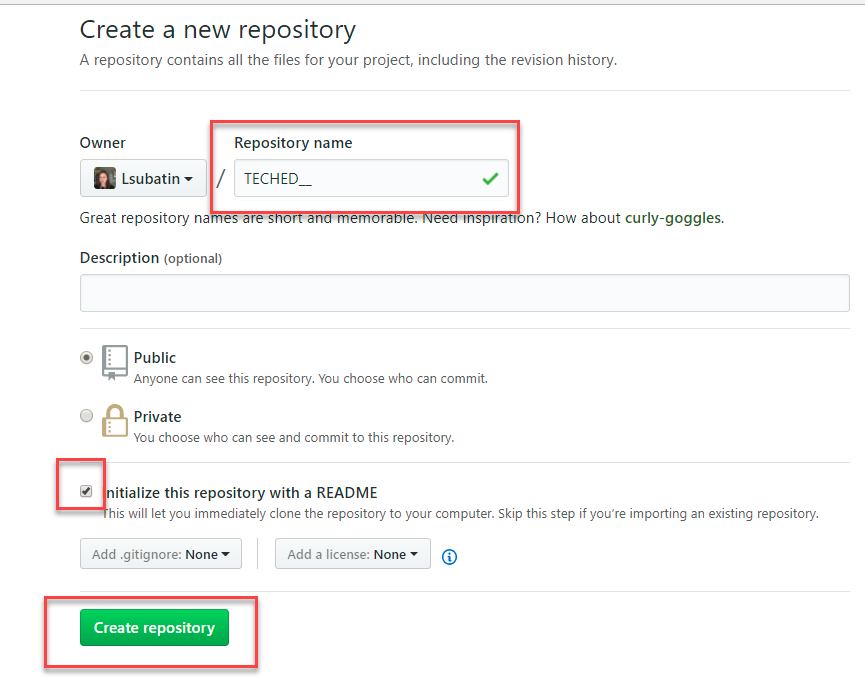

Once created, click on the **Clone or download** and **copy the URL** so you have it handy. Keep this tab **open**.

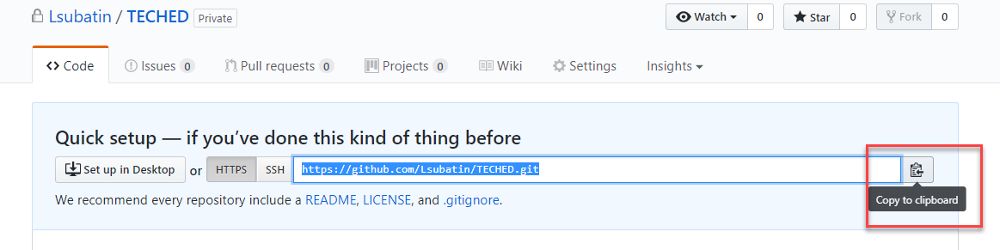

[DONE]
[ACCORDION-END]

[ACCORDION-BEGIN [Step 2: ](Connect to SAP Web IDE for SAP HANA)]

Open a new **incognito browser** on the web browser and enter the following address `https://hxehost:53075`. If you get a security warning because the certificate is self-signed, click on **Proceed to `hxehost`**:

You will be routed to the User Account and Authentication service and prompted for your log in. Use user `XSA_DEV` and the password you entered during setup:

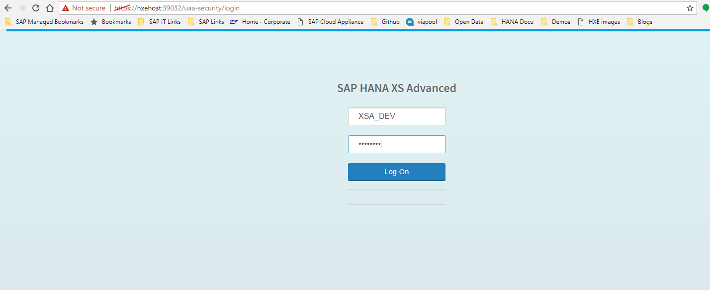

Once the Web IDE has loaded, you will clone your GitHub repository:

Right-click on the Workspace and then on `Git->Clone Repository`.
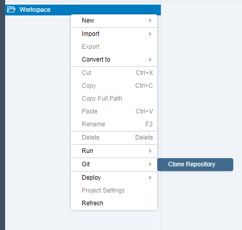

Then copy the URL from your Git Hub repository:

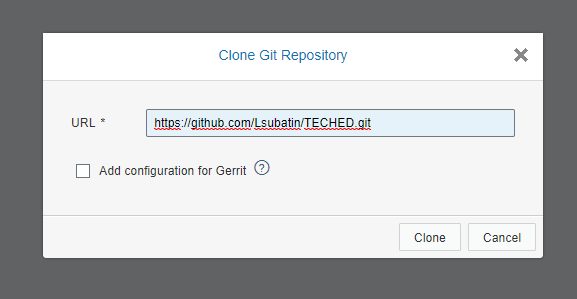

Enter your GitHub username and password if prompted:

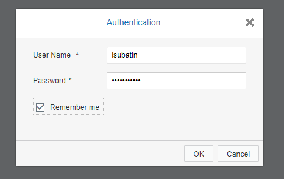

You should see a single project in your workspace:

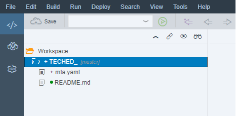

[DONE]
[ACCORDION-END]

[ACCORDION-BEGIN [Step 3: ](Set the space)]

You need to set the space for your cloned project.

Right-click on the project and then on **Project Settings**:

Go into the Space and select `development`. Click on **Save**:

[DONE]
[ACCORDION-END]

[ACCORDION-BEGIN [Step 4: ](Sync your application)]

Open the GitHub pane using the button on the right side bar:

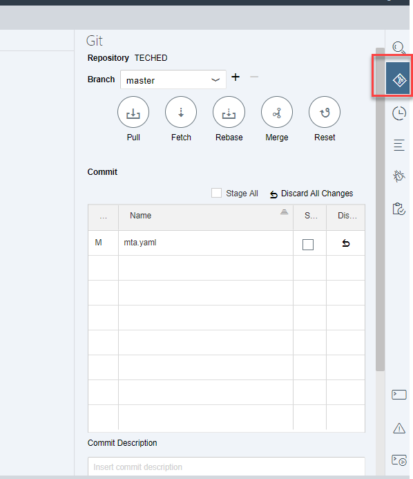

Select the master branch and click on **Stage all**

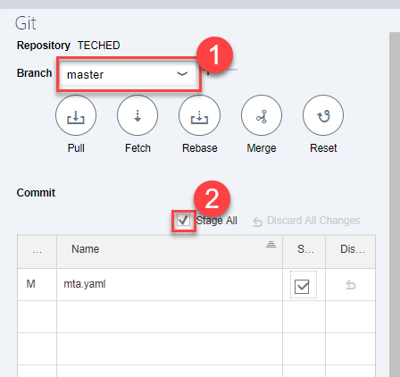

Enter a comment for the initial commit and click on **Commit and Push**

You will be prompted for your GitHub account details:

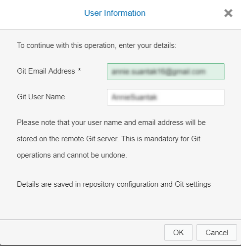

**You can do this at any time you want to save your progress into your GitHub repository.**

Finally, open the `mta.yaml` file that has been created automatically. Copy the contents in the **Code Editor** tab and paste them in the box below. Click on **validate**:

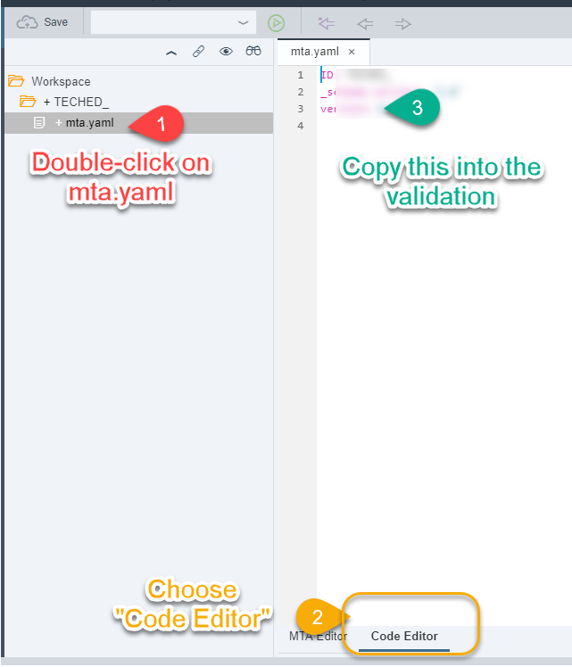

[VALIDATE_1]

[ACCORDION-END]
