## Prerequisites
 - This tutorial is designed for SAP HANA on premise and SAP HANA, express edition. It is not designed for SAP HANA Cloud.
 - **Proficiency:** Beginner

## Details
### You will learn  
You will import and setup a virtual machine with SAP HANA, express edition. **Please note** that this virtual machine will be deleted by the next participant.

### Time to Complete
**25 Min**

---

[ACCORDION-BEGIN [Step 1: ](Open VMWare Workstation Player)]

Open `VMWare Workstation Player`:

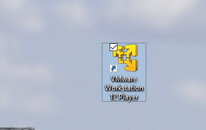

If there is a Virtual Machine already there, use **Delete from Disk** on it so you get plenty of room for your own:

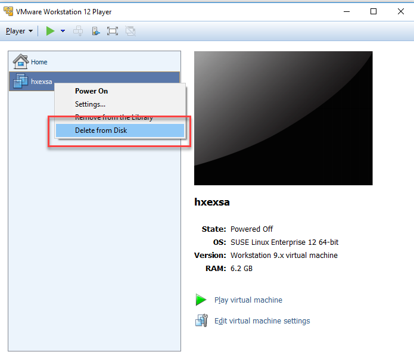

Once there are no virtual machines from previous developers, click on **Open Virtual Machine**

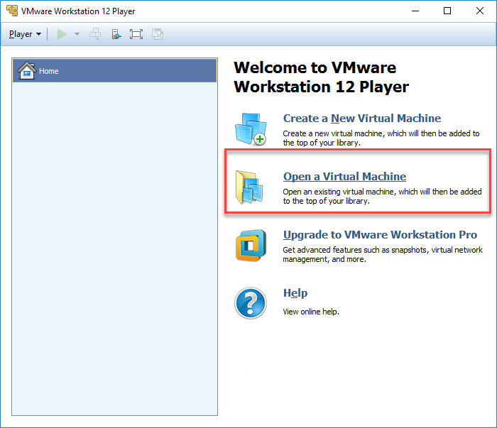

Navigate to the `Desktop -> Virtual Machine` folder and select **`hxexsa_rocks.ovf`**. Click on **open**

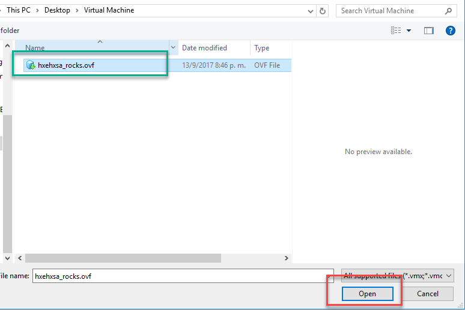

Wait for the Import process to finish.

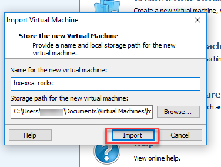


This will take about 10 minutes. The setup process has the same steps that you would execute if you downloaded a Virtual Machine with SAP HANA, express edition, in your personal computer.

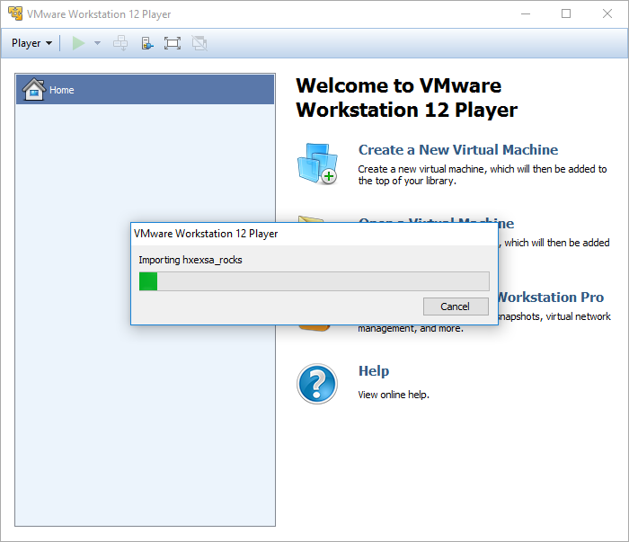

While you are waiting, if you do not have an account in GitHub, [create one](https://github.com/join). If you do, [log in](https://github.com/login).


You will need your session open in a browser for later steps. To complete the following validation, go into your profile in GitHub:

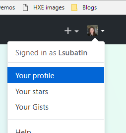

Which are some of the tabs you see next to **Overview** (more than one option applies)?
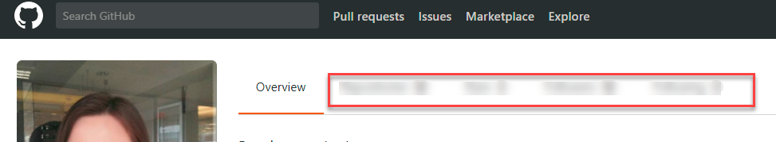

Choose the right tabs and click on **Validate**

[VALIDATE_1]

[ACCORDION-END]

[ACCORDION-BEGIN [Step 2: ](While you are waiting: What is SAP HANA, express edition?)]

SAP HANA, express edition, is a streamlined version of the SAP HANA development platform. It is designed to run in constrained environments, such as a laptop. For this same reason, some of the features that become irrelevant in these environments, such as high-availability or connectivity to SAP Solution Manager, were removed from the platform.

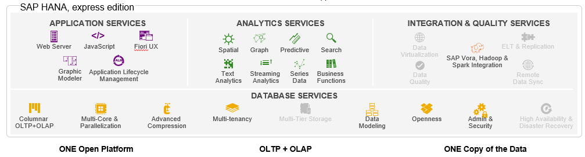

There are two flavors for SAP HANA, express edition. The basic one, that includes the in-memory database, called `server-only` and the full image, that includes the XS Advanced applications.

The version you will be using today includes the XS Advanced applications. However, many features such as the administration cockpit, Smart Data Streaming or the EA designer have been removed or not installed in this particular image so that the import process is faster.

SAP HANA, express edition, can be downloaded for free and can also be executed in different cloud providers such as Google Cloud Platform, Amazon Web Services and MS Azure. **The license allows you to use the platform for free for productive use up to 32 GB of RAM.** You can upgrade the license to use more if needed.


[VALIDATE_3]

[ACCORDION-END]

[ACCORDION-BEGIN [Step 3: ](Start Setup)]

Once the Virtual Machine is imported, you can start using it. Click on **Play virtual machine**:

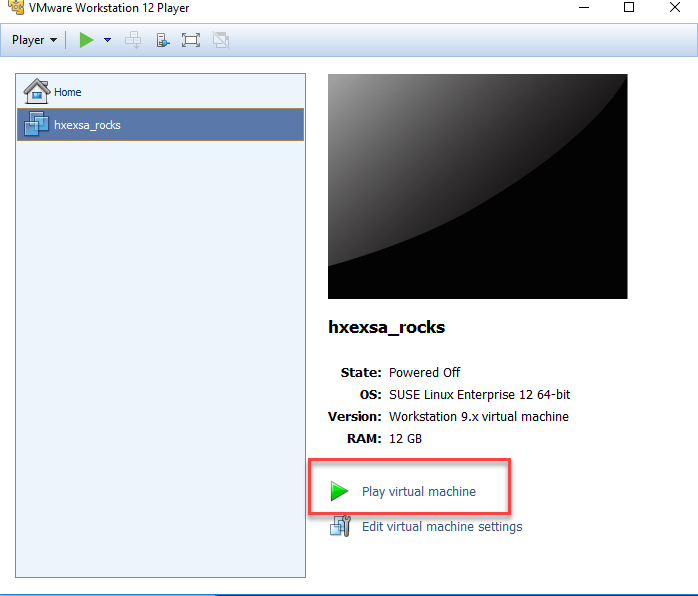

You will be prompted for a username and password. Enter:

Username: `hxeadm`
**Password: `HanaRocks01`**


You will be prompted for a password for your development user, `XSA_DEV`. Choose a password that you will remember and follows these rules:

>Password must be at least 8 characters in length.  **It must contain at least 1 uppercase letter, 1 lowercase letter, and 1 number.**  Special characters are allowed, except `\` (backslash), `"` (double quotes), and `backtick`.
&nbsp;

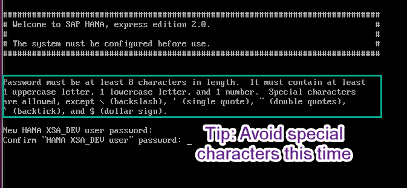

You will be asked to confirm if you want to continue setup. Choose `Y`.

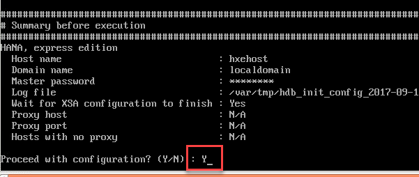

The database server and XS Advanced applications will now start. You can continue with the next step while the setup makes progress.

[DONE]
[ACCORDION-END]


[ACCORDION-BEGIN [Step 4: ](Setup the hosts file)]

After a minute or two, you will see your IP address. **Take note of it**:

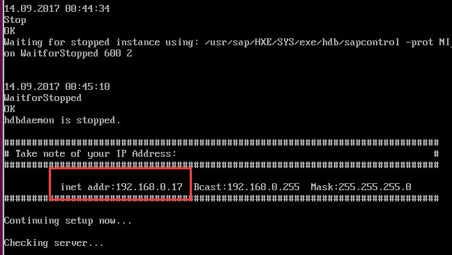

Open Notepad as Administrator:


**Open** a file:

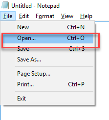

Navigate to `C:\Windows\System32\drivers\etc`, switch the filter extension to **all files** and open the file called `hosts`:

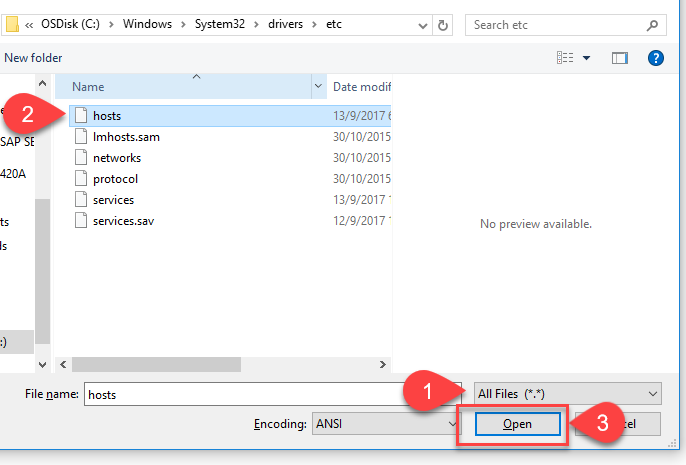

**Delete any existing entry**.

Add your IP and the host name `hxehost`. For example:

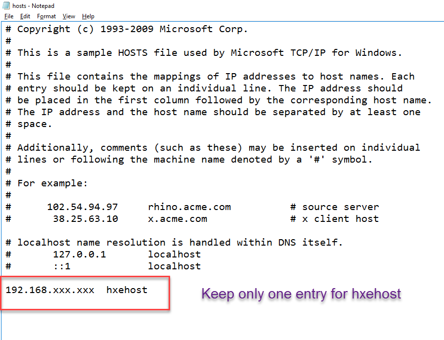

**Save** and close.

Open a Command prompt:

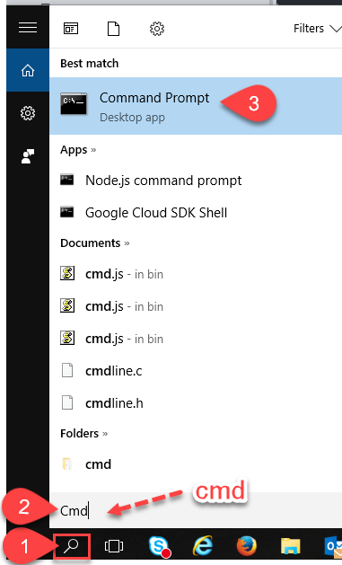

Enter `ping hxehost`. Copy the first **three lines from the response** into the frame below and click on **Validate**:


[VALIDATE_2]

[ACCORDION-END]

[ACCORDION-BEGIN [Step 5: ](Log in as XSA_DEV and get the Web IDE URL)]

Once the database and XS Advanced Applications have started, you will see the following success message:

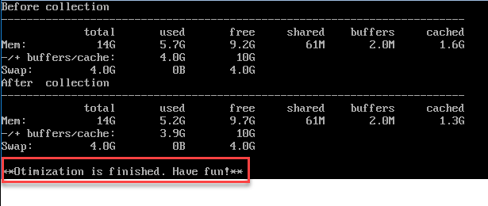

Use the following command in the console to get the URL for Web IDE. You will be prompted for your password. This is the password you chose for the user `XSA_DEV`.

```
xs login -u XSA_DEV -s SAP
```
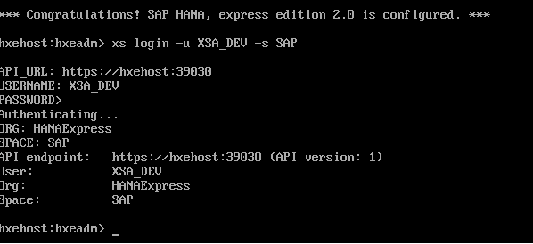

Enter the following commands:

```
xs apps | grep webide
```

You will see the status of the Web IDE application. Once it is shown as **`1/1`** it means that you can start using it.

>Repeat the command until you see **`1/1`**

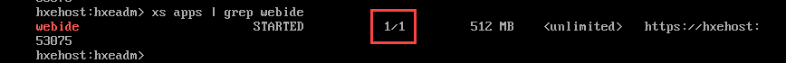

You can see the URL for Web IDE is `https://hxehost:53075`.

[DONE]
[ACCORDION-END]
