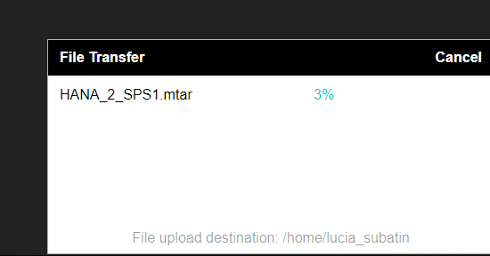

## Prerequisites  
 - **Proficiency:** Beginner | Intermediate | Advanced
 - **Tutorials:** [SAP HANA XS Advanced tutorial - Getting started](https://www.sap.com/developer/groups/hana-xsa-get-started.html) or [SAP HANA XS Advanced tutorial - Node.js](https://www.sap.com/developer/groups/hana-xsa-nodejs.html) or [SAP HANA XS Advanced tutorial - SAPUI5](https://www.sap.com/developer/groups/hana-xsa-sapui5.html)

## Next Steps
 - [Tutorial Navigator](https://www.sap.com/developer/tutorial-navigator.html) or the [Tutorial Catalog](https://www.sap.com/developer/tutorial-navigator.tutorials.html)

## Details
### You will learn  
This tutorial will show you how to migrate your Multi Target Application into another server

### Time to Complete
**10 Min**

---

[ACCORDION-BEGIN [Step 1: ](Build your MTA application)]

Right-click on your project and select **Build**

You will see a file downloading from the browser. Take note of its location

[ACCORDION-END]

[ACCORDION-BEGIN [Step 2: ](Download and upload your MTA application)]

Export the .`mtar `file into a local directory in your computer:

Upload the `*mtar` file to a suitable directory.

[ACCORDION-END]

[ACCORDION-BEGIN [Step 3: ](Deploy the MTAR file)]

As a user with the proper permissions, for example, `hxeadm` if you are using SAP HANA, express edition, execute the XS CLI.

>Notes: If required, login to `xs` first using command `xs login`. Additionally, If you have created a user-provided service, you will need to create it with the proper `xs cups` command first.

 

Use command `xs deploy` followed by the proper file:

Make sure it finished successfully:

[ACCORDION-END]

[ACCORDION-BEGIN [Step 4: ](Check your application)]

You can now check the services have been deployed using XS services:

And the application using `xs apps` in the corresponding space (for example, development in HANA express edition):

[ACCORDION-END]

## Next Steps
 - [Tutorial Navigator](https://www.sap.com/developer/tutorial-navigator.html) or the [Tutorial Catalog](https://www.sap.com/developer/tutorial-navigator.tutorials.html)
