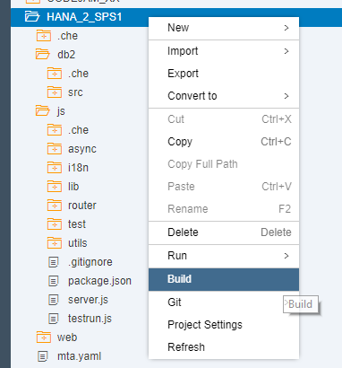
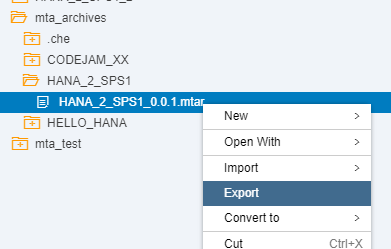
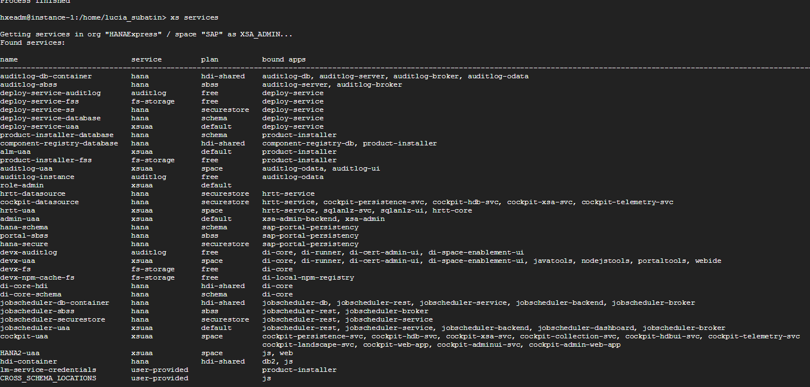
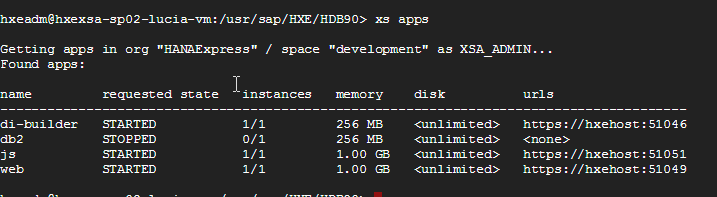

## Prerequisites  
 - This tutorial is designed for SAP HANA on premise and SAP HANA, express edition. It is not designed for SAP HANA Cloud.
 - **Tutorials:** [SAP HANA XS Advanced tutorial - Getting started](https://developers.sap.com/group.hana-xsa-get-started.html) or [SAP HANA XS Advanced tutorial - Node.js](https://developers.sap.com/group.hana-xsa-nodejs.html) or [SAP HANA XS Advanced tutorial - SAPUI5](https://developers.sap.com/group.hana-xsa-sapui5.html)

## Details
### You will learn  
  - How to migrate your Multi Target Application into another server

---

[ACCORDION-BEGIN [Step 1: ](Build your MTA application)]

Right-click on your project and select **Build->Build**

This will take several minutes to complete.  

[DONE]

[ACCORDION-END]

[ACCORDION-BEGIN [Step 2: ](Download and upload your MTA application)]

You will find a new folder named `mta_archieves` and within a folder for your project.  Within this folder is the `MTAR` archive for your application.

Export the .`mtar `file into a local directory in your computer:

[DONE]

[ACCORDION-END]

[ACCORDION-BEGIN [Step 3: ](Deploy the MTAR file)]

As a user with the proper permissions, for example, `hxeadm` if you are using SAP HANA, express edition, execute the XS CLI.

>Notes: If required, login to `xs` first using command `xs login`. Additionally, If you have created a user-provided service, you will need to create it with the proper `xs cups` command first.

 

Use command `xs deploy` followed by the proper file:

Make sure it finished successfully:

[DONE]

[ACCORDION-END]

[ACCORDION-BEGIN [Step 4: ](Check your application)]

You can now check the services have been deployed using XS services:

And the application using `xs apps` in the corresponding space (for example, development in HANA express edition):

[DONE]

[ACCORDION-END]
