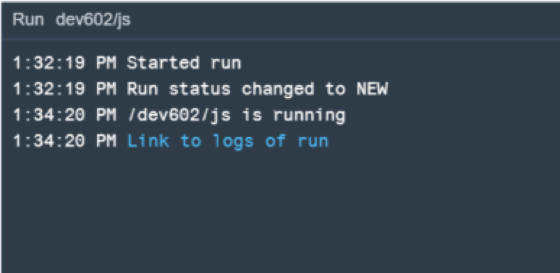
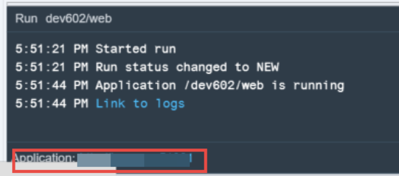
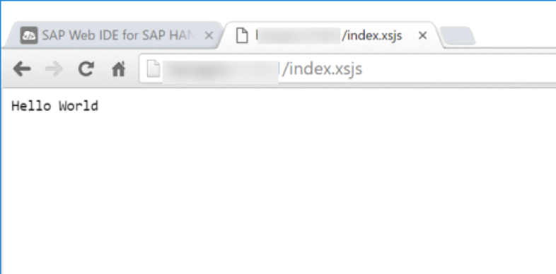
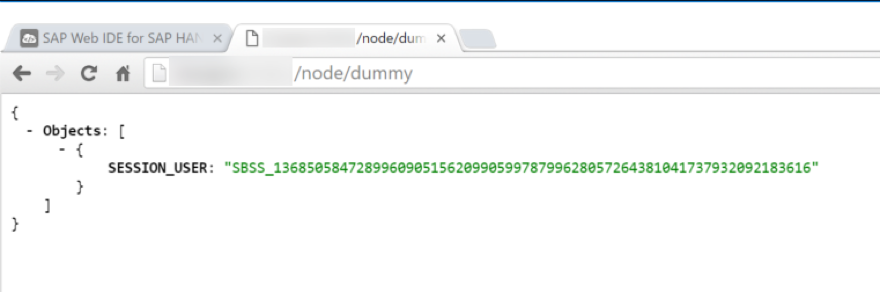

## Prerequisites  
 - **Proficiency:** Intermediate
 - **Tutorials:** [Modules and Express](http://www.sap.com/developer/tutorials/xsa-node-modules.html)

## Next Steps
 - [Asynchronous Non-Blocking I/O](http://www.sap.com/developer/tutorials/xsa-node-async.html)

## Details
### You will learn  
Learn how to connect to the SAP HANA database using Node.js

### Time to Complete
**15 Min**.

---

1. In this exercise you will look at how to use the HANA database access library to send queries to the database. Return to the Node.js module and the `myNode.js` source file.  Extend the logic here with a URL handler for `/node/dummy` which will issue a database SELECT statement against the DUMMY table and return the current database user. 

	

2. You will begin by adding several more required modules to the start of your `myNode.js` file. These are a combination of SAP provided Node.js modules and some standard ones; all of which you will use for making a database connection and issuing the SELECT statement.    

	```
	"use strict";
	var express = require("express");
	var xssec = require("sap-xssec");
	var passport = require("passport");
	var xsHDBConn = require("sap-hdbext");
	var xsenv = require("sap-xsenv");
	var async = require("async");
	```

3. Before your first route handler, add these few lines of code.  This is similar to the options section of the `server.js` file you used to set the configuration for the XSJS module.  You are doing essentially the same thing here – you are telling the service how to lookup the connection and security parameters. The `xsHDBConn` is an instance of the `sap-hdb-connection` module designed to expose pooled database connections as a Node.js express middleware. 

	```
	module.exports = function(){
	  var app = express(); 
	  passport.use("JWT", new xssec.JWTStrategy(xsenv.getServices({uaa:{tag:"xsuaa"}}).uaa));
	  app.use(passport.initialize());
	
	  app.use(
	   passport.authenticate("JWT", {session: false}),
	   xsHDBConn.middleware());
	
	//Hello Router
	  app.route("/")
	```

4. Now add a new route for `/dummy`  that gets the database `connection/client` from the express request object (`req.db`). Then create a prepared statement for the SELECT of `SESSION_USER` from dummy ([using the synonym we created](http://www.sap.com/developer/tutorials/xsa-hdi-module.html) ). Execute the statement and send the results as JSON in the response object. 

	```
	//Simple Database Select - In-line Callbacks
	app.route("/dummy")
	  .get(function(req, res){
	  var client = req.db;
	  client.prepare(
	  "select SESSION_USER from \"dev602.data::DUMMY\" ", 
	     function (err, statement){
	       statement.exec([],
	       function (err, results) {
	       if (err){
	       res.type("text/plain").status(500).send("ERROR: " + err);
	       }else{
	       var result = JSON.stringify( { Objects: results });
	       res.type("application/json").status(200).send(result);
	     } }  );
	   } );
	}); 
	```
	
5. Look at the `package.json` file in the editor. You will see the dependencies section which lists all required libraries and their versions. Add the new modules which we referenced in the `myNode.js` file for this exercise part.  

	```
	"dependencies": {
	"sap-xsenv": "1.2.1",
	"sap-xsjs": "1.4.0",
	"express": "4.12.3",
	"sap-hdbext": "1.1.2",
    	"sap-xssec": "0.5.3",
    	"passport": "0.2.1",
    	"async": "latest"
	},
	```

6. You can now run the `js` module

	

7. You should see that the build and deploy was successful. 

	

8. However if you go to the tab where the service run was started, you will see an Unauthorized message just as we did in previous sections.  This is as intended.

	

9. Click on the `web` folder and the run window should change to the details of the running HTML5 module.  Since its already running and we didn't make any changes to it, you can just click on the Application link in the bottom left corner of the window to reopen it in your web browser. 

	

10. In the running tab, you should see the `index.html` from earlier. We can add the URL to our XSJS service `/index.xsjs` in the browser. This will test to make sure that our XSJS and XSODATA paths are still accessible even though we swapped out the root handler.  

	

11. Now change the path in the browser to `/node/dummy`.  You should see the output of your successful SELECT statement. 

	

12. You might have noticed that the default Node.js programming approach is to use callbacks/event handlers for each operation.  This is because even the different parts of a database request (connection, prepared statement, execution, etc) are all non-blocking operations.  While this provides considerable parallelization and performance opportunities; it can also make the code more difficult to read. As a bonus part of this exercise you can return to `myNode.js` and add a second route handler, `/dummy2` that performs the same select but uses the `async` module. This module doesn't really change the runtime aspects of the code, but organizes the callback functions in an easier to read array instead of in-lining them within each other. 

	```
	//Simple Database Select - Async Waterfall
	app.route("/dummy2")
	  .get(function(req, res){
	  var client = req.db;
	 async.waterfall([
	 function prepare(callback){
	    client.prepare("select SESSION_USER from \"dev602.data::DUMMY\" ", 
	  function(err,statement){callback(null, err, statement);});
	  },
	 
	function execute(err, statement, callback){
	   statement.exec([], function(execErr, results){callback(null,execErr,results);});
	},
	function response(err, results, callback){
	 if(err){
	 res.type("text/plain").status(500).send("ERROR: " + err);
	}else{
	 var result = JSON.stringify( { Objects: results });
	 res.type("application/json").status(200).send(result);	
	}
	callback();
	} ]);
	});
	```


## Next Steps
 - [Asynchronous Non-Blocking I/O](http://www.sap.com/developer/tutorials/xsa-node-async.html)
