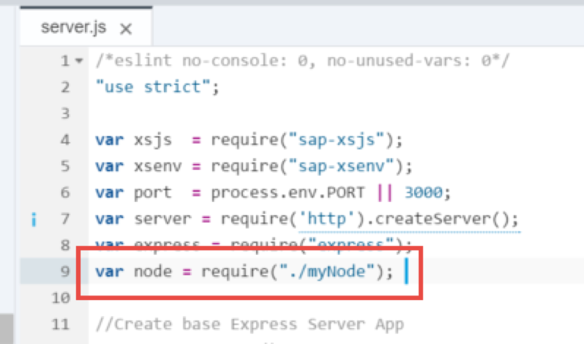

## Prerequisites  
- **Proficiency:** Intermediate
- **Tutorials:** [SAP HANA XS Advanced, Creating a Node.js Module](https://developers.sap.com/tutorials/xsa-xsjs-xsodata.html)

## Next Steps
- [HANA Database Access from Node.js](https://developers.sap.com/tutorials/xsa-node-dbaccess.html)

## Details

In a previous tutorial you created [a Node.js Module](https://developers.sap.com/tutorials/xsa-xsjs-xsodata.html), but didn't really do much Node.js specific programming.  You were only using Node.js to run XSJS and XSODATA services. The support for XSJS and XSODATA is an important feature for XS Advanced. It not only allows backward compatible support for much of your existing development, but it also provides a simplified programming model as an alternative to the non-block I/O event-driven programming model normally used by Node.js, but you certainly aren't limited to only the functionality provided by XSJS and XSODATA. You have access to the full programming model of Node.js as well. In this section you will learn how to extend your existing Node.js module in the SAP Web IDE for SAP HANA.

You will learn about how to create and use reusable code in the form of Node.js modules. You will use `package.json` to define dependencies to these modules which make the installation of them quite easy. You will use one of the most popular modules – **express** - which helps with the setup the handling of the request and response object. You will use `express` to handle multiple HTTP handlers in the same service by using routes.

You will learn about the fundamentals of the asynchronous nature of Node.js You will also see how this asynchronous capability allows for non-blocking input and output. This technique is one of the basic things that makes Node.js development different from other JavaScript development and also creates one of the reasons for its growing popularity. You will see how these techniques are applied to common operations like HTTP web service calls or even SAP HANA database access. You will also see how to create language translatable text strings and HANA database queries from Node.js

Your final part of this section will demonstrate the ease at which you can tap into the powerful web sockets capabilities of Node.js You will use web sockets to build a simple chat application. Any message sent from the SAPUI5 client side application will be propagated by the server to all listening clients.


### Time to Complete
**15 Min**.

---


[ACCORDION-BEGIN [Step 1: ](Require modules)]

Return to the Node.js module and the `server.js` source file. You currently have enough Node.js logic to start up the XSJS compatibility and that's it. You would like to extend `server.js` to also handle some purely Node.js code as well. At the same time we still want to support our existing XSJS and XSODATA services from this `server.js`.  


Begin by adding two new Node.js module requirements toward the beginning of the file.  One is for the http built-in module and the other is the popular open source module `express`. One of the most common tasks in Node.js is acting as a web server and handling `http requests/responses`. `Express` is a module that wraps and extends the low level http library and provides many additional services.

```JavaScript
/*eslint no-console: 0, no-unused-vars: 0, no-undef:0*/

"use strict";
var https = require("https");

var xsenv = require("@sap/xsenv");
var port = process.env.PORT || 3000;
var server = require("http").createServer();

https.globalAgent.options.ca= xsenv.loadCertificates(); 	

global.__base = __dirname + "/";
var init = require(global.__base + "utils/initialize");
//Initialize Express App for XSA UAA and HDBEXT Middleware
var app = init.initExpress();



//Setup Routes


var router = require("./router")(app, server);


//Initialize the XSJS Compatibility Layer

init.initXSJS(app);

//Start the Server
server.on("request", app);

server.listen(port, function() {
	console.info("HTTP Server: " + server.address().port);
});
```

If you look into the code, you will see a script called `initialize` is called, and is supposed to be found in the current application directory. Under `js`, create a directory called  `utils` and a file named `initialize.js`.



The `server.js` script is calling two function modules, `initExpress` and `initXSJS`. You will define them here as reusable functions using `module.exports` as in the code below. Copy it into the `initialize.js` script.


```JavaScript
/*eslint no-console: 0, no-unused-vars: 0*/
"use strict";
module.exports = {
initExpress: function() {
		var xsenv = require("@sap/xsenv");
		var passport = require("passport");
		var xssec = require("@sap/xssec");
		var xsHDBConn = require("@sap/hdbext");
		var express = require("express");

		//logging
		var logging = require("@sap/logging");
		var appContext = logging.createAppContext();

		//Initialize Express App for XS UAA and HDBEXT Middleware
		var app = express();
		passport.use("JWT", new xssec.JWTStrategy(xsenv.getServices({
			uaa: {
				tag: "xsuaa"
			}
		}).uaa));
		app.use(logging.expressMiddleware(appContext));
		app.use(passport.initialize());
		var hanaOptions = xsenv.getServices({
			hana: {
				tag: "hana"
			}
		});
		app.use(
			passport.authenticate("JWT", {
				session: false
			}),
			xsHDBConn.middleware(hanaOptions.hana)
		);
		return app;
	},
};

```
Before you add the initialization for XSJS so that the previous modules can also be executed, take a look at the code you have just pasted.
First, the `@sap/logging` module is used to write log and trace files. By calling the external node module, `passport`, you are enforcing the UAA authentication you defined earlier. How? By using a JWT (JSON web token) strategy, a middleware function passes the request to the actual route which, in this case, is the `xsuaa` service you defined at the very beginning using the XS client. You are then injecting  an instance of `sap-hdb-ext`, called `xsHDBConn`. This module is designed to expose pooled database connections as a Node.js middleware.


[ACCORDION-END]

[ACCORDION-BEGIN [Step 2: ](Add XSJS initialization)]

You still want to configure the XSJS module but no longer want it to listen directly on your service port. Instead you will start your own instance of express add a route handler for `/node` which you can code your own Node.js logic. Then you will add the XSJS as a root route handler. Here is the ending piece of code for `initialize.js`.

```JavaScript

initXSJS: function(app) {
//	process.env.XS_APP_LOG_LEVEL='debug';
var xsjs = require("@sap/xsjs");
var xsenv = require("@sap/xsenv");
var options = {
	//	anonymous : true, // remove to authenticate calls
	redirectUrl: "/index.xsjs",
	context: {
		base: global.__base,
		env: process.env,
		answer: 42
	}
};

//configure HANA
try {
	options = Object.assign(options, xsenv.getServices({
		hana: {
			tag: "hana"
		}
	}));
	options = Object.assign(options, xsenv.getServices({
		secureStore: {
			tag: "hana"
		}
	}));
} catch (err) {
	console.log("[WARN]", err.message);
}

//Add SQLCC
try {
	options.hana.sqlcc = xsenv.getServices({
		"xsjs.sqlcc_config": "CROSS_SCHEMA_LOCATIONS"
	});
} catch (err) {
	console.log("[WARN]", err.message);
}

// configure UAA
try {
	options = Object.assign(options, xsenv.getServices({
		uaa: {
			tag: "xsuaa"
		}
	}));
} catch (err) {
	console.log("[WARN]", err.message);
}

// start server
var xsjsApp = xsjs(options);
app.use(xsjsApp);
}
};



```

You can now **Save**, as you have defined both reusable modules.


[ACCORDION-END]

[ACCORDION-BEGIN [Step 3: ](Create route handler)]

Back in `server.js`, after calling the initialization scripts, you are calling a router. You will now create a router that will accommodate the different Express route requests. You will mimic part of the folder structure suggested in the [Express module documentation](http://expressjs.com/en/starter/generator.html) and create a folder called `router` with a file called `index.js` in it.


Routes determine how your application will respond to different requests based on the URI and HTTP method. In the following code, a call aiming at the path `node` like `https://app_URL:port/node` will be handled by a script called `myNode`:.

```JavaScript
"use strict";

module.exports = function(app, server){
	app.use("/node", require("./routes/myNode")());
};

```

Add the code to the new `index.js` file and **save**.


[ACCORDION-END]

[ACCORDION-BEGIN [Step 4: ](Create destination module for route)]

As you can imagine from the code in the previous step, you now need a script called `myNode.js` in a folder called `routes`


Add the following code to it:

```JavaScript
/*eslint no-console: 0, no-unused-vars: 0, no-shadow: 0, new-cap: 0*/
"use strict";
var express = require("express");

module.exports = function() {
	var app = express.Router();

	//Hello Router
	app.get("/", function(req, res) {
		res.send("Hello World Node.js");
	});
	return app;
};

```
You are now responding to a `GET` request to the relative root location of the file (in this case, `router`).  However, in the `index.js` file inside the `router` folder, you set the path to `/node` in the URL. You need to map this route in the `xs-app.json` file in the HTML5 module.


[ACCORDION-END]

[ACCORDION-BEGIN [Step 5: ](Add the route in the web module)]

Because it is the web module that is exposed for calls, you need to add the new `/node` route to the file `xs-app.json`:


```JavaScript
 {
 		"source": "/node(.*)",
 		"destination": "core-backend",
 		"csrfProtection": true,
 		"authenticationType": "xsuaa"
 	}

```

As follows:


[ACCORDION-END]

[ACCORDION-BEGIN [Step 6: ](Extend dependencies in package.json)]

Back in step 1 you added the modules `express` and `passport` using the **require** function. You now need to add them manually in the `package.json` file with the rest of the dependencies for the `js` module.


[ACCORDION-END]

[ACCORDION-BEGIN [Step 6: ](Build and Run )]

You can now run the `js` module.


After it has built and started running, you can run the **web** module. This will open a new tab with the `index.html`. Test the original `.xsjs` service is running properly after the paths were changed with the route handler. Replace `html` with `xsjs`:


You can also test the newly added router by adding `/node` to the URL:


[ACCORDION-END]


