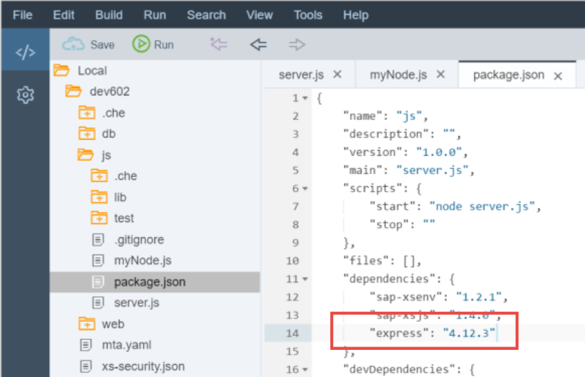
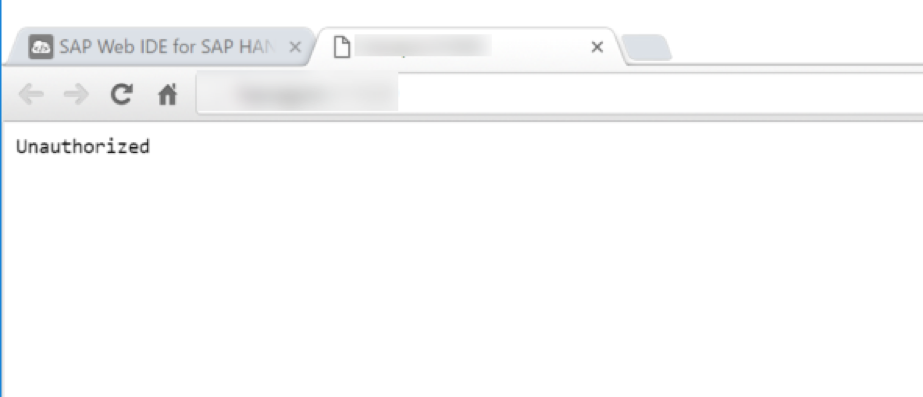
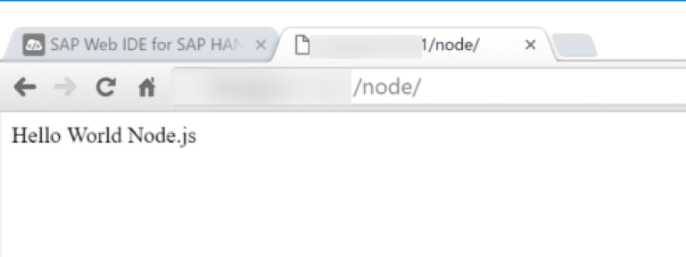

## Prerequisites  
 - **Proficiency:** Intermediate
 - **Tutorials:** [SAP HANA XS Advanced, Creating a Node.js Module](http://go.sap.com/developer/tutorials/xsa-xsjs-xsodata.html)

## Next Steps
 - [HANA Database Access from Node.js](http://go.sap.com/developer/tutorials/xsa-node-dbaccess.html)

## Details
### You will learn  
In a previous tutorial you created a [SAP HANA XS Advanced, Creating a Node.js Module](http://go.sap.com/developer/tutorials/xsa-xsjs-xsodata.html), but didn’t really do much Node.js specific programming.  You were only using Node.js to run XSJS and XSODATA services. The support for XSJS and XSODATA is an important feature for XS Advanced. It not only allows backward compatible support for much of your existing development; but it provides a simplified programming model as an alternative to the non-block I/O event driven programming model normally used by Node.js

But you certainly aren’t limited to only the functionality provided by XSJS and XSODATA. You have access to the full programming model of Node.js as well. In this section you will learn how to extend your existing Node.js module in the SAP Web IDE for SAP HANA. 

You will learn about how to create and use reusable code in the form of Node.js modules. You will use `packages.json` to define dependencies to these modules which make the installation of them quite easy. You will use one of the most popular modules – express; which helps with the setup the handling of the request and response object. You will use express to handle multiple HTTP handlers in the same service by using routes. 

You will learn about the fundamentals of the asynchronous nature of Node.js You will also see how this asynchronous capability allows for non-blocking input and output. This technique is one of the basic things that makes Node.js development different from other JavaScript development and also creates one of the reasons for its growing popularity. You will see how these techniques are applied to common operations like HTTP web service calls or even SAP HANA database access. You will also see how to create language translatable text strings and HANA database queries from Node.js

Your final part of this section will demonstrate the ease at which you can tap into the powerful web sockets capabilities of Node.js You will use web sockets to build a simple chat application. Any message sent from the SAPUI5 client side application will be propagated by the server to all listening clients. 

### Time to Complete
**15 Min**.

---

1. Return to the Node.js module and the `server.js` source file. You currently have enough Node.js logic to start up the XSJS compatibility and that’s it. You would like to extend `server.js` to also handle some purely Node.js code as well. At the same time we still want to support our existing XSJS and XSODATA services from this `server.js`.  

	

2. Begin by adding two new Node.js module requirements toward the beginning of the file.  One is for the http built-in module and the other is the popular open source module – express. One of the most common tasks in Node.js is acting as a web server and handling `http requests/responses`. express is a module that wraps and extends the low level http library and provides many additional services. 

	```
	/*eslint no-console: 0, no-unused-vars: 0*/
	"use strict";
	
	var xsjs  = require("sap-xsjs");
	var xsenv = require("sap-xsenv");
	var port  = process.env.PORT || 3000;
	var server = require('http').createServer();
	var express = require("express");
	
	var options = xsjs.extend({
		//anonymous : true, // remove to authenticate calls
		redirectUrl : "/index.xsjs"
	});
	```

3. You still want to configure the XSJS module but no longer want it to listen directly on your service port. Instead you will start your own instance of express add a route handler for `/node` which you can code your own Node.js logic. Then you will add the XSJS as a root route handler. Here is the complete new coding of your `server.js`. 

	```
	*eslint no-console: 0, no-unused-vars: 0*/
	"use strict";
	
	var xsjs  = require("sap-xsjs");
	var xsenv = require("sap-xsenv");
	var port  = process.env.PORT || 3000;
	var server = require('http').createServer();
	var express = require("express");
	var node = require("./myNode"); 
	
	//Create base Express Server App
	var app = express(); 
	app.use("/node", node());
	
	var options = xsjs.extend({
		//anonymous : true, // remove to authenticate calls
		redirectUrl : "/index.xsjs"
	});
	// configure HANA
	options = xsjs.extend(options, xsenv.getServices({ hana: {tag: "hana"} }));
	// configure UAA
	options = xsjs.extend(options, xsenv.getServices({ uaa: {tag: "xsuaa"} }));
	
	//Add XSJS to the base app
	var xsjsApp = xsjs(options);
	app.use(xsjsApp);
	
	server.on('request', app);
	server.listen(port, function () {
	    console.log('HTTP Server: ' + server.address().port );
	});
	```

4. Notice that in the previous additions to `server.js` you added a reference to a module called `./myNode`. This is a Node.js module which will be local to your project. Modules don’t all have to come from central repositories. They can also be a way of modularizing your own code (similar to XSJSLIB files). That is exactly what you will do here. Rather than filling up your `server.js` with application specific logic, you will break that out into its own Node.js module named `myNode.js`. 

	

5. Create a new file in your `js` folder called `myNode.js`

	

6. Add the following code to your `myNode.js` file. This will add a simple GET handler that returns a “Hello World” message when requested. Notice express in this module has a root route handler. But this will relatively to where it is attached in `server.js`.  Therefore this logic will still respond relative to the `/node` route handler base we specified earlier. 

	```
	"use strict";
	var express = require("express");
	
	module.exports = function(){
		var app = express(); 
	
	//Hello Router
		app.route("/")
		  .get(function(req, res) {
		    res.send("Hello World Node.js");
		});
	
	   return app;	
	};
	```

7. Look at the `package.json` file in the editor. You will see the dependencies section which lists all required libraries and their versions. You manually added the express Node.js module to your project, so you also need to extend the dependencies section here. 

	

8. Your Node.js module is essentially finished, however before you can run it you also need to add a new route to the `xs-app.json` of your `HTML5` module.  

	```
	{
		"welcomeFile": "index.html",
		"authenticationMethod": "route",
		"routes": [
	 	{
			"source": "/node/(.*)",
			"destination": "nodejs",
			"csrfProtection": false,
			"authenticationType": "xsuaa"
		}, 	
		{
			"source": "(.*)(.xsjs)",
			"destination": "nodejs",
			"csrfProtection": false,
			"authenticationType": "xsuaa"
		}, {
			"source": "(.*)(.xsodata)",
			"destination": "nodejs",
			"authenticationType": "xsuaa"
		}]
	}
	```

9. You can now run the `js` module.

	

10. You should see that the build and deploy was successful. 

	

11. However if you go to the tab where the service run was started, you will see an Unauthorized message just as you did in [SAP HANA XS Advanced, Creating a Node.js Module](http://go.sap.com/developer/tutorials/xsa-xsjs-xsodata.html).  This is as intended.

	

12. So now run the `web` module. It will need to rebuild and redeploy due to the added route.

	

13. In the running tab, you should see the `index.html` from earlier. You can add the URL to your XSJS service `/index.xsjs` in the browser. This will test to make sure that your XSJS and XSODATA paths are still accessible even though you swapped out the root handler.

	

14. Now change the path in the browser to `/node/`.  You should see "Hello World" Node.js this is being returned from the new route handler and Node.js module you just implemented in this exercise. 

	

## Next Steps
 - [HANA Database Access from Node.js](http://go.sap.com/developer/tutorials/xsa-node-dbaccess.html)
