## Prerequisites  
- This tutorial is designed for SAP HANA on premise and SAP HANA, express edition. It is not designed for SAP HANA Cloud.
- **Proficiency:** Intermediate
- **Tutorials:** [SAP HANA XS Advanced, Creating a Node.js Module](https://developers.sap.com/tutorials/xsa-xsjs-xsodata.html)

## Next Steps
- [HANA Database Access from Node.js](https://developers.sap.com/tutorials/xsa-node-dbaccess.html)

## Details
### You will learn
In a previous tutorial you created [a Node.js Module](https://developers.sap.com/tutorials/xsa-xsjs-xsodata.html), but didn't really do much Node.js specific programming.  You were only using Node.js to run XSJS and XSODATA services. The support for XSJS and XSODATA is an important feature for XS Advanced. It not only allows backward compatible support for much of your existing development, but it also provides a simplified programming model as an alternative to the non-blocking I/O event-driven programming model normally used by Node.js

, but you certainly aren't limited to only the functionality provided by XSJS and XSODATA. You have access to the full programming model of Node.js as well. In this section you will learn how to extend your existing Node.js module in the SAP Web IDE for SAP HANA.

You will learn about how to create and use reusable code in the form of Node.js modules. You will use `package.json` to define dependencies to these modules which make the installation of them quite easy. You will use one of the most popular modules – **express** - which helps with the setup the handling of the request and response object. You will use `express` to handle multiple HTTP handlers in the same service by using routes.

You will learn about the fundamentals of the asynchronous nature of Node.js You will also see how this asynchronous capability allows for non-blocking input and output. This technique is one of the basic things that makes Node.js development different from other JavaScript development and also creates one of the reasons for its growing popularity. You will see how these techniques are applied to common operations like HTTP web service calls or even SAP HANA database access. You will also see how to create language translatable text strings and HANA database queries from Node.js

Your final part of this section will demonstrate the ease at which you can tap into the powerful web sockets capabilities of Node.js You will use web sockets to build a simple chat application. Any message sent from the SAPUI5 client side application will be propagated by the server to all listening clients.


### Time to Complete
**15 Min**.

---


[ACCORDION-BEGIN [Step 1: ](New Node.js module)]

Return to the project from the previous tutorial (https://developers.sap.com/tutorials/xsa-xsjs-xsodata.html) and create a new module of type Node.js.  
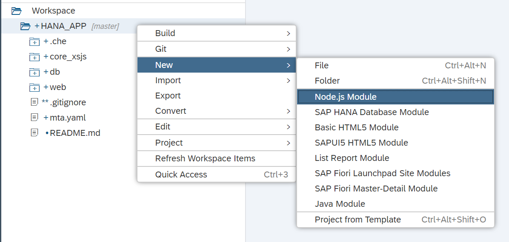

Give the module the name: `core_node`. Leave all other fields at the default and press **Finish**.
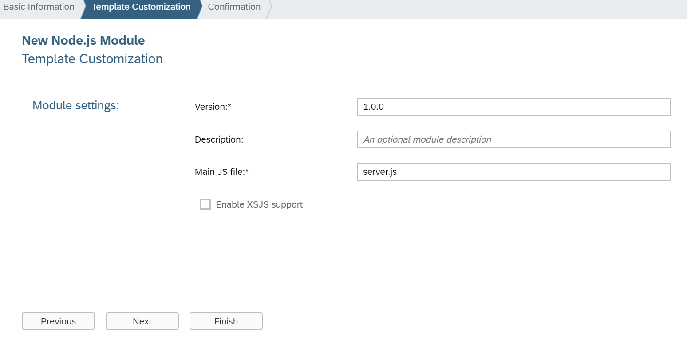

In this new Node.js module you have the `server.js` source file as your mail entry point.  You would like to extend `server.js` to also handle some purely Node.js code as well.

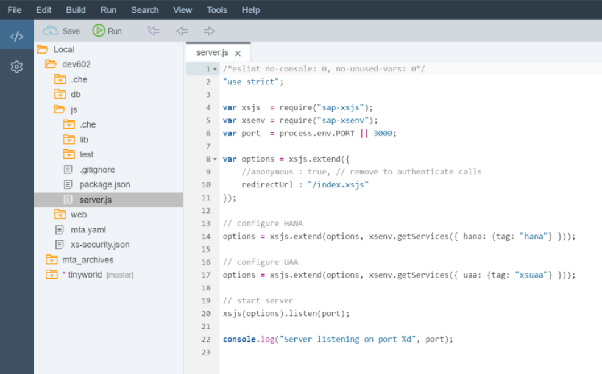

Begin by adding two new Node.js module requirements toward the beginning of the file.  One is for the http built-in module and the other is the popular open source module `express`. One of the most common tasks in Node.js is acting as a web server and handling `http requests/responses`. `Express` is a module that wraps and extends the low level http library and provides many additional services.

```JavaScript
/*eslint no-console: 0, no-unused-vars: 0, no-undef:0, no-process-exit:0*/
/*eslint-env node, es6 */

"use strict";
const https = require("https");
const port = process.env.PORT || 3100;
const server = require("http").createServer();
const express = require("express");

//Initialize Express App for XSA UAA and HDBEXT Middleware
const xsenv = require("@sap/xsenv");
const passport = require("passport");
const xssec = require("@sap/xssec");
const xsHDBConn = require("@sap/hdbext");
xsenv.loadEnv();

https.globalAgent.options.ca = xsenv.loadCertificates();
global.__base = __dirname + "/";
global.__uaa = process.env.UAA_SERVICE_NAME;

//logging
let logging = require("@sap/logging");
let appContext = logging.createAppContext();

//Initialize Express App for XS UAA and HDBEXT Middleware
let app = express();

//Build a JWT Strategy from the bound UAA resource
passport.use("JWT", new xssec.JWTStrategy(xsenv.getServices({
	uaa: {
		tag: "xsuaa"
	}
}).uaa));

//Add XS Logging to Express
app.use(logging.middleware({
	appContext: appContext,
	logNetwork: true
}));

//Add Passport JWT processing
app.use(passport.initialize());

let hanaOptions = xsenv.getServices({
	hana: {
		plan: "hdi-shared"
	}
});

hanaOptions.hana.pooling = true;
//Add Passport for Authentication via JWT + HANA DB connection as Middleware in Expess
app.use(
	xsHDBConn.middleware(hanaOptions.hana),
	passport.authenticate("JWT", {
		session: false
	})
);

//Setup Additional Node.js Routes
require("./router")(app, server);

//Start the Server
server.on("request", app);
server.listen(port, function () {
	console.info(`HTTP Server: ${server.address().port}`);
});
```

Please take a look at the code you have just pasted.

First, the `@sap/logging` module is used to write log and trace files. By calling the external node module, `passport`, you are enforcing the UAA authentication you defined earlier. How? By using a JWT (JSON web token) strategy, a middleware function passes the request to the actual route which, in this case, is the `xsuaa` service you defined at the very beginning using the XS client. You are then injecting  an instance of `@sap/hdbext`, called `xsHDBConn`. This module is designed to expose pooled HANA database connections as a Node.js middleware.

[DONE]

[ACCORDION-END]

[ACCORDION-BEGIN [Step 2: ](Create route handler)]

Back in `server.js`, you are calling a router. You will now create a router that will accommodate the different Express route requests. You will mimic part of the folder structure suggested in the [Express module documentation](http://expressjs.com/en/starter/generator.html) and create a folder called `router` with a file called `index.js` in it.

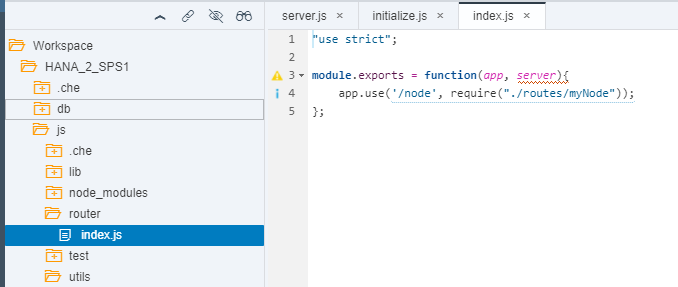


Routes determine how your application will respond to different requests based on the URI and HTTP method. In the following code, a call aiming at the path `node` like `https://app_URL:port/node` will be handled by a script called `myNode`:.

```JavaScript
/*eslint no-console: 0, no-unused-vars: 0, no-undef:0, no-process-exit:0*/
/*eslint-env node, es6 */
"use strict";

module.exports = (app, server) => {
	app.use("/node", require("./routes/myNode")());

	app.use( (err, req, res, next) => {
		console.error(JSON.stringify(err));
		res.status(500).send(`System Error ${JSON.stringify(err)}`);
	});

};
```

Add the code to the new `index.js` file and **save**.

[DONE]

[ACCORDION-END]

[ACCORDION-BEGIN [Step 3: ](Create destination module for route)]

As you can imagine from the code in the previous step, you now need a script called `myNode.js` in a folder called `routes`

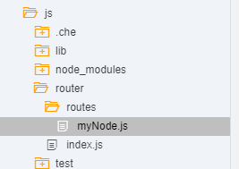

Add the following code to it:

```JavaScript
/*eslint no-console: 0, no-unused-vars: 0, no-shadow: 0, new-cap: 0*/
/*eslint-env node, es6 */
"use strict";
var express = require("express");

module.exports = function() {
	var app = express.Router();

	//Hello Router
	app.get("/", (req, res) => {
		return res.type("text/plain").status(200).send("Hello World Node.js");
	});
	return app;
};
```
You are now responding to a `GET` request to the relative root location of the file (in this case, `router`).  However, in the `index.js` file inside the `router` folder, you set the path to `/node` in the URL. You need to map this route in the `xs-app.json` file in the HTML5 module.

[DONE]

[ACCORDION-END]

[ACCORDION-BEGIN [Step 4: ](Add the route in the web module)]

Because it is the web module that is exposed for calls, you need to add the new `/node` route to the file `xs-app.json`:


```JavaScript
 {
 		"source": "/node(.*)",
 		"destination": "core-backend",
 		"csrfProtection": true,
 		"authenticationType": "xsuaa"
 	},

```

As follows:

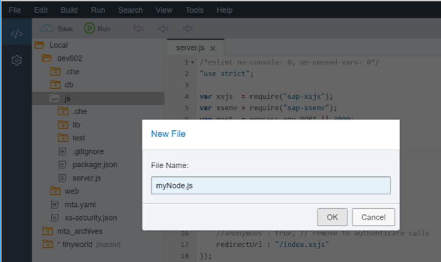

We also need to go to the mta.yaml and now extend the web module to include a dependency to the `core_node` module. Add a new Requires entry for the **web** module.  Set it to the `core_node_api (provider)` with a `Group` value of **destinations**.  Create properties of `name` = **core-backend**, `url` = **`~{url}`**, and `forwardAuthToken` = **true**.

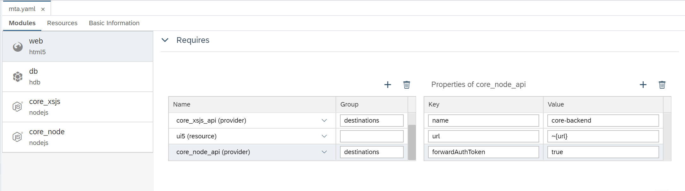

Now we need to extend the dependencies for the `core_node` module itself so it has access to the UAA and HANA service also. Add entries in the `Requires` section for these resources.
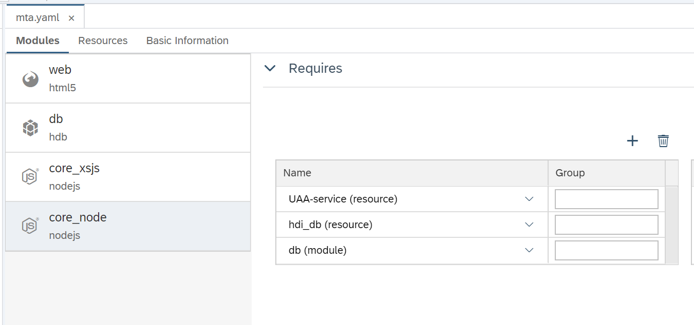

[DONE]

[ACCORDION-END]

[ACCORDION-BEGIN [Step 5: ](Extend dependencies in package.json)]

Back in step 1 you added the modules `express`, `passport` and several other modules using the **require** function. You now need to add them manually in the `package.json` file with the rest of the dependencies for the `core_node` module.

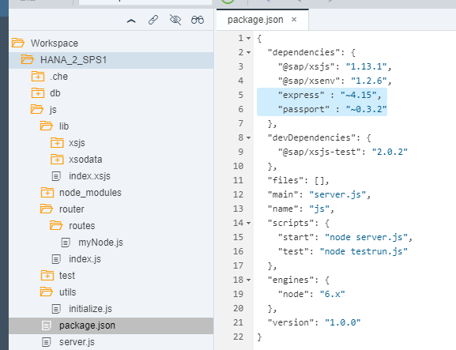

```text
"express": "^4.17",
"@sap/xssec": "^2.2",
"@sap/xsenv": "^2.2",
"@sap/hdbext": "~6.2",
"@sap/textbundle": "latest",
"@sap/logging": "~5.2",
"passport": "~0.4.0",
"async": "latest",
"ws": "~7.2",
"accept-language-parser": "latest",
"node-xlsx": "~0.15",
"node-zip": "~1.1.1",
"xmldoc": "~1.1.2",
"winston": "~3.2",
"body-parser": "~1.19",
"elementtree": "latest",
"then-request": "latest"
```

[DONE]

[ACCORDION-END]

[ACCORDION-BEGIN [Step 6: ](Build and Run )]

You can now run the `core_node` module.

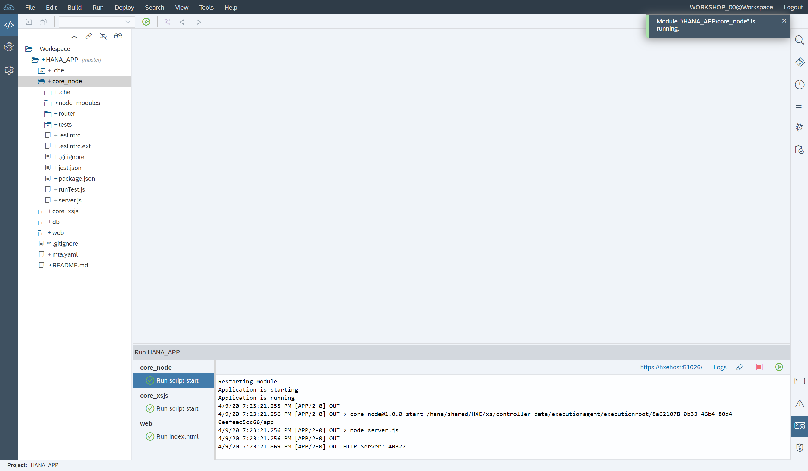

After it has built and started running, you can run the **web** module. This will open a new tab with the `index.html`. Test the original `.xsjs` service is running properly after the paths were changed with the route handler. Replace `html` with `xsjs`:

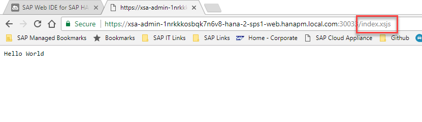

You can also test the newly added router by adding `/node` to the URL:

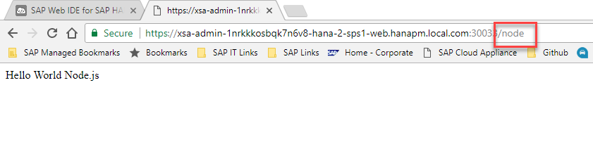

[DONE]

[ACCORDION-END]

