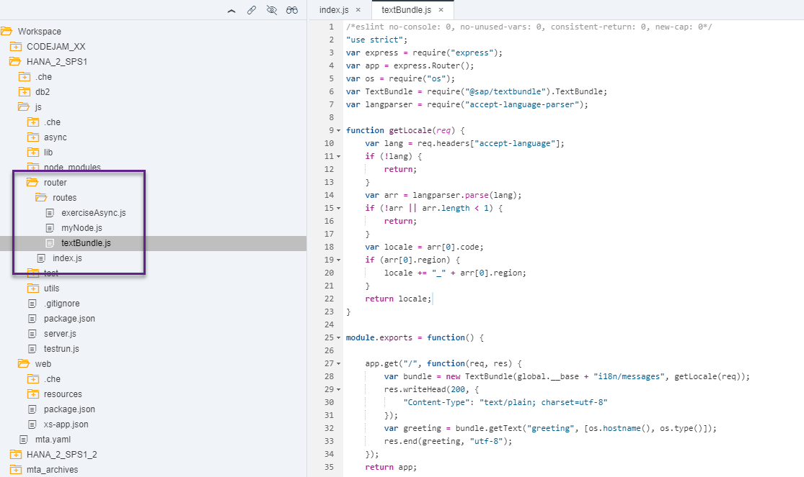
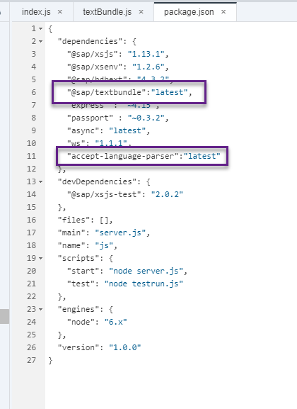
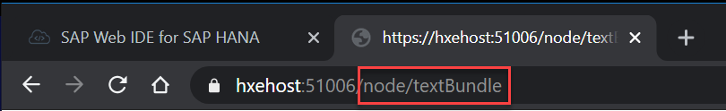
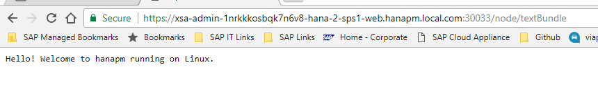

## Prerequisites  
- **Proficiency:** Intermediate
- **Tutorials:** [Asynchronous Non-Blocking I/O](https://www.sap.com/developer/tutorials/xsa-node-async.html)

## Next Steps
- [Web Sockets](https://www.sap.com/developer/tutorials/xsa-node-websockets.html)

## Details
### You will learn  
Working with text bundles in Node.js


### Time to Complete
**15 Min**.

---

[ACCORDION-BEGIN [Step 1: ](Add a new route for a text bundle module)]

Add a new route for `/routes/textBundle` in `/routerìndex.js`

```javascript
"use strict";


module.exports = function(app, server){
	app.use("/node", require("./routes/myNode")());
	app.use("/node/excAsync", require("./routes/exerciseAsync")(server));
	app.use("/node/textBundle", require("./routes/textBundle")());
};

```

As follows:


[ACCORDION-END]

[ACCORDION-BEGIN [Step 2: ](Create text bundle script)]

As you can guess from the code in the first step, you need a file called `textBundle.js` in your `routes` folder with the following code

```javascript
/*eslint no-console: 0, no-unused-vars: 0, consistent-return: 0, new-cap: 0*/
"use strict";
var express = require("express");
var app = express.Router();
var os = require("os");
var TextBundle = require("@sap/textbundle").TextBundle;
var langparser = require("accept-language-parser");

function getLocale(req) {
	var lang = req.headers["accept-language"];
	if (!lang) {
		return;
	}
	var arr = langparser.parse(lang);
	if (!arr || arr.length < 1) {
		return;
	}
	var locale = arr[0].code;
	if (arr[0].region) {
		locale += "_" + arr[0].region;
	}
	return locale;
}

module.exports = function() {

	app.get("/", function(req, res) {
		var bundle = new TextBundle(global.__base + "i18n/messages", getLocale(req));
		res.writeHead(200, {
			"Content-Type": "text/plain; charset=utf-8"
		});
		var greeting = bundle.getText("greeting", [os.hostname(), os.type()]);
		res.end(greeting, "utf-8");
	});
	return app;
};

```



Take a look at the code you have just added. First, you can see there are two new modules you will need to add as dependencies. Go to your `package.json` file and add them:




[ACCORDION-END]

[ACCORDION-BEGIN [Step 3: ](Create text bundle)]

`i18n` stands for `internationalization`, the process and means to adapt text, unit of measures and other language-specific aspects of software to the different languages and their norms.  The code you added in the previous step is referring to a folder called `i18n` in the base directory, where the text bundles are. Create the folder and a file called `messages.properties` with the following content:

```text

greeting = Hello! Welcome to {0} running on {1}.
```

You can see the code in `textBundle.js` is getting the language from the request and passing it to the `TextBundle` library, getting the text `greeting`. You can add a file called `messajes_ja.properties` for the translation in Japanese:

```Text

greeting = こんにちは！{0}上で実行されているへようこそ{1}
```

Or the following for the translation in German, in a file called `message_de.properties`.

```text

greeting = Hallo! Willkommen bei {0} läuft auf {1}

```
This is what the files should look like:


[ACCORDION-END]

[ACCORDION-BEGIN [Step 4: ](Test the translations)]

You can now run the `js` and `web` module. In the running tab, change the path to `/node/textBundle`:



You probably get the default language, English:



Change the language in your browser to test, for example, German:


Repeat the process raising Japanese `[ja]` to the top of the list and refresh the web page


[ACCORDION-END]


## Next Steps
- [SAP HANA XS Advanced - Web Sockets](https://www.sap.com/developer/tutorials/xsa-node-websockets.html)
