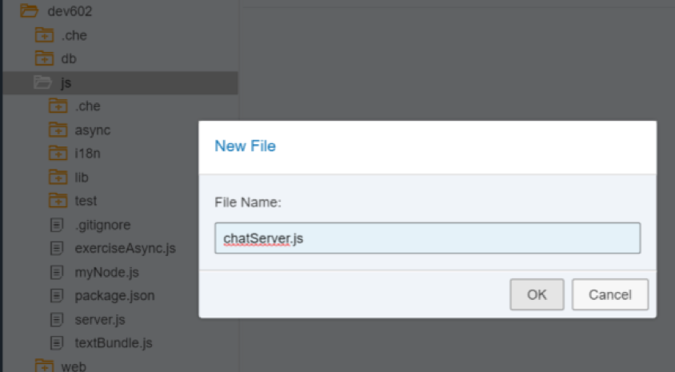
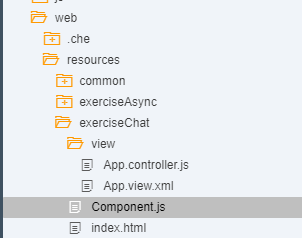
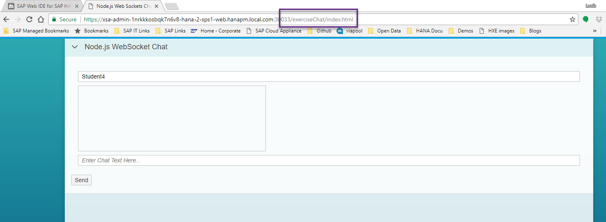
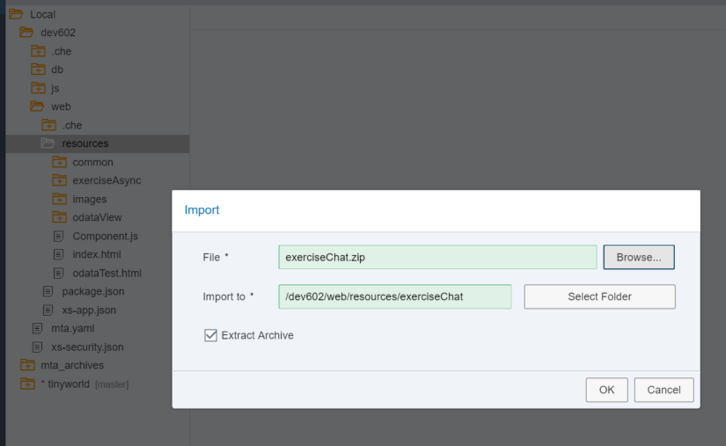

## Prerequisites  
- **Tutorials:** [Text Bundles](https://developers.sap.com/tutorials/xsa-node-text.html)

## Details
### You will learn  
This section will demonstrate the ease at which you can tap into the powerful web sockets capabilities of Node.js You will use web sockets to build a simple chat application. Any message sent from the SAPUI5 client side application will be propagated by the server to all listening clients.


---


[ACCORDION-BEGIN [Step 1: ](Require new module)]

Add an express route handler for this `chatServer` module and pass the server variable in as well.  

```JavaScript
/*eslint no-console: 0, no-unused-vars: 0, no-undef:0, no-process-exit:0*/
/*eslint-env node, es6 */
"use strict";

module.exports = (app, server) => {
	app.use("/node", require("./routes/myNode")());
	app.use("/node/excAsync", require("./routes/exerciseAsync")(server));
	app.use("/node/textBundle", require("./routes/textBundle")());
	app.use("/node/chat", require("./routes/chatServer")(server));

	app.use( (err, req, res, next) => {
		console.error(JSON.stringify(err));
		res.status(500).send(`System Error ${JSON.stringify(err)}`);
	});
};
```

[DONE]

[ACCORDION-END]

[ACCORDION-BEGIN [Step 2: ](Add route handler)]

Create a file called `chatServer.js` inside your `routes` folder with the following code:

```JavaScript
/*eslint no-console: 0, no-unused-vars: 0, new-cap: 0*/
/*eslint-env node, es6 */
"use strict";
var WebSocketServer = require("ws").Server;
var express = require("express");

module.exports = function (server) {
	var app = express.Router();
	app.use((req, res) => {
		var output =
			`<H1>Node.js Web Socket Examples</H1></br>
			<a href="/exerciseChat">/exerciseChat</a> - Chat Application for Web Socket Example</br>`;
		res.type("text/html").status(200).send(output);
	});
	var wss = new WebSocketServer({
		//	server: server,
		noServer: true,
		path: "/node/chatServer"
	});

	server.on("upgrade", function upgrade(request, socket, head) {
		const url = require("url");		
		const pathname = url.parse(request.url).pathname;

		if (pathname === "/node/chatServer") {
			wss.handleUpgrade(request, socket, head, function done(ws) {
				wss.emit("connection", ws, request);
			});
		}
	});

	wss.broadcast = (data) => {
		wss.clients.forEach(function each(client) {
			try {
				client.send(data);
			} catch (e) {
				console.log("Broadcast Error: %s", e.toString());
			}
		});
		console.log("sent: %s", data);

	};

	wss.on("connection", (ws) => {
		console.log("Connected");
		ws.on("message", (message) => {
			console.log("received: %s", message);
			wss.broadcast(message);
		});
		ws.send(JSON.stringify({
			user: "XS",
			text: "Hello from Node.js XS Server"
		}));
	});

	return app;
};

```

>Note: You can find more information on the `WebSockets` module and how it works the their [GitHub repository](https://github.com/websockets/ws)

[DONE]

[ACCORDION-END]

[ACCORDION-BEGIN [Step 3: ](Create a UI5 interface)]

The file structure for this interface will be simple as it is not the focus for this tutorial. Create a folder called `exerciseChat` in your web module, in `resources`:



Create a folder called `view` within that folder. It will contain one file, with the following name and code:

`view/App.view.xml`
```XML
<mvc:View controllerName="sap.xs.chat.controller.App" xmlns="sap.m" xmlns:l="sap.ui.layout" xmlns:mvc="sap.ui.core.mvc" height="100%">
	<Page title="{i18n>appTitle}">
		<content>
			<ScrollContainer height="100%" width="100%" horizontal="true" vertical="true">
				<Panel headerText="Node.js WebSocket Chat" expandable="true" expanded="true">
					<l:VerticalLayout class="sapUiContentPadding" width="100%">
						<l:content>
							<Input id="uName" value="{chatModel>/user}"/>
						</l:content>
						<l:content>
							<TextArea id="chatInfo" value="{chatModel>/chat}" cols="60" rows="8" editable="false"/>
						</l:content>
						<l:content>
							<Input id="message" value="{chatModel>/message}" placeholder="Enter Chat Text Here..."/>
						</l:content>
					</l:VerticalLayout>
					<Button text="Send" press="sendMsg"/>
				</Panel>
			</ScrollContainer>
		</content>
	</Page>
</mvc:View>
```

Now create a folder named `controller`.  We will create two files within this folder.

`controller/App.controller.js`

```javascript
/*eslint no-console: 0, no-unused-vars: 0, no-use-before-define: 0, no-redeclare: 0, no-undef: 0, no-sequences: 0, no-unused-expressions: 0*/
//To use a javascript controller its name must end with .controller.js
sap.ui.define([
	"sap/xs/chat/controller/BaseController",
	"sap/ui/model/json/JSONModel"
], function(BaseController, JSONModel) {
	"use strict";
	jQuery.sap.require("sap.ui.core.ws.WebSocket");
	var connection = new sap.ui.core.ws.WebSocket("/node/chatServer");
	return BaseController.extend("sap.xs.chat.controller.App", {

		onInit: function() {

			this.getView().addStyleClass("sapUiSizeCompact"); // make everything inside this View appear in Compact mode

			// server messages
			connection.attachMessage(function(oControlEvent) {
				var oModel = sap.ui.getCore().getComponent("comp").getModel("chatModel");
				var result = oModel.getData();

				var data = jQuery.parseJSON(oControlEvent.getParameter("data"));
				var msg = data.user + ": " + data.text,
					lastInfo = result.chat;

				if (lastInfo.length > 0) {
					lastInfo += "\r\n";
				}
				oModel.setData({
					chat: lastInfo + msg
				}, true);

				// scroll to textarea bottom to show new messages
			//	$("#comp---app--chatInfo-inner").scrollTop($("#comp---app--chatInfo-inner")[0].scrollHeight);
			});

			// error handling
			connection.attachError(function(oControlEvent) {
				sap.m.MessageToast.show("Websocket connection error");
			});

			// onConnectionClose
			connection.attachClose(function(oControlEvent) {
				sap.m.MessageToast.show("Websocket connection closed");
			});

			sap.ui.getCore().byId("comp---app--message").onsapenter = function(e) {
				if (sap.m.InputBase.prototype.onsapenter) {
					sap.m.InputBase.prototype.onsapenter.apply(this, arguments);
				}
				var oController = sap.ui.getCore().byId("comp---app").getController();
				oController.sendMsg();
			};
		},

		// send message
		sendMsg: function() {
			var oModel = this.getOwnerComponent().getModel("chatModel");
			var result = oModel.getData();
			var msg = result.message;
			if (msg.length > 0) {
				connection.send(JSON.stringify({
					user: result.user,
					text: result.message
				}));
				oModel.setData({
					message: ""
				}, true);
			}
		},

		onErrorCall: function(oError) {
			if (oError.statusCode === 500 || oError.statusCode === 400 || oError.statusCode === "500" || oError.statusCode === "400") {
				var errorRes = JSON.parse(oError.responseText);
				if (!errorRes.error.innererror) {
					sap.m.MessageBox.alert(errorRes.error.message.value);
				} else {
					if (!errorRes.error.innererror.message) {
						sap.m.MessageBox.alert(errorRes.error.innererror.toString());
					} else {
						sap.m.MessageBox.alert(errorRes.error.innererror.message);
					}
				}
				return;
			} else {
				sap.m.MessageBox.alert(oError.response.statusText);
				return;
			}

		}
	});
});
```

`controller/BaseController.js`
```JavaScript
/*global history */
sap.ui.define([
		"sap/ui/core/mvc/Controller",
		"sap/ui/core/routing/History"
	], function (Controller, History) {
		"use strict";

		return Controller.extend("sap.xs.chat.controller.BaseController", {
			/**
			 * Convenience method for accessing the router in every controller of the application.
			 * @public
			 * @returns {sap.ui.core.routing.Router} the router for this component
			 */
			getRouter : function () {
				return this.getOwnerComponent().getRouter();
			},

			/**
			 * Convenience method for getting the view model by name in every controller of the application.
			 * @public
			 * @param {string} sName the model name
			 * @returns {sap.ui.model.Model} the model instance
			 */
			getModel : function (sName) {
				return this.getView().getModel(sName);
			},

			/**
			 * Convenience method for setting the view model in every controller of the application.
			 * @public
			 * @param {sap.ui.model.Model} oModel the model instance
			 * @param {string} sName the model name
			 * @returns {sap.ui.mvc.View} the view instance
			 */
			setModel : function (oModel, sName) {
				return this.getView().setModel(oModel, sName);
			},

			/**
			 * Convenience method for getting the resource bundle.
			 * @public
			 * @returns {sap.ui.model.resource.ResourceModel} the resourceModel of the component
			 */
			getResourceBundle : function () {
				return this.getOwnerComponent().getModel("i18n").getResourceBundle();
			},

			/**
			 * Event handler for navigating back.
			 * It there is a history entry we go one step back in the browser history
			 * If not, it will replace the current entry of the browser history with the master route.
			 * @public
			 */
			onNavBack : function() {
				var sPreviousHash = History.getInstance().getPreviousHash();

					if (sPreviousHash !== undefined) {
					history.go(-1);
				} else {
					this.getRouter().navTo("master", {}, true);
				}
			}

		});

	}
);
```

Outside this folder, in the `exerciseChat` folder, add an `index.html` file with the following code to call your view:

```html
<!DOCTYPE html>
<html>
<head>
	<meta http-equiv="X-UA-Compatible" content="IE=edge" />
	<meta charset="UTF-8">
	<meta name="viewport" content="width=device-width, initial-scale=1.0, maximum-scale=1.0, user-scalable=no" />
	    <!-- <script id="sap-ui-bootstrap" src="https://sapui5.hana.ondemand.com/resources/sap-ui-core.js" -->
	<script id="sap-ui-bootstrap" src="{{{sapui5_sb.url}}}/resources/sap-ui-core.js"
		data-sap-ui-theme="sap_belize_plus"
		data-sap-ui-xx-bindingSyntax="complex"
		data-sap-ui-compatVersion="edge"
		data-sap-ui-preload="async"
		data-sap-ui-language="en"
		data-sap-ui-resourceroots='{
				"sap.xs.chat": "./",
				"view": "./view" }'			
		data-sap-ui-libs="sap.m,sap.ui.comp,sap.ui.core,sap.ui.layout,sap.ui.unified">
	</script>
	<script type="text/javascript" src="../common/startup.js"></script>
	<script>
		localShellStartup("sap.xs.chat");
	</script>
</head>
<body class="sapUiBody" role="application">
	<div id="content"></div>
</body>
</html>
```

Create a `Component.js` file with the following code:

```JavaScript
/*eslint no-console: 0, no-unused-vars: 0, no-use-before-define: 0, no-redeclare: 0*/
sap.ui.define([
	"sap/ui/core/UIComponent"
], function(UIComponent) {
	"use strict";

	return UIComponent.extend("sap.xs.chat.Component", {

	metadata: {
		manifest: "json"
	},

	init: function(){
		jQuery.sap.require("sap.m.MessageBox");
		jQuery.sap.require("sap.m.MessageToast");

		sap.ui.core.UIComponent.prototype.init.apply(
			this, arguments);

		// Chat Model
		var oModel = this.getModel("chatModel");
       	var names = ["Student1","Student2","Student3","Student4","Student5","Student6"];
      	oModel.setData({
      		user: names[Math.floor(names.length * Math.random())],
        	chat: "",
        	message: ""
      	});
	},

	destroy: function() {
			// call the base component's destroy function
			UIComponent.prototype.destroy.apply(this, arguments);
	}

	});

});
```

Finally create a file named `manifest.json` in the `exerciseChat` folder. This is its content.
```JSON
{
  "_version": "1.4.0",
  "start_url": "index.html",
  "sap.app": {
  	"_version": "1.4.0",
	"type": "application",
	"resources": "resources.json",
  	"i18n": "i18n/i18n.properties",
  	"id": "exerciseChat",
  	"title": "{{appTitle}}",
  	"description": "{{appDescription}}",
  	"applicationVersion": {
			"version": "${project.version}"
	}
  },
  "sap.fiori": {
	"_version": "2.0.0",
	"registrationIds": [],
	"archeType": "transactional"
  },
  "sap.ui": {
  	"_version": "1.40.0",
	"technology": "UI5",
  	 "icons":  {
  	 	"icon": "/images/favicon.ico",
  	 	"favIcon": "/images/favicon.ico"
  	 },
  	"deviceTypes": {
		"desktop": true,
		"tablet": true,
		"phone": true
	},
	"supportedThemes": [
			"sap_hcb",
			"sap_bluecrystal",
			"sap_belize"
	]
  },
  "sap.ui5": {
    "config": {
      "sapFiori2Adaptation": true
    },
    "rootView": {
    	"viewName": "sap.xs.chat.view.App",
    	"type": "XML",
    	"id": "app"
    },
    "dependencies": {
			"minUI5Version": "1.40.0",
			"libs": {
				"sap.ui.core": {
					"minVersion": "1.40.0"
				},
				"sap.ui.comp": {
					"minVersion": "1.40.0"					
				},
				"sap.m": {
					"minVersion": "1.40.0"
				},
				"sap.ui.layout": {
					"minVersion": "1.40.0"
				}
			}
		},
	"contentDensities": {
		"compact": true,
		"cozy": true
	},
    "handleValidation": true,
    "models": {
    	"chatModel": {
    		"type": "sap.ui.model.json.JSONModel",
    		"settings": {
    			"defaultBindingMode": "TwoWay"
    		}
    	},   	
    	"config": {
    		"type": "sap.ui.model.json.JSONModel"
    	},
    	"i18n": {
    		"type": "sap.ui.model.resource.ResourceModel",
    		"settings": {
    			"bundleUrl": "./i18n/i18n.properties"
    		}
    	}
    }

  }
}
```

[DONE]

[ACCORDION-END]

[ACCORDION-BEGIN [Step 4: ](Build and Run)]

This is what the file structure for the web module should look like.



Run the `core_node` module first and then run the `web` module. Remember to change the path to see the new web module:



[DONE]

[ACCORDION-END]

[ACCORDION-BEGIN [Step 5: ](Test the Chat)]

Open a second web browser with the same URL. You can test the chat by chatting with yourself:



All messages are being pushed out into all listeners. You can open a third chat window to test this.

[DONE]

[ACCORDION-END]
