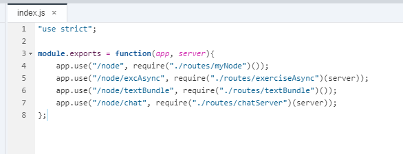
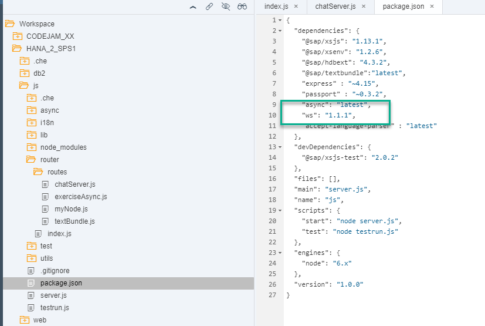
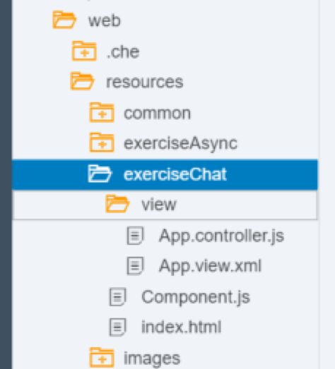

## Prerequisites  
- **Proficiency:** Intermediate
- **Tutorials:** [Text Bundles](http://www.sap.com/developer/tutorials/xsa-node-text.html)

## Next Steps
- Select a tutorial from the [Tutorial Navigator](http://www.sap.com/developer/tutorial-navigator.html) or the [Tutorial Catalog](http://www.sap.com/developer/tutorials.html)

## Details
### You will learn  
This section will demonstrate the ease at which you can tap into the powerful web sockets capabilities of Node.js You will use web sockets to build a simple chat application. Any message sent from the SAPUI5 client side application will be propagated by the server to all listening clients.


### Time to Complete
**15 Min**.

---


[ACCORDION-BEGIN [Step 1: ](Require new module)]

Add an express route handler for this `chatServer` module and pass the server variable in as well.  

```JavaScript
"use strict";

module.exports = function(app,server) {
	app.use("/node", require("./routes/myNode")());
	app.use("/node/excAsync", require("./routes/exerciseAsync")(server));
	app.use("/node/textBundle", require("./routes/textBundle")());
	app.use("/node/chat", require("./routes/chatServer")(server));
};

```

As follows:




[ACCORDION-END]

[ACCORDION-BEGIN [Step 2: ](Add route handler)]

Create a file called `chatServer.js` inside your `routes` folder with the following code:

```JavaScript
/*eslint no-console: 0, no-unused-vars: 0, new-cap: 0*/
"use strict";
var WebSocketServer = require("ws").Server;
var express = require("express");

module.exports = function(server) {
	var app = express.Router();
	app.use(function(req, res) {
		var output = "<H1>Node.js Web Socket Examples</H1></br>" +
			"<a href=\"/exerciseChat\">/exerciseChat</a> - Chat Application for Web Socket Example</br>";
		res.type("text/html").status(200).send(output);
	});
	var wss = new WebSocketServer({
		server: server,
		path: "/node/chatServer"
	});

	wss.broadcast = function(data) {
		wss.clients.forEach(function each(client) {
			try {
				client.send(data);
			} catch (e) {
				console.log("Broadcast Error: %s", e.toString());
			}
		});
		console.log("sent: %s", data);

	};

	wss.on("connection", function(ws) {
		ws.on("message", function(message) {
			console.log("received: %s", message);
			wss.broadcast(message);
		});
		ws.send(JSON.stringify({
			user: "XS",
			text: "Hello from Node.js XS Server"
		}));
	});

	return app;
};

```

Check the code you have just added. You will see the `ws` module is required. Add it to the `package.json` file.



>Note: You can find more information on the `WebSockets` module and how it works the their [GitHub repository](https://github.com/websockets/ws)


[ACCORDION-END]

[ACCORDION-BEGIN [Step 3: ](Create a UI5 interface)]

The file structure for this interface will be simple as it is not the focus for this tutorial. Create a folder called `exerciseChat` in your web module, in `resources`:


Create a folder called `view` within that folder. It will contain two files, worth the following names and code:

`App.view.xml`
```XML
<core:View
	controllerName="sap.xs.chat.view.App"
	xmlns="sap.m"
    xmlns:l="sap.ui.layout"
	xmlns:mvc="sap.ui.core.mvc"
	xmlns:core="sap.ui.core" >
	<ScrollContainer
    height="100%"
    width="100%"
    horizontal="true"
    vertical="true" >
    <Panel
	   headerText="Node.js WebSocket Chat"
	   expandable="true"
	   expanded="true">
        <l:VerticalLayout
            class="sapUiContentPadding"
            width="100%">
        <l:content>            
	        <Input id="uName" value="{/user}" />
        </l:content>
         <l:content>
	        <TextArea id="chatInfo" value="{/chat}" cols="60" rows="8" editable="false" />
        </l:content>
        <l:content>
	        <Input id="message" value="{/message}" placeholder="Enter Chat Text Here..." />
        </l:content>
        </l:VerticalLayout>
	   <Button text="Send" press="sendMsg" />
	</Panel>   

   </ScrollContainer>
</core:View>

```

`App.controller.js`

```javascript
/*eslint no-unused-vars: 0, no-undef: 0, no-sequences: 0, no-unused-expressions: 0*/
//To use a javascript controller its name must end with .controller.js
sap.ui.controller("sap.xs.chat.view.App", {

            onInit : function(){


                this.getView().addStyleClass("sapUiSizeCompact"); // make everything inside this View appear in Compact mode

      			// connection opened
      			connection.attachOpen(function (oControlEvent) {
        			sap.m.MessageToast.show("connection opened");
      			});

      			// server messages
      			connection.attachMessage(function (oControlEvent) {
      				var oModel = sap.ui.getCore().getModel("chatModel");
      				var result = oModel.getData();

       				var data = jQuery.parseJSON(oControlEvent.getParameter("data"));
        			msg = data.user + ": " + data.text,
        			lastInfo = result.chat;

       				if (lastInfo.length > 0){ lastInfo += "\r\n"; }   
       				oModel.setData({chat: lastInfo + msg}, true);

       				// scroll to textarea bottom to show new messages
       				$("#app--chatInfo-inner").scrollTop($("#app--chatInfo-inner")[0].scrollHeight);
     			});

      			// error handling
      			connection.attachError(function (oControlEvent) {
        			sap.m.MessageToast.show("Websocket connection error" );
      			});

      			// onConnectionClose
      			connection.attachClose(function (oControlEvent) {
        			sap.m.MessageToast.show("Websocket connection closed");
      			});    

      			sap.ui.getCore().byId("app--message").onsapenter = function(e) {
      				if (sap.m.InputBase.prototype.onsapenter) {  
     					 sap.m.InputBase.prototype.onsapenter.apply(this, arguments);  
  					}  
      				var oController = sap.ui.getCore().byId("app").getController();
      				oController.sendMsg();
      			};     				
            },

            // send message
      		sendMsg: function() {
      			var oModel = sap.ui.getCore().getModel("chatModel");
      			var result = oModel.getData();
       			var msg = result.chat;
       			if (msg.length > 0) {
        			connection.send(JSON.stringify(
         				{user: result.user, text: result.message}
        			));
        	    oModel.setData({message: ""}, true);
       			}     
      		},

			onErrorCall: function(oError){
			    if(oError.response.statusCode === 500 || oError.response.statusCode === 400){
	   	   	 		     var errorRes = JSON.parse(oError.response.body);
                        sap.m.MessageBox.alert(errorRes.error.message.value);
	   		    		return;
	   	   	 	 }
	   	   	  	 else{
	   			         sap.m.MessageBox.alert(oError.response.statusText);
	   		    		return;
	   	   	 	 }
			}
});

```

Outside this folder, in the `exerciseChat` folder, add an `index.html` file with the following code to call your view:

```html
<!DOCTYPE html>
<html>
<head>
	<meta http-equiv="X-UA-Compatible" content="IE=edge" />
	<meta charset="UTF-8">
	<meta name="viewport" content="width=device-width, initial-scale=1.0, maximum-scale=1.0, user-scalable=no" />
	<title>Node.js Web Sockets Chat</title>
	    <!-- <script id="sap-ui-bootstrap" src="https://sapui5.hana.ondemand.com/resources/sap-ui-core.js" -->
	<script id="sap-ui-bootstrap" src="{{{ui5liburl}}}/resources/sap-ui-core.js"
		data-sap-ui-theme="sap_bluecrystal"
		data-sap-ui-xx-bindingSyntax="complex"
		data-sap-ui-resourceroots='{
				"sap.xs.chat": "./",
				"view": "./view" }'			
		data-sap-ui-libs="sap.m, sap.me">
	</script>

	<script>
      // WS handling
      jQuery.sap.require("sap.ui.core.ws.WebSocket");  
      //var connection = new sap.ui.core.ws.WebSocket('ws://localhost:3080');
      var connection = new sap.ui.core.ws.WebSocket('/node/chatServer');      
	</script>

	<script>

	new sap.m.Shell({
		app : new sap.ui.core.ComponentContainer({
			name : "sap.xs.chat"
		})
	}).placeAt("content");

	</script>
</head>
<body class="sapUiBody" role="application">
	<div id="content"></div>
</body>
</html>
```

Create a `Component.js` file with the following code:

```JavaScript
jQuery.sap.declare("sap.xs.chat.Component");


sap.ui.core.UIComponent.extend("sap.xs.chat.Component", {
	init: function(){
		jQuery.sap.require("sap.m.MessageBox");
		jQuery.sap.require("sap.m.MessageToast");		
		// Chat Model
      	var oModel = new sap.ui.model.json.JSONModel();
       	var names = ["Student1","Student2","Student3","Student4","Student5","Student6"];
      	oModel.setData({
      		user: names[Math.floor(names.length * Math.random())],
        	chat: "",
        	message: ""
      	});
      	sap.ui.getCore().setModel(oModel,"chatModel");

		sap.ui.core.UIComponent.prototype.init.apply(this, arguments);
	},

	createContent: function() {

		var settings = {
				ID: "chatRoot",
				title: "Node.js Web Sockets Chat",
				description: "Node.js Web Sockets Chat"
			};

		var oView = sap.ui.view({
			id: "app",
			viewName: "sap.xs.chat.view.App",
			type: "XML",
			viewData: settings
		});
		oView.setModel(sap.ui.getCore().getModel("chatModel"));
    	return oView;
	}
});
```

[ACCORDION-END]

[ACCORDION-BEGIN [Step 4: ](Build and Run)]

This is what the file structure for the web module should look like.


Run the `js` module first and then run the `web` module. Remember to change the path to see the new web module:


[ACCORDION-END]

[ACCORDION-BEGIN [Step 5: ](Test the Chat)]

Open a second web browser with the same URL. You can test the chat by chatting with yourself:


All messages are being pushed out into all listeners. You can open a third chat window to test this:




[ACCORDION-END]


## Next Steps
- Select a tutorial from the [Tutorial Navigator](http://www.sap.com/developer/tutorial-navigator.html) or the [Tutorial Catalog](http://www.sap.com/developer/tutorials.html)
