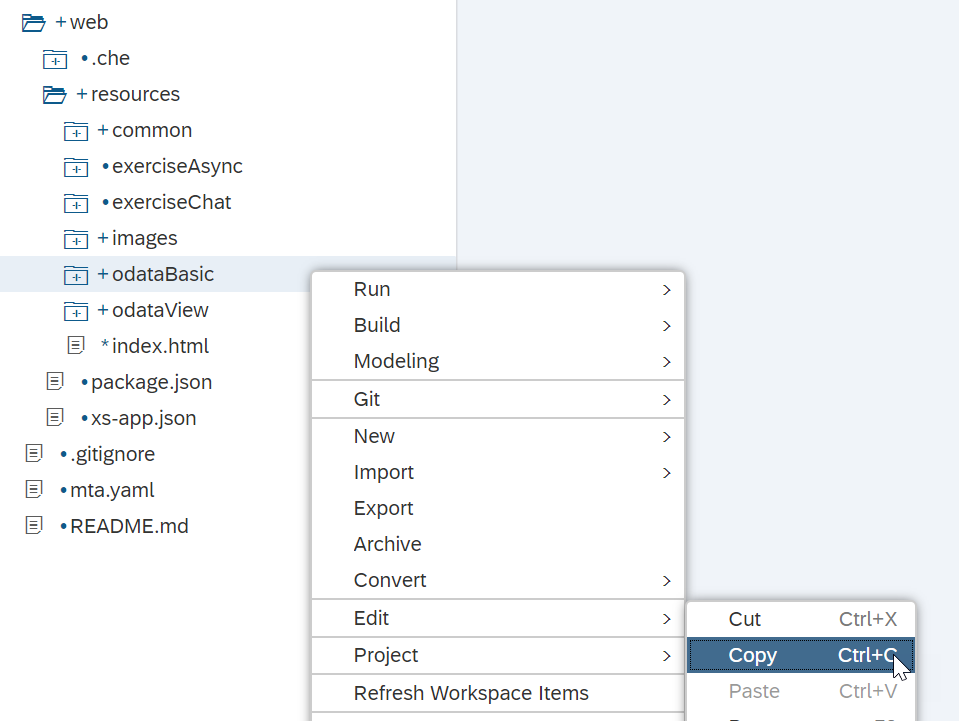
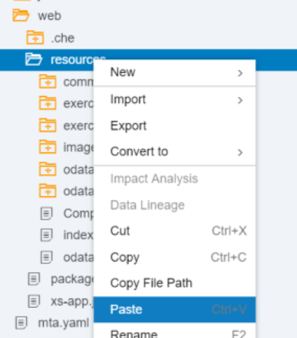
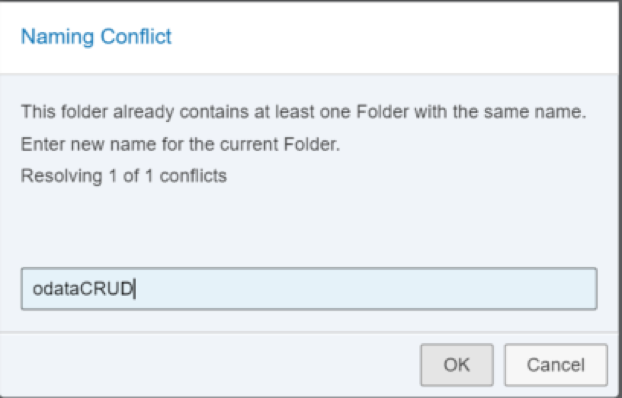
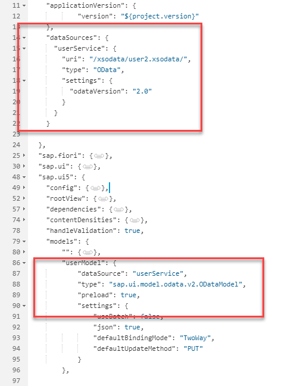
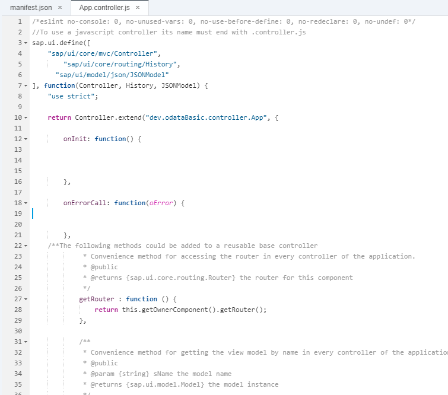
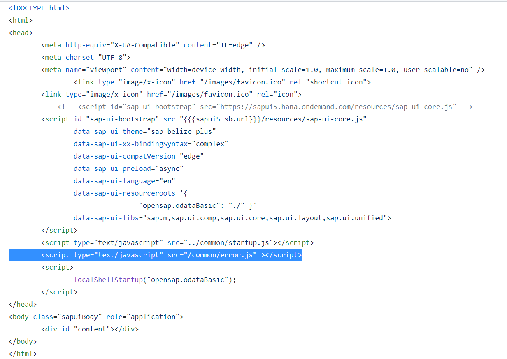
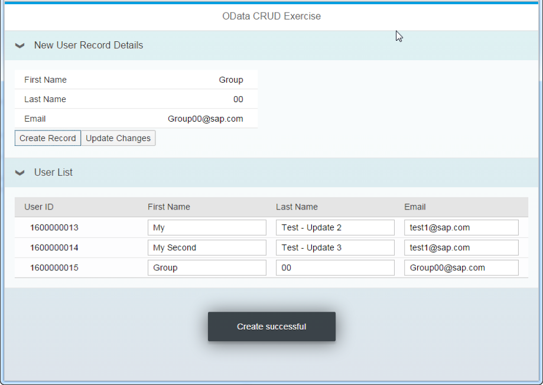
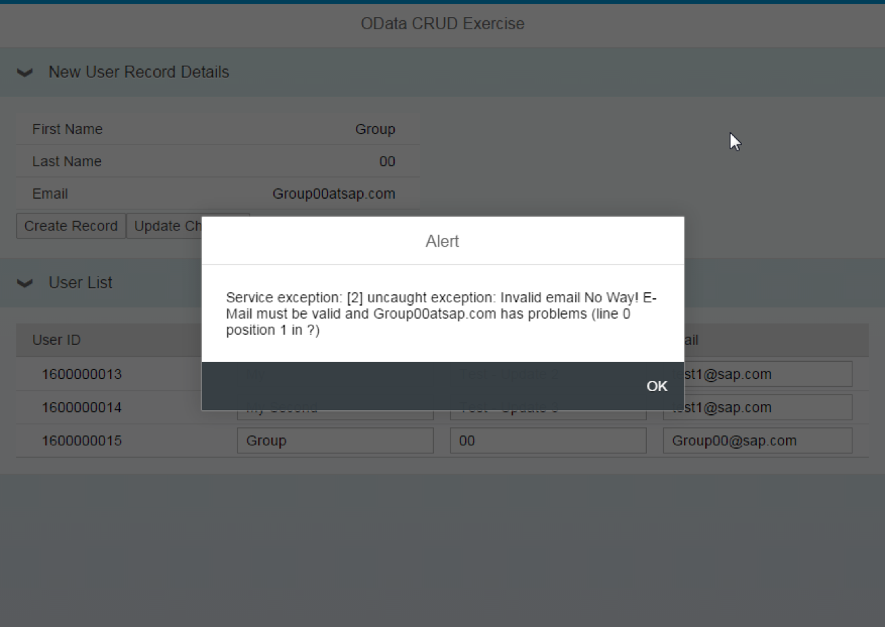

## Prerequisites  
- This tutorial is designed for SAP HANA on premise and SAP HANA, express edition. It is not designed for SAP HANA Cloud.
- **Tutorials:** [Use OData Metadata to dynamically create the columns](https://developers.sap.com/tutorials/xsa-sapui5-metadata.html)

## Details
### You will learn  
  - How to consume an OData service with create option


---

[ACCORDION-BEGIN [Step 1: ](Copy previous code)]

You will begin by making a copy of the previous exercise.



 Right-click on the `resources` folder. Choose Paste.



In the copy folder dialog, give the new Name as `odataCRUD`.



[DONE]

[ACCORDION-END]

[ACCORDION-BEGIN [Step 2: ](Edit `manifest,json`)]

Go into the `manifest.json` file and switch the service to the existing `user.xsodata` service. Also adjust the name of the `datasource` in the model configuration:



[DONE]

[ACCORDION-END]

[ACCORDION-BEGIN [Step 3: ](Adjust the XML view)]

Use the following code to replace the existing code for your XML view:

```XML
<mvc:View xmlns="sap.m" xmlns:mvc="sap.ui.core.mvc" xmlns:core="sap.ui.core"
	xmlns:smartTable="sap.ui.comp.smarttable" controllerName="opensap.odataBasic.controller.App" height="100%">
	<Page id="mPage" title="{i18n>appTitle}" titleLevel="H1">
		<content>
			<ScrollContainer id="sc1" height="100%" width="100%" horizontal="true" vertical="true">
				<Panel id="panel" headerText="New User Record Details" expandable="true" expanded="true">
					<List id="list" width="400px">
						<InputListItem id="itmFName" label="{i18n>FName}">
							<Input id="fName" value="{/FirstName}"/>
						</InputListItem>
						<InputListItem id="itmLName" label="{i18n>LName}">
							<Input id="lName" value="{/LastName}"/>
						</InputListItem>
						<InputListItem id="itmEmail" label="{i18n>EMail}">
							<Input id="email" value="{/Email}"/>
						</InputListItem>
					</List>
					<Button id="btnCall" text="{i18n>B3}" press="callUserService"/>
					<Button id="btnUpdate" text="{i18n>B4}" press="callUserUpdate"/>
				</Panel>
				<VBox fitContainer="true">
					<smartTable:SmartTable id="userTable" header="{i18n>UList}" editable="false" entitySet="Users" showRowCount="true" enableAutoBinding="true"
						showFullScreenButton="true" tableType="Table">
						<Table>
							<columns>
								<Column id="UserId">
									<customData>
										<core:CustomData key="p13nData" value='\{"columnKey": "UserId", "leadingProperty": "UserId", "sortProperty": "UserId", "columnIndex":"1"}'/>
									</customData>
									<Text text="{i18n>UserId}"/>
								</Column>
								<Column id="FirstName">
									<customData>
										<core:CustomData key="p13nData" value='\{"columnKey": "FirstName", "leadingProperty": "FirstName", "maxLength": "40","columnIndex":"2"}'/>
									</customData>
									<Text text="{i18n>FName}"/>
								</Column>
								<Column id="LastName">
									<customData>
										<core:CustomData key="p13nData" value='\{"columnKey": "LastName", "leadingProperty": "LastName", "maxLength": "40","columnIndex":"3"}'/>
									</customData>
									<Text text="{i18n>LName}"/>
								</Column>
								<Column id="Email">
									<customData>
										<core:CustomData key="p13nData" value='\{"columnKey": "Email", "leadingProperty": "Email", "maxLength": "40","columnIndex":"4"}'/>
									</customData>
									<Text text="{i18n>EMail}"/>
								</Column>
							</columns>
							<items>
								<ColumnListItem>
									<cells>
										<Input value="{UserId}" name="PERS_NO"/>
										<Input value="{FirstName}" name="FIRSTNAME"/>
										<Input value="{LastName}" name="LASTNAME"/>
										<Input value="{Email}" name="E_MAIL"/>
									</cells>
								</ColumnListItem>
							</items>
						</Table>
					</smartTable:SmartTable>
				</VBox>
			</ScrollContainer>
		</content>
	</Page>
</mvc:View>
```

[DONE]

[ACCORDION-END]

[ACCORDION-BEGIN [Step 4: ](Add controller logic)]

Event handlers are within the controller file for your view. You can delete the implementation of the functions `onInit` and `onErrorCall`, as you will implement new logic:



Add the following code to the `onInit` function:

```javascript
this.getView().addStyleClass("sapUiSizeCompact"); // make everything inside this View appear in Compact mode
var oConfig = this.getOwnerComponent().getModel("config");
var userName = oConfig.getProperty("/UserName");
var userModel = this.getOwnerComponent().getModel("userModel");
var oTable = this.getView().byId("userTable");
oTable.setModel(userModel);

```

Add a function called `callUserService`:

```javascript
callUserService: function () {
  var oModel = this.getOwnerComponent().getModel("userModel");
  var result = this.getView().getModel().getData();
  var oEntry = {};
  oEntry.UserId = "0000000000";
  oEntry.FirstName = result.FirstName;
  oEntry.LastName = result.LastName;
  oEntry.Email = result.Email;

  oModel.setHeaders({
    "content-type": "application/json;charset=utf-8"
  });
  var mParams = {};
  mParams.success = function () {
    sap.ui.require(["sap/m/MessageToast"], function (MessageToast) {
      MessageToast.show("Create successful");
    });
  };
  mParams.error = onODataError;
  oModel.create("/Users", oEntry, mParams);
},
```

Take a look at the code you have just added. You can see it is creating a JSON object with the service fields.

Add a new function called `callUserUpdate`

```javascript
callUserUpdate: function () {
  var oModel = this.getOwnerComponent().getModel("userModel");
  oModel.setHeaders({
    "content-type": "application/json;charset=utf-8"
  });

  var mParams = {};
  mParams.error = onODataError;
  mParams.success = function () {
    sap.ui.require(["sap/m/MessageToast"], function (MessageToast) {
      MessageToast.show("Update successful");
    });
  };

  oModel.submitChanges(mParams);
}
```

Finally, delete the error handling function as we will use the reusable function from `common/error.js` which was created earlier.  But we also need add this `error.js` reference to our index.html

```html
	<script type="text/javascript" src="/common/error.js" ></script>
```


[DONE]

[ACCORDION-END]

[ACCORDION-BEGIN [Step 5: ](Save and test)]

Run the `web` module. When the new tab opens, adjust the URL to include the `/odataCRUD` path:


Try creating a new record:

Try both creating a new record and editing existing records. Also try creating a record with an invalid email address.





[DONE]

[ACCORDION-END]
