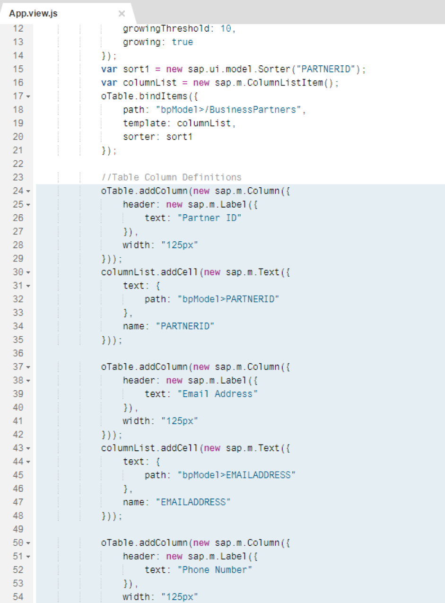
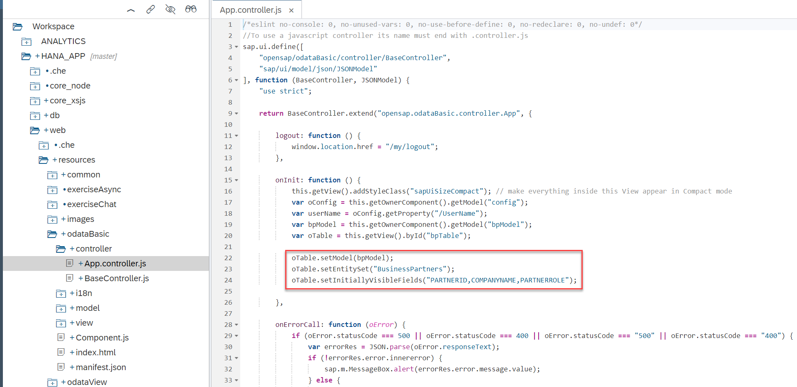
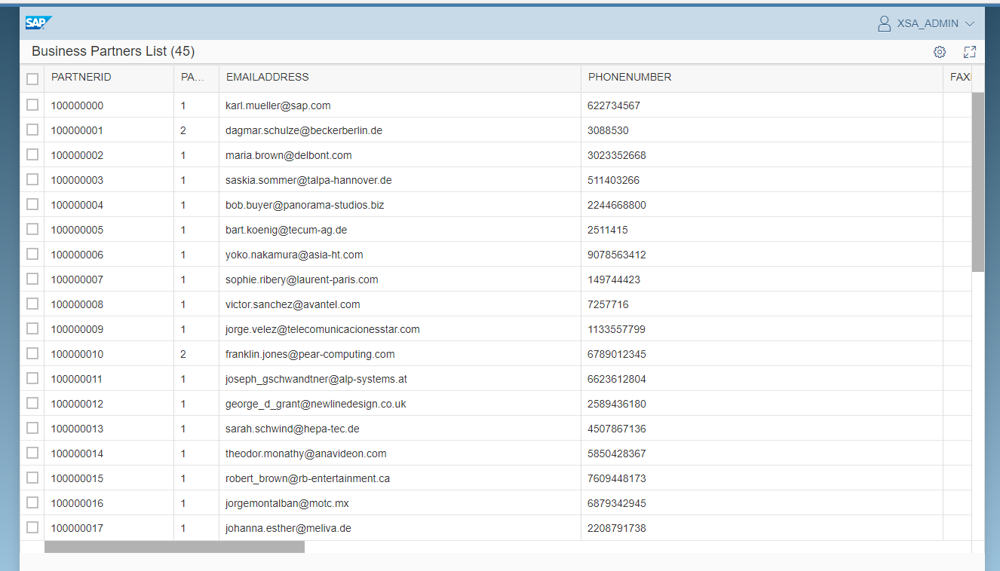

## Prerequisites  
- **Proficiency:** Intermediate
- **Tutorials:** [Consume a Basic OData Service](https://developers.sap.com/tutorials/xsa-sapui5-odata.html)

## Next Steps
- [Consume an OData Service with Create Option](https://developers.sap.com/tutorials/xsa-sapui5-consume.html)

## Details
### You will learn  
Use the Metadata to dynamically create columns in your table.


### Time to Complete
**10 Min**.

---


[ACCORDION-BEGIN [Step 1: ](Check the metadata from the service)]

In the previous tutorial, you hard-coded the columns to be displayed from your OData service. However, OData services expose all their meta data and we can use this feature to build the columns dynamically. You can test this by running the web module and calling the OData service and adding `$metadata`



You can see the service exposes the names of the fields and other properties such as the length.

[DONE]

[ACCORDION-END]

[ACCORDION-BEGIN [Step 2: ](Adapt the controller)]

Return to the controller of `odataBasic` from the previous tutorial and replace the following lines:



With the following code:

```javascript
function fnLoadMetadata() {
	try {
		oTable.setModel(bpModel);
		oTable.setEntitySet("BusinessPartners");
		var oMeta = bpModel.getServiceMetadata();
		var headerFields = "";
		for (var i = 0; i < oMeta.dataServices.schema[0].entityType[0].property.length; i++) {
			var property = oMeta.dataServices.schema[0].entityType[0].property[i];
			headerFields += property.name + ",";
		}
		oTable.setInitiallyVisibleFields(headerFields);
	} catch (e) {
		console.log(e.toString());
		oDataFailed();
	}
}
bpModel.attachMetadataLoaded(bpModel, function () {
	fnLoadMetadata();
});
fnLoadMetadata();
```

You can see the new function that retrieves the metadata from the service, loops at the results and concatenates the names of the fields separated by a comma. The fields are  then attached to the `bpModel` component.

[DONE]

[ACCORDION-END]

[ACCORDION-BEGIN [Step 3: ](Save and run)]

Save the files you have modified and run the web module:



[DONE]

[ACCORDION-END]
