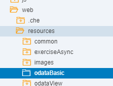
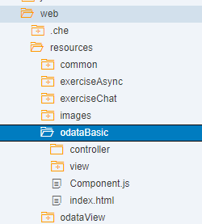

## Prerequisites
- This tutorial is designed for SAP HANA on premise and SAP HANA, express edition. It is not designed for SAP HANA Cloud.
- **Proficiency:** Intermediate
- **Tutorials:** [SAPUI5 User Interface](https://developers.sap.com/tutorials/xsa-sapui5.html)

## Next Steps
- [Use OData Metadata to dynamically create the columns](https://developers.sap.com/tutorials/xsa-sapui5-metadata.html)

## Details
### You will learn
SAPUI5 uses data binding to bind two data sources or information sources together to keep them in sync: All changes in one source are also reflected in the other one. In this tutorial, you will consume a Basic OData Service within UI5 binding the service to a table.


### Time to Complete
**15 Min**.

---


[ACCORDION-BEGIN [Step 1: ](Import Template Project)]

We have prepared a skeleton application for you with several sections that need to be completed marked To-Do.

Import this this template into web/resources folder from the following URL: [https://github.com/SAP-samples/hana-xsa-opensap-hana7/raw/snippets_2.4.0/ex4/odataBasic.zip](https://github.com/SAP-samples/hana-xsa-opensap-hana7/raw/snippets_2.4.0/ex4/odataBasic.zip)


Create a folder named `odataBasic` within the `web/resources` folder





After the import, please check to see if you have a `/web/resources/common` folder with a file `startup.js` within it.  This could have been created earlier if you completed tutorial [SAP HANA XS Advanced - Asynchronous Non-Blocking I/O within Node.js SAP HANA applications](xsa-node-async).  If you do not have this file, you can create it now without having to perform the entire previous tutorial.  Here is the source code of `startup.js`.

```JavaScript
/*eslint no-console: 0, no-unused-vars: 0, no-use-before-define: 0, no-redeclare: 0, no-shadow:0*/
function onLoadSession(myJSON) {
	try {
		var result = JSON.parse(myJSON);
		if (result.session.length > 0) {
			if (result.session[0].familyName !== "") {
				return result.session[0].givenName + " " + result.session[0].familyName;
			} else {
				return result.session[0].UserName;
			}
		}
	} catch (e) {
		return "";
	}
	return "";
}

function getSessionInfo() {
	var aUrl = "/node/getSessionInfo";

	return onLoadSession(
		jQuery.ajax({
			url: aUrl,
			method: "GET",
			dataType: "json",
			async: false
		}).responseText);
}

function localShellStartup(name) {

	sap.ui.getCore().attachInit(function () {
		var ComponentContainer = new sap.ui.core.ComponentContainer({
			height: "100%"
		});
		var username = "Test User";
		// create a shell
		new sap.ui.unified.Shell({
			id: "myShell",
			icon: "/images/sap_18.png",
			headEndItems: new sap.ui.unified.ShellHeadItem({
				icon: "sap-icon://log",
				tooltip: "Logoff",
				press: function () {
					window.location.href = "/my/logout";
				}
			}),
			user: new sap.ui.unified.ShellHeadUserItem({
				image: "sap-icon://person-placeholder",
				username: username
			}),
			content: ComponentContainer
		}).placeAt("content");

		var oComponent = sap.ui.component({
			id: "comp",
			name: name,
			manifestFirst: true,
			async: true
		}).then(function (oComponent) {
			ComponentContainer.setComponent(oComponent);
		});

	});
}
```

[DONE]

[ACCORDION-END]

[ACCORDION-BEGIN [Step 2: ](Understanding the code - fill in the `To-Dos` to create a model from a data source)]

So far, you have created a skeleton of an application.  Just copying and pasting is no fun, so you have some pending coding to do. The objective here is to bind the `xsodata` service you created within the `js` module to a table displayed in your SAPUI5 interface. You will reuse the service `businessPartners.xsodata`. In order to achieve this, you need to declare this service as a data source.  This is done in the `manifest.json` file, replacing the first `//To-Do` comment with the following:

```json
"dataSources": {
			"bpService": {
				"uri": "/xsodata/businessPartners.xsodata/",
				"type": "OData",
				"settings": {
					"odataVersion": "2.0"
				}
			}
		}

```

Scroll down until the next `//To-Do` comment and add the following model:

```json
"bpModel": {
	"dataSource": "bpService",
	"type": "sap.ui.model.odata.v2.ODataModel",
	"preload": true,
	"settings": {
		"useBatch": false,
		"json": true,
		"defaultBindingMode": "TwoWay",
		"defaultUpdateMethod": "PUT"
	}
},
```

[DONE]

[ACCORDION-END]

[ACCORDION-BEGIN [Step 3: ](Fill in the `To-Do` in the controller)]

Now that you have a data source and a model exposing it, you need to bind it to the table in your view. You will first bind the table to the entity `BusinessPartners` and tell the `SmartTable` control which columns to display. You fill find the to-do in `onInit` method in the `App.controller.js`:

```javascript

oTable.setModel(bpModel);
oTable.setEntitySet("BusinessPartners");
oTable.setInitiallyVisibleFields("PARTNERID,COMPANYNAME,PARTNERROLE");

```

[DONE]

[ACCORDION-END]

[ACCORDION-BEGIN [Step 4: ](Save and Run)]

Save the files you have modified and run the web module

Change the path in the new tab to `/odataBasic`:


[DONE]

[ACCORDION-END]
