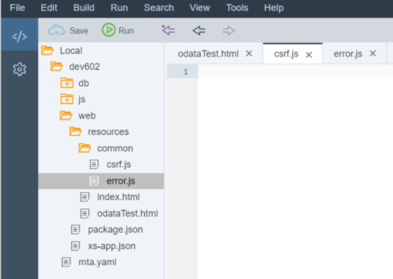
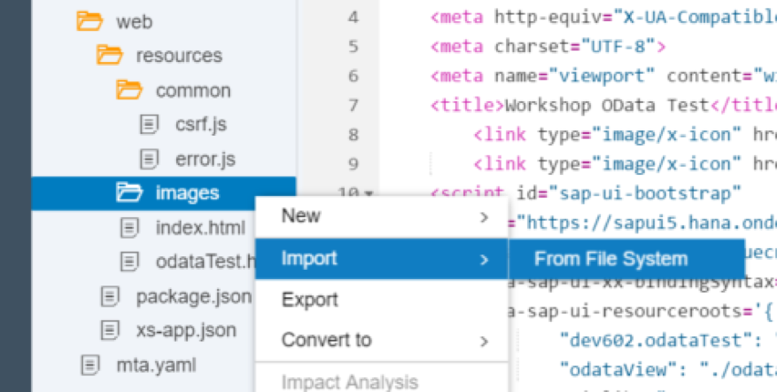
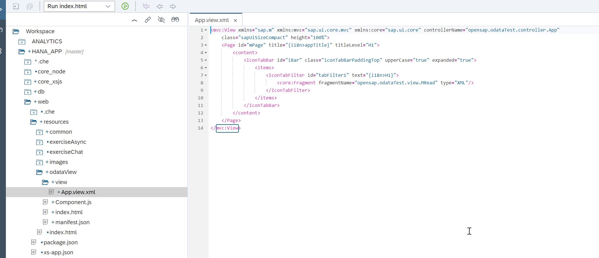
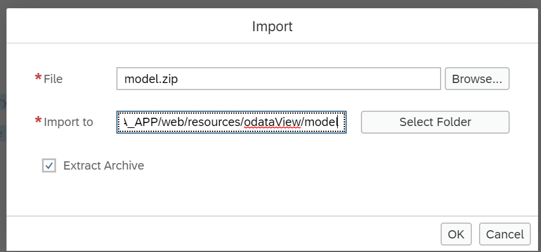
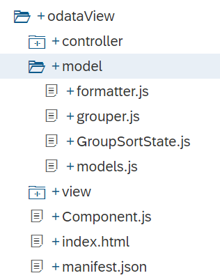
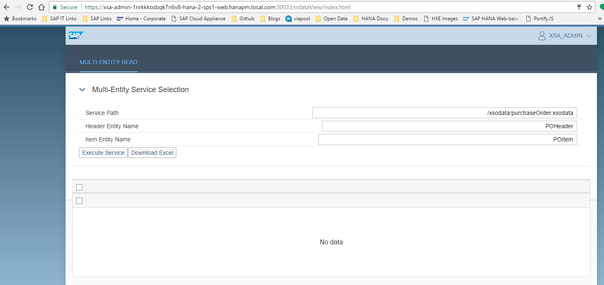

## Prerequisites  
- This tutorial is designed for SAP HANA on premise and SAP HANA, express edition. It is not designed for SAP HANA Cloud.
- **Tutorials:** [Creating an OData Service with Create Operation and XSJS Exit](xsa-xsodata-create) and [SAP HANA XS Advanced - Consume the OData service in a basic HTML5 module](xsa-html5-expand-module)

## Details
### You will learn  
In this tutorial, you will create a SAPUI5 user interface, including the view and their controllers, to call `xsjs` and OData services. Be sure to have completed [SAP HANA XS Advanced - Consume the OData service in a basic HTML5 module](xsa-html5-expand-module) as this tutorial adds the SAPUI5 service to the project and properly wires it into the `web` module.  With this step done we can focus on creating new SAPUI5 interfaces which leverage this work.

---

[ACCORDION-BEGIN [Step 1: ](Create a new HTML file)]

Return to your `web` module and create a new folder named `resources/odataView` with an HTML file called `index.html`


Here is the complete coding for the new page.


```HTML
<!DOCTYPE html>
<html>
<head>
	<meta http-equiv="X-UA-Compatible" content="IE=edge" />
	<meta http-equiv="Content-Type" content="text/html;charset=UTF-8"/>
	<meta name="viewport" content="width=device-width, initial-scale=1.0" />
   	<link type="image/x-icon" href="/images/favicon.ico" rel="shortcut icon">
    <link type="image/x-icon" href="/images/favicon.ico" rel="icon">
	<!-- <script id="sap-ui-bootstrap" src="https://sapui5.hana.ondemand.com/resources/sap-ui-core.js" -->
	<script id="sap-ui-bootstrap" src="{{{sapui5_sb.url}}}/resources/sap-ui-core.js"
		data-sap-ui-theme="sap_belize_plus"
		data-sap-ui-xx-bindingSyntax="complex"
		data-sap-ui-compatVersion="edge"
		data-sap-ui-preload="async"
		data-sap-ui-language="en"
		data-sap-ui-oninit="module:common/index"		
		data-sap-ui-resourceroots='{
        		"common": "../common",
				"root": "./",
				"opensap.odataTest": "./"}'		
		data-sap-ui-frameOptions="trusted">
	</script>
	<script type="text/javascript" src="/common/error.js" ></script>  
</head>

<!-- UI Content -->
<body class="sapUiBody" id="content">
</body>
</html>
```

[DONE]

[ACCORDION-END]

[ACCORDION-BEGIN [Step 2: ](Create `csrf.js`, `error.js`, and `index.js` )]

There are three utility JavaScript libraries you reference in this HTML page:
- `common/csrf.js` for the handling of CSRF tokens
- `common/error.js` for producing error messages
- `common/index.js` for bootstrapping the shell

Create a `common` folder in resources and add these three files.



Here is the coding of `csrf.js` :

```JavaScript
/*eslint no-console: 0, no-unused-vars: 0, no-use-before-define: 0, no-redeclare: 0*/
$.ajaxSetup({
	    beforeSend: function(xhr,settings) {
	      if (settings && settings.hasOwnProperty("type")
	          && settings.type !== "GET"){
	    	  var token = getCSRFToken();
	        xhr.setRequestHeader("X-CSRF-Token", token);
	      }
	    },
	    complete: function(xhr,textStatus) {
	        var loginPage = xhr.getResponseHeader("x-sap-login-page");
	        if (loginPage) {
	            location.href = loginPage + "?x-sap-origin-location=" + encodeURIComponent(window.location.pathname);
	        }
	    }
	});

	function getCSRFToken() {
	    var token = null;
	    $.ajax({
	        url: "/xsjs/csrf.xsjs",
	        type: "GET",
	        async: false,
	        beforeSend: function(xhr) {
	            xhr.setRequestHeader("X-CSRF-Token", "Fetch");
	        },
	        complete: function(xhr) {
	            token = xhr.getResponseHeader("X-CSRF-Token");
	        }
	    });
	    return token;
	}

```

And here is the code for `error.js`:

```JavaScript
/*eslint no-console: 0, no-unused-vars: 0, no-use-before-define: 0, no-redeclare: 0*/
/*eslint-env es6 */
function onErrorCall(jqXHR, textStatus, errorThrown) {
	sap.ui.require(["sap/ui/core/Core", "sap/m/MessageBox"], function (Core, MessageBox) {
		if (typeof jqXHR.status === "undefined") {
			var errorRes = JSON.parse(jqXHR.response.body);
			MessageBox.show(
				errorRes.error.innererror.errordetail.DETAIL, {
					icon: MessageBox.Icon.ERROR,
					title: "Service Call Error",
					actions: [MessageBox.Action.OK],
					styleClass: "sapUiSizeCompact"
				});
		} else {
			if (jqXHR.status === 500 || jqXHR.status === 400) {
				MessageBox.show(jqXHR.responseText, {
					icon: MessageBox.Icon.ERROR,
					title: "Service Call Error",
					actions: [MessageBox.Action.OK],
					styleClass: "sapUiSizeCompact"
				});
				return;
			} else {
				MessageBox.show(jqXHR.statusText, {
					icon: MessageBox.Icon.ERROR,
					title: "Service Call Error",
					actions: [MessageBox.Action.OK],
					styleClass: "sapUiSizeCompact"
				});
				return;
			}
		}
	});
}

function onODataError(oError) {
	sap.ui.require(["sap/m/MessageBox"], (MessageBox) => {
		if (oError.statusCode === 500 || oError.statusCode === 400 || oError.statusCode === "500" || oError.statusCode === "400") {
			var errorRes = JSON.parse(oError.responseText);
			if (!errorRes.error.innererror) {
				MessageBox.alert(errorRes.error.message.value);
			} else {
				if (!errorRes.error.innererror.message) {
					MessageBox.alert(errorRes.error.innererror.toString());
				} else {
					MessageBox.alert(errorRes.error.innererror.message);
				}
			}
			return;
		} else {
			MessageBox.alert(oError.response.statusText);
			return;
		}
	});
}

function oDataFailed(oControlEvent) {
	sap.ui.require(["sap/m/MessageBox"], (MessageBox) => {
		MessageBox.show("Bad Entity Definition", {
			icon: MessageBox.Icon.ERROR,
			title: "OData Service Call Error",
			actions: [MessageBox.Action.OK],
			styleClass: "sapUiSizeCompact"
		});
	});

	return;
}


```

Finally check that your `common` folder also has a file named `index.js`. You likely created this in a previous tutorial. If not, please create it now  with the following content:

```JavaScript
/*eslint no-console: 0, no-unused-vars: 0, no-use-before-define: 0, no-redeclare: 0, no-shadow:0*/
/*eslint-env es6 */
sap.ui.require(["sap/ui/core/Core", "sap/ui/core/Component"], (oCore, Component) => {

	function onLoadSession(myJSON) {
		try {
			var result = JSON.parse(myJSON);
			if (result.session.length > 0) {
				if (result.session[0].familyName !== "") {
					return result.session[0].givenName + " " + result.session[0].familyName;
				} else {
					return result.session[0].UserName;
				}
			}
		} catch (e) {
			return "";
		}
		return "";
	}

	function getSessionInfo() {
		var aUrl = "/node/getSessionInfo";

		return onLoadSession(
			jQuery.ajax({
				url: aUrl,
				method: "GET",
				dataType: "json",
				async: false
			}).responseText);
	}

	Component.create({
		id: "comp",
		name: "root",
		manifestFirst: true,
		async: true
	}).then((oComp) => {
		sap.ui.require(["sap/ui/core/ComponentContainer"], (ComponentContainer) => {
			let oCont = new ComponentContainer({
				component: oComp,
				height: "100%"
			});

			let username = "Test User";
			oCore.loadLibrary("sap.ui.unified", {
				async: true
			}).then(() => {
				let oShell = new sap.ui.unified.Shell({
					id: "myShell",
					icon: "/images/sap_18.png",
					headEndItems: new sap.ui.unified.ShellHeadItem({
						icon: "sap-icon://log",
						tooltip: "Logoff",
						press: () => {
							window.location.href = "/my/logout";
						}
					}),
					user: new sap.ui.unified.ShellHeadUserItem({
						image: "sap-icon://person-placeholder",
						username: username
					}),
					content: oCont
				}).placeAt("content");
			});
		});
	});

});
```

[DONE]

[ACCORDION-END]

[ACCORDION-BEGIN [Step 3: ](Create optional images folder)]

You also reference some images in this HTML page. They aren't critical, but if you want you can create an images folder inside resources and then upload these images from our GIT repository:

1. [SAP icon](https://github.com/SAP-samples/hana-xsa-opensap-hana7/raw/main/web/resources/images/favicon.ico)

2. [SAP logo](https://github.com/SAP-samples/hana-xsa-opensap-hana7/raw/main/web/resources/images/sap_18.png)



[DONE]

[ACCORDION-END]

[ACCORDION-BEGIN [Step 4: ](Create `Component.js`)]

Next you need to create your `Component.js` file in the folder `web/resources/odataView`. Here is the coding of this file:  

```JavaScript
/*eslint no-console: 0, no-unused-vars: 0, no-use-before-define: 0, no-redeclare: 0*/
sap.ui.define([
	"sap/ui/core/UIComponent",
	"sap/ui/Device",
	"opensap/odataTest/model/models"
], function(UIComponent, Device, models) {
	"use strict";

	return UIComponent.extend("opensap.odataTest.Component", {

		metadata: {
			manifest: "json"
		},

		init: function() {
			this.setModel(models.createDeviceModel(), "device");

			sap.ui.core.UIComponent.prototype.init.apply(
				this, arguments);
		},

		destroy: function() {
			// call the base component's destroy function
			UIComponent.prototype.destroy.apply(this, arguments);
		}
	});
});


```

Here you initialize the SAPUI5 component and in doing so you create an instance of the JSON configuration model. You also load your first view which you will create in the next step.

[DONE]

[ACCORDION-END]


[ACCORDION-BEGIN [Step 5: ](Create manifest.json file)]
This file works as an application descriptor. This file provides metadata about the application, such as libraries and other technical details. It also sets the initial view details as well as creates the JSON and OData models.

```JSON
{
	"_version": "1.4.0",
	"start_url": "index.html",
	"sap.app": {
		"_version": "1.4.0",
		"type": "application",
		"resources": "resources.json",
		"i18n": "i18n/i18n.properties",
		"id": "odataView",
		"title": "{{appTitle}}",
		"description": "{{appDescription}}",
		"applicationVersion": {
			"version": "${project.version}"
		}
	},
	"sap.fiori": {
		"_version": "2.0.0",
		"registrationIds": [],
		"archeType": "transactional"
	},
	"sap.ui": {
		"_version": "1.60.0",
		"technology": "UI5",
		"icons": {
			"icon": "./images/favicon.ico",
			"favIcon": "./images/favicon.ico"
		},
		"deviceTypes": {
			"desktop": true,
			"tablet": true,
			"phone": true
		},
		"supportedThemes": [
			"sap_belize",
			"sap_belize_plus"
		]
	},
	"sap.ui5": {
		"config": {
			"sapFiori2Adaptation": true
		},
		"rootView": {
			"viewName": "opensap.odataTest.view.App",
			"type": "XML",
			"id": "app",
			"async": true
		},
		"dependencies": {
			"minUI5Version": "1.60.0",
			"libs": {
				"sap.ui.core": {
					"minVersion": "1.60.0"
				},
				"sap.ui.comp": {
					"minVersion": "1.60.0"
				},
				"sap.m": {
					"minVersion": "1.60.0"
				},
				"sap.ui.layout": {
					"minVersion": "1.60.0"
				}
			}
		},
		"contentDensities": {
			"compact": true,
			"cozy": true
		},
		"handleValidation": true,
		"models": {
			"": {
				"type": "sap.ui.model.json.JSONModel",
				"settings": {
					"defaultBindingMode": "TwoWay"
				}
			},
			"config": {
				"type": "sap.ui.model.json.JSONModel"
			},
			"i18n": {
				"type": "sap.ui.model.resource.ResourceModel",
				"settings": {
					"bundleUrl": "./i18n/i18n.properties"
				}
			}
		}

	}
}
```

You can see the reference to this file in the `Component.js` file. This allows us to separate out a lot of the configuration of our application into a separate `manifest.json` file (as most modern Fiori based UI5 applications are designed).

[DONE]

[ACCORDION-END]


[ACCORDION-BEGIN [Step 6: ](Create `App.view.xml`)]

Create a folder called `view` inside `odataView`. This is where you will hold all of your views and controllers. Create the root view named `App.view.xml`.



Here is the complete coding of the `App.view.xml` file. It creates the shell control and the overall flow of your page, but then defers the design of the header and table areas to an XML fragment we will create next.

```xml
<mvc:View xmlns="sap.m" xmlns:mvc="sap.ui.core.mvc" xmlns:core="sap.ui.core" controllerName="opensap.odataTest.controller.App"
	class="sapUiSizeCompact" height="100%">
	<Page id="mPage" title="{i18n>appTitle}" titleLevel="H1">
		<content>
			<IconTabBar id="iBar" class="iconTabBarPaddingTop" upperCase="true" expanded="true">
				<items>
					<IconTabFilter id="tabFilter1" text="{i18n>H1}">
						<core:Fragment fragmentName="opensap.odataTest.view.MRead" type="XML"/>
					</IconTabFilter>
				</items>
			</IconTabBar>
		</content>
	</Page>
</mvc:View>
```

[DONE]

[ACCORDION-END]

[ACCORDION-BEGIN [Step 7: ](Create fragments)]

Create a file named `MRead.fragment.xml` in the `view` folder. Here is the complete coding of this file.
Here you build a panel with your input fields. These fields will allow you to control settings for calling your XSODATA service. You will then have a table control for your purchase order header and another for your purchase order items.  The rendering of these two sections are further separated out into two JavaScript based fragments.

```xml
<core:FragmentDefinition xmlns:core="sap.ui.core" xmlns="sap.m">
	<Panel id="panelMRead" expandable="true" expanded="true" headerText="{i18n>P1}">
		<List id="listMRead" width="100%">
			<InputListItem id="itmPath" label="{i18n>L1}">
				<Input id="mPath" value="{/mPath}"/>
			</InputListItem>
			<InputListItem id="itmEntity1" label="{i18n>L2}">
				<Input id="mEntity1" value="{/mEntity1}"/>
			</InputListItem>
			<InputListItem id="itmEntity2" label="{i18n>L3}">
				<Input id="mEntity2" value="{/mEntity2}"/>
			</InputListItem>
		</List>
		<Button id="btnCallMulti" press="callMultiService" text="{i18n>B1}"/>
		<Button id="btnExcel" press="callExcel" text="{i18n>B2}"/>
	</Panel>
	<core:Fragment fragmentName="opensap.odataTest.view.MTableHead" type="XML"/>
	<core:Fragment fragmentName="opensap.odataTest.view.MTableItem" type="XML"/>
</core:FragmentDefinition>
```

Create another file called `MTableHead.fragment.xml`  with the following content:

```xml
<core:FragmentDefinition xmlns:core="sap.ui.core" xmlns="sap.m" xmlns:smartTable="sap.ui.comp.smarttable">
	<VBox id="vboxHead" fitContainer="true">
		<smartTable:SmartTable id="tblPOHeader" tableType="Table" header="{i18n>POHeader}" showRowCount="true" enableAutoBinding="true"
			showFullScreenButton="true"></smartTable:SmartTable>
	</VBox>
</core:FragmentDefinition>
```

And one last fragment called `MTableItem.fragment.xml` with the following content:

```xml
<core:FragmentDefinition xmlns:core="sap.ui.core" xmlns="sap.m" xmlns:smartTable="sap.ui.comp.smarttable">
	<smartTable:SmartTable id="tblPOItem" tableType="Table" header="{i18n>POItem}" showRowCount="true" enableAutoBinding="true"
		showFullScreenButton="true"/>
</core:FragmentDefinition>

```

[DONE]

[ACCORDION-END]

[ACCORDION-BEGIN [Step 8: ](Create a controller for the main view)]

Create a file named `App.controller.js` in a new folder called `controller`. This file contains all the event handlers for our application. The first event, called `onInit` is triggered automatically when the page starts up. Some of the initial values are set here.

Take a look at the comments inside the code to learn what each of the events does.

```JavaScript
/*eslint no-console: 0, no-unused-vars: 0, no-use-before-define: 0, no-redeclare: 0, no-undef: 0*/
/*eslint-env es6 */
//To use a javascript controller its name must end with .controller.js
sap.ui.define([
	"opensap/odataTest/controller/BaseController",
	"sap/ui/model/json/JSONModel"
], function(BaseController, JSONModel) {
	"use strict";

	return BaseController.extend("opensap.odataTest.controller.App", {

		onInit: function() {

			var oConfig = this.getOwnerComponent().getModel("config");
			var userName = oConfig.getProperty("/UserName");

			var urlMulti = "/xsodata/purchaseOrder.xsodata";
			this.getOwnerComponent().getModel().setProperty("/mPath", urlMulti);
			this.getOwnerComponent().getModel().setProperty("/mEntity1", "POHeader");
			this.getOwnerComponent().getModel().setProperty("/mEntity2", "POItem");

		},
		callMultiService: function() {
			var oTable = this.getView().byId("tblPOHeader");
			var oTableItem = this.getView().byId("tblPOItem");

			var mPath = this.getOwnerComponent().getModel().getProperty("/mPath");
			var mEntity1 = this.getOwnerComponent().getModel().getProperty("/mEntity1");
			var mEntity2 = this.getOwnerComponent().getModel().getProperty("/mEntity2");

			var oParams = {};
			oParams.json = true;
			oParams.useBatch = true;
			var oModel = new sap.ui.model.odata.v2.ODataModel(mPath, oParams);
			oModel.attachEvent("requestFailed", oDataFailed);

			function fnLoadMetadata() {
				oTable.setModel(oModel);
				oTable.setEntitySet(mEntity1);
				oTableItem.setModel(oModel);
				oTableItem.setEntitySet(mEntity2);				
				var oMeta = oModel.getServiceMetadata();
				var headerFields = "";
				var itemFields = "";
				for (var i = 0; i < oMeta.dataServices.schema[0].entityType[0].property.length; i++) {
					var property = oMeta.dataServices.schema[0].entityType[0].property[i];
					headerFields +=  property.name + ",";
				}

				for (var i = 0; i < oMeta.dataServices.schema[0].entityType[1].property.length; i++) {
						var property = oMeta.dataServices.schema[0].entityType[1].property[i];
						itemFields +=  property.name + ",";
				}
				oTable.setInitiallyVisibleFields(headerFields);
				oTableItem.setInitiallyVisibleFields(itemFields);
			}

			oModel.attachMetadataLoaded(oModel, function() {
				fnLoadMetadata();
			});

			oModel.attachMetadataFailed(oModel, function() {
				oDataFailed();
			});
		},
		callExcel: function(oEvent) {
			//Excel Download
			window.open("/node/excel/download/");
			return;
		}
	});
});
```

[DONE]

[ACCORDION-END]

[ACCORDION-BEGIN [Step 9: ](Create a reusable Controller)]

Create a reusable controller for further tutorials. Create a file called `BaseController.js` in the `controller` folder with the following code:

```JavaScript
/*global history */
sap.ui.define([
		"sap/ui/core/mvc/Controller",
		"sap/ui/core/routing/History"
	], function (Controller, History) {
		"use strict";

		return Controller.extend("opensap.odataTest.controller.BaseController", {
			/**
			 * Convenience method for accessing the router in every controller of the application.
			 * @public
			 * @returns {sap.ui.core.routing.Router} the router for this component
			 */
			getRouter : function () {
				return this.getOwnerComponent().getRouter();
			},

			/**
			 * Convenience method for getting the view model by name in every controller of the application.
			 * @public
			 * @param {string} sName the model name
			 * @returns {sap.ui.model.Model} the model instance
			 */
			getModel : function (sName) {
				return this.getView().getModel(sName);
			},

			/**
			 * Convenience method for setting the view model in every controller of the application.
			 * @public
			 * @param {sap.ui.model.Model} oModel the model instance
			 * @param {string} sName the model name
			 * @returns {sap.ui.mvc.View} the view instance
			 */
			setModel : function (oModel, sName) {
				return this.getView().setModel(oModel, sName);
			},

			/**
			 * Convenience method for getting the resource bundle.
			 * @public
			 * @returns {sap.ui.model.resource.ResourceModel} the resourceModel of the component
			 */
			getResourceBundle : function () {
				return this.getOwnerComponent().getModel("i18n").getResourceBundle();
			},

			/**
			 * Event handler for navigating back.
			 * It there is a history entry we go one step back in the browser history
			 * If not, it will replace the current entry of the browser history with the master route.
			 * @public
			 */
			onNavBack : function() {
				var sPreviousHash = History.getInstance().getPreviousHash();

					if (sPreviousHash !== undefined) {
					history.go(-1);
				} else {
					this.getRouter().navTo("master", {}, true);
				}
			}

		});

	}
);
```

[DONE]

[ACCORDION-END]

[ACCORDION-BEGIN [Step 10: ](Add model helpers)]

We can also have reusable functions like formatters, sorters, and grouping functions.  We have prepared these model support tools for you.  You can download the `model.zip` file from `Github` here: [https://github.com/SAP-samples/hana-xsa-opensap-hana7/raw/snippets_2.4.0/ex4/model.zip](https://github.com/SAP-samples/hana-xsa-opensap-hana7/raw/snippets_2.4.0/ex4/model.zip).

Please import this file into the `odataView/model` folder.





[DONE]

[ACCORDION-END]

[ACCORDION-BEGIN [Step 11: ](Text strings)]

We want to put our text strings into a text bundle. Create a folder inside `odataView` named `i18n` and then a file named `i18n_en.properties`.

Add the following text strings to this `i18n_en.properties` file:

```properties
# This is the resource bundle for OData View Exercise
# __ldi.translation.uuid=1aadca5c-73bb-4086-ae70-98149af3cde1

#XTIT: Application name
appTitle=Workshop OData Test

#YDES: Application description
appDescription=Workshop OData Test

H1=Multi-Entity Read
P1=Multi-Entity Service Selection
L1=Service Path
L2=Header Entity Name
L3=Item Entity Name
B1=Execute Service
B2=Download Excel
POHeader=PO Header Data
POItem=PO Item Data
#~~~ Not Found View ~~~~~~~~~~~~~~~~~~~~~~~

#XTIT: Not found view title
notFoundTitle=Not Found

#YMSG: The not found text is displayed when there was an error loading the resource (404 error)
notFoundText=The requested resource was not found

#~~~ Error Handling ~~~~~~~~~~~~~~~~~~~~~~~

#YMSG: Error dialog description
errorText=Sorry, a technical error occurred! Please try again later.
```

[DONE]

[ACCORDION-END]

[ACCORDION-BEGIN [Step 12: ](Run and test the web module)]

So now run the `web` module. It will need to rebuild and redeploy all the newly added artifacts.

In the running tab, you should see the `index.html` from earlier. Adjust the URL and add `/odataView`.

Test the Execute Service button



[DONE]

[ACCORDION-END]
