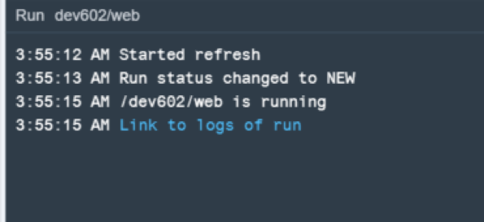

## Prerequisites  
 - **Proficiency:** Intermediate
 - **Tutorials:** [Creating an OData Service with Create Operation and XSJS Exit](http://www.sap.com/developer/tutorials/xsa-xsodata-create.html)

## Next Steps
 - [Consume a Basic OData Service](http://www.sap.com/developer/tutorials/xsa-sapui5-odata.html)

## Details
### You will learn  
Now we want to build a proper SAPUI5 interface that will consume our XSJS and XSODATA services.

**Please note - This tutorial is based on SPS11**

### Time to Complete
**15 Min**.

---

1. Return to your `web` module and create a new html file in the resources folder called `odataTest.html`

	

2. Here is the complete coding of the `odataTest.html` page. Note: if you don't want to type this code, we recommend that you cut and paste it from this web address `http://<hostname>:51013/workshop/admin/ui/exerciseMaster/?workshop=dev602 &sub=ex4_1` You are loading the SAPUI5 `bootstap` and then initializing the Fiori shell.

	```
	<!DOCTYPE html>
	<html>
	<head>
		<meta http-equiv="X-UA-Compatible" content="IE=edge" />
		<meta charset="UTF-8">
		<meta name="viewport" content="width=device-width, initial-scale=1.0, maximum-scale=1.0, user-scalable=no" />
		<title>Workshop OData Test</title>
	   		<link type="image/x-icon" href="./images/favicon.ico" rel="shortcut icon">
	        <link type="image/x-icon" href="./images/favicon.ico" rel="icon">
		<script id="sap-ui-bootstrap"
			src="https://sapui5.hana.ondemand.com/resources/sap-ui-core.js"
			data-sap-ui-theme="sap_bluecrystal"
			data-sap-ui-xx-bindingSyntax="complex"
			data-sap-ui-resourceroots='{
					"dev602.odataTest": "./",
					"odataView": "./odataView"}'		
			data-sap-ui-libs="sap.m, sap.me">
		</script>
		<script type="text/javascript" src="./common/csrf.js" ></script>  
		<script type="text/javascript" src="./common/error.js" ></script>  
		<script>

		new sap.m.Shell({
			title: "Test App",
			app : new sap.ui.core.ComponentContainer({
				name : "dev602.odataTest",
				width: "100%",
				height: "100%"
			})
		}).placeAt("content");

		</script>
	</head>
	<body class="sapUiBody" role="application">
		<div id="content"></div>
	</body>
	</html>
	```

3. There are two utility JavaScript libraries you reference in this html page – `common/csrf.js` for the handling of CSRF tokens and `common/error.js` for producing error messages. Create a common folder in resources and add these two files.

	

4. Here is the coding of `csrf.js` Note: if you don't want to type this code, we recommend that you cut and paste it from this web address `http://<hostname>:51013/workshop/admin/ui/exerciseMaster/?workshop=dev602 &sub=ex4_2`

	```
	$.ajaxSetup({
	    beforeSend: function(xhr,settings) {
	      if (settings && settings.hasOwnProperty('type')
	          && settings.type !== 'GET'){
	    	  var token = getCSRFToken();
	        xhr.setRequestHeader("X-CSRF-Token", token);
	      }
	    },
	    complete: function(xhr,textStatus) {
	        var loginPage = xhr.getResponseHeader("x-sap-login-page");
	        if (loginPage) {
	            location.href = loginPage + "?x-sap-origin-location=" + encodeURIComponent(window.location.pathname);
	        }
	    }
	});

	function getCSRFToken() {
	    var token = null;
	    $.ajax({
	        url: "/xsjs/csrf.xsjs",
	        type: "GET",
	        async: false,
	        beforeSend: function(xhr) {
	            xhr.setRequestHeader("X-CSRF-Token", "Fetch");
	        },
	        complete: function(xhr) {
	            token = xhr.getResponseHeader('X-CSRF-Token');
	        }
	    });
	    return token;
	}
	```

5. Here is the coding of `error.js` Note: if you don't want to type this code, we recommend that you cut and paste it from this web address `http://<hostname>:51013/workshop/admin/ui/exerciseMaster/?workshop=dev602 &sub=ex4_3`

	```
	function onErrorCall(jqXHR, textStatus, errorThrown){
	var page = sap.ui.getCore().byId("pageID");
		page.setBusy(false);					
	   	if(typeof jqXHR.status == 'undefined'){
	   	var errorRes = JSON.parse(jqXHR.response.body);	sap.m.MessageBox.show(
	                errorRes.error.innererror.errordetail.DETAIL,
		{ icon: sap.m.MessageBox.Icon.ERROR,
		  title: "Service Call Error",
		  actions: [sap.m.MessageBox.Action.OK],
		  styleClass: "sapUiSizeCompact" } );	   	            	}else{
		  if(jqXHR.status === 500 || jqXHR.status === 400){
		    sap.m.MessageBox.show(jqXHR.responseText,
		    { icon: sap.m.MessageBox.Icon.ERROR,
	                   title: "Service Call Error",
		      actions: [sap.m.MessageBox.Action.OK],
		      styleClass: "sapUiSizeCompact" } );
		     return;
		   }
		   else{
		     sap.m.MessageBox.show(jqXHR.statusText,
		     { icon: sap.m.MessageBox.Icon.ERROR,
	  	       title: "Service Call Error",
	  	      actions: [sap.m.MessageBox.Action.OK],
	  	      styleClass: "sapUiSizeCompact" } );		
		      return;
		   }
		   }}

		   function oDataFailed(oControlEvent){
		    sap.m.MessageBox.show("Bad Entity Definition",
		    { icon: sap.m.MessageBox.Icon.ERROR,
		      title: "OData Service Call Error",
		      actions: [sap.m.MessageBox.Action.OK],
		      styleClass: "sapUiSizeCompact" } );		
		   return;		   			
	}
	```

6. You also reference some images in this html page. They aren't critical, but if you want you can create an images folder inside resources and then upload these images from our GIT repository.

	

7. Next you need to create your `Component.js` file. Here is the coding of this file. Note: if you don't want to type this code, we recommend that you cut and paste it from this web address `http://<hostname>:51013/workshop/admin/ui/exerciseMaster/?workshop=dev602 &sub=ex4_4` Here you initialize the SAPUI5 component and in doing so you create an instance of the JSON configuration model. You also load your first view which you will create in the next step. Finally you see that you make a call to `xsjs/exercisesMaster.xsjs` to fill the page header with the current user id.

	```
	jQuery.sap.declare("dev602.odataTest.Component");

	sap.ui.core.UIComponent.extend("dev602.odataTest.Component", {
	init: function() {
	jQuery.sap.require("sap.m.MessageBox");
		jQuery.sap.require("sap.m.MessageToast");

		var model = new sap.ui.model.json.JSONModel({});
		sap.ui.getCore().setModel(model);
		var oConfig = new sap.ui.model.json.JSONModel({});
		sap.ui.getCore().setModel(oConfig, "config");
		this.getSessionInfo();

		sap.ui.core.UIComponent.prototype.init.apply(
	               this, arguments);
	},

	createContent: function() {

	var settings = {
		ID: "App",
		title: "Workshop OData Test",
		description: "Workshop OData Test"
		};

		var oView = sap.ui.view({
		id: "App",
		viewName: "odataView.App",
		type: "XML",
		viewData: settings
		});

		var page = new sap.m.Page("pageID", {
		title: "Workshop CDS and OData Test",
		showHeader: false,
		content: oView
		});
		page.setBusyIndicatorDelay(10);
		oView.setModel(sap.ui.getCore().getModel(
	                 "config"), "config");
		oView.setModel(sap.ui.getCore().getModel());
		return page;
	},

	getSessionInfo: function() {
		var aUrl = '/xsjs/exercisesMaster.xsjs?cmd=getSessionInfo';
		this.onLoadSession(
		JSON.parse(jQuery.ajax({
		url: aUrl,
		method: 'GET',
		dataType: 'json',
		async: false
		}).responseText));
	},

	onLoadSession: function(myJSON) {
		for (var i = 0; i < myJSON.session.length; i++) {
		var config = sap.ui.getCore().getModel("config");
		config.setProperty("/UserName", myJSON.session[i].UserName);
		}
	}
	});
	```

8. Create a folder called `odataView` inside resources. This is where you will hold all of your views and controllers. Create the root view named `App.view.xml`.

	

9. Here is the complete coding of the `App.view.xml` file. Note: if you don't want to type this code, we recommend that you cut and paste it from this web address `http://<hostname>:51013/workshop/admin/ui/exerciseMaster/?workshop=dev602 &sub=ex4_5` It creates the shell control and the overall flow of your page, but then defers the design of the header and table areas to an XML fragment we will create next.

	```
	<core:View controllerName="odataView.App" xmlns="sap.m"
	xmlns:u="sap.ui.unified" xmlns:mvc="sap.ui.core.mvc" xmlns:core="sap.ui.core">
	<u:Shell id="myShell" icon="./images/sap_18.png">
	<u:user>
	<u:ShellHeadUserItem image="sap-icon://person-placeholder"
	username="{config>/UserName}" />
	</u:user>
	<u:content>
	<IconTabBar class="iconTabBarPaddingTop"
			upperCase="true" expanded="true">
	<items>
	<IconTabFilter text="Multi-Entity Read" >
	<core:Fragment fragmentName="odataView.MRead" type="XML" />
	</IconTabFilter>				
	</items>
	</IconTabBar>
	</u:content>
	</u:Shell>
	</core:View>
	```

10. Create a file named `MRead.fragment.xml`. Here is the complete coding of this file. Note: if you don't want to type this code, we recommend that you cut and paste it from this web address `http://<hostname>:51013/workshop/admin/ui/exerciseMaster/?workshop=dev602 &sub=ex4_6` Here you build a panel with your input fields. These fields will allow you to control settings for calling your XSODATA service. You then will have a table control for your purchase order header and another for your purchase order item.  The rendering of these two sections are further separated out into two JavaScript based fragments.

	```
	<core:FragmentDefinition xmlns:core="sap.ui.core" xmlns="sap.m">
	<Panel expandable="true" expanded="true" headerText="Multi-Entity Service Selections">
	<List width="100%">
	<InputListItem label="Service Path">
	<Input id="mPath" value="{/mPath}"/>
	</InputListItem>
	<InputListItem label="Header Entity Name">
	<Input id="mEntity1" value="{/mEntity1}"/>
	</InputListItem>
	<InputListItem label="Item Entity Name">
	<Input id="mEntity2" value="{/mEntity2}"/>
	</InputListItem>
	</List>
	<Button press="callMultiService" text="Execute Service"/>
	<Button press="callExcel" text="Download Excel"/>
	</Panel>
	<core:Fragment fragmentName="odataView.MTableHead" type="JS"/>
	<core:Fragment fragmentName="odataView.MTableItem" type="JS"/>
	</core:FragmentDefinition>
	```

11. Create the `MTableHead.fragment.js` file. Here is the complete coding for this file. Note: if you don't want to type this code, we recommend that you cut and paste it from this web address `http://<hostname>:51013/workshop/admin/ui/exerciseMaster/?workshop=dev602 &sub=ex4_7` You are creating a table control to display our Purchase Order Header data which will be returned by the XSODATA service.

	```
	sap.ui.jsfragment("odataView.MTableHead", {

	createContent: function(oController) {
	 var oTable = new sap.m.Table("tblPOHeader",{
	 tableId: "tblPOHeader",
	rowSelectionChange: oController.onRowSelect,    growingThreshold:5,
	growing:true});  
	var displayPanel = new sap.m.Panel().setHeaderText('PO Header Data');
	displayPanel.setExpandable(true);
	displayPanel.setExpanded(true);
	displayPanel.addContent(oTable);
	return displayPanel;
	}  
	});
	```

12. Repeat the process for the PO Item table. Filename `MTableItem.fragment.js`. Note: if you don't want to type this code, we recommend that you cut and paste it from this web address `http://<hostname>:51013/workshop/admin/ui/exerciseMaster/?workshop=dev602 &sub=ex4_8`

	```
	sap.ui.jsfragment("odataView.MTableItem", {

	createContent: function(oController) {
	var oTable = new sap.m.Table("tblPOItem",{
	        tableId: "tblPOItem",
	        growingThreshold:5,
	        growing:true});  
	var displayPanel = new sap.m.Panel().setHeaderText('PO Item Data');
	         displayPanel.setExpandable(true);
	         displayPanel.setExpanded(true);
	         displayPanel.addContent(oTable);
	        return displayPanel;
	    }  
	});
	```

13. The final piece of our UI is the view controller named `App.controller.js`. Note: if you don't want to type this code, we recommend that you cut and paste it from this web address `http://<hostname>:51013/workshop/admin/ui/exerciseMaster/?workshop=dev602 &sub=ex4_9`

	There is some considerable code in this file because here you have all the event handlers for your application. You start with the `onInit` event which fires on startup of the page. You set some initial values into configuration model so they appear in your input fields.

	`callMultiService` handles the logic to call our OData service. You are reading the metadata from the OData service in order to dynamically create the columns in our table controls.

	`onRowSelect` handles the selection of a PO Header record and forces the loading of the corresponding PO Item records.

	Finally `callExcel` responds to a button press and calls `/xsjs/hdb.xsjs` to download your PO data in a text tab delimited format.

	```
	//To use a javascript controller its name must end with .controller.js
	sap.ui.controller("odataView.App", {
	 onInit : function(){
	this.getView().addStyleClass("sapUiSizeCompact"); // make everything inside this View appear in Compact mode
	var userName = sap.ui.getCore().getModel("config").getProperty("/UserName");
	var urlMulti = "/xsodata/purchaseOrder.xsodata";
		     sap.ui.getCore().getModel().setProperty("/mPath",urlMulti);
		     sap.ui.getCore().getModel().setProperty("/mEntity1","/POHeader");
		     sap.ui.getCore().getModel().setProperty("/mEntity2","/POItem");	     
	},
	callMultiService: function(){
	      	  var oTable = sap.ui.getCore().byId("tblPOHeader");
	    	  var oTableItem = sap.ui.getCore().byId("tblPOItem");		    	  
			  oTable.removeAllColumns();
			  oTable.removeAllItems();
			  oTableItem.removeAllColumns();
			  oTableItem.removeAllItems();

			  var mPath = sap.ui.getCore().getModel().getProperty("/mPath");
			  var mEntity1 = sap.ui.getCore().getModel().getProperty("/mEntity1");
			  var mEntity2 = sap.ui.getCore().getModel().getProperty("/mEntity2");		  

		   	  var oModel = new sap.ui.model.odata.ODataModel(mPath, true);
		   	  oModel.attachEvent("requestFailed",oDataFailed);

		   	  var oMeta = oModel.getServiceMetadata();
	          var oControl;
	          var columnList = new sap.m.ColumnListItem();
	          var columnListItem = new sap.m.ColumnListItem();          
	          if(!oMeta){
		   	  		 sap.m.MessageBox.show("Bad Service Definition",
	{ icon: sap.m.MessageBox.Icon.ERROR,
	  title: "Service Call Error",
	  actions: [sap.m.MessageBox.Action.OK],
	  styleClass: "sapUiSizeCompact" } ); }
	else{
	//Table Column Definitions
	 for ( var i = 0; i < oMeta.dataServices.schema[0].entityType[0].property.length; i++) {
	 var property = oMeta.dataServices.schema[0].entityType[0].property[i];
	oTable.addColumn(new sap.m.Column({
	header: new sap.m.Label({
	text: property.name
	}),
	width: "125px"
	}));
	columnList.addCell(new sap.m.Text({
	text: {
	path: property.name
	},
	name: property.name
	}));
	}	   	  
	oTable.setModel(oModel);
	for ( var i = 0; i < oMeta.dataServices.schema[0].entityType[1].property.length; i++) {
	var property = oMeta.dataServices.schema[0].entityType[1].property[i];

	oTableItem.addColumn(new sap.m.Column({
	header: new sap.m.Label({
	text: property.name
	}),
	width: "125px"
	}));
	columnListItem.addCell(new sap.m.Text({
	text: {
	path: property.name
	},
	name: property.name
	}));	   		  
	}	   	  
	oTableItem.setModel(oModel);
	}		   	  
	oTable.bindItems({
	path: mEntity1,
	template: columnList
	});    
	oTableItem.bindItems({
	path: mEntity2,
	template: columnListItem
	});  	   	  
	},
	onRowSelect: function(oEvent){
	var data = oEvent.getSource().getModel();
	var oTable = oEvent.getSource();
	var poId = data.getProperty("PURCHASEORDERID",oTable.getContextByIndex(oTable.getSelectedIndex()));
	var oTableItems = sap.ui.getCore().byId("tblPOItem");
	var ContextItem = sap.ui.getCore().byId("val2_2").getValue()+"(PURCHASEORDERID='"+poId+"')"+sap.ui.getCore().byId("val2_3").getValue();
	oTableItems.bindItems(ContextItem);    	 
	},
	callExcel: function(oEvent){
	//Excel Download
	 window.open('/xsjs/hdb.xsjs' );
	 return;
	}
	});
	```


14. So now run the `web` module. It will need to rebuild and redeploy all the newly added artifacts.

	

15. In the running tab, you should see the `index.html` from earlier. Change this to `odataTest.html` to test the new UI you have created.

	Test both the Execute Service and Download Excel buttons

	


## Next Steps
 - [Consume a Basic OData Service](http://www.sap.com/developer/tutorials/xsa-sapui5-odata.html)
