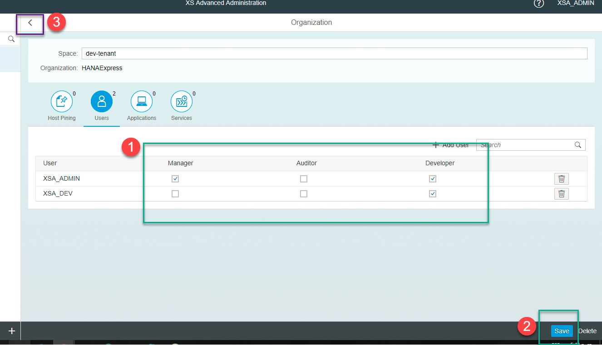

## Prerequisites  
 - **Proficiency:** Beginner

## Details
### You will learn  
Describe what the user will learn from your tutorial and what the outcome will be.

### Time to Complete
**15 Min**

---

[ACCORDION-BEGIN [Step 1: ](Log in to the XS Advanced Administration site)]

If you are using SAP HANA, express edition, open `https://hxehost:51015`.

>If you are not using SAP HANA, express edition, or you have changed the ports, you can find out the right URL using command `xs apps` on the Command Line Interface and look for the URL for application `xsa-admin`. You can access the CLI directly from an SSH console on the server or download using the Download Manager. You can get the Download Manager after registering at the [Download site](https://www.sap.com/developer/topics/sap-hana-express.html)

&nbsp;

Log in using `xsa_admin` (or, if unavailable, a user with authorizations to create Spaces)

[ACCORDION-END]

[ACCORDION-BEGIN [Step 2: ](Create a Space)]

Click on **Organization and Space Management**

Then on **Create Space**

Provide a name for the space

[ACCORDION-END]

[ACCORDION-BEGIN [Step 3: ](Add users to the Space)]

Click on the space

Click on Users and then on **Add User**

Select the users you want to add to the space:

Select the roles for each of the users, click on **Save** and go back to the organization

Go back using the **Home** button

[ACCORDION-END]

[ACCORDION-BEGIN [Step 4: ](Setup the Space using the space enablement tool)]

Click on the **Application Monitor** tile

Look for the app `di-space-enablement-ui` and enable it if it is not running yet:

Once it is running, click on the URL to access it:

[ACCORDION-END]

[ACCORDION-BEGIN [Step 5: ](Run the Space enablement tool)]

In the Space Enablement tool, click on **Enable**:

Wait until processing finishes and you get a successful message:

The space is now ready to use.

[ACCORDION-END]
