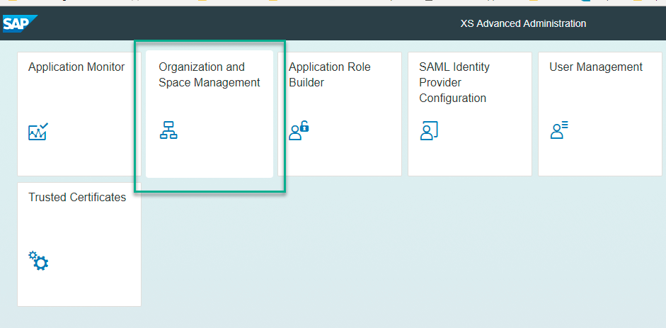
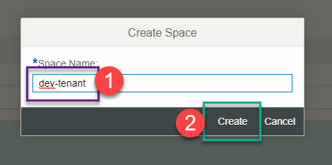
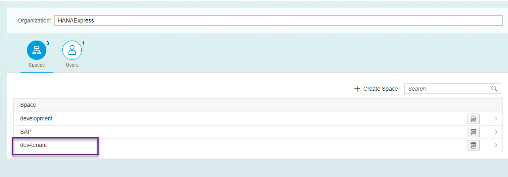
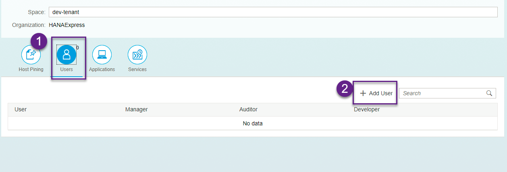
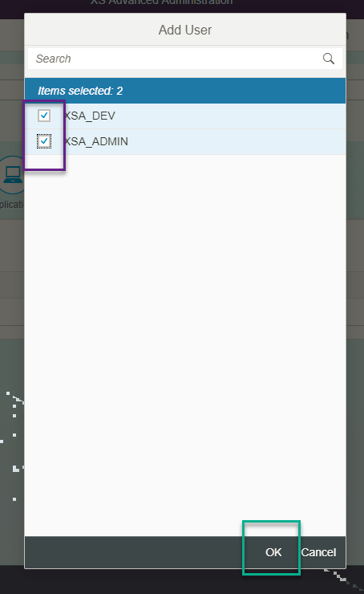
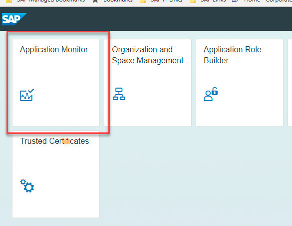
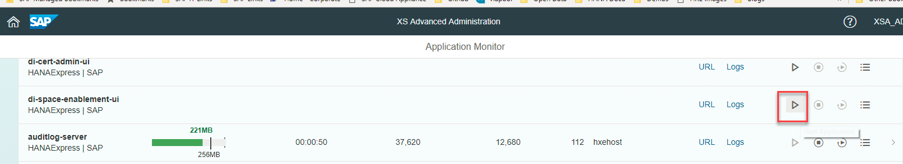
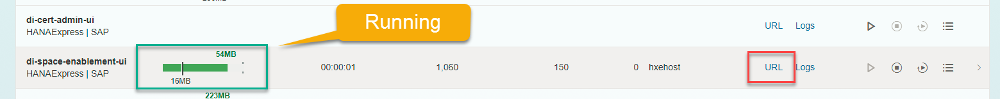
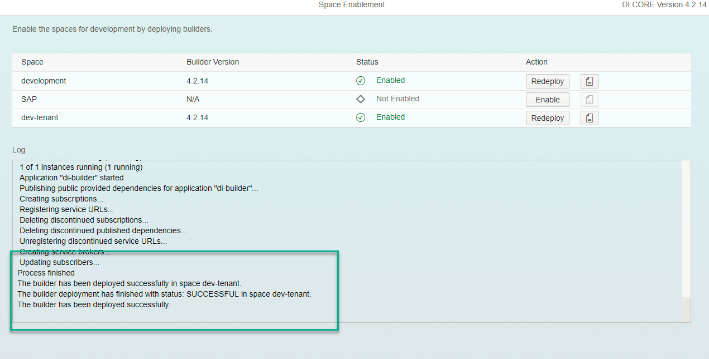

## Prerequisites
 - This tutorial is designed for SAP HANA on premise and SAP HANA, express edition. It is not designed for SAP HANA Cloud.

## Details
### You will learn  
Describe what the user will learn from your tutorial and what the outcome will be.

---

[ACCORDION-BEGIN [Step 1: ](Log in to the XS Advanced Administration site)]

If you are using SAP HANA, express edition, go to `https://hxehost:39030` to access the `xsa-cockpit` app.

>If you are not using SAP HANA, express edition, or you have changed the ports, you can find out the right URL using command `xs apps` on the Command Line Interface and look for the URL for application `xsa-cockpit`. You can access the CLI directly from an SSH console on the server or download using the Download Manager. You can get the Download Manager after registering at the [Download site](https://developers.sap.com/topics/hana.html)

&nbsp;

Log in using `xsa_admin` (or, if unavailable, a user with authorizations to create Spaces)

[DONE]

[ACCORDION-END]

[ACCORDION-BEGIN [Step 2: ](Create a Space)]

Click on **Organizations** and on the organization to which you want to add a space

Then on **New Space**

Provide a name for the space and the roles you want to give to `XSA_ADMIN`

[DONE]

[ACCORDION-END]

[ACCORDION-BEGIN [Step 3: ](Add users to the Space)]

Click the space

Click **Members** and then on **Add Member**

Select the users you want to add to the space and their roles:

Go back using the **Home** button

[DONE]

[ACCORDION-END]

[ACCORDION-BEGIN [Step 4: ](Setup the Space using the space enablement tool)]

Go back using the **home** button and go into the **SAP** space

Look for the app `di-space-enablement-ui` and enable it if it is not running yet:

Once it is running, click on the link to see the URL (by default, `https://hxehost:39030` )

[DONE]

[ACCORDION-END]

[ACCORDION-BEGIN [Step 5: ](Run the Space enablement tool)]

In the Space Enablement tool, click on **Enable**:

Wait until processing finishes and you get a successful message:

The space is now ready to use.

[DONE]

[ACCORDION-END]
