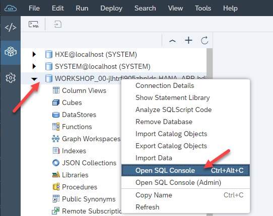
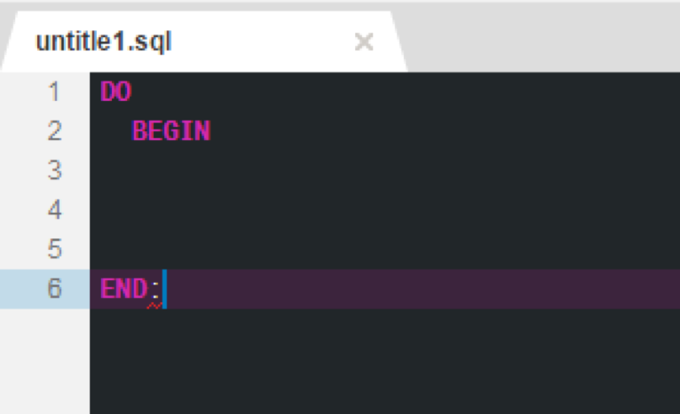
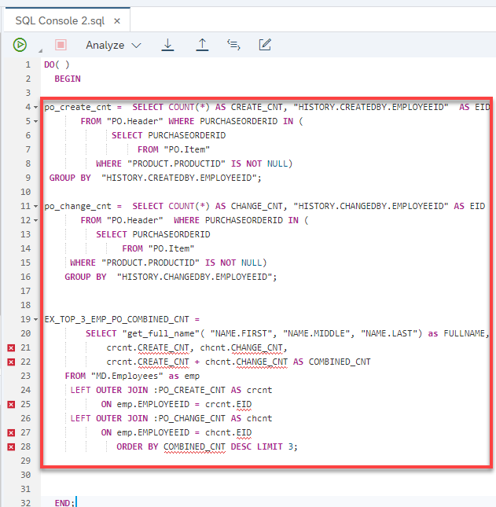
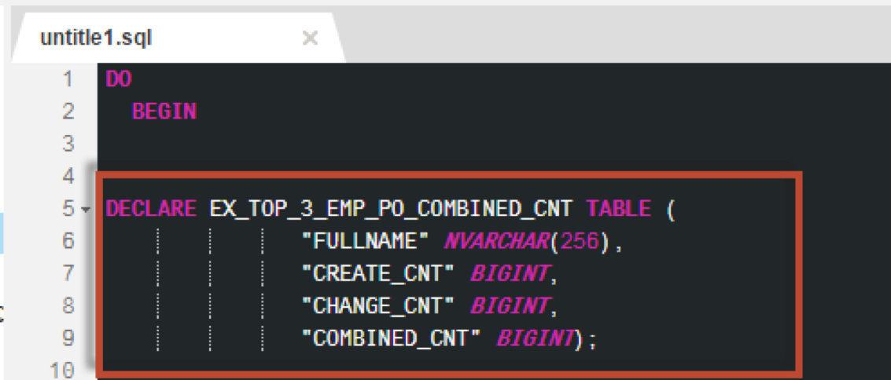

## Prerequisites  
- This tutorial is designed for SAP HANA on premise and SAP HANA, express edition. It is not designed for SAP HANA Cloud.
- **Tutorials:** [Creating SQLScript User Defined Libraries](xsa-sqlscript-libraries)

## Details
### You will learn  
- How to invoke SQLScript logic without a persistent logic container  

In this exercise, we will show you how you can invoke SQLScript logic without the need to create a persistent logic container such as a procedure or function. Instead we will use so called anonymous blocks.

---

[ACCORDION-BEGIN [Step 1: ](Create anonymous block )]

From the Database Explorer page, click the "SQL Console" button



To have an anonymous block you need a do begin … end.  Enter the this code in the SQL tab.



[DONE]

[ACCORDION-END]

[ACCORDION-BEGIN [Step 2: ](Add body of statement)]

Copy the logic from the procedure `get_po_header_data` into the body.  Make sure to only copy the code between the BEGIN and END statements



[DONE]
[ACCORDION-END]

[ACCORDION-BEGIN [Step 3: ](Declare required variable)]

Copy the signature from the procedure `get_po_header_data` into the signature part of the anonymous block. Ensure the parameter is assigned to a query parameter placeholder (?) as shown.



[DONE]
[ACCORDION-END]


[ACCORDION-BEGIN [Step 5: ](Check complete code)]

The completed code should look very similar to this.

```
DO(   OUT EX_TOP_3_EMP_PO_COMBINED_CNT TABLE(
                      FULLNAME NVARCHAR(256),
		  CREATE_CNT INTEGER,
		  CHANGE_CNT INTEGER,
		  COMBINED_CNT INTEGER ) =>? )
  BEGIN

po_create_cnt =  SELECT COUNT(*) AS CREATE_CNT, "HISTORY.CREATEDBY.EMPLOYEEID"  AS EID
       FROM "PO.Header" WHERE PURCHASEORDERID IN (
             SELECT PURCHASEORDERID
                  FROM "PO.Item"
          WHERE "PRODUCT.PRODUCTID" IS NOT NULL)
 GROUP BY  "HISTORY.CREATEDBY.EMPLOYEEID";

po_change_cnt =  SELECT COUNT(*) AS CHANGE_CNT, "HISTORY.CHANGEDBY.EMPLOYEEID" AS EID
       FROM "PO.Header"  WHERE PURCHASEORDERID IN (
          SELECT PURCHASEORDERID
               FROM "PO.Item"
     WHERE "PRODUCT.PRODUCTID" IS NOT NULL)
	GROUP BY  "HISTORY.CHANGEDBY.EMPLOYEEID";


EX_TOP_3_EMP_PO_COMBINED_CNT =
        SELECT "get_full_name"( "NAME.FIRST", "NAME.MIDDLE", "NAME.LAST") as FULLNAME,
            crcnt.CREATE_CNT, chcnt.CHANGE_CNT,
            crcnt.CREATE_CNT + chcnt.CHANGE_CNT AS COMBINED_CNT
 	FROM "MD.Employees" as emp
     LEFT OUTER JOIN :PO_CREATE_CNT AS crcnt
           ON emp.EMPLOYEEID = crcnt.EID
     LEFT OUTER JOIN :PO_CHANGE_CNT AS chcnt
           ON emp.EMPLOYEEID = chcnt.EID
              ORDER BY COMBINED_CNT DESC LIMIT 3;


  END;

```

[DONE]

[ACCORDION-END]


[ACCORDION-BEGIN [Step 6: ](Run and check results)]

Click **Run**.  You will notice that the SQLScript code is executed and results are shown.  Again, there is no procedure or function created here, just the SQLScript being executed by the engine.


[DONE]
[ACCORDION-END]
