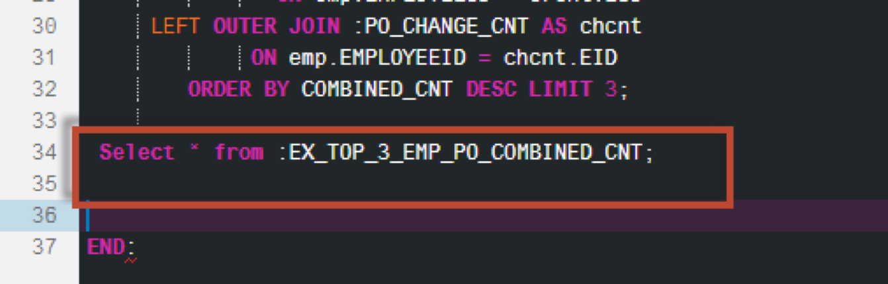

## Prerequisites  
 - **Proficiency:** Intermediate
 - **Tutorials:** [Debugging Stored Procedures](http://go.sap.com/developer/tutorials/xsa-sqlscript-debugging.html)

## Next Steps
 - [Using Dynamic SQL vs Dynamic Filtering](http://go.sap.com/developer/tutorials/xsa-sqlscript-dynamic.html)

## Details
### You will learn  
In this exercise we will show you how you can invoke SQLScript logic without the need to create a persistent logic container such as a procedure or function. Instead we will use so called anonymous blocks.

### Time to Complete
**15 Min**.

---

1. From the HRTT page, click the "SQL Console" button

    

2. To have an anonymous block you need a do begin … end.  Enter the this code in the SQL tab.

    

3. Copy the logic from the procedure `get_po_header_data` into the body.  Make sure to only copy the code between the BEGIN and END statements

    

4. Let’s assume the application executing this block only allows string types. Since we have no signature for defining this we are simply declaring the type of the table variable  `EX_TOP_3_EMP_PO_COMBINED_CNT`.  The columns will then be implicitly converted to the corresponding types. Between the BEGIN statement and the first SELECT statement, enter a DECLARE statement to declare an intermediate table variable called `EX_TOP_3_EMP_PO_COMBINED_CNT` as shown

    

5. After the last SELECT statement and before the END statement, insert another SELECT against the intermediate table variable which you declared above 

    

6. The completed code should look very similar to this. If you do not wish to type this code, you can reference the solution web page at `http://<hostname>:51013/workshop/admin/ui/exerciseMaster/?workshop=dev602&sub=ex2_16`

    ```
    DO
	 BEGIN
 
	 DECLARE EX_TOP_3_EMP_PO_COMBINED_CNT TABLE (
               "FULLNAME" NVARCHAR(256), 
               "CREATE_CNT" BIGINT, 
               "CHANGE_CNT" BIGINT, 
               "COMBINED_CNT" BIGINT);
 
	po_create_cnt =  SELECT COUNT(*) AS CREATE_CNT, "HISTORY.CREATEDBY.EMPLOYEEID"  AS EID
         FROM "dev602.data::PO.Header" WHERE PURCHASEORDERID IN (
         SELECT PURCHASEORDERID 
             FROM "dev602.data::PO.Item" 
    WHERE "PRODUCT.PRODUCTID" IS NOT NULL)
    GROUP BY  "HISTORY.CREATEDBY.EMPLOYEEID";

	po_change_cnt =  SELECT COUNT(*) AS CHANGE_CNT, "HISTORY.CHANGEDBY.EMPLOYEEID" AS EID
         FROM "dev602.data::PO.Header"  WHERE PURCHASEORDERID IN (
       SELECT PURCHASEORDERID 
               FROM "dev602.data::PO.Item"
    WHERE "PRODUCT.PRODUCTID" IS NOT NULL)
    GROUP BY  "HISTORY.CHANGEDBY.EMPLOYEEID";

	EX_TOP_3_EMP_PO_COMBINED_CNT = 
          SELECT "dev602.procedures::get_full_name"( "NAME.FIRST", "NAME.MIDDLE", "NAME.LAST") as FULLNAME, crcnt.CREATE_CNT, chcnt.CHANGE_CNT, crcnt.CREATE_CNT + chcnt.CHANGE_CNT AS COMBINED_CNT
      FROM "dev602.data::MD.Employees" as emp
      LEFT OUTER JOIN :PO_CREATE_CNT AS crcnt
               ON emp.EMPLOYEEID = crcnt.EID
     LEFT OUTER JOIN :PO_CHANGE_CNT AS chcnt
             ON emp.EMPLOYEEID = chcnt.EID
        ORDER BY COMBINED_CNT DESC LIMIT 3;
     	   
	 Select * from :EX_TOP_3_EMP_PO_COMBINED_CNT;
 
	 END;
    ```
    
7. Click "Run".

    

8. You will notice that the SQLScript code is executed and results are shown.  Again, there is no procedure or function created here, just the SQLScript being executed by the engine.

    


## Next Steps
 - [Using Dynamic SQL vs Dynamic Filtering](http://go.sap.com/developer/tutorials/xsa-sqlscript-dynamic.html)
