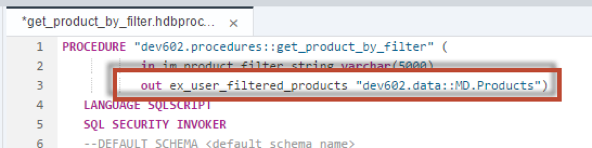
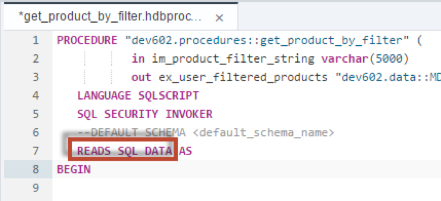
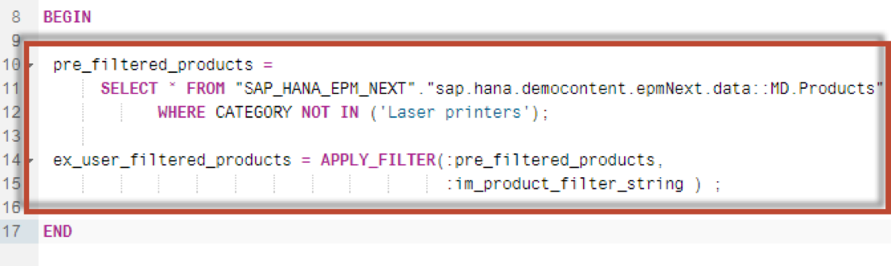
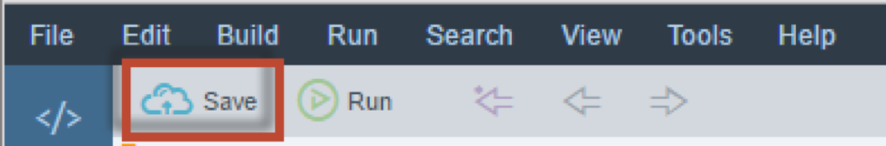
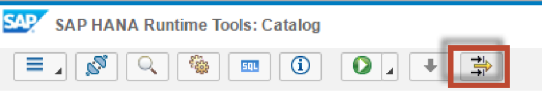
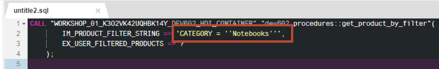
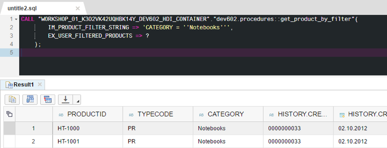
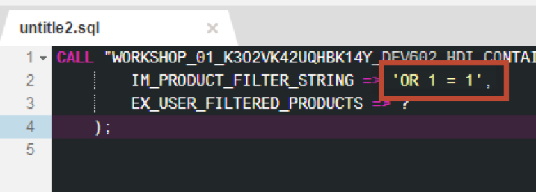

## Prerequisites  
 - **Proficiency:** Intermediate
 - **Tutorials:** [Using Execute Immediate](http://go.sap.com/developer/tutorials/xsa-sqlscript-execute.html)

## Next Steps
 - [SQL vs Cursors vs Arrays vs Index-based Cell Access](http://go.sap.com/developer/tutorials/xsa-sqlscript-sql-cursor.html)

## Details
### You will learn  
In contrast to EXEC and EXECUTE IMMEDIATE, `APPLY_FILTER` is SQL injection save. Furthermore the result of the `APPLY_FILTER` will be assigned to a table variable. This allows further processing of the result by referring to the table variable. As `APPLY_FILTER` does not allow executing dynamic `DML/DDL` statements the procedure can be flagged read only which allows further optimization.

### Time to Complete
**15 Min**.

---

1. Return to the procedure editor. Add an output parameter called `ex_user_filtered_products` and reference the `dev602.data::MD.Products` table as the type.

    

2. Now that we are not using the dynamic SQL keywords, we no longer need a `read/write` procedure, so add the READS SQL DATA before AS.

    

3. Remove the EXECUTE IMMEDIATE statement and instead insert the following SELECT statement and `APPLY_FILTER` statement using table variable assignments. The `APPLY_FILTER` needs two input parameters: table variable which will used for filtering and a scalar variable which contains the string.

    

4. The completed code should be very similar to this. If you do not wish to type this code, you can reference the solution web page at `http://<hostname>:51013/workshop/admin/ui/exerciseMaster/?workshop=dev602&sub=ex2_18` 

    ```
    PROCEDURE "dev602.procedures::get_product_by_filter" (
          IN im_product_filter_string varchar(5000), 
          OUT ex_user_filtered_products "dev602.data::MD.Products" )
   LANGUAGE SQLSCRIPT
   SQL SECURITY INVOKER
   --DEFAULT SCHEMA <default_schema_name>
   READS SQL DATA  AS
	BEGIN 

  	pre_filtered_products = 
         SELECT * FROM "dev602.data::MD.Products" WHERE CATEGORY NOT IN ('Laser printers');
       
	ex_user_filtered_products = APPLY_FILTER(:pre_filtered_products, :im_product_filter_string ) ;

	END
    ```
        
5. Click "Save".

    

6. Use what you have learned already and perform a build on your `hdb` module. Then return to the HRTT page and invoke the procedure again.

    

7. Click "Format Code".

    

8. Enter the filter string for the input parameter as 

    ```
    	'CATEGORY = ''Notebooks''' and click “Run”. 
	```
	
    

9. Once again, the results are displayed, but this time they are passed through a parameter which you are able to access for further processing.

    

10. Change the input parameter value to 'OR 1 = 1' and click "Run" again.

    

11. You will notice you now get an error message when passing 'OR 1 = 1' to the procedure. This happens as the provided string will no longer be concatenated to the predefined filter conditions. Instead the provided string will be treated as a stand-alone filter condition, in this case having an invalid syntax.

    


## Next Steps
 - [SQL vs Cursors vs Arrays vs Index-based Cell Access](http://go.sap.com/developer/tutorials/xsa-sqlscript-sql-cursor.html)
