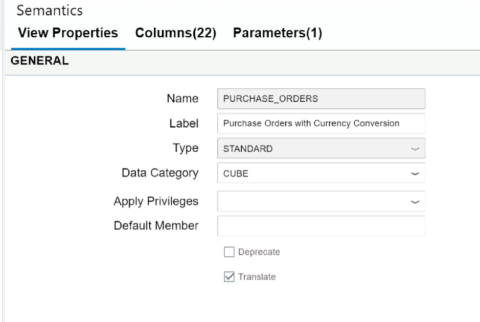

## Prerequisites  
 - **Proficiency:** Intermediate
 - **Tutorials:** [Creating a Graphical Calculation View](http://www.sap.com/developer/tutorials/xsa-graphical-view.html)

## Next Steps
 - [Creating Stored Procedures](http://www.sap.com/developer/tutorials/xsa-sqlscript-stored-proc.html)

## Details
### You will learn  
Now to create a calculation view using cube data and a star join

### Time to Complete
**15 Min**.

---

1. Now you will create another Calculation view – but one which uses the Cube data type and therefore aggregation of the results. It will combine purchase order table data with the product view we created in the previous step.  Because we have various currency based amounts in our source data, we will also create a calculated column which contains a currency conversion.

    Using the same steps as the previous part of the exercise; in your models folder, create a new Calculation View

    

2. Name your new view `PURCHASE_ORDERS`. Set the Data Category to CUBE. This will create a view very similar in capabilities to the older Analytical View.

    
    
3. Insert a Join Node into the Scenario. Add the `PO.Header` and `PO.Item` tables to this Join Node.

    
    
4. Create an inner join between `PURCHASEORDERID` from the header table to the `PURCHASEORDERID` column of the item table

    
    
5. Using the Mapping tab, add the columns `HISTORY.CREATEDAT` from the Header table and the `PURCHASEORDERID`, `PURCHASEORDERITEM`, `PRODUCT.PRODUCTID`, `CURRENCY`, and `GROSSAMOUNT` columns from the Item table

    
    
6. Create another Join node and connect your first node to this new one. Press the plus button next to this node. Search for and select the PRODUCTS view from the previous part of the exercise to insert it into the Join of your new view.  

    
    
7. Create a join on the `PRODUCT_PRODUCTID` to the `PRODUCTID` column. 

    
    
8. From the Parameters tab, create an input parameter named `IP_O_TARGET_CURRENCY`. 

    
    
9. Configure as shown with type `NVARCHAR` length 3 with a Semantic type of Currency. It should be mandatory and have a default value of USD.

    
    
10. From the Mapping tab, select all the columns of the `Join_1` node and all the columns from the PRODUCTS node and add them to the output

    
    
11. In the Calculated `Columns/Counters` tab, create a new Calculated Column for the common currency gross amount. 

    
    
12. Create a Calculated Column named `ConvGrossAmount` which is a summarized measure for the base column Gross Amount. This involves writing an Expression that sets the base value of `GROSSAMOUNT`. Configure as shown here.

    
    
13. Connect the `Join_2` node to the Aggregation node and use the Auto Map by Name button

    
    
14. Return to the Semantics Scenario and then the Columns tab. Set the `GrossAmount` as measures and all of others as attributes. (They may already be defaulting into the correct values, but please double check).

    
    
15. In the View Properties tab, change the Apply Privileges to the blank value. 

    
    
16. Save your View.

    
    
17. Build the `hdb` module and then return to the HRTT tool. Your container will now have an entry in the Column Views folder for this new Calculation View. 

    
    
18. For an initial test make sure your output looks similar to the following:

## Next Steps
 -  - [Creating Stored Procedures](http://www.sap.com/developer/tutorials/xsa-sqlscript-stored-proc.html)
