## Prerequisites  
- **Proficiency:** Intermediate
- **Tutorials:** [Creating a Graphical Calculation View](http://www.sap.com/developer/tutorials/xsa-graphical-view.html)

## Next Steps
- [Creating Stored Procedures](http://www.sap.com/developer/tutorials/xsa-sqlscript-stored-proc.html)

## Details
### You will learn  
Now to create a calculation view using cube data and a star join.

### Time to Complete
**15 Min**.

---

[ACCORDION-BEGIN [Step 1: ](Create a new Calculation View)]

You will now create a calculation view of type cube. This type of view allows for the aggregation of data and will use the dimension calculation view you created in the previous step. Create a new calculation view in your `models` folder.

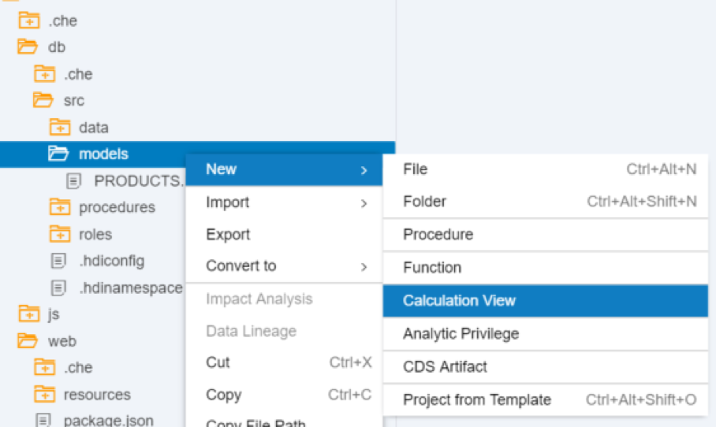

Add a name and set the `Star join` flag to true.

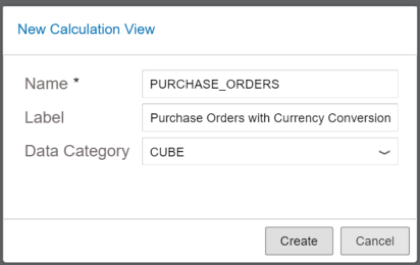

This calculation view would have been an Analytical view in previous versions of SAP HANA.

[DONE]
[ACCORDION-END]

[ACCORDION-BEGIN [Step 2: ](Insert join for Purchase Order items and header)]

Insert a Join Node into the Scenario. Add the `PO.Header` and `PO.Item` tables to this Join Node.

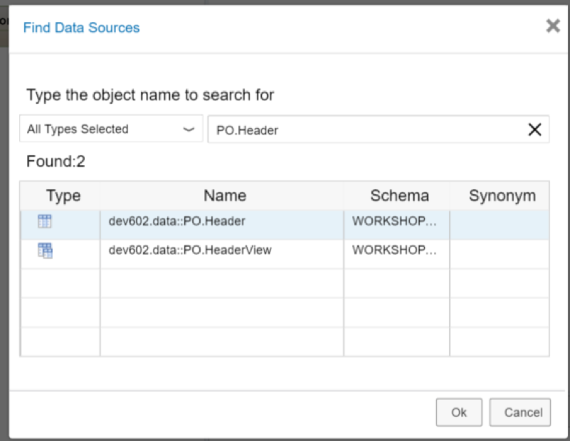

Create an inner join between `PURCHASEORDERID` from the header table to the `PURCHASEORDERID` column of the item table

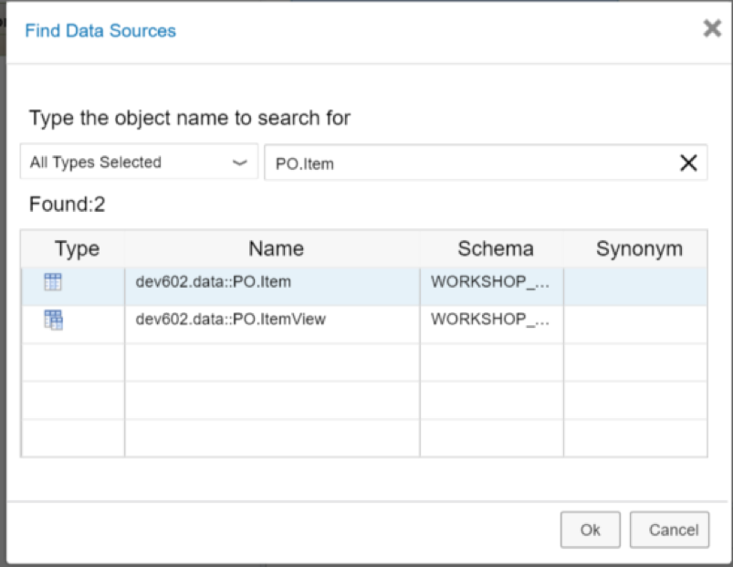

Using the Mapping tab, add the columns `HISTORY.CHANGEDAT` from the Header table and the `PURCHASEORDERID`, `PURCHASEORDERITEM`, `PRODUCT.PRODUCTID`, `CURRENCY`, and `GROSSAMOUNT` columns from the Item table. You can select all the columns first and then press the **Add to Output** button instead of dragging individual fields.

[DONE]
[ACCORDION-END]

[ACCORDION-BEGIN [Step 3: ](Create a new join node to integrate the Dimension Calculation view )]

Before you can insert the dimension view, you need to add the `PRODUCTID` field to it. You will also remove the `CURRENCY` filter so you can create a conversion later. Open the Dimension calculation view and add the field `PRODUCTID` from the base node into the list of output columns in the mapping tab. Right-click on the new field and select **Propagate to Semantics**

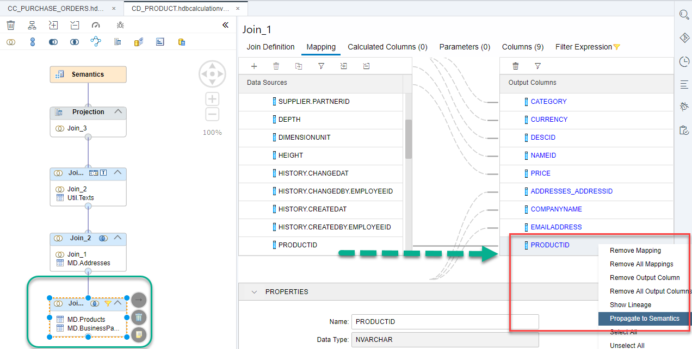

Go into the `Filter expression` tab and erase the SQL filter condition. **Build** the view by right-clicking on it and return to the cube view.

Create another Join node and connect your first node to this new one. Press the **+** button next to this node. Search for and select the `CD_PRODUCT` view from the previous video tutorial.

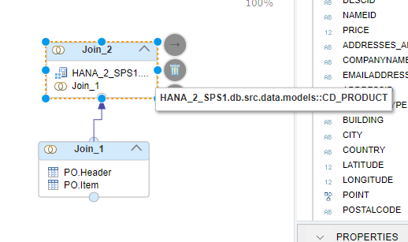

Create a join on the `PRODUCT_PRODUCTID` to the `PRODUCTID` column.

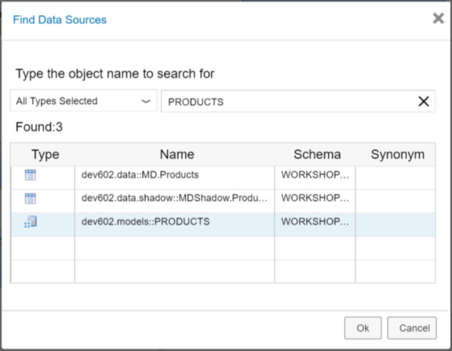

Add all the columns to the output.

[DONE]
[ACCORDION-END]

[ACCORDION-BEGIN [Step 4: ](Create an input parameter)]

From the Parameters tab, create an input parameter named `IP_O_TARGET_CURRENCY`.

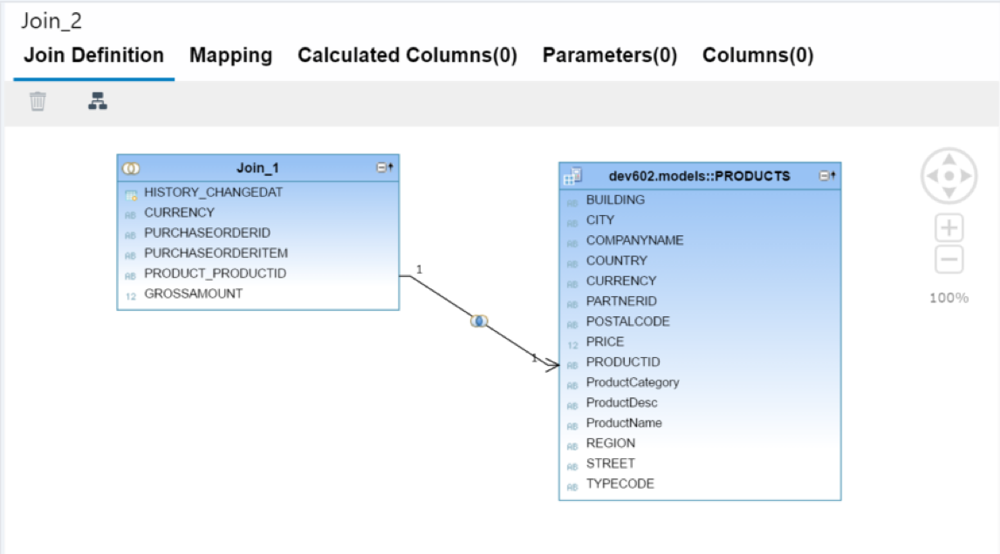

Configure as shown with type `NVARCHAR` length 3 with a Semantic type of Currency. It should be mandatory and have a default value of USD.

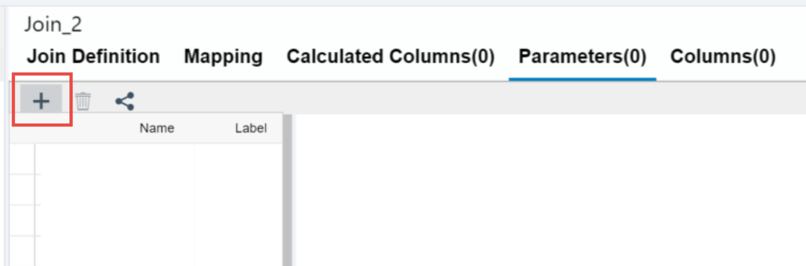

>Note: You can click on the names of the join nodes to change them to something more meaningful.

[DONE]
[ACCORDION-END]

[ACCORDION-BEGIN [Step 5: ](Map the Star Join node)]

**Drag** the latest join with the Dimension Calculation view and PO data into the `star join`.

From the Mapping tab, select all the columns of the star join and add them to the output.

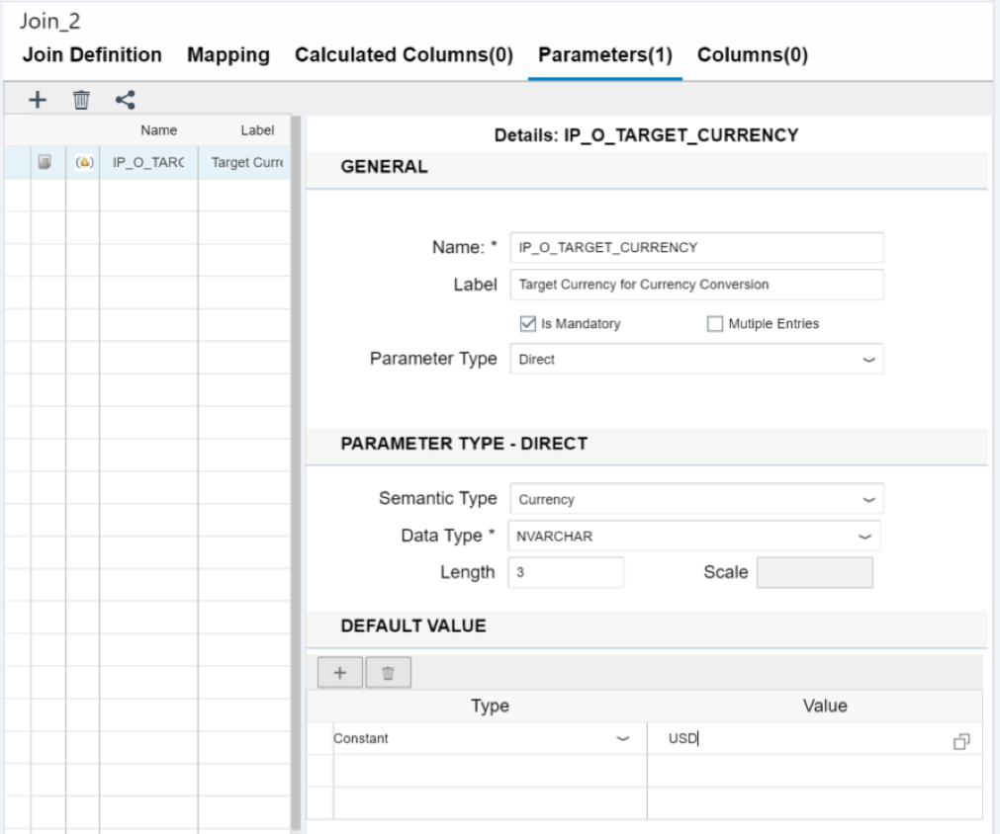

**Add** the `GROSSAMOUNT` column again and rename it to `OriginalGrossAmount`

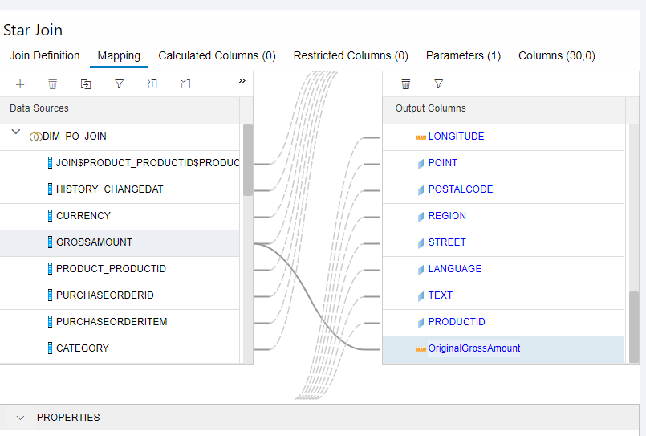

[DONE]
[ACCORDION-END]

[ACCORDION-BEGIN [Step 6: ](Configure currency conversion)]

In the Semantics node, in the **Columns** tab, select the `GROSSAMOUNT` measure and click on `Assign Semantics`.

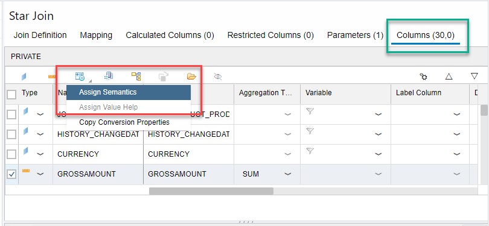

Choose `Amount with currency code` and click **OK**.

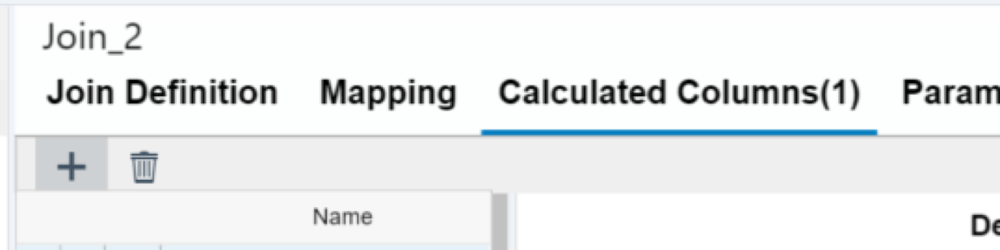

Perform the following configurations as in the screenshot below:

- Choose `Column` as the display currency and assign the proper column.
- Mark the **Conversion** flag and the configuration tables will fill themselves with the standard configuration tables.
- Fix the client to `001`. You can check the values of the SHINE data model in the `Database explorer`
- Set the source currency to the currency from the products
- Set the target currency to the input parameter
- Set the exchange type to the desired exchange type (1001 in this example)
- Set the conversion date to `HISTORY_CHANGEDAT`
- Set the behavior upon failure

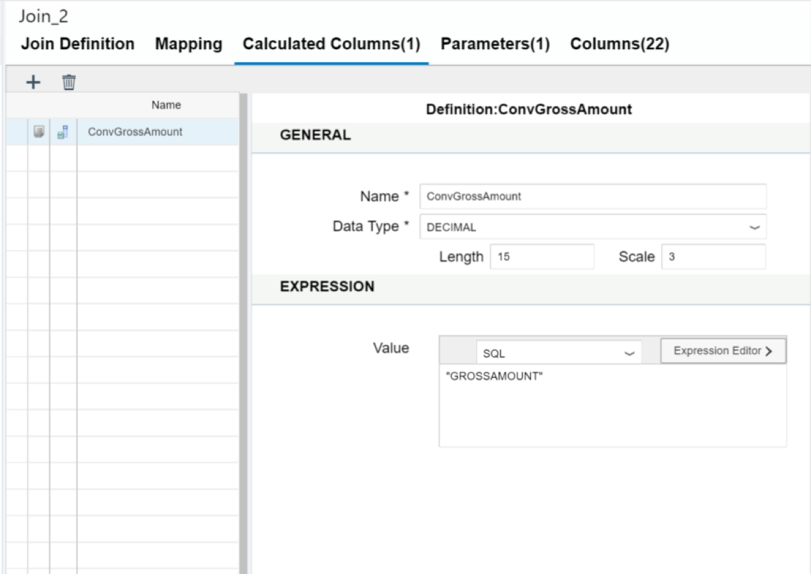

[DONE]
[ACCORDION-END]

[ACCORDION-BEGIN [Step 7: ](Build and run)]

Check the **Semantics** tab and leave the field `Apply privileges` blank.

**Build** the view. Right-click on the view on the left-side menu and click on **Data preview**.

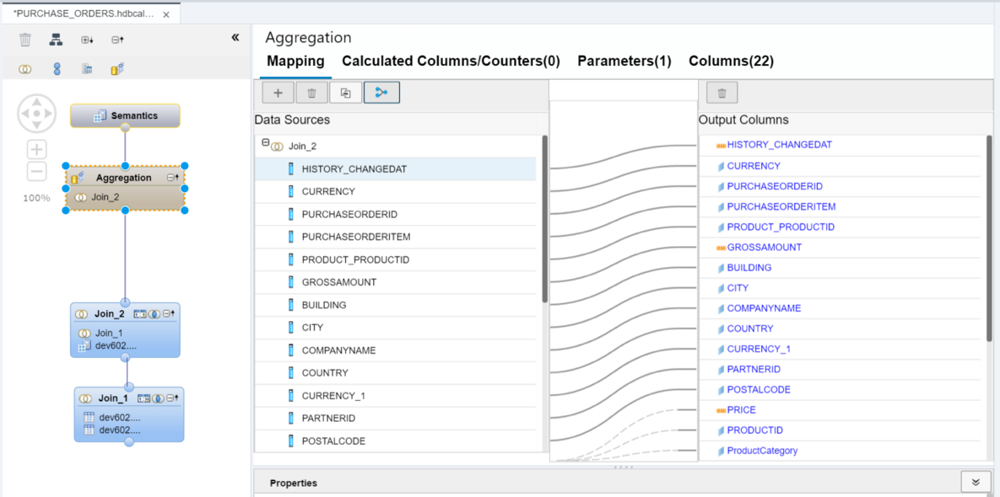

Fill in the **From** parameter for conversion with `USD` and click on **Open Content** (the green `play` button).

See how the conversion has been performed for those currencies in table TCURR, where the conversion type is the one you selected (1001 in this example)

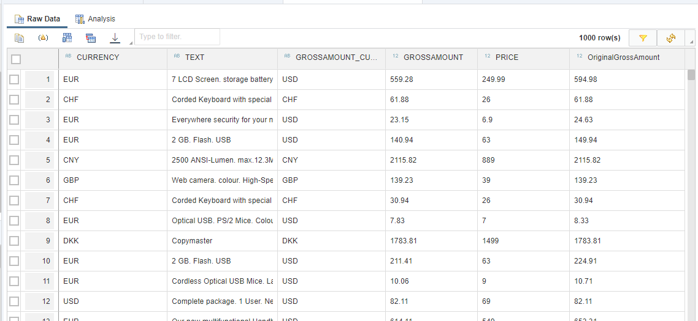

[DONE]
[ACCORDION-END]

## Next Steps
-  - [Creating Stored Procedures](http://www.sap.com/developer/tutorials/xsa-sqlscript-stored-proc.html)
