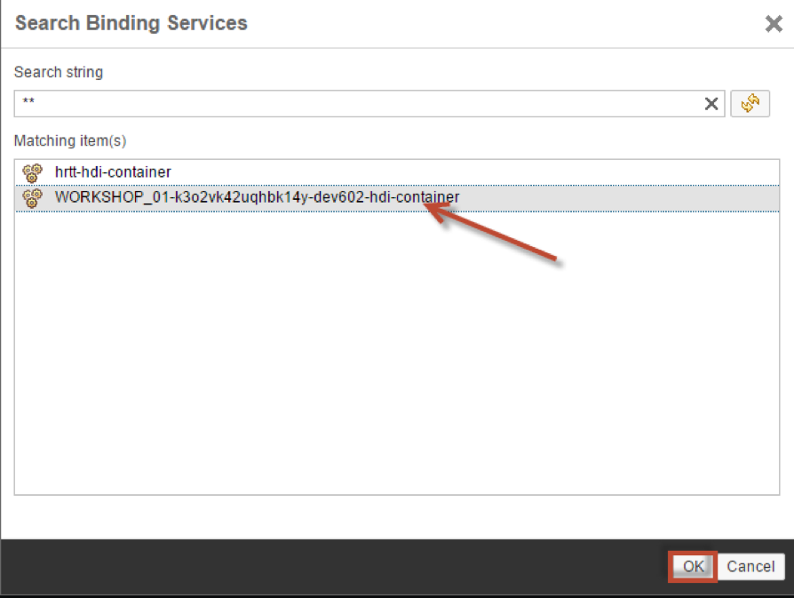
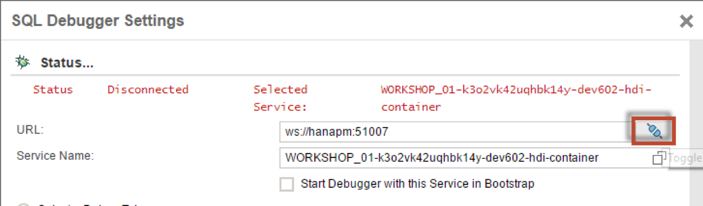

## Prerequisites  
 - **Proficiency:** Intermediate
 - **Tutorials:** [Creating Table User Defined Functions](http://go.sap.com/developer/tutorials/xsa-sqlscript-table-user.html)

## Next Steps
 - [Anonymous Blocks](http://go.sap.com/developer/tutorials/xsa-sqlscript-anonymous.html)

## Details
### You will learn  
In the following exercise we will show how to debug a procedure using the SQLScript debugger. This includes setting breakpoints, evaluating expressions and intermediate results.

### Time to Complete
**10 Min**.

---

1. Go to the HRTT page and open the procedure called `dev602.procedures::get_po_header_data`. 

    

2. From the menu, click SQL Debugger, then Debug Settings.

    

3. For the service name, click the drop down box.

    

4. Choose your container associated with your user id.  Click "OK".

    

5. Click the "Connect" button.

    

6. Click "Apply", then "Close".

    

7. Set breakpoints at the lines shown here by simply clicking on the line number.

    

8. Click "Invoke Procedure".

    

9. A new SQL tab will be opened.  Click on the "Run" button.

    

10. Execution of the procedure has started, and a debugger pane is now visible which is displayed on the right. You can see all of the variables and parameters for this procedure.  You might notice that this pane is currently not showing the intermediate table variables at this point.

    

11. Click the "Step Over" button.

    

12. You will notice that execution has continued to the next statement. In the debugger pane, a new local variable has been added. This is because it is not defined explicitly will be implicitly declared at runtime during first usage.

    

13. To see the data for this intermediate table variable, right click on it and choose "Display Content".

    

14. A new window is then opened showing the data in the table. Review the data and close the window by clicking the "X" in the upper right hand corner.

    

15. Click the "Toggle Expression Editor" button.

    

16. In the yellow box that appears below, enter a SELECT statement as shown here and hit "Enter".

    

17. You will notice the expression is then added to the "Expressions" section above.

    

18. Right click on the expression and choose "Display Content".

    

19. Review the results and close the window by clicking the "X".

    

20. Once again click the "Step Over" button. Notice the next intermediate table variables is also added.  You can review the data in this table as well.

    

21. Continue to step through the code and when execution stops at the END statement of the procedure, display the contents of the output parameter the same way you did for the intermediate table variables. Finally, close the window by clicking the "X".

    

22. Click the "Resume" button.

    

23. Execution of the procedure is now completed. Return to the SQL tab and check the results.

    

## Next Steps
 - [Anonymous Blocks](http://go.sap.com/developer/tutorials/xsa-sqlscript-anonymous.html)
