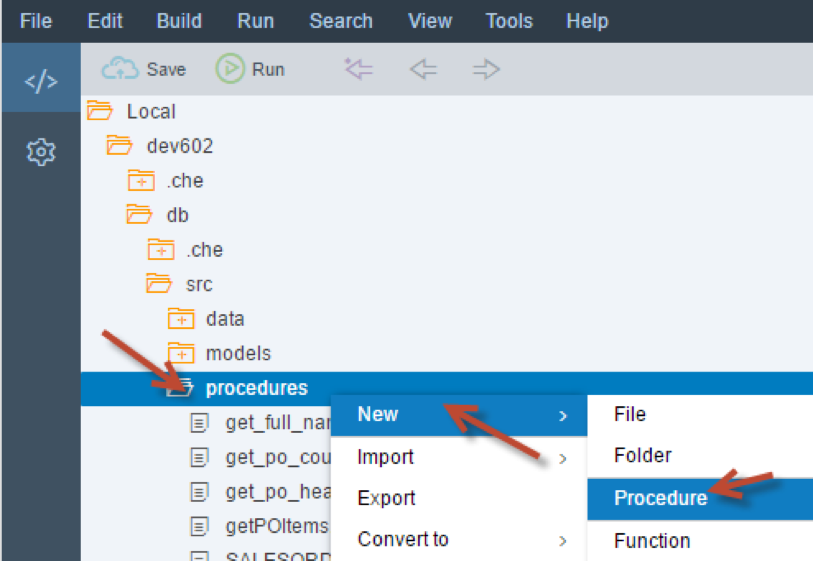
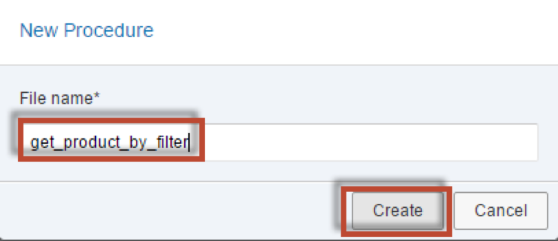
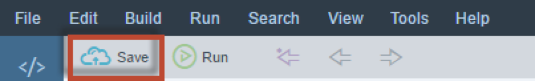
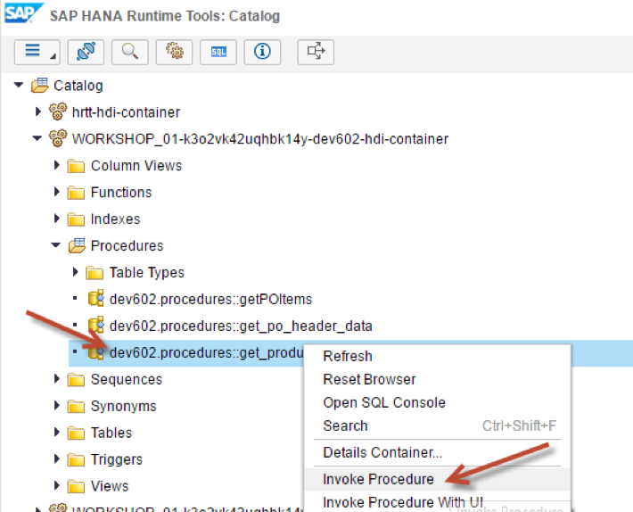
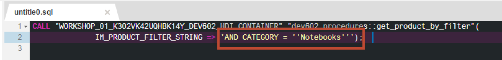

## Prerequisites  
 - **Proficiency:** Intermediate
 - **Tutorials:** [Anonymous Blocks](http://go.sap.com/developer/tutorials/xsa-sqlscript-anonymous.html)

## Next Steps
 - [Using Execute Immediate](http://go.sap.com/developer/tutorials/xsa-sqlscript-execute.html)

## Details 
### You will learn  
In this exercise, you will learn the differences between dynamic SQL (EXEC, EXECUTE IMMEDIATE) and applying a dynamic filter.

### Time to Complete
**10 Min**.

---

1. Right click on the procedures folder and choose "New", then "Procedure".

	
	
2. Enter the name of the procedure as `get_product_by_filter`.  Click the drop down box for "Schema".

	

3. Change the namespace from `Undefined` to `dev602.procedures`. Add an input parameter named `im_product_filter_string`, type `varchar` with a length of 5000.

	

4. Because dynamic SQL is not supported in "Read-only" procedures, you must remove the ""READS SQL DATA" keywords as shown here.

	

5. Between the BEGIN and END statements, insert the EXEC statements as shown.  The completed code should look similar to this. If you do not wish to type this code, you can reference the solution web page at `http://<hostname>:51013/workshop/admin/ui/exerciseMaster/?workshop=dev602&sub=ex2_17`

    ```
    PROCEDURE "dev602.procedures::get_product_by_filter" (
              IN im_product_filter_string VARCHAR(5000) )
   LANGUAGE SQLSCRIPT
   SQL SECURITY INVOKER
   --DEFAULT SCHEMA <default_schema_name>
   AS
	BEGIN

	EXEC 'SELECT count(*) FROM "dev602.data::MD.Products" where CATEGORY NOT IN (''Laser printers'')' 
      || :im_product_filter_string  ;

	END
    ```

6. Save the procedure

	

7. Use what you have learned already and perform a build on your `hdb` module. Then return to the HRTT page and invoke the procedure.

	

8. A new SQL tab will be opened. Add the filter string as `AND CATEGORY = ''Notebooks'''`

	

9. Click the "Run" button.  You will notice that you get no results from the call at all.  Also by using the EXEC statement, there is a possibility of SQL injection

	

## Next Steps
 - [Using Execute Immediate](http://go.sap.com/developer/tutorials/xsa-sqlscript-execute.html)
