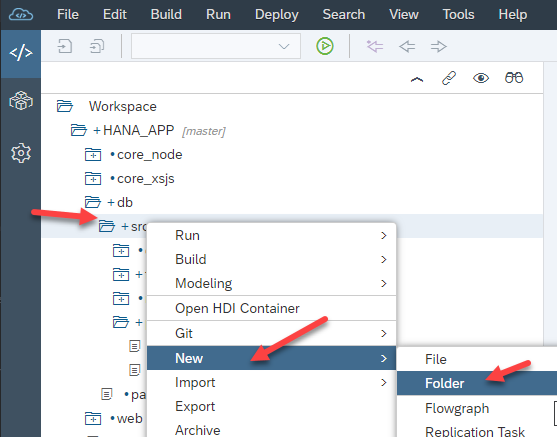
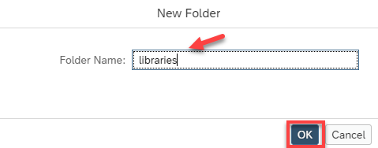
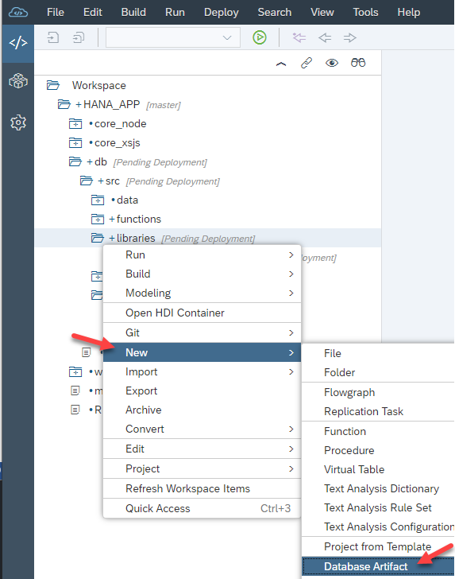
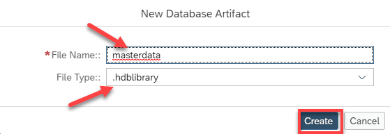
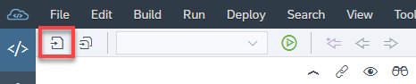
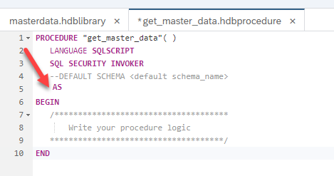
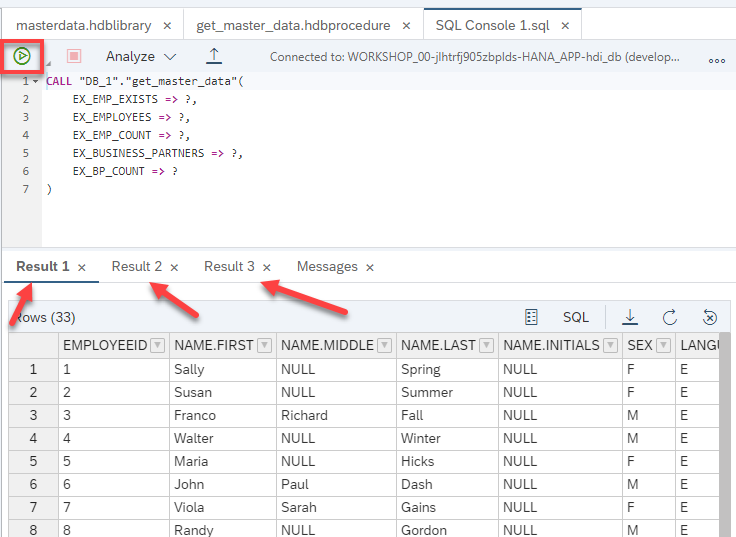

## Prerequisites  
- This tutorial is designed for SAP HANA on premise and SAP HANA, express edition. It is not designed for SAP HANA Cloud.
- **Tutorials:** [Creating Table User Defined Functions](xsa-sqlscript-table-user)

## Details
### You will learn  
- How to create SQLScript User Defined Libraries

Libraries are designed to group related variables, functions, and procedures together within a common object. These library members can either be exposed using the PULBIC keyword, or set to only be consumable from within the library itself using the PRIVATE keyword.

---

[ACCORDION-BEGIN [Step 1: ](Create Libraries Folder)]
Return to the SAP Web IDE for SAP HANA and right click on the `src` folder and choose **New**, then **Folder**.



Enter the name of the folder as **libraries** and click **OK**.



[DONE]
[ACCORDION-END]

[ACCORDION-BEGIN [Step 2: ](Create New User Defined Library)]
Right click on the libraries folder and choose **New**, then **Database Artifact**.



Enter the name of the file as `masterdata`, set the artifact type as `.hdblibrary` and click **OK**.



[DONE]
[ACCORDION-END]


[ACCORDION-BEGIN [Step 3: ](Enter the Library Shell)]
Enter the shell of the library as shown here.

```
LIBRARY "masterdata"
  LANGUAGE SQLSCRIPT AS
 BEGIN


END;

```

[DONE]
[ACCORDION-END]

[ACCORDION-BEGIN [Step 4: ](Define a Public Variable)]
Between the BEGIN and END statements, define a public variable library member called `rowcount` with type int.

```
public variable rowcount int;
```

[DONE]
[ACCORDION-END]

[ACCORDION-BEGIN [Step 5: ](Define a Public Function)]
After the public variable, define a public function library member as shown here.
```
public function "employee_exists"(
             in im_employee_id nvarchar(10) )
             returns res boolean as
begin
    declare lv_count int;
    select count(*) into lv_count from "MD.Employees"
                           where employeeid = im_employee_id;
    if  lv_count > 0 then
     res = true;
    else
     res = false;
    end if;
end;

```

[DONE]
[ACCORDION-END]

[ACCORDION-BEGIN [Step 6: ](Define Public Procedures)]
After the public function, define two public procedure library members, one called `get_employee_data` and the other `get_business_partner_data`.

```
public procedure "get_employee_data"(
             out ex_employees "MD.Employees" )
   LANGUAGE SQLSCRIPT
   SQL SECURITY INVOKER
   AS
begin
  ex_employees = select * from "MD.Employees";
  rowcount = record_count(:ex_employees);
end;

public procedure "get_business_partner_data"(
             out ex_businesspartners "MD.BusinessPartner" )
   LANGUAGE SQLSCRIPT
   SQL SECURITY INVOKER
    AS
begin
  ex_businesspartners = select * from "MD.BusinessPartner";
  rowcount = record_count(:ex_businesspartners);
end;

```


[DONE]
[ACCORDION-END]

[ACCORDION-BEGIN [Step 7: ](Review Completed Code)]
The complete code should look like this.

```
LIBRARY "masterdata"
  LANGUAGE SQLSCRIPT AS
 BEGIN

   public variable rowcount int;

   public function "employee_exists"(
                in im_employee_id nvarchar(10) )
                returns res boolean as
   begin
       declare lv_count int;
       select count(*) into lv_count from "MD.Employees"
                              where employeeid = im_employee_id;
       if  lv_count > 0 then
        res = true;
       else
        res = false;
       end if;
   end;

   public procedure "get_employee_data"(
                out ex_employees "MD.Employees" )
      LANGUAGE SQLSCRIPT
      SQL SECURITY INVOKER
      AS
   begin
     ex_employees = select * from "MD.Employees";
     rowcount = record_count(:ex_employees);
   end;

   public procedure "get_business_partner_data"(
                out ex_businesspartners "MD.BusinessPartner" )
      LANGUAGE SQLSCRIPT
      SQL SECURITY INVOKER
       AS
   begin
     ex_businesspartners = select * from "MD.BusinessPartner";
     rowcount = record_count(:ex_businesspartners);
   end;

END;

```


[DONE]
[ACCORDION-END]

[ACCORDION-BEGIN [Step 8: ](Save Your Work)]

**Save** your work.




[DONE]
[ACCORDION-END]

[ACCORDION-BEGIN [Step 9: ](Create a Procedure)]
Use what you have learned and create a new procedure in the procedures folder called `get_master_data`. Because our library procedures actually update the library variable, we need our consuming procedure to be Read/Write as well, so make sure to remove the **READS SQL DATA** from this procedure as shown.



[DONE]
[ACCORDION-END]

[ACCORDION-BEGIN [Step 10: ](Define the Output Parameters)]
Enter the output parameters in the signature of the procedure.

```
out ex_emp_exists boolean,
out ex_employees "MD.Employees",
out ex_emp_count int,
out ex_business_partners "MD.BusinessPartner",
out ex_bp_count int
```


[DONE]
[ACCORDION-END]

[ACCORDION-BEGIN [Step 11: ](Leverage the Library Members from the Procedure)]
Enter code between the BEGIN and END statements. First call the scalar function and pass the result to the output parameter. Next, call the procedures and pass the result to the output parameters as well as pass the library variable to the output parameters.

```

ex_emp_exists  = "masterdata":"employee_exists"('199999');   

call "masterdata":"get_employee_data"( ex_employees );
ex_emp_count = "masterdata":rowcount;

call "masterdata":"get_business_partner_data"( ex_business_partners );
ex_bp_count = "masterdata":rowcount;

```


[DONE]
[ACCORDION-END]

[ACCORDION-BEGIN [Step 12: ](Review Completed Code)]
The completed code should look similar to this.

```
PROCEDURE "get_master_data"(              
	             out ex_emp_exists boolean,
	             out ex_employees "MD.Employees",
	             out ex_emp_count int,
	             out ex_business_partners "MD.BusinessPartner",
	             out ex_bp_count int
 )
   LANGUAGE SQLSCRIPT
   SQL SECURITY INVOKER
   --DEFAULT SCHEMA <default_schema_name>
    AS
BEGIN

 ex_emp_exists  = "masterdata":"employee_exists"('199999');   

 call "masterdata":"get_employee_data"( ex_employees );
 ex_emp_count = "masterdata":rowcount;

 call "masterdata":"get_business_partner_data"( ex_business_partners );
 ex_bp_count = "masterdata":rowcount;


END
```


[DONE]
[ACCORDION-END]

[ACCORDION-BEGIN [Step 13: ](Save, Build, Run and Check Results)]
Use what you have learned and Save your work, perform a Build on the module. Then return to the Database Explorer and call the procedure and check the results.




[DONE]
[ACCORDION-END]


---
