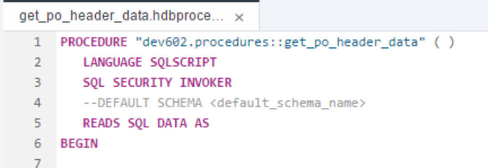
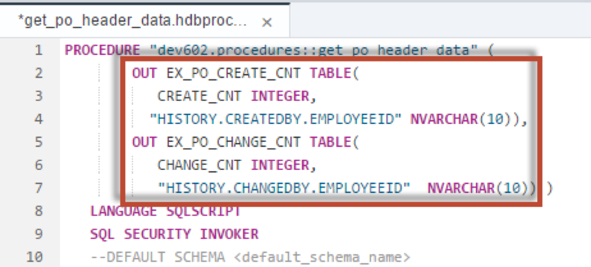
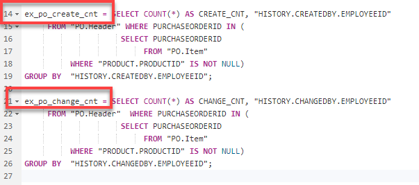
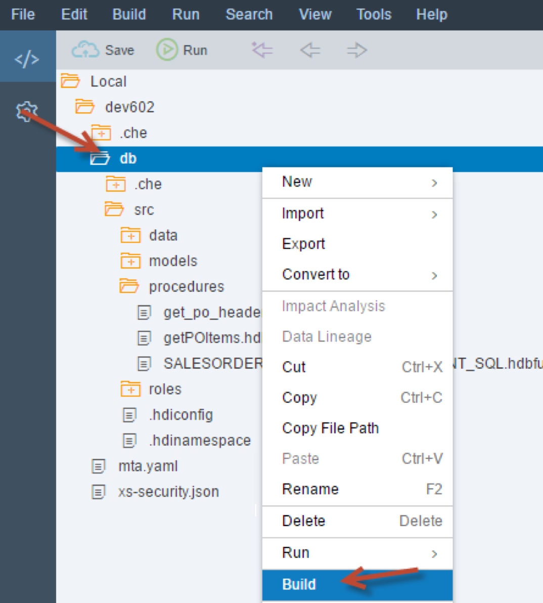
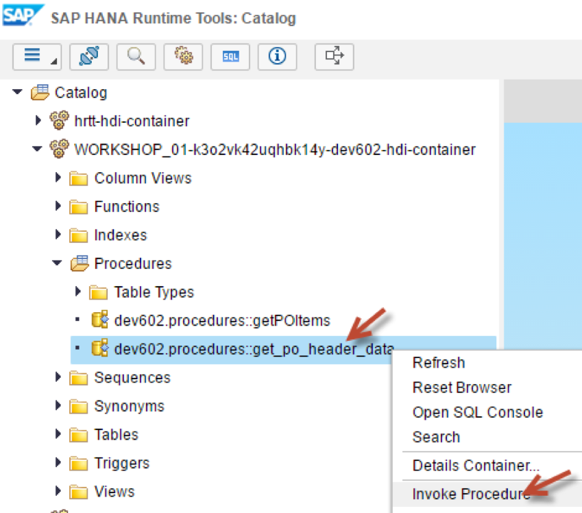
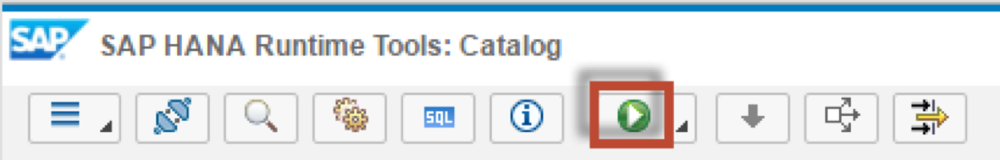
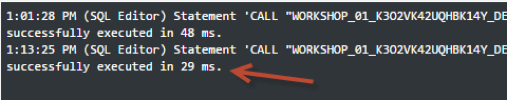

## Prerequisites  
- This tutorial is designed for SAP HANA on premise and SAP HANA, express edition. It is not designed for SAP HANA Cloud.
- **Tutorials:** [Creating Stored Procedures](xsa-sqlscript-stored-proc)

## Details
### You will learn  
- How to take full advantage of parallel processing in SAP HANA by using table variables

In this exercise, we will modify the code of procedure `get_po_header_data`  so that it takes full advantage of the parallel processing within HANA by using table variables.

---

[ACCORDION-BEGIN [Step 1: ](Edit previous procedure)]

Return to your procedure called `get_po_header_data`.



Define two tabular output parameters which will be used to explicitly pass the results of the SELECT statements to the caller.




[DONE]
[ACCORDION-END]

[ACCORDION-BEGIN [Step 2: ](Assign SELECT statements)]

Next, assign SELECT statements to the output parameters as shown here.



The completed code should be similar to this.

```
PROCEDURE "get_po_header_data"(
    OUT EX_PO_CREATE_CNT TABLE(
       CREATE_CNT INTEGER,
      "HISTORY.CREATEDBY.EMPLOYEEID" NVARCHAR(10)),
    OUT EX_PO_CHANGE_CNT TABLE(
       CHANGE_CNT INTEGER,
       "HISTORY.CHANGEDBY.EMPLOYEEID"  NVARCHAR(10)) )  
   LANGUAGE SQLSCRIPT
   SQL SECURITY INVOKER
   --DEFAULT SCHEMA <default_schema_name>
   READS SQL DATA AS
BEGIN

ex_po_create_cnt = SELECT COUNT(*) AS CREATE_CNT, "HISTORY.CREATEDBY.EMPLOYEEID"
     FROM "PO.Header" WHERE PURCHASEORDERID IN (
                     SELECT PURCHASEORDERID
                          FROM "PO.Item"
          WHERE "PRODUCT.PRODUCTID" IS NOT NULL)
GROUP BY  "HISTORY.CREATEDBY.EMPLOYEEID";

ex_po_change_cnt = SELECT COUNT(*) AS CHANGE_CNT, "HISTORY.CHANGEDBY.EMPLOYEEID"
     FROM "PO.Header"  WHERE PURCHASEORDERID IN (
                     SELECT PURCHASEORDERID
                          FROM "PO.Item"
          WHERE "PRODUCT.PRODUCTID" IS NOT NULL)
GROUP BY  "HISTORY.CHANGEDBY.EMPLOYEEID";

END
```


[DONE]
[ACCORDION-END]

[ACCORDION-BEGIN [Step 3: ](Save and build)]

Save the procedure.


Perform a build on the `hdb` module.




[DONE]
[ACCORDION-END]

[ACCORDION-BEGIN [Step 4: ](Run the procedure again)]

Return to the Database Explorer page and run the procedure again.



The CALL statement will be inserted into a new "SQL" tab. Click the **Run** button




[DONE]
[ACCORDION-END]

[ACCORDION-BEGIN [Step 5: ](Check execution time)]

Check the execution time again, you may notice that it is a bit faster this time. The reason is that these SQL statements are now executed in parallel.



[DONE]
[ACCORDION-END]
