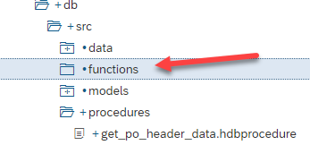
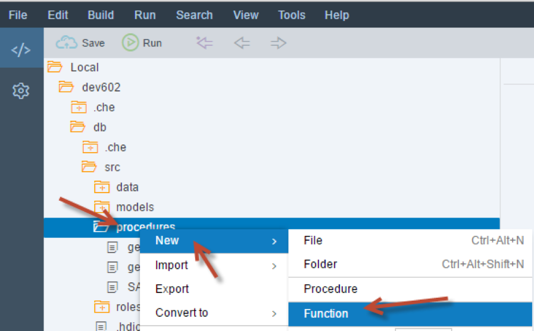
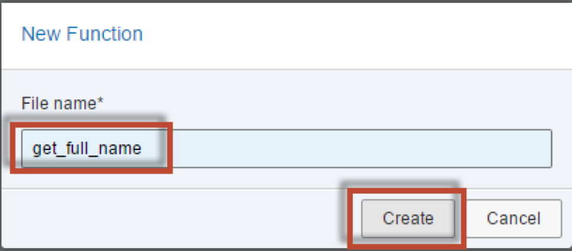
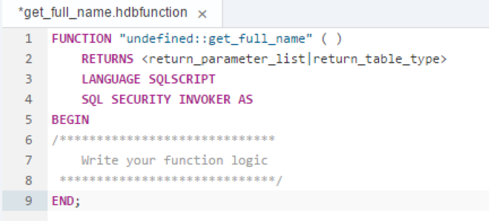
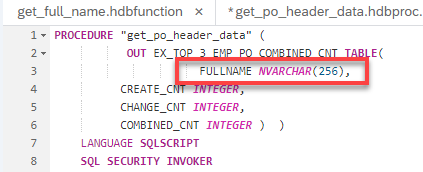
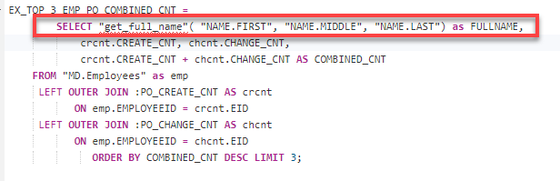
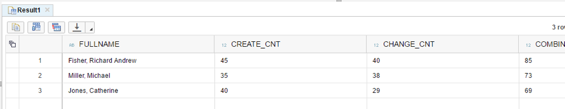

## Prerequisites
- This tutorial is designed for SAP HANA on premise and SAP HANA, express edition. It is not designed for SAP HANA Cloud. 
- **Tutorials:**  [Intermediate Table Variables](xsa-sqlscript-table-var)

## Details
### You will learn  
- How to create a scalar UDF for generating a full name from the last, first and middle name of the employee

---


[ACCORDION-BEGIN [Step 1: ](Create New Function)]

Create a new folder called `functions` under the `src` folder by right clicking on the `src` folder and choosing **New**, then **Folder**.



Right click on the **functions** folder and choose **New**, then **Function**.



Enter the name of the file as `get_full_name` and click **Create**.



[DONE]
[ACCORDION-END]

[ACCORDION-BEGIN [Step 2: ](Edit the Function and Save)]

The editor will open with a small code snippet inserted



Enter the code into the editor as shown here.  Please note the default for parameter `im_employeeid` which makes assigning a value to the parameter optional.

```
FUNCTION "get_full_name" (
          IN im_firstname NVARCHAR(40) ,
          IN im_middlename NVARCHAR(40),
          IN im_lastname NVARCHAR(40),
          IN im_employeeid NVARCHAR(10) DEFAULT '' )
			RETURNS ex_fullname NVARCHAR(256) AS
	BEGIN

		if :im_middlename IS NULL THEN
 				ex_fullname = :im_lastname || ', ' || :im_firstname;
		ELSE
 				ex_fullname = :im_lastname || ', ' ||
               :im_firstname || ' ' || :im_middlename;
		END IF;

		IF :im_employeeid <> '' then
 				ex_fullname = :ex_fullname || '(' || :im_employeeid || ')';
		END IF;
END;


```

Click **Save**


[DONE]
[ACCORDION-END]

[ACCORDION-BEGIN [Step 3: ](Edit Procedure)]

Return to your procedure called `get_po_header_data` and modify it. Start by renaming the `LOGINNAME` column of the output table to `FULLNAME`. Also change the output length to 256. This is needed to match later on which the anticipated output structure.



Change the last SELECT statement.  Remove the `LOGINNAME` column from the field list and replace it with a call to the scalar function that you created earlier.  Make sure to pass the `NAME.FIRST`, `NAME.MIDDLE` and `NAME.LAST` name columns to the scalar function call.



The completed code should look very similar to this.
```
PROCEDURE "get_po_header_data" (
           OUT EX_TOP_3_EMP_PO_COMBINED_CNT TABLE(
                      FULLNAME NVARCHAR(256),
		  CREATE_CNT INTEGER,
		  CHANGE_CNT INTEGER,
		  COMBINED_CNT INTEGER )  )
 	LANGUAGE SQLSCRIPT
 	SQL SECURITY INVOKER
 		--DEFAULT SCHEMA <default_schema_name>
 	READS SQL DATA AS
BEGIN

po_create_cnt =  SELECT COUNT(*) AS CREATE_CNT, "HISTORY.CREATEDBY.EMPLOYEEID"  AS EID
       FROM "PO.Header" WHERE PURCHASEORDERID IN (
             SELECT PURCHASEORDERID
                  FROM "PO.Item"
          WHERE "PRODUCT.PRODUCTID" IS NOT NULL)
 GROUP BY  "HISTORY.CREATEDBY.EMPLOYEEID";

po_change_cnt =  SELECT COUNT(*) AS CHANGE_CNT, "HISTORY.CHANGEDBY.EMPLOYEEID" AS EID
       FROM "PO.Header"  WHERE PURCHASEORDERID IN (
          SELECT PURCHASEORDERID
               FROM "PO.Item"
     WHERE "PRODUCT.PRODUCTID" IS NOT NULL)
	GROUP BY  "HISTORY.CHANGEDBY.EMPLOYEEID";


EX_TOP_3_EMP_PO_COMBINED_CNT =
        SELECT "get_full_name"( "NAME.FIRST", "NAME.MIDDLE", "NAME.LAST") as FULLNAME,
            crcnt.CREATE_CNT, chcnt.CHANGE_CNT,
            crcnt.CREATE_CNT + chcnt.CHANGE_CNT AS COMBINED_CNT
 	FROM "MD.Employees" as emp
     LEFT OUTER JOIN :PO_CREATE_CNT AS crcnt
           ON emp.EMPLOYEEID = crcnt.EID
     LEFT OUTER JOIN :PO_CHANGE_CNT AS chcnt
           ON emp.EMPLOYEEID = chcnt.EID
              ORDER BY COMBINED_CNT DESC LIMIT 3;

END
```

[DONE]
[ACCORDION-END]

[ACCORDION-BEGIN [Step 4: ](Save, Build and Check Results)]

Click **Save**. Use what you have learned already and perform a build on your `hdb` module. Then return to the Database Explorer and generate a new CALL statement and run it. Notice the `FULLNAME` column, it shows the results of the scalar `UDF` logic.



[DONE]
[ACCORDION-END]
