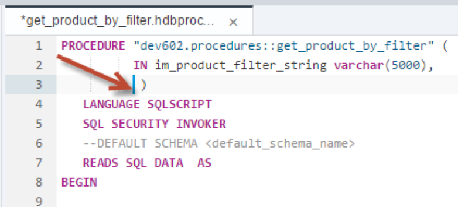
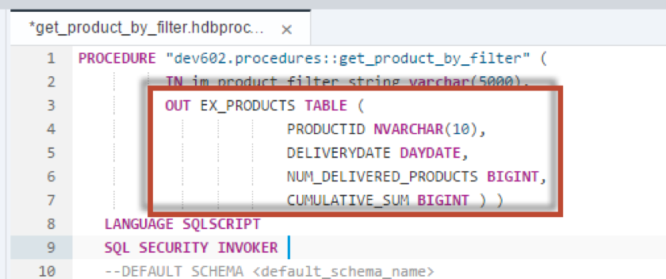
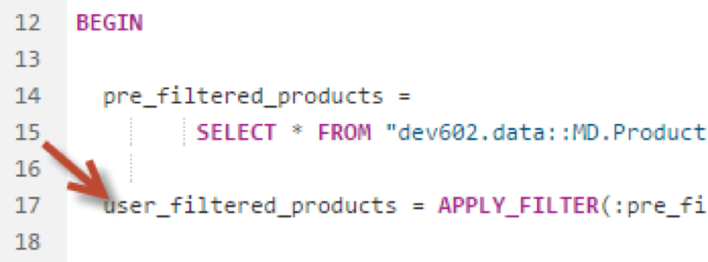
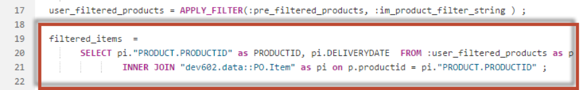
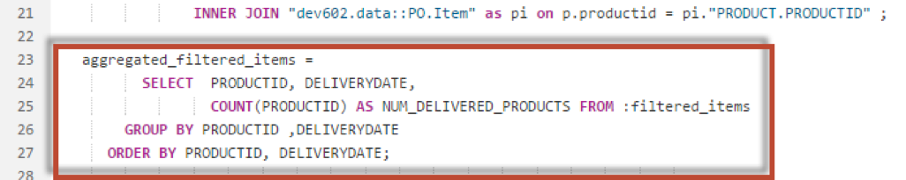
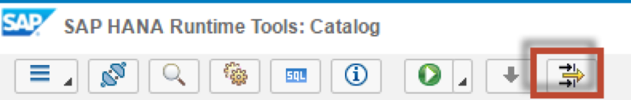
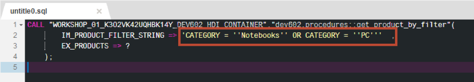
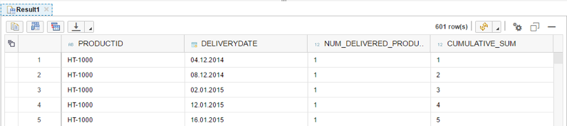

## Prerequisites  
 - **Proficiency:** Intermediate
 - **Tutorials:** [Using APPLY FILTER statement](http://go.sap.com/developer/tutorials/xsa-sqlscript-applyfilter.html)

## Next Steps
 - [Using Cursors](http://go.sap.com/developer/tutorials/xsa-sqlscript-usingcursor.html)

## Details
### You will learn  
Depending on the nature of the problem to be solved a solution using an imperative algorithm might be worse to be considered. You will see the different possibilities based on the example of calculating the cumulative sum of the number of delivered products.

### Time to Complete
**15 Min**.

---

1. Return the `get_product_by_filter` procedure in the editor. Delete the output parameter.

	

2. Define a new output parameter called `EX_PRODUCTS`. Instead of referring to predefined table of table type we are now using in place table type definition

	

3. Rename `EX_USER_FILTERED_PRODUCTS` to `USER_FILTERED_PRODUCTS`.

	

4. Enter another SELECT statement which does an INNER JOIN between the results of the previous SELECT statement and the `PO.Item` table as shown here. Assign this statement to a table variable named `filtered_items`.

	

5. Next enter another SELECT which aggregates the results of the previous SELECT statement. Assign this statement to a table variable named `aggregated_filtered_items`

	

6. Finally, add another SELECT statement which does a self inner join to calculate the cumulative sum. Assign this statement to the output table parameter `ex_products`.

	
 
7. The completed code should look very similar to the following. If you do not wish to type this code, you can reference the solution web page at `http://<hostname>:51013/workshop/admin/ui/exerciseMaster/?workshop=dev602&sub=ex2_19`

	```
	PROCEDURE "dev602.procedures::get_product_by_filter" (
          IN im_product_filter_string varchar(5000), 
          OUT EX_PRODUCTS TABLE (
                        PRODUCTID NVARCHAR(10),
                        DELIVERYDATE DAYDATE,
                        NUM_DELIVERED_PRODUCTS BIGINT,
                        CUMULATIVE_SUM BIGINT ) )
   LANGUAGE SQLSCRIPT
   SQL SECURITY INVOKER 
   --DEFAULT SCHEMA <default_schema_name>
   READS SQL DATA  AS
	BEGIN 

  	pre_filtered_products = 
         SELECT * FROM "dev602.data::MD.Products" WHERE CATEGORY NOT IN ('Laser Printer');
       
  	user_filtered_products = APPLY_FILTER(:pre_filtered_products, :im_product_filter_string ) ;

  	filtered_items  = 
        SELECT pi."PRODUCT.PRODUCTID" as PRODUCTID, pi.DELIVERYDATE  		FROM :user_filtered_products as p
                INNER JOIN "dev602.data::PO.Item" as pi on p.productid = 		pi."PRODUCT.PRODUCTID" ;

   aggregated_filtered_items = 
          SELECT  PRODUCTID, DELIVERYDATE, 
                  COUNT(PRODUCTID) AS NUM_DELIVERED_PRODUCTS FROM :filtered_items
        GROUP BY PRODUCTID ,DELIVERYDATE
      ORDER BY PRODUCTID, DELIVERYDATE;
                                                                           
   	ex_products =
           SELECT  p1.PRODUCTID, 
                   p1.DELIVERYDATE, 
                   p1.NUM_DELIVERED_PRODUCTS, 
          SUM(p2.NUM_DELIVERED_PRODUCTS) AS CUMULATIVE_SUM   
            FROM :aggregated_filtered_items as p1 
            INNER JOIN  :aggregated_filtered_items as p2 
                   ON  p1.PRODUCTID = p2.PRODUCTID        
                  and p1.DELIVERYDATE >= p2.DELIVERYDATE  
            GROUP BY p1.PRODUCTID,p1.DELIVERYDATE, 
           p1.NUM_DELIVERED_PRODUCTS
         ORDER BY PRODUCTID, DELIVERYDATE ;

	END
	```
	
8. Click “Save”.

	

9. Use what you have learned already and perform a build on your `hdb` module. Then return to the HRTT page and invoke the procedure again.

	

10. Click "Format Code".

	

11. Enter the value for the input parameter as shown. Then run the call statement. 

	```
	'CATEGORY = ''Notebooks'' OR CATEGORY = ''PC'''
	```

	

12. View the results.

	

13. Take note of the run time.

	

## Next Steps
 - [Using Cursors](http://go.sap.com/developer/tutorials/xsa-sqlscript-usingcursor.html)
