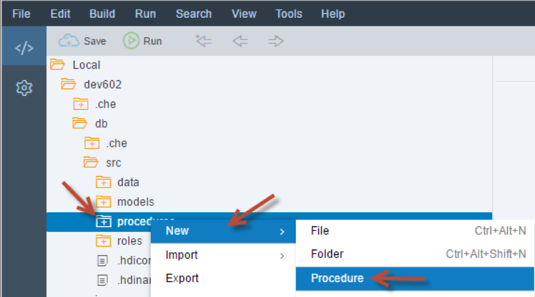
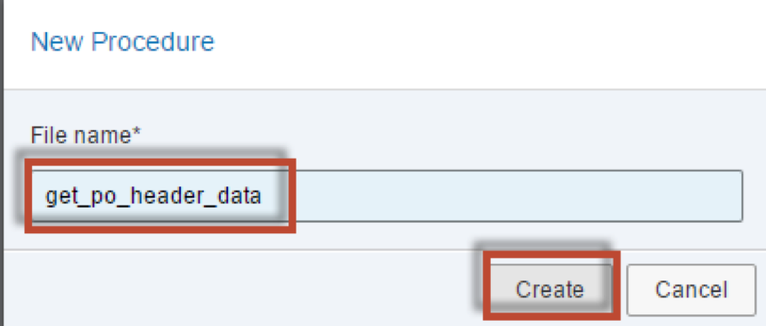
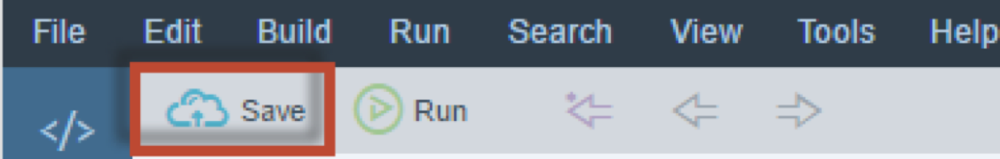
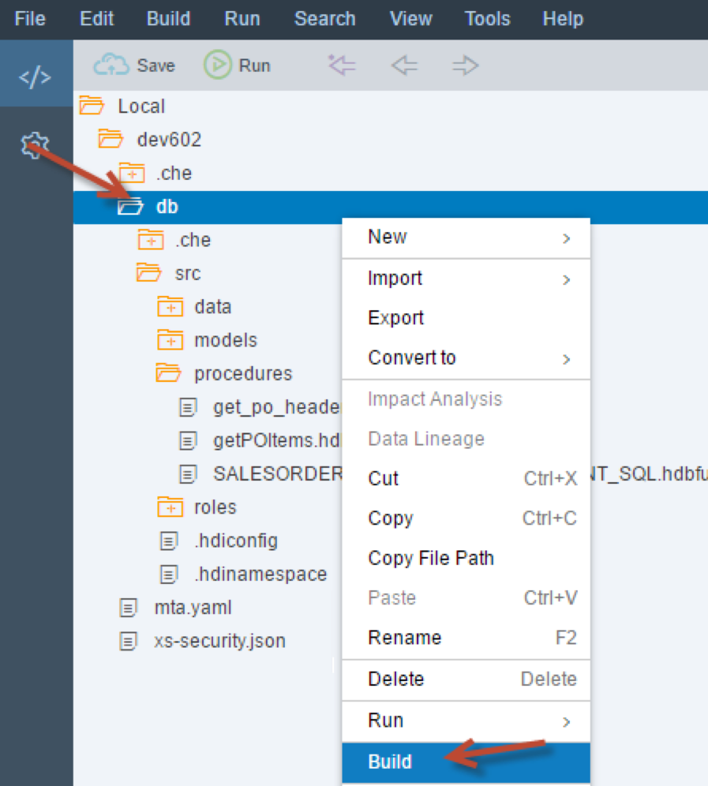
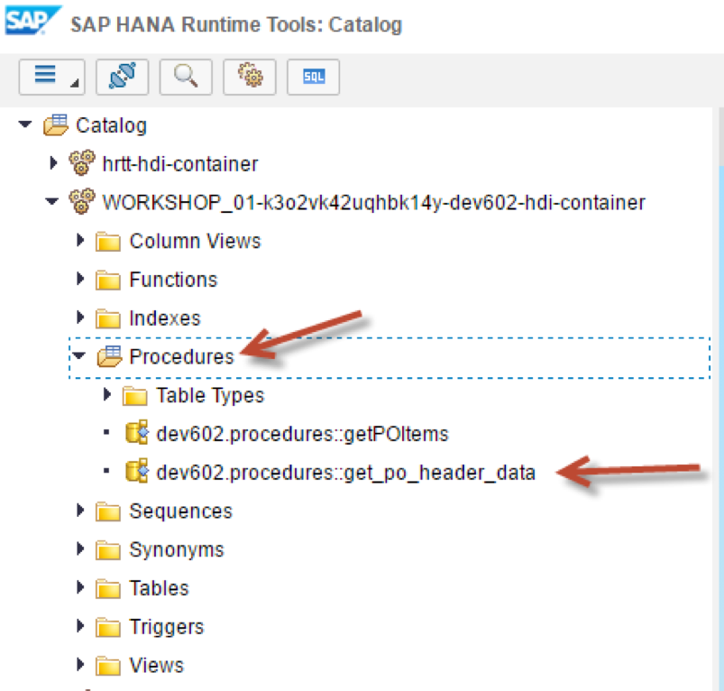
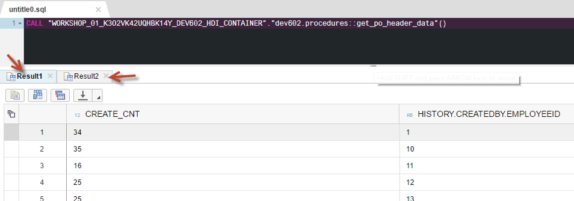
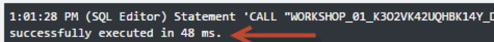

## Prerequisites  
 - This tutorial is designed for SAP HANA on premise and SAP HANA, express edition. It is not designed for SAP HANA Cloud.
 
## Details
### You will learn  
- How to create a small procedure `get_po_header_data` with two implicit SELECT queries

---

[ACCORDION-BEGIN [Step 1: ](Create New Procedure)]

Right click on the **procedures** folder and choose **New**, then **Procedure**.



Enter the name of the procedure as `get_po_header_data`.  Click **Create**



The editor will then be shown.


[DONE]
[ACCORDION-END]

[ACCORDION-BEGIN [Step 2: ](Add SELECTs)]

Between the BEGIN and END statements, insert the SELECT statements as shown.  These are implicit select statements whose results sets are passed to the caller.  

```
SELECT COUNT(*) AS CREATE_CNT, "HISTORY.CREATEDBY.EMPLOYEEID"
     FROM "PO.Header" WHERE PURCHASEORDERID IN (
                     SELECT PURCHASEORDERID
                          FROM "PO.Item"
          WHERE "PRODUCT.PRODUCTID" IS NOT NULL)
GROUP BY  "HISTORY.CREATEDBY.EMPLOYEEID";

SELECT COUNT(*) AS CHANGE_CNT, "HISTORY.CHANGEDBY.EMPLOYEEID"
     FROM "PO.Header"  WHERE PURCHASEORDERID IN (
                     SELECT PURCHASEORDERID
                          FROM "PO.Item"
          WHERE "PRODUCT.PRODUCTID" IS NOT NULL)
GROUP BY  "HISTORY.CHANGEDBY.EMPLOYEEID";
```

[DONE]
[ACCORDION-END]

[ACCORDION-BEGIN [Step 3: ](Review Complete Code)]

The completed code should look similar to this.


```
PROCEDURE "get_po_header_data"( )
   LANGUAGE SQLSCRIPT
   SQL SECURITY INVOKER
   --DEFAULT SCHEMA <default_schema_name>
   READS SQL DATA AS
BEGIN

SELECT COUNT(*) AS CREATE_CNT, "HISTORY.CREATEDBY.EMPLOYEEID"
     FROM "PO.Header" WHERE PURCHASEORDERID IN (
                     SELECT PURCHASEORDERID
                          FROM "PO.Item"
          WHERE "PRODUCT.PRODUCTID" IS NOT NULL)
GROUP BY  "HISTORY.CREATEDBY.EMPLOYEEID";

SELECT COUNT(*) AS CHANGE_CNT, "HISTORY.CHANGEDBY.EMPLOYEEID"
     FROM "PO.Header"  WHERE PURCHASEORDERID IN (
                     SELECT PURCHASEORDERID
                          FROM "PO.Item"
          WHERE "PRODUCT.PRODUCTID" IS NOT NULL)
GROUP BY  "HISTORY.CHANGEDBY.EMPLOYEEID";

END

```

[DONE]
[ACCORDION-END]

[ACCORDION-BEGIN [Step 4: ](Save and Build)]

Save the procedure.



Perform a build on your `hdb` module.




[DONE]
[ACCORDION-END]

[ACCORDION-BEGIN [Step 5: ](Run Procedure)]

Switch over to the Database Explorer page and look for your procedure. Right-click on the procedure and choose **Generate Call Statement**.




A new SQL tab will be opened with the CALL statement inserted. Click the **Run** button.


[DONE]
[ACCORDION-END]

[ACCORDION-BEGIN [Step 6: ](Check Results)]

The two results are then shown in another tab.  



Note the execution time.



[DONE]
[ACCORDION-END]
