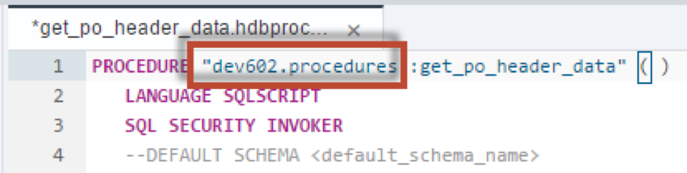
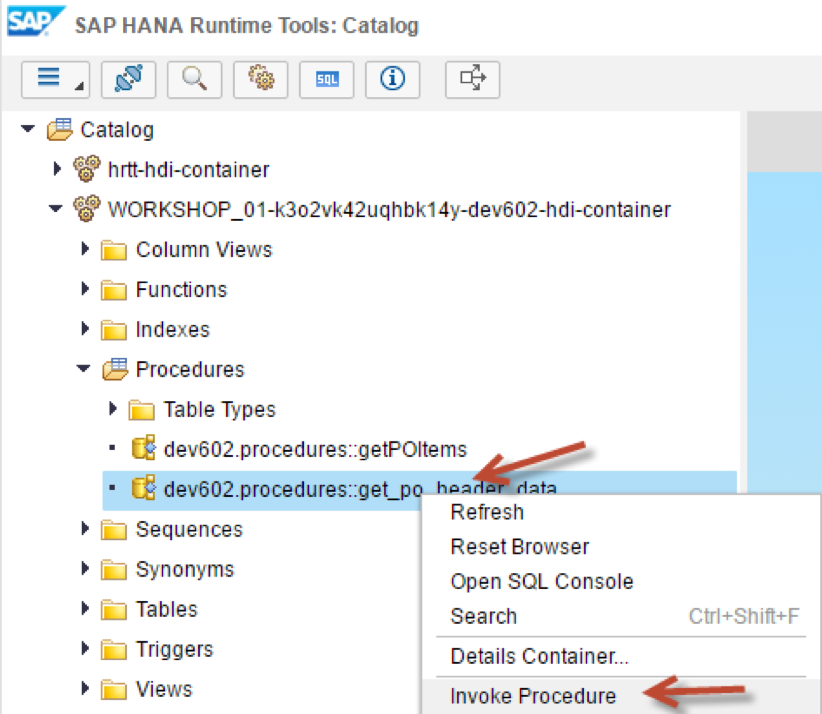
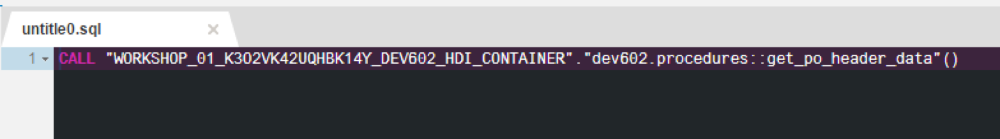

## Prerequisites  
 - **Proficiency:** Intermediate
 - **Tutorials:** [Creating a Calculation View with a Cube data type and Star Join](http://go.sap.com/developer/tutorials/xsa-sqlscript-cube.html)

## Next Steps
 - [Parallel Processing and Parameters](http://go.sap.com/developer/tutorials/xsa-sqlscript-parallel.html)

## Details
### You will learn  
In this exercise you will create a small procedure `get_po_header_data` with two implicit SELECT queries.

### Time to Complete
**15 Min**.

---

1. Right click on the "procedures" package and choose "New", then "HDB Procedure".
    
    
    
2. Enter the name of the procedure as `get_po_header_data`.  Click "Create"
	
	
	
3. The editor will then be shown.

    
    
4. Change the namespace from “Undefined” to `dev602.procedures`

    

5. Between the BEGIN and END statements, insert the SELECT statements as shown.  These are implicit select statements whose results sets are passed to the caller.  

    

6. The completed code should look similar to this. If you do not wish to type this code, you can reference the solution web page at `http://<hostname>:51013/workshop/admin/ui/exerciseMaster/?workshop=dev602&sub=ex2_10`

   ```
   PROCEDURE "dev602.procedures::get_po_header_data" ( )
   LANGUAGE SQLSCRIPT
   SQL SECURITY INVOKER
   --DEFAULT SCHEMA <default_schema_name>
   READS SQL DATA AS
	BEGIN

	SELECT COUNT(*) AS CREATE_CNT, "HISTORY.CREATEDBY.EMPLOYEEID" 
         FROM "dev602.data::PO.Header" WHERE PURCHASEORDERID IN (
                         SELECT PURCHASEORDERID 
                              FROM "dev602.data::PO.Item" 
              WHERE "PRODUCT.PRODUCTID" IS NOT NULL)
    GROUP BY  "HISTORY.CREATEDBY.EMPLOYEEID";
    
    SELECT COUNT(*) AS CHANGE_CNT, "HISTORY.CHANGEDBY.EMPLOYEEID" 
         FROM "dev602.data::PO.Header"  WHERE PURCHASEORDERID IN (
                         SELECT PURCHASEORDERID 
                              FROM "dev602.data::PO.Item"
              WHERE "PRODUCT.PRODUCTID" IS NOT NULL)
    GROUP BY  "HISTORY.CHANGEDBY.EMPLOYEEID";
	END
   ```

   
7. Save the procedure.

    

8. Perform a build on your `hdb` module.

    

9. Switch over to the HRTT page and look for your procedure

    

10. Right-click on the procedure and choose "Invoke Procedure".

    

11. A new SQL tab will be opened with the CALL statement inserted.  

    

12. Click the "Run" button.

    

13. The two results are then shown in another tab.  

    

14. Note the execution time.

    


## Next Steps
 - [Parallel Processing and Parameters](http://go.sap.com/developer/tutorials/xsa-sqlscript-parallel.html)
