## Prerequisites  
- This tutorial is designed for SAP HANA on premise and SAP HANA, express edition. It is not designed for SAP HANA Cloud.
- **Tutorials:** [Creating Scalar User Defined Functions](xsa-sqlscript-scalar)

## Details
### You will learn
- How to transform a procedure to a table function.

There are application and scenarios where you need a table function instead of procedure to leverage the advantage of direct selects on the output, for example, filtering, sorting and grouping. In the following exercise, we show you how you can easily transform a procedure to a table function.


---

[ACCORDION-BEGIN [Step 1: ](Create New Function)]

Return to the **functions** folder, and right click and choose **New**, then **Function**.

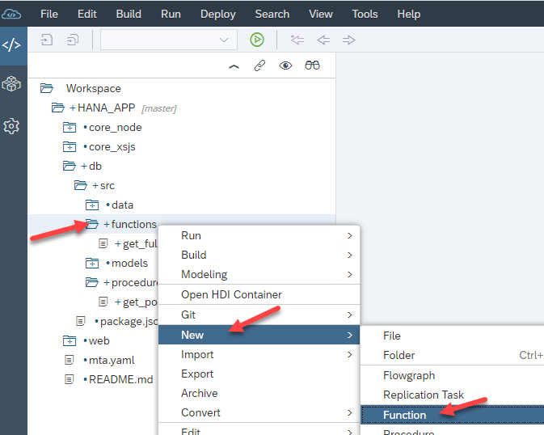

2. Enter the name of the file as `get_po_counts`. Then click **Create**.

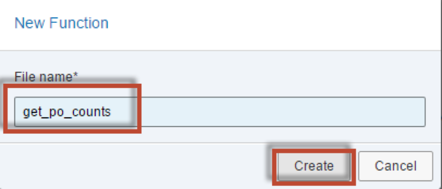

3. The editor will be shown

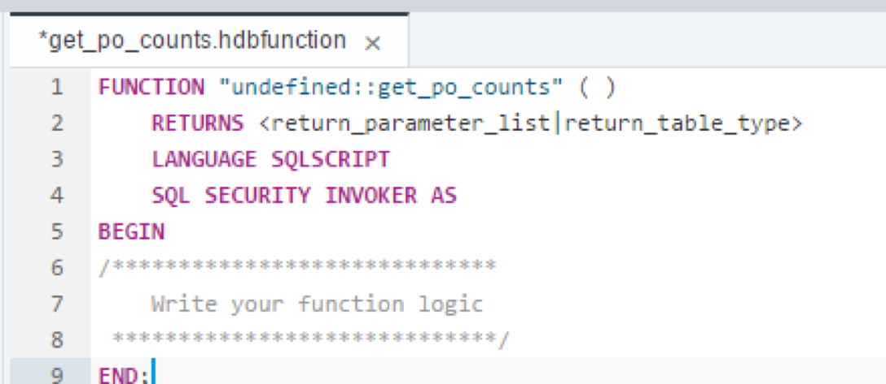


[DONE]
[ACCORDION-END]

[ACCORDION-BEGIN [Step 2: ](Modify Parameters)]

Add the input parameter called `IM_FDATE` as well as the RETURN Table parameter as shown. Please note the scalar input parameter we will used later on for filtering.

```
FUNCTION "get_po_counts" ( im_fdate DATE )
RETURNS TABLE (EMPLOYEEID NVARCHAR(10),
	       FULLNAME NVARCHAR(256),
	       CREATE_CNT INTEGER,
	       CHANGE_CNT INTEGER,
	       COMBINED_CNT INTEGER)
AS
BEGIN


END;
```


[DONE]
[ACCORDION-END]
[ACCORDION-BEGIN [Step 3: ](Insert Code)]

Copy the logic from the procedure `get_po_header_data` into the body of the function.  Make sure to only copy the code between the BEGIN and END statements

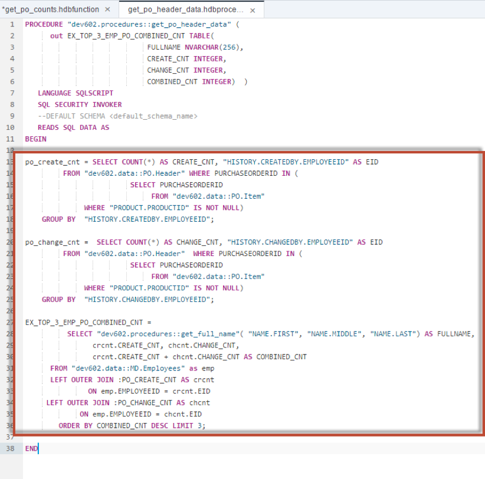


[DONE]
[ACCORDION-END]

[ACCORDION-BEGIN [Step 4: ](Edit WHERE Clauses)]

Add to the WHERE clauses in the first two SELECT statements for filtering by month. Month is captured from the input parameter `im_fdate`.

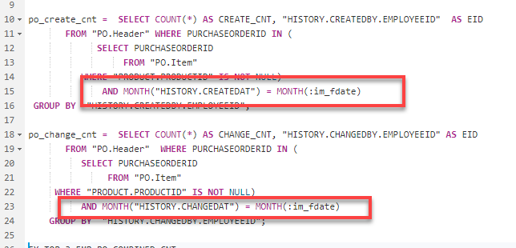


[DONE]
[ACCORDION-END]

[ACCORDION-BEGIN [Step 5: ](Change Variable Name)]

In the third SELECT statement, change the name of the intermediate table variable to `EMP_PO_COMBINED_CNT` to match the variable name to the semantics of the query

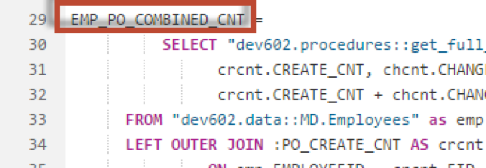


Also add the `EMPLOYEEID` column to the field list.

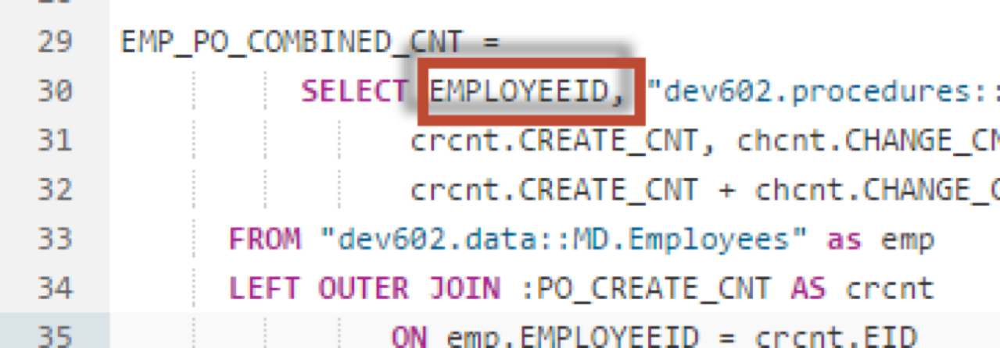


[DONE]
[ACCORDION-END]

[ACCORDION-BEGIN [Step 6: ](Remove LIMIT Clause)]

Remove the LIMIT clause at the end.

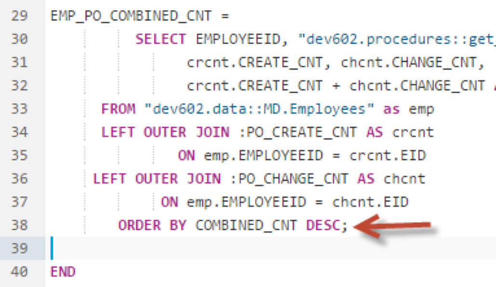

[DONE]
[ACCORDION-END]

[ACCORDION-BEGIN [Step 7: ](Add a RETURN SELECT)]

Finally, add a RETURN SELECT statement at the end to mark the to be returned result set of the function.

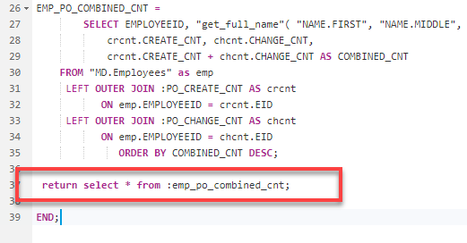


[DONE]
[ACCORDION-END]

[ACCORDION-BEGIN [Step 8: ](Check Complete Code)]

The completed code should be very similar to this.

```
FUNCTION "get_po_counts" ( im_fdate DATE )
RETURNS TABLE (EMPLOYEEID NVARCHAR(10),
	       FULLNAME NVARCHAR(256),
	       CREATE_CNT INTEGER,
	       CHANGE_CNT INTEGER,
	       COMBINED_CNT INTEGER)
AS
BEGIN

po_create_cnt =  SELECT COUNT(*) AS CREATE_CNT, "HISTORY.CREATEDBY.EMPLOYEEID"  AS EID
       FROM "PO.Header" WHERE PURCHASEORDERID IN (
             SELECT PURCHASEORDERID
                  FROM "PO.Item"
          WHERE "PRODUCT.PRODUCTID" IS NOT NULL)
              AND MONTH("HISTORY.CREATEDAT") = MONTH(:im_fdate)
 GROUP BY  "HISTORY.CREATEDBY.EMPLOYEEID";

po_change_cnt =  SELECT COUNT(*) AS CHANGE_CNT, "HISTORY.CHANGEDBY.EMPLOYEEID" AS EID
       FROM "PO.Header"  WHERE PURCHASEORDERID IN (
          SELECT PURCHASEORDERID
               FROM "PO.Item"
     WHERE "PRODUCT.PRODUCTID" IS NOT NULL)
          AND MONTH("HISTORY.CHANGEDAT") = MONTH(:im_fdate)
	GROUP BY  "HISTORY.CHANGEDBY.EMPLOYEEID";

EMP_PO_COMBINED_CNT =
        SELECT EMPLOYEEID, "get_full_name"( "NAME.FIRST", "NAME.MIDDLE", "NAME.LAST") as FULLNAME,
            crcnt.CREATE_CNT, chcnt.CHANGE_CNT,
            crcnt.CREATE_CNT + chcnt.CHANGE_CNT AS COMBINED_CNT
 	FROM "MD.Employees" as emp
     LEFT OUTER JOIN :PO_CREATE_CNT AS crcnt
           ON emp.EMPLOYEEID = crcnt.EID
     LEFT OUTER JOIN :PO_CHANGE_CNT AS chcnt
           ON emp.EMPLOYEEID = chcnt.EID
              ORDER BY COMBINED_CNT DESC;

 return select * from :emp_po_combined_cnt;

END;
```


[DONE]
[ACCORDION-END]

[ACCORDION-BEGIN [Step 9: ](Save and Build)]

Click **Save**


Use what you have learned already and perform a build on your `hdb` module.

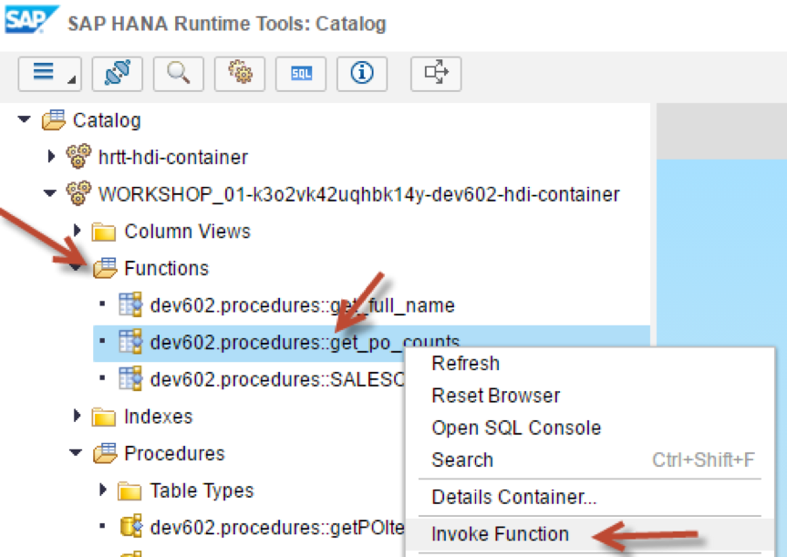


[DONE]
[ACCORDION-END]

[ACCORDION-BEGIN [Step 10: ](Enter Input Parameter)]

Return to the Database Explorer page. Select the Functions folder.  Righ-click on the `get_po_counts` function and choose Generate SELECT statement.

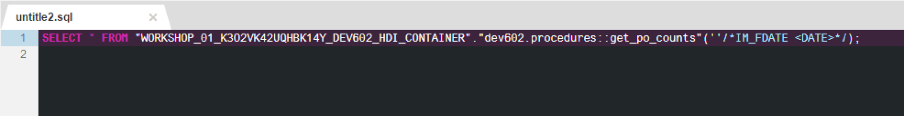

A new SQL tab will be opened with a SELECT statement. Enter the date `18.12.2014` as the input parameter and add  LIMIT 3 at the end of it. Click **Run**.

```
SELECT * FROM "get_po_counts"('18.12.2014') LIMIT 3;
```
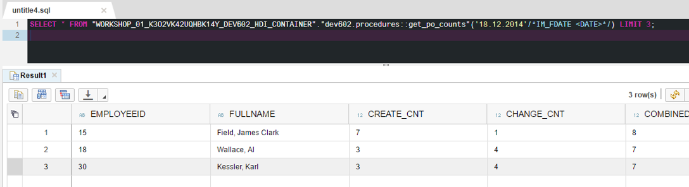

[DONE]
[ACCORDION-END]
