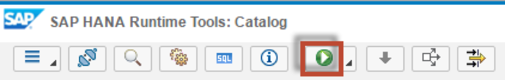

## Prerequisites  
 - **Proficiency:** Intermediate
 - **Tutorials:** [Creating Scalar User Defined Functions](http://go.sap.com/developer/tutorials/xsa-sqlscript-scalar.html)

## Next Steps
 - [Debugging Stored Procedures](http://go.sap.com/developer/tutorials/xsa-sqlscript-debugging.html)

## Details
### You will learn  
There are application and scenarios where you need a table function instead of procedure to leverage the advantage of direct selects on the output i.e. filtering, sorting and grouping. In the following exercise we show you how you can easily transform a procedure to a table function.

### Time to Complete
**15 Min**.

---

1. Return to the "procedures" folder, and right click and choose "New", then "Function".

	

2. Enter the name of the file as `get_po_counts`. Then click "Create".

	

3. The editor will be shown

	

4. Change the namespace from `Undefined` to `dev602.procedures`. Also add the input parameter called `IM_FDATE` as well as the RETURN Table parameter as shown. Please note the scalar input parameter we will used later on for filtering. If you do not wish to type this code, you can reference the solution web page at `http://<hostname>:51013/workshop/admin/ui/exerciseMaster/?workshop=dev602&sub=ex2_15`
    
    ```
    FUNCTION "dev602.procedures::get_po_counts" ( im_fdate DATE ) 
    RETURNS TABLE (EMPLOYEEID NVARCHAR(10),
			       FULLNAME NVARCHAR(256), 
			       CREATE_CNT INTEGER, 
			       CHANGE_CNT INTEGER,
			       COMBINED_CNT INTEGER)
  	AS
	BEGIN


	END;
    ```
    
5. Copy the logic from the procedure `get_po_header_data` into the body of the function.  Make sure to only copy the code between the BEGIN and END statements

	

6. Add to the WHERE clauses in the first two SELECT statements for filtering by month. Month is captured from the input parameter `im_fdate`.

	

7. In the 3rd SELECT statement, change the name of the intermediate table variable to `EMP_PO_COMBINED_CNT` to match the variable name to the semantics of the query

	

8. Also add the `EMPLOYEEID` column to the field list.

	

9. Remove the LIMIT clause at the end.

	

10. Finally, add a RETURN SELECT statement at the end to mark the to be returned result set of the function.

	

11. The completed code should be very similar to this. If you do not wish to type this code, you can reference the solution web page at `http://<hostname>:51013/workshop/admin/ui/exerciseMaster/?workshop=dev602&sub=ex2_15`

    ```
    FUNCTION "dev602.procedures::get_po_counts" ( im_fdate DATE ) 
    RETURNS TABLE (EMPLOYEEID NVARCHAR(10),
			       FULLNAME NVARCHAR(256), 
			       CREATE_CNT INTEGER, 
			       CHANGE_CNT INTEGER,
			       COMBINED_CNT INTEGER)
	  AS
	BEGIN

	po_create_cnt =  SELECT COUNT(*) AS CREATE_CNT, "HISTORY.CREATEDBY.EMPLOYEEID"  AS EID
         FROM "dev602.data::PO.Header" WHERE PURCHASEORDERID IN (
             SELECT PURCHASEORDERID 
        FROM "dev602.data::PO.Item" 
   WHERE "PRODUCT.PRODUCTID" IS NOT NULL)
     AND MONTH("HISTORY.CREATEDAT") = MONTH(:im_fdate)
       GROUP BY  "HISTORY.CREATEDBY.EMPLOYEEID";
    
	po_change_cnt =  SELECT COUNT(*) AS CHANGE_CNT, "HISTORY.CHANGEDBY.EMPLOYEEID" AS EID
         FROM "dev602.data::PO.Header"  WHERE PURCHASEORDERID IN (
            SELECT PURCHASEORDERID 
        FROM "dev602.data::PO.Item"
    WHERE "PRODUCT.PRODUCTID" IS NOT NULL)
       AND MONTH("HISTORY.CHANGEDAT") = MONTH(:im_fdate)
        GROUP BY  "HISTORY.CHANGEDBY.EMPLOYEEID";

	EMP_PO_COMBINED_CNT = SELECT EMPLOYEEID, 
              "dev602.procedures::get_full_name"( 
              "NAME.FIRST", "NAME.MIDDLE", "NAME.LAST") as FULLNAME, crcnt.CREATE_CNT, chcnt.CHANGE_CNT, crcnt.CREATE_CNT + chcnt.CHANGE_CNT AS COMBINED_CNT
                 FROM "dev602.data::MD.Employees" as emp 
                  LEFT OUTER JOIN :PO_CREATE_CNT AS crcnt
                     ON emp.EMPLOYEEID = crcnt.EID
                  LEFT OUTER JOIN :PO_CHANGE_CNT AS chcnt
                    ON emp.EMPLOYEEID = chcnt.EID
                      ORDER BY COMBINED_CNT DESC ;

	RETURN select * from :emp_po_combined_cnt;

	END;
    ```
    
12. Click "Save"

	

13. Use what you have learned already and perform a build on your `hdb` module. Then return to the HRTT page and invoke the function.

	

14. A new SQL tab will be opened with a SELECT statement.

	

15. Enter the date `18.12.2014` as the input parameter.

    ```
    SELECT * FROM "dev602.procedures::get_po_counts"('18.12.2014') LIMIT 3;
    ```
    
16. Click the "Run" button.

	

17. The results of your table function are then shown.

	
	

## Next Steps
 - [Debugging Stored Procedures](http://go.sap.com/developer/tutorials/xsa-sqlscript-debugging.html)
