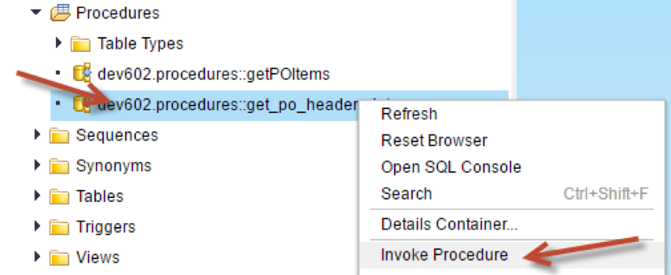
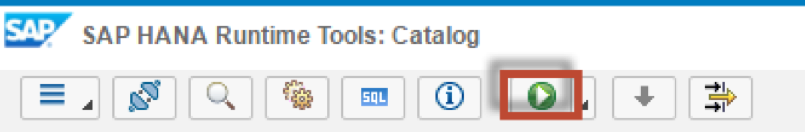

## Prerequisites  
 - **Proficiency:** Intermediate
 - **Tutorials:** [Parallel Processing and Parameters](http://go.sap.com/developer/tutorials/xsa-sqlscript-parallel.html)

## Next Steps
 - [Creating Scalar User Defined Functions](http://go.sap.com/developer/tutorials/xsa-sqlscript-scalar.html)

## Details
### You will learn  
In this exercise you will modify the code of procedure `get_po_header_data` again to use a single tabular output. Existing queries will be reused based on intermediate table variables.

### Time to Complete
**15 Min**.

---

1. Return to your procedure called `get_po_header_data`.

	
	
2. Delete the output parameters which you defined in the last section.

	

3. Define a new output parameter as shown

	

4. Rename `EX_PO_CREATE_CNT` to `PO_CREATE_CNT`. Also rename `EX_PO_CHANGE_CNT` to `PO_CHANGE_CNT`

	

5. Modify the two SELECT statements and add `AS EID` after the `EMPLOYEEID` field.

	

6. Next, add another SELECT statement after the 2 previous SELECT statements as shown. This statement uses the previously defined table variables.

	

7. The completed code should be very similar to this. If you do not wish to type this code, you can reference the solution web page at `http://<hostname>:51013/workshop/admin/ui/exerciseMaster/?workshop=dev602&sub=ex2_12`

	```	
	PROCEDURE "dev602.procedures::get_po_header_data" (
             OUT EX_TOP_3_EMP_PO_COMBINED_CNT TABLE(
                      LOGINNAME NVARCHAR(12), 
			CREATE_CNT INTEGER, 
			CHANGE_CNT INTEGER,
			COMBINED_CNT INTEGER )  )
   		LANGUAGE SQLSCRIPT
   		SQL SECURITY INVOKER
   			--DEFAULT SCHEMA <default_schema_name>
   		READS SQL DATA AS 
	BEGIN

	po_create_cnt =  SELECT COUNT(*) AS CREATE_CNT, "HISTORY.CREATEDBY.EMPLOYEEID"  AS EID
         FROM "dev602.data::PO.Header" WHERE PURCHASEORDERID IN (
           SELECT PURCHASEORDERID 
               FROM "dev602.data::PO.Item" 
             WHERE "PRODUCT.PRODUCTID" IS NOT NULL)
       GROUP BY  "HISTORY.CREATEDBY.EMPLOYEEID";
    
	po_change_cnt =  SELECT COUNT(*) AS CHANGE_CNT, "HISTORY.CHANGEDBY.EMPLOYEEID" AS EID
         FROM "dev602.data::PO.Header"  WHERE PURCHASEORDERID IN (
                SELECT PURCHASEORDERID 
                   FROM "dev602.data::PO.Item"
          WHERE "PRODUCT.PRODUCTID" IS NOT NULL)
     GROUP BY  "HISTORY.CHANGEDBY.EMPLOYEEID";

	EX_TOP_3_EMP_PO_COMBINED_CNT = 
          SELECT emp.LOGINNAME, crcnt.CREATE_CNT, chcnt.CHANGE_CNT,  crcnt.CREATE_CNT + 
			chcnt.CHANGE_CNT AS COMBINED_CNT
      		FROM "dev602.data::MD.Employees" as emp
      		LEFT OUTER JOIN :PO_CREATE_CNT AS crcnt
               ON emp.EMPLOYEEID = crcnt.EID
     		LEFT OUTER JOIN :PO_CHANGE_CNT AS chcnt
             ON emp.EMPLOYEEID = chcnt.EID
        	ORDER BY COMBINED_CNT DESC LIMIT 3;
	END
	```

8. Save the procedure

	

9. Use what you have learned already and perform a build on your `hdb` module. Then return to the HRTT page and invoke the procedure.

	

10. Click "Run".

	

11. The results are then shown.

	
	

## Next Steps
 - [Creating Scalar User Defined Functions](http://go.sap.com/developer/tutorials/xsa-sqlscript-scalar.html)
