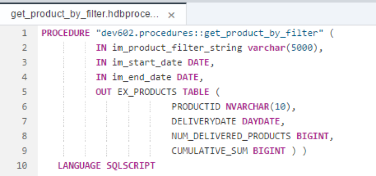
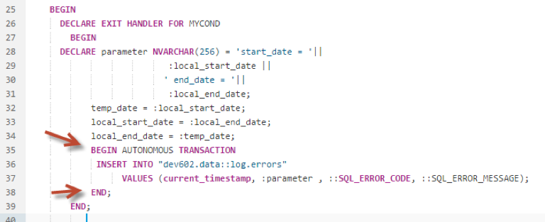
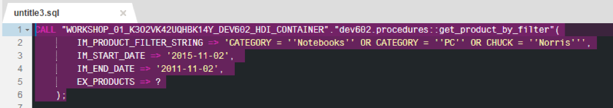
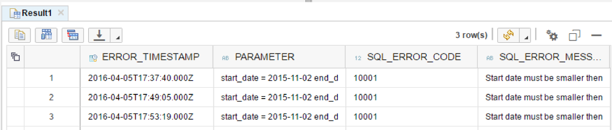
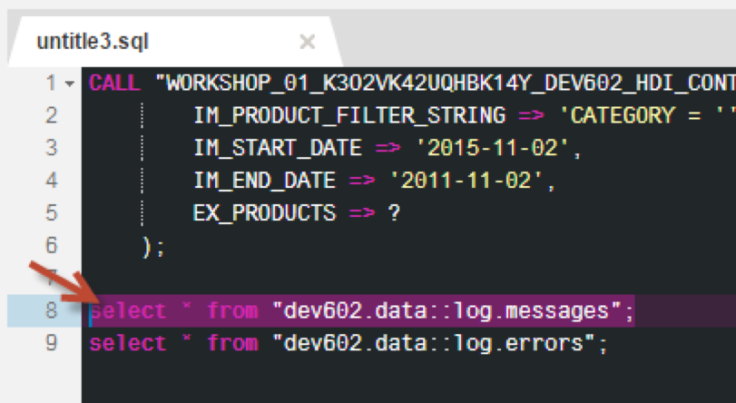
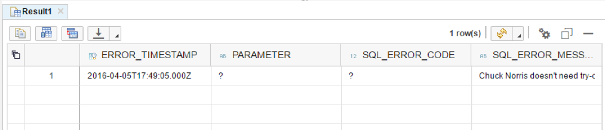

## Prerequisites  
- **Proficiency:** Intermediate
- **Tutorials:** [Using COMMIT Statement](http://www.sap.com/developer/tutorials/xsa-sqlscript-trans-commit.html)

## Next Steps
- [SAP HANA XS Advanced Creating an HDI Module](http://www.sap.com/developer/tutorials/xsa-hdi-module.html)

## Details
### You will learn  
The autonomous transaction is independent from the main procedure transaction. Changes made and committed by an autonomous transaction can be stored in persistency regardless of `commit/rollback` of the main transaction. The end of the autonomous transaction block has an implicit commit.

**Please note - This tutorial is based on SPS11**

### Time to Complete
**15 Min**.

---

[ACCORDION-BEGIN [Step 1: ](Edit previous procedure)]

Return to the procedure called `get_product_by_filter`.

Remove the COMMIT statement, and instead wrap the INSERT statement with an AUTONOMOUS TRANSACTION block as shown.

Click "Save".

  

[DONE]
[ACCORDION-END]

[ACCORDION-BEGIN [Step 2: ](Build and run `log.errors` SELECT)]

Use what you have learned already and perform a build on your `hdb` module. Then return to the HRTT page and make sure the input parameters are as shown and run the CALL statement again.

You will still get the error for invalid column.  Select the SELECT statement for the `log.errors` table and click "Run" to execute it.

[DONE]
[ACCORDION-END]

[ACCORDION-BEGIN [Step 3: ](Run `log.messages` SELECT)]

You will now notice that a new row was entered into the `log.errors` table

Select the SELECT statement for the `log.messages` table and click "Run" to execute it.

[DONE]
[ACCORDION-END]

[ACCORDION-BEGIN [Step 4: ](Examine results)]

Another "Chuck" record was not inserted.  "Chuck Norris's" record was removed by the rollback ("Is that even possible…?")  by using AUTONOMOUS TRANSACTION blocks, the code within is isolated from the rest of the mainline code and is treated as a separate transaction.

[DONE]
[ACCORDION-END]

## Next Steps
- [SAP HANA XS Advanced Creating an HDI Module](http://www.sap.com/developer/tutorials/xsa-hdi-module.html)
