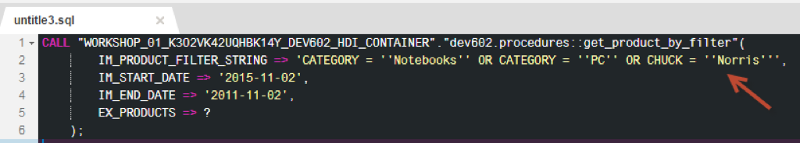
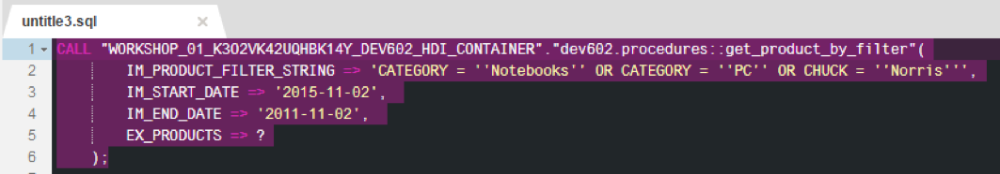
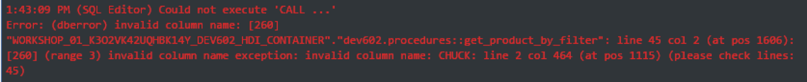
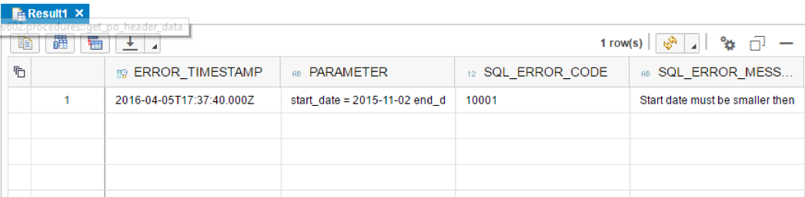
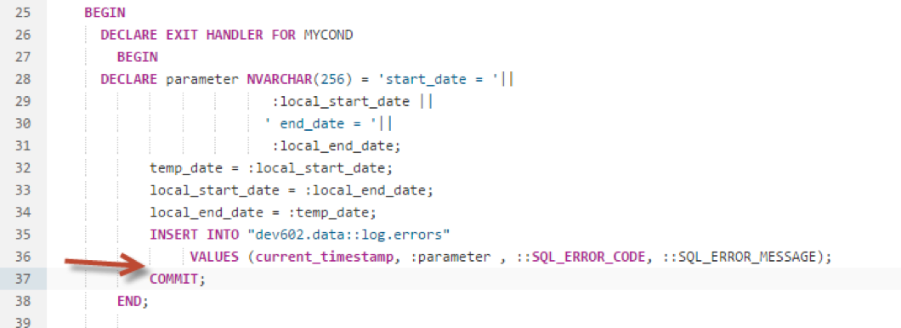
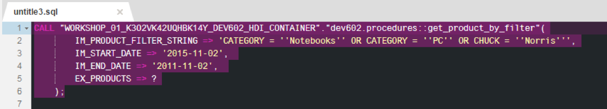
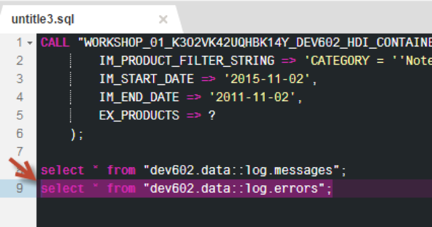
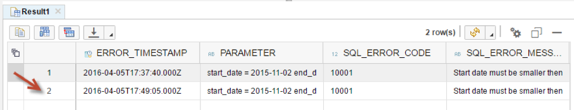
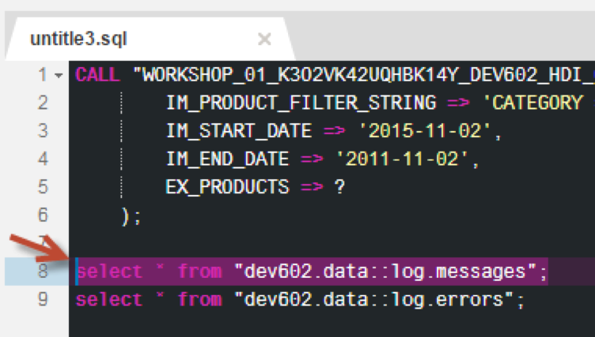
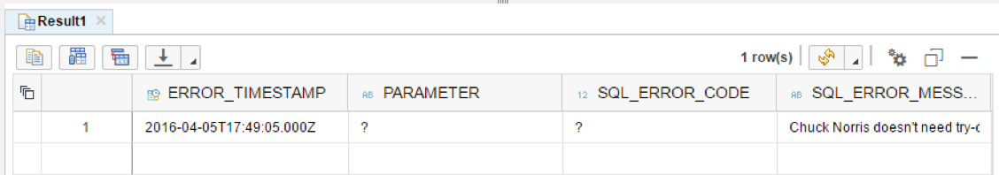

## Prerequisites  
 - **Proficiency:** Intermediate
 - **Tutorials:** [Using Exception Handling](http://go.sap.com/developer/tutorials/xsa-sqlscript-trans-exception.html)

## Next Steps
 - [Using Autonomous Transactions](http://go.sap.com/developer/tutorials/xsa-sqlscript-trans-autonomous.html)

## Details
### You will learn  
In this exercise will show the impact of a runtime error on DML statements and how to prevent it using COMMIT.

### Time to Complete
**15 Min**.

---

1. Return to the SQL tab and change the filter value for the first input parameter. Here you are adding a filter on a column which we know does not exists in hopes of causing an error and transaction rollback.

	

2. Select the entire CALL statement, and click "Run"

	

3. Of course we get the error "invalid column name".

	

4. Select the SELECT statement for `log.errors` again and click "Run" to check the table contents.  

	

5. You will notice that a new row was not inserted into the log table due to transaction rollback.

	

6. Return to the procedure called `get_product_by_filter`. To avoid the deletion of the log entry in case of transaction rollback, we will use an explicit COMMIT.

	

7. Insert a DML statement  for the sake of showing the behavior of COMMIT. Insert this INSERT statement with BEGIN and END blocks after the DECLARE statements as shown. 

	

8. After the INSERT statement with in the EXIT HANDLER, add a COMMIT statement.

	

9. Click "Save".

	

10. Use what you have learned already and perform a build on your `hdb` module. Then return to the HRTT page and make sure the input parameters are as shown and run the CALL statement again.

	

11. You will still get the error for invalid column. Select the SELECT statement for `log.errors` and click "Run" to execute it.

	

12. You will now notice that the new row has been inserted into the log table even though there was an error and a ROLLBACK was executed. 

	

13. Highlight the SELECT statement for `log.messages` and click "Run".   

	

14. As you can see not only was the new record inserted into the `log.errors` table, but also “Chuck Norris” found its way into our `log.messages` table. The complete transaction will be committed, meaning any modification happened in this transaction will be persisted. A better solution for this are the autonomous transaction.

	

## Next Steps
 - [Using Autonomous Transactions](http://go.sap.com/developer/tutorials/xsa-sqlscript-trans-autonomous.html)
