## Prerequisites  
- **Proficiency:** Intermediate
- **Tutorials:** [Using Index-based Cell Access](http://www.sap.com/developer/tutorials/xsa-sqlscript-usingindexbased.html)

## Next Steps
- [Using COMMIT Statement](http://www.sap.com/developer/tutorials/xsa-sqlscript-trans-commit.html)

## Details
### You will learn  
In this example we will exchange the dates of the scalar input parameters to prevent the error in case the start date is larger than the end date. To do so we will rely on exception handling.
**Please note - This tutorial is based on SPS11**

### Time to Complete
**15 Min**.

---


[ACCORDION-BEGIN [Step 1: ](Edit previous procedure)]

Return to the `get_product_by_filter` procedure in the procedure editor. Add two additional input parameters for start and end date as shown.

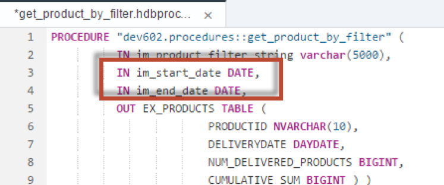

Add a WHERE clause to the third statement which filters the data by the start and end date input parameters.


[ACCORDION-END]

[ACCORDION-BEGIN [Step 2: ](Check complete code)]

The completed code should look very similar to this. If you do not wish to type this code, you can reference the solution web page at `http://<hostname>:51013/workshop/admin/ui/exerciseMaster/?workshop=dev602&sub=ex2_24`

```
PROCEDURE "dev602.procedures::get_product_by_filter" (
        IN im_product_filter_string varchar(5000),
        IN im_start_date DATE,
        IN im_end_date DATE,
        OUT EX_PRODUCTS TABLE (
                      PRODUCTID NVARCHAR(10),
                      DELIVERYDATE DAYDATE,
                      NUM_DELIVERED_PRODUCTS BIGINT,
                      CUMULATIVE_SUM BIGINT ) )
 LANGUAGE SQLSCRIPT
 SQL SECURITY INVOKER
 --DEFAULT SCHEMA <default_schema_name>
 READS SQL DATA  AS
BEGIN

	pre_filtered_products =
       SELECT * FROM "dev602.data::MD.Products" WHERE CATEGORY NOT IN ('Laser Printer');

	user_filtered_products = APPLY_FILTER(:pre_filtered_products, :im_product_filter_string ) ;

	filtered_items  =
      select pi."PRODUCT.PRODUCTID" as PRODUCTID, pi.DELIVERYDATE  		from :user_filtered_products as p
              inner join "dev602.data::PO.Item" as pi on p.productid = 		pi."PRODUCT.PRODUCTID"
     where pi.DELIVERYDATE >= :im_start_date
        AND pi.DELIVERYDATE <= :im_end_date;

aggregated_filtered_items =
  SELECT  PRODUCTID, DELIVERYDATE, COUNT(PRODUCTID) AS NUM_DELIVERED_PRODUCTS FROM :filtered_items
                  GROUP BY PRODUCTID ,DELIVERYDATE
                  ORDER BY PRODUCTID, DELIVERYDATE;

CALL "dev602.procedures::calculate_cumulative_sum_of_delivered_products"(
IM_PRODUCTS => :aggregated_filtered_items,
EX_PRODUCTS => :products );

 ex_products = select * from :PRODUCTS order by PRODUCTID, DELIVERYDATE;

END;
```


[ACCORDION-END]

[ACCORDION-BEGIN [Step 3: ](Save and build)]

Click **Save**.

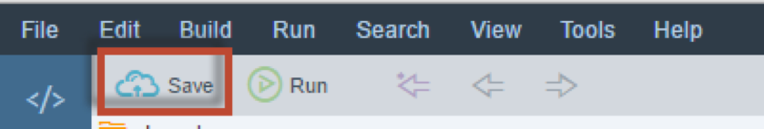

Use what you have learned already and perform a build on your `hdb` module.


[ACCORDION-END]

[ACCORDION-BEGIN [Step 4: ](Invoke the procedure)]

Then return to the HRTT page and invoke the procedure.

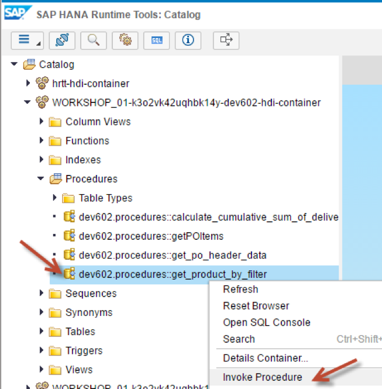


[ACCORDION-END]

[ACCORDION-BEGIN [Step 5: ](Enter input parameters)]

Enter the values for the input parameters as shown. Then run the procedure.


Results are shown.


[ACCORDION-END]

[ACCORDION-BEGIN [Step 6: ](Check for scalar input parameters)]

Return to the procedure called `get_product_by_filter`. We will include a check for the two scalar input parameters and throw an error in case the check fails. To do so please enter the following code after the BEGIN statement.

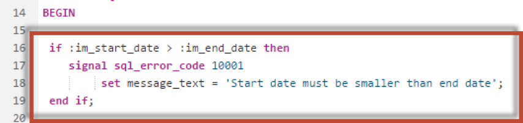


[ACCORDION-END]

[ACCORDION-BEGIN [Step 7: ](Save and build)]

Click **Save**.

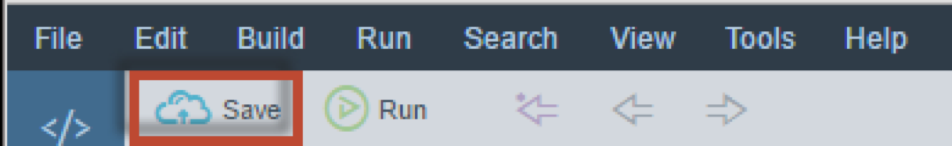

Use what you have learned already and perform a build on your `hdb` module.


[ACCORDION-END]

[ACCORDION-BEGIN [Step 8: ](Change input parameters)]

Return to the HRTT page and change the input parameters as shown and run the CALL statement again.

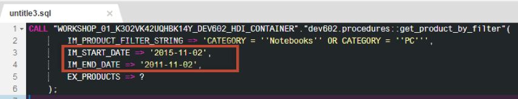

You should see an error message showing user defined error 10001. If you scroll to the right, you can see the message text as well.


[ACCORDION-END]

[ACCORDION-BEGIN [Step 9: ](Handle the exception)]


We do not want to stop the procedure execution by throwing a signal. Instead we will handle the exception, write the exception into a log table and continue with the procedure execution. As a prerequisite we need to create a table that we will use for logging. Therefore, go to the data folder and create a new file by right-clicking on the data folder and choosing **New**, then **CDS Artifact**.

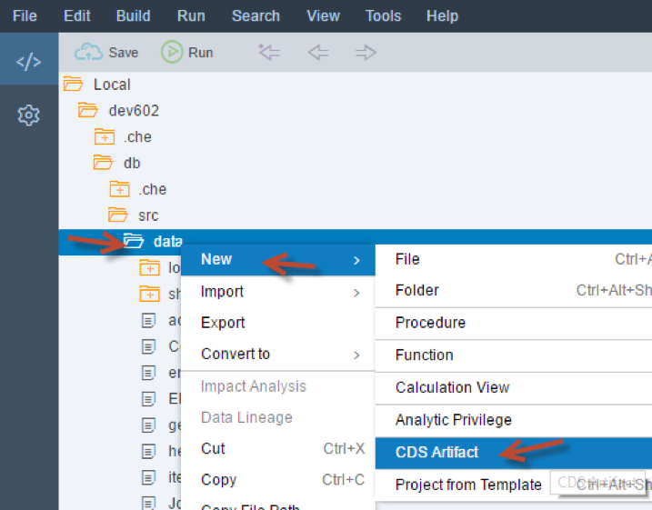


[ACCORDION-END]

[ACCORDION-BEGIN [Step 10: ](Create new file)]

13. Enter the name of the file as "log", select **Text** and click **Create**.


Enter the code into the editor as shown. Make sure to substitute your group number where appropriate. If you do not wish to type this code, you can reference the solution web page at `http://<hostname>:51013/workshop/admin/ui/exerciseMaster/?workshop=dev602&sub=ex2_25`

```
namespace dev602.data;

context log {

	entity errors {
  		ERROR_TIMESTAMP: UTCDateTime;
  	PARAMETER: String(256);
  	SQL_ERROR_CODE: Integer;
  	SQL_ERROR_MESSAGE: String(5000);
		};

	entity messages {
  		ERROR_TIMESTAMP: UTCDateTime;
  		PARAMETER: String(256);
  		SQL_ERROR_CODE: Integer;
  		SQL_ERROR_MESSAGE: String(5000);
		};

};
```

Click **Save**.

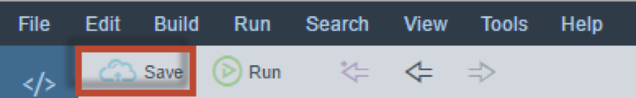


[ACCORDION-END]

[ACCORDION-BEGIN [Step 11: ](Remove READS SQL DATA)]

Switch back to the procedure called `get_product_by_filter`. Since we will have a DML statement in the procedure we cannot flag it read only. Please remove the "READS SQL DATA" statement.

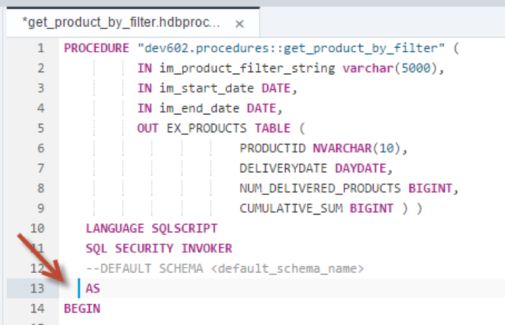


[ACCORDION-END]

[ACCORDION-BEGIN [Step 12: ](Remove IF statement statement)]

Remove the IF statement that you inserted a little earlier.

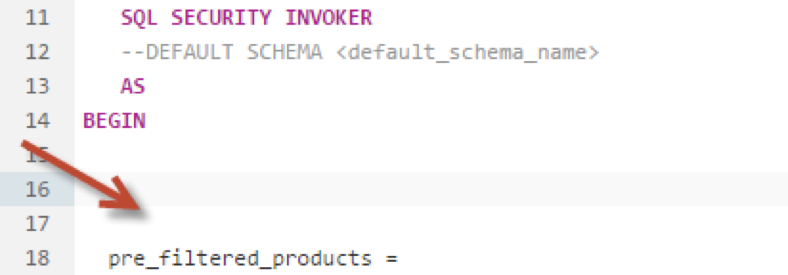


[ACCORDION-END]

[ACCORDION-BEGIN [Step 13: ](Insert DECLARE statements)]

Insert these DECLARE statements as shown.  Notice the last DECLARE statement is declaring a custom condition and assigning error code 10001 in the user defined number range.

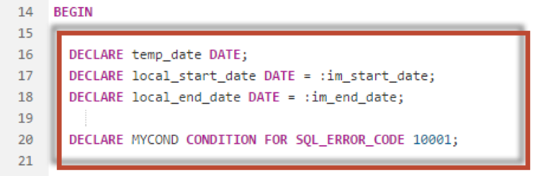


[ACCORDION-END]

[ACCORDION-BEGIN [Step 14: ](Create exit handler)]

 After the last DECLARE statement, insert the following code. This code is declaring a custom exit handler for your custom condition.  This exit handler will insert a new record in to the log table and will switch start date and end date accordingly, The surrounding block, marked by the `BEGIN/END` statements ensures that after the exception is caught, execution will continue after the block

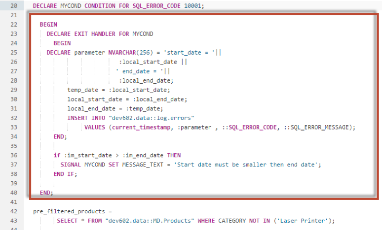


[ACCORDION-END]

[ACCORDION-BEGIN [Step 15: ](Change WHERE clause)]

Change the WHERE clause of SELECT statement for `filtered_items` as shown here. This ensures usage of the local declared date variables which contain the corrected values.

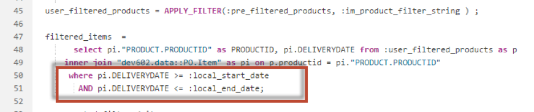


[ACCORDION-END]

[ACCORDION-BEGIN [Step 16: ](Check complete code)]

The completed code should look very similar to the following. If you do not wish to type this code, you can reference the solution web page at `http://<hostname>:51013/workshop/admin/ui/exerciseMaster/?workshop=dev602&sub=ex2_26`

```
PROCEDURE "dev602.procedures::get_product_by_filter" (
        IN im_product_filter_string varchar(5000),
        IN im_start_date DATE,
        IN im_end_date DATE,
        OUT EX_PRODUCTS TABLE (
                      PRODUCTID NVARCHAR(10),
                      DELIVERYDATE DAYDATE,
                      NUM_DELIVERED_PRODUCTS BIGINT,
                      CUMULATIVE_SUM BIGINT ) )
 	LANGUAGE SQLSCRIPT
 	SQL SECURITY INVOKER
 		--DEFAULT SCHEMA <default_schema_name>
 		AS
BEGIN

  DECLARE temp_date DATE;
	  DECLARE local_start_date DATE = :im_start_date;
	  DECLARE local_end_date DATE = :im_end_date;

	  DECLARE MYCOND CONDITION FOR SQL_ERROR_CODE 10001;

  	BEGIN
    	DECLARE EXIT HANDLER FOR MYCOND
      	BEGIN
      		DECLARE parameter NVARCHAR(256) = 'start_date = '||
                         :local_start_date ||
                        ' end_date = '||
                         :local_end_date;
          	temp_date = :local_start_date;
          	local_start_date = :local_end_date;
          	local_end_date = :temp_date;
          	INSERT INTO "dev602.data::log.errors"
               VALUES
               (current_timestamp, :parameter , ::SQL_ERROR_CODE, ::SQL_ERROR_MESSAGE);
      	END;

      	if :im_start_date > :im_end_date THEN
        		SIGNAL MYCOND SET MESSAGE_TEXT = 'Start date must be smaller then end date';
      	END IF;

  	END;

  pre_filtered_products =
       SELECT * FROM "dev602.data::MD.Products" WHERE CATEGORY NOT IN ('Laser Printer');

		user_filtered_products = APPLY_FILTER(:pre_filtered_products, :im_product_filter_string ) ;

	filtered_items  =
      select pi."PRODUCT.PRODUCTID" as PRODUCTID, pi.DELIVERYDATE 		from :user_filtered_products as p
    inner join "dev602.data::PO.Item" as pi on p.productid = pi."PRODUCT.PRODUCTID"
     where pi.DELIVERYDATE >= :local_start_date
       AND pi.DELIVERYDATE <= :local_end_date;

 	aggregated_filtered_items =
        SELECT  PRODUCTID, DELIVERYDATE,
                COUNT(PRODUCTID) AS NUM_DELIVERED_PRODUCTS FROM :filtered_items
                  GROUP BY PRODUCTID ,DELIVERYDATE
                  ORDER BY PRODUCTID, DELIVERYDATE;

	  CALL "dev602.procedures::calculate_cumulative_sum_of_delivered_products"(
	IM_PRODUCTS => :aggregated_filtered_items,
	EX_PRODUCTS => :products	);

   ex_products = select * from :PRODUCTS order by PRODUCTID, DELIVERYDATE;

END;
```


[ACCORDION-END]

[ACCORDION-BEGIN [Step 17: ](Save and build)]

Click **Save**.


Use what you have learned already and perform a build on your `hdb` module.


[ACCORDION-END]

[ACCORDION-BEGIN [Step 18: ](Run CALL statement again)]

Return to the HRTT page and make sure the input parameters are as shown and run the CALL statement again.

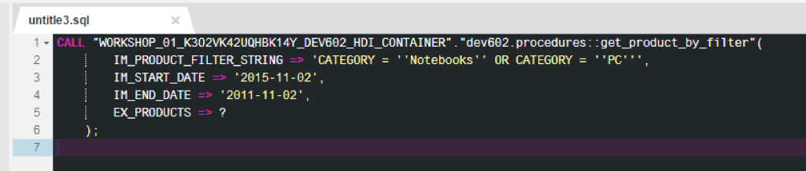

Notice the results of the procedure are returned.


[ACCORDION-END]

[ACCORDION-BEGIN [Step 19: ](Create and run SELECT statements)]

In the SQL tab, enter SELECT statements against your `log.errors` and `log.messages` table as shown.

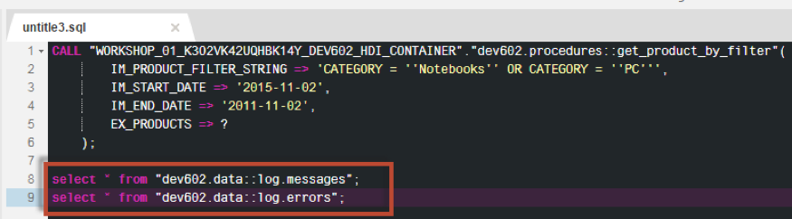

Highlight the SELECT statement for `log.errors`, and click **Run**.

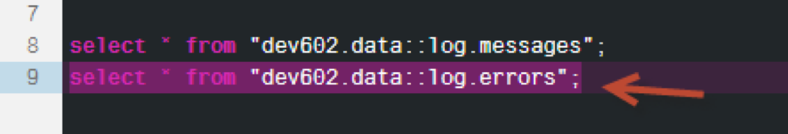

You should see an error message in your table. This means that the exception was caught by the handler, and execution was allowed to continue since you saw the results of the procedure call.

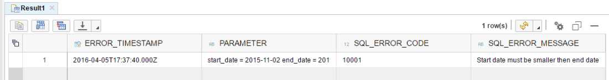


[ACCORDION-END]


## Next Steps
- [Using COMMIT Statement](http://www.sap.com/developer/tutorials/xsa-sqlscript-trans-commit.html)
