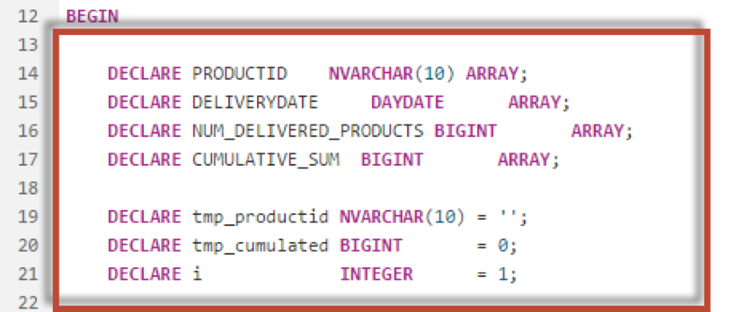
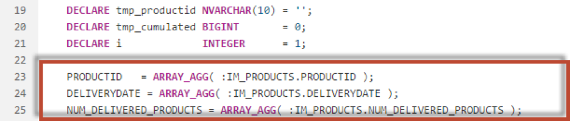
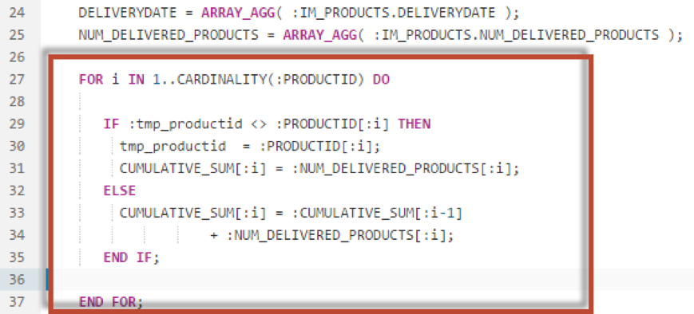
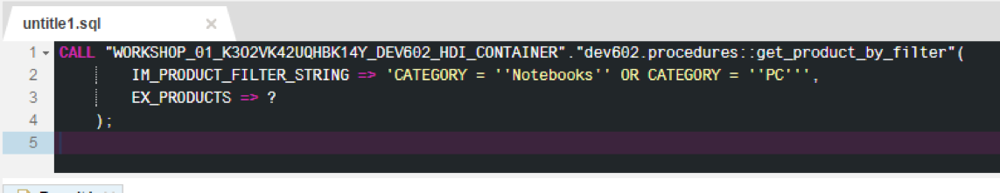
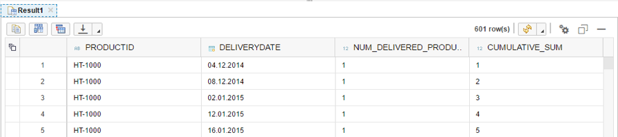

## Prerequisites  
 - **Proficiency:** Intermediate
 - **Tutorials:** [Using Cursors](http://www.sap.com/developer/tutorials/xsa-sqlscript-usingarrays.html)

## Next Steps
 - [Using Index-based Cell Access](http://www.sap.com/developer/tutorials/xsa-sqlscript-usingindexbased.html)

## Details
### You will learn  
This solution shows how to use Arrays data iteration as well as the result creation.
**Please note - This tutorial is based on SPS11**

### Time to Complete
**XX Min**.

---

1. Returned to the procedure called `calculate_cumulative_sum_of_delivered_products`.

	

2. Delete all of the logic in the body of the procedure

	

3. Enter the following DECLARE statements. Notice here you are declaring 4 arrays.

	

4. Next, use the `ARRAY_AGG` statement to extract a column of the table into an array

	

5. Use a FOR loop to perform the calculation and insert the value into the array

	

6. Finally, use the UNNEST statement to render the arrays into the output table parameter.

	

7. The completed code should look like the following. If you do not wish to type this code, you can reference the solution web page at `http://<hostname>:51013/workshop/admin/ui/exerciseMaster/?workshop=dev602&sub=ex2_22`

	```
	PROCEDURE "dev602.procedures::calculate_cumulative_sum_of_delivered_products" (
    IN IM_PRODUCTS TABLE ( PRODUCTID NVARCHAR(10),  
                           DELIVERYDATE DAYDATE,
                          NUM_DELIVERED_PRODUCTS BIGINT ),
    OUT EX_PRODUCTS TABLE ( PRODUCTID NVARCHAR(10),
                            DELIVERYDATE DAYDATE,
                            NUM_DELIVERED_PRODUCTS BIGINT,
                          CUMULATIVE_SUM BIGINT )  )
   LANGUAGE SQLSCRIPT
   SQL SECURITY INVOKER
   READS SQL DATA AS
	BEGIN

    DECLARE PRODUCTID    NVARCHAR(10) ARRAY;
    DECLARE DELIVERYDATE     DAYDATE      ARRAY;
    DECLARE NUM_DELIVERED_PRODUCTS BIGINT       ARRAY;
    DECLARE CUMULATIVE_SUM  BIGINT       ARRAY;


    DECLARE tmp_cumulated BIGINT       = 0;
    DECLARE i             INTEGER      = 1;

    PRODUCTID   = ARRAY_AGG( :IM_PRODUCTS.PRODUCTID );
    DELIVERYDATE = ARRAY_AGG( :IM_PRODUCTS.DELIVERYDATE );
    NUM_DELIVERED_PRODUCTS = ARRAY_AGG( :IM_PRODUCTS.NUM_DELIVERED_PRODUCTS );

    FOR i IN 1..CARDINALITY(:PRODUCTID) DO

       IF :tmp_productid <> :PRODUCTID[:i] THEN
         tmp_productid  = :PRODUCTID[:i];
         CUMULATIVE_SUM[:i] = :NUM_DELIVERED_PRODUCTS[:i];
       ELSE
         CUMULATIVE_SUM[:i] = :CUMULATIVE_SUM[:i-1]
                    + :NUM_DELIVERED_PRODUCTS[:i];
       END IF;

    END FOR;

    ex_products = UNNEST( :PRODUCTID, :DELIVERYDATE, :NUM_DELIVERED_PRODUCTS, :CUMULATIVE_SUM)
                 AS ( PRODUCTID, DELIVERYDATE, NUM_DELIVERED_PRODUCTS, CUMULATIVE_SUM );

	END
	```

8. Click "Save".

	

9. Use what you have learned already and perform a build on your `hdb` module. Then return to the HRTT page and run the call statement again.

	

10. Check the results.

	

11. Notice the execution time is a little bit less than when doing the calculation using SQL, and a lot less than when doing the calculation using cursors.

	


## Next Steps
 - [Using Index-based Cell Access](http://www.sap.com/developer/tutorials/xsa-sqlscript-usingindexbased.html)
