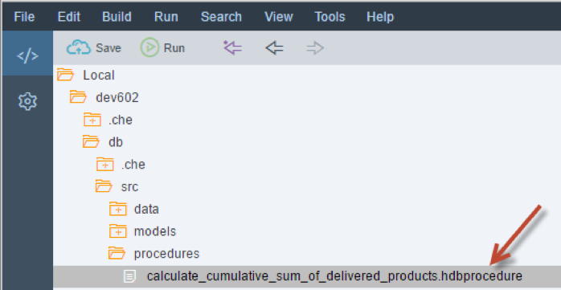
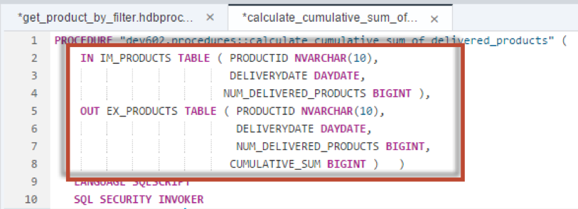
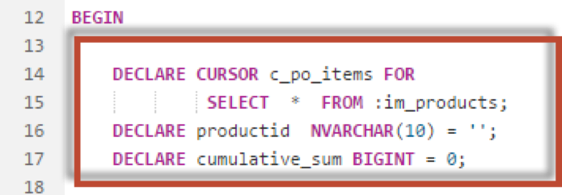
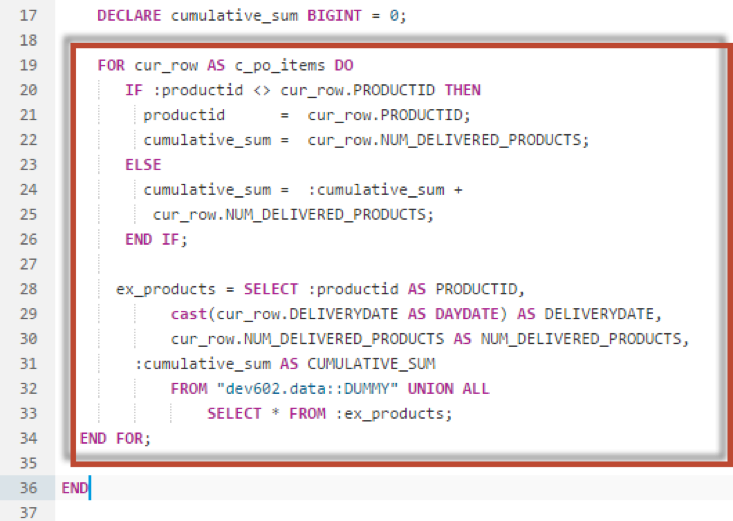
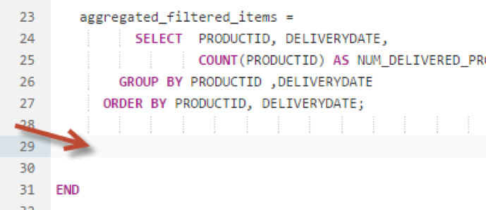
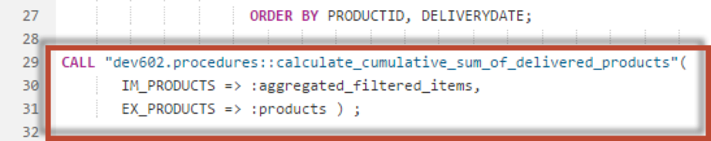
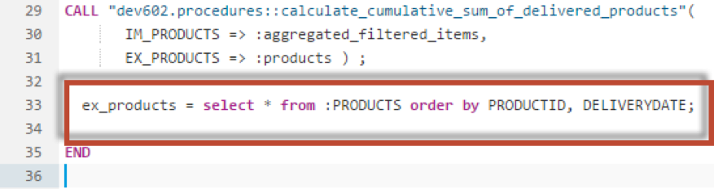
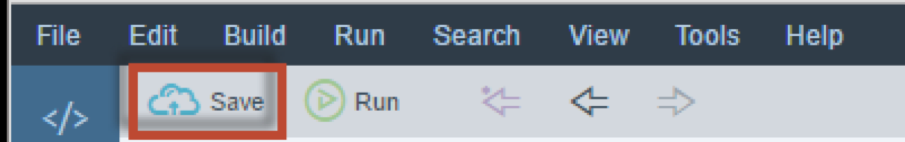
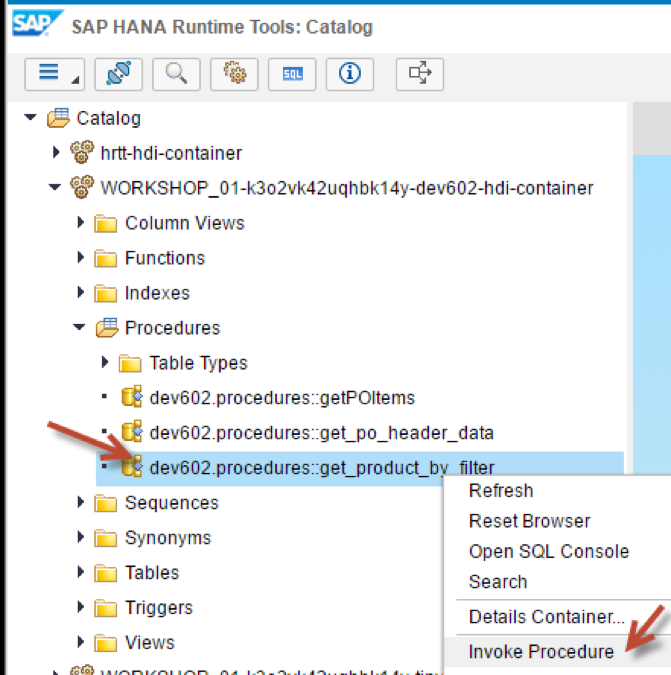
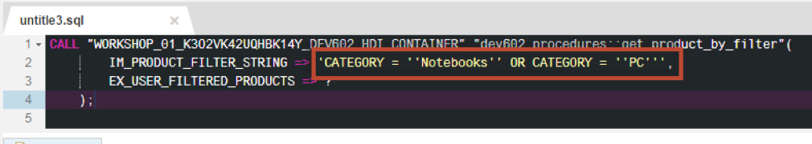

## Prerequisites  
- **Proficiency:** Intermediate
- **Tutorials:** [SQL vs Cursors vs Arrays vs Index-based Cell Access](http://www.sap.com/developer/tutorials/xsa-sqlscript-sql-cursor.html)

## Next Steps
- [Using Arrays](http://www.sap.com/developer/tutorials/xsa-sqlscript-usingarrays.html)

## Details
### You will learn  
This solution leverages a cursor for looping over the rows and calculating the sum and using UNION ALL for building the result set to solve the exercise. It is the slowest running solution out of the three shown possibilities.
**Please note - This tutorial is based on SPS11**

### Time to Complete
**15 Min**.

---


[ACCORDION-BEGIN [Step 1: ](Create new procedure)]

Use what you have learned and create another procedure called  `calculate_cumulative_sum_of_delivered_products` in the procedures folder.



Be sure to change the namespace from `Undefined` to `dev602.procedures`. Enter the input and output parameters as shown



[DONE]
[ACCORDION-END]

[ACCORDION-BEGIN [Step 2: ](Add DECLARE statements)]

Enter the following DECLARE statements



[DONE]
[ACCORDION-END]

[ACCORDION-BEGIN [Step 3: ](Add a loop)]

Enter a FOR loop which will iterate over the input parameter table and perform the calculation and finally update the output table parameter.



[DONE]
[ACCORDION-END]

[ACCORDION-BEGIN [Step 4: ](Check code and save)]

The completed code should look very similar to the following. If you do not wish to type this code, you can reference the solution web page at `http://<hostname>:51013/workshop/admin/ui/exerciseMaster/?workshop=dev602&sub=ex2_20`

```
PROCEDURE "dev602.procedures::calculate_cumulative_sum_of_delivered_products" (
  IN IM_PRODUCTS TABLE ( PRODUCTID NVARCHAR(10),  
                         DELIVERYDATE DAYDATE,
                        NUM_DELIVERED_PRODUCTS BIGINT ),
  OUT EX_PRODUCTS TABLE ( PRODUCTID NVARCHAR(10),
                          DELIVERYDATE DAYDATE,
                          NUM_DELIVERED_PRODUCTS BIGINT,
                         CUMULATIVE_SUM BIGINT )   )
 LANGUAGE SQLSCRIPT
 SQL SECURITY INVOKER
 READS SQL DATA AS
BEGIN

  DECLARE CURSOR c_po_items FOR
           SELECT  *  FROM :im_products;
  DECLARE productid  NVARCHAR(10) = '';
  DECLARE cumulative_sum BIGINT = 0;

  ex_products = SELECT
      CAST ( '' AS NVARCHAR(10) )  AS PRODUCTID ,
       CAST ( '' AS DAYDATE )   AS DELIVERYDATE,
       CAST ( 0 AS BIGINT )   AS NUM_DELIVERED_PRODUCTS,
      CAST ( 0 AS BIGINT )  AS CUMULATIVE_SUM
             FROM DUMMY where 1 <> 1;

  FOR cur_row AS c_po_items DO
     IF :productid <> cur_row.PRODUCTID THEN
       productid      =  cur_row.PRODUCTID;
       cumulative_sum =  cur_row.NUM_DELIVERED_PRODUCTS;
     ELSE
       cumulative_sum =  :cumulative_sum +
        cur_row.NUM_DELIVERED_PRODUCTS;
     END IF;

    ex_products = SELECT :productid AS PRODUCTID,
          cast(cur_row.DELIVERYDATE AS DAYDATE) AS DELIVERYDATE,  cur_row.NUM_DELIVERED_PRODUCTS AS NUM_DELIVERED_PRODUCTS,
      :cumulative_sum AS CUMULATIVE_SUM
          FROM "dev602.data::DUMMY" UNION ALL
              SELECT * FROM :ex_products;
	END FOR;

END
```


Click **Save**.  


[DONE]
[ACCORDION-END]

[ACCORDION-BEGIN [Step 5: ](Remove last SELECT)]

Return to the procedure called `get_product_by_filter` and remove the last SELECT statement.



[DONE]
[ACCORDION-END]

[ACCORDION-BEGIN [Step 6: ](Call the procedure)]

Insert a call to the procedure called `calculate_cumulative_sum_of_delivered_products` and pass the `aggregated_filtered_items` as the input parameter and set products as the output parameter as shown



[DONE]
[ACCORDION-END]

[ACCORDION-BEGIN [Step 7: ](Add SELECT statement)]

Finally, add a SELECT statement at the end to assign the sorted results to the output parameter.



[DONE]
[ACCORDION-END]

[ACCORDION-BEGIN [Step 8: ](Check complete code)]

The completed code should look very similar to this following. If you do not wish to type this code, you can reference the solution web page at `http://<hostname>:51013/workshop/admin/ui/exerciseMaster/?workshop=dev602&sub=ex2_21`

```
PROCEDURE "dev602.procedures::get_product_by_filter" (
        IN im_product_filter_string varchar(5000),
        OUT EX_PRODUCTS TABLE (  PRODUCTID NVARCHAR(10),
                                 DELIVERYDATE DAYDATE,
                       NUM_DELIVERED_PRODUCTS BIGINT,
             CUMULATIVE_SUM BIGINT ) )
 LANGUAGE SQLSCRIPT
 SQL SECURITY INVOKER
 --DEFAULT SCHEMA <default_schema_name>
 READS SQL DATA  AS
BEGIN

	pre_filtered_products =
       SELECT * FROM "dev602.data::MD.Products" WHERE CATEGORY NOT IN ('Laser Printer');

	user_filtered_products = APPLY_FILTER(:pre_filtered_products, :im_product_filter_string ) ;

	filtered_items  =
      select pi."PRODUCT.PRODUCTID" as PRODUCTID, pi.DELIVERYDATE 	from :user_filtered_products as p
    inner join "dev602.data::PO.Item" as pi on p.productid = pi."PRODUCT.PRODUCTID" ;

 	aggregated_filtered_items =
        SELECT  PRODUCTID, DELIVERYDATE,
     COUNT(PRODUCTID) AS NUM_DELIVERED_PRODUCTS
             FROM :filtered_items
                 GROUP BY PRODUCTID ,DELIVERYDATE
                    ORDER BY PRODUCTID, DELIVERYDATE;

CALL "dev602.procedures::calculate_cumulative_sum_of_delivered_products"(
     IM_PRODUCTS => :aggregated_filtered_items,
     EX_PRODUCTS => :products ) ;

  ex_products = select * from :PRODUCTS order by PRODUCTID, DELIVERYDATE;

END
```

[DONE]
[ACCORDION-END]

[ACCORDION-BEGIN [Step 9: ](Save and build)]

Click **Save**.



Use what you have learned already and perform a build on your `hdb` module.

[DONE]
[ACCORDION-END]

[ACCORDION-BEGIN [Step 10: ](Invoke the procedure)]

Return to the HRTT page and invoke the procedure.



Make sure to pass the filter string. Note: This procedure call will take a few seconds, just wait for it to return results.

```
'CATEGORY = ''Notebooks'' OR CATEGORY = ''PC'''
```



[DONE]
[ACCORDION-END]

[ACCORDION-BEGIN [Step 11: ](View the results)]

Eventually, the results will be shown.  


You will notice that using cursors takes quite a bit of time.


[DONE]
[ACCORDION-END]


## Next Steps
- [Using Arrays](http://www.sap.com/developer/tutorials/xsa-sqlscript-usingarrays.html)
