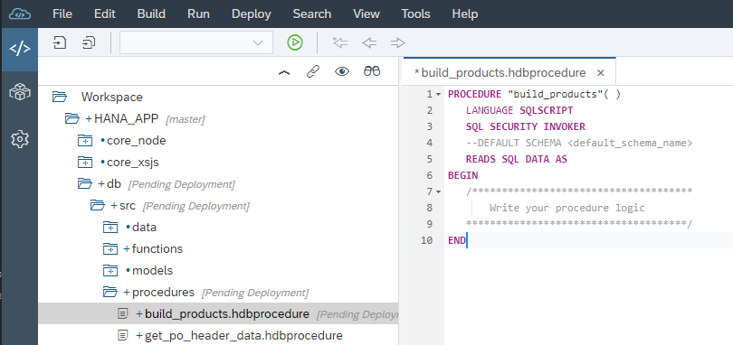
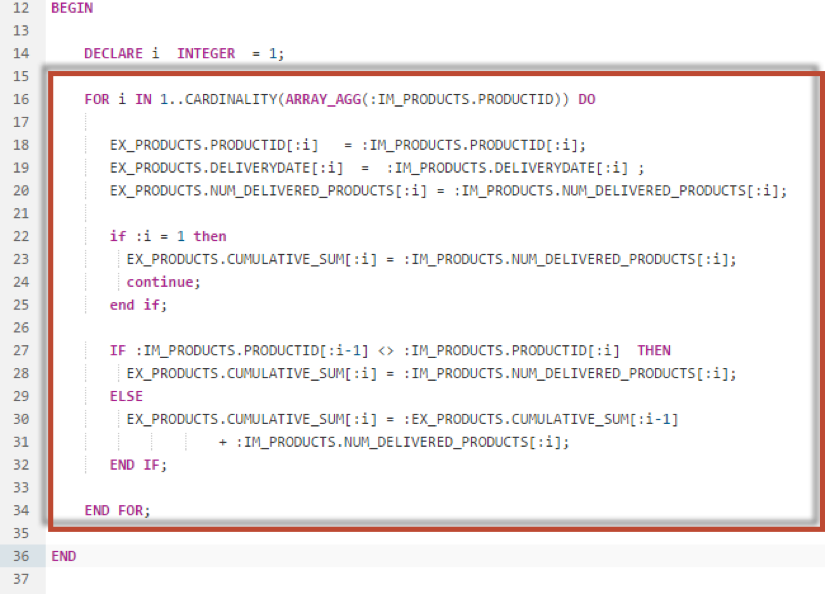
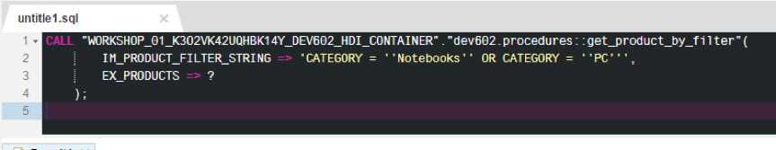
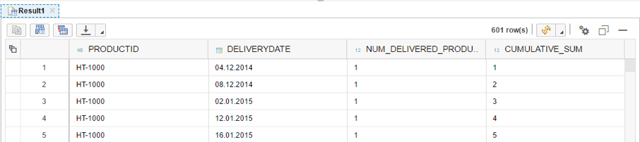

## Prerequisites  
 - This tutorial is designed for SAP HANA on premise and SAP HANA, express edition. It is not designed for SAP HANA Cloud.

## Details
### You will learn  
- How to use index-based cell access to manipulate table data.

Using index-based cell access to manipulate table data is faster than using cursors or arrays.

---

[ACCORDION-BEGIN [Step 1: ](Create a New Procedure)]

Use what you have learned and create a new procedure called `build_products` in the procedure folder.



Define an output parameters as show here.


[DONE]

[ACCORDION-END]

[ACCORDION-BEGIN [Step 2: ](Insert Into Table)]

Using index based cell access, insert rows into an intermediate table variable as shown here.



[DONE]
[ACCORDION-END]


[ACCORDION-BEGIN [Step 3: ](Check Complete Code)]

The completed code should look like the following.
```
PROCEDURE "build_products" (
	        out ex_products table (PRODUCTID nvarchar(10),
                               CATEGORY nvarchar(20),
                               PRICE decimal(15,2) ) )
   LANGUAGE SQLSCRIPT
   SQL SECURITY INVOKER
   READS SQL DATA AS
BEGIN

 declare lt_products table like :ex_products;

 lt_products = select PRODUCTID, CATEGORY, PRICE from "MD.Products";

 lt_products.productid[1] = 'ProductA';
 lt_products.category[1] = 'Software';
 lt_products.price[1] = '1999.99';

 lt_products.productid[2] = 'ProductB';
 lt_products.category[2] = 'Software';
 lt_products.price[2] = '2999.99';

 lt_products.productid[3] = 'ProductC';
 lt_products.category[3] = 'Software';
 lt_products.price[3] = '3999.99';

 ex_products = select * from :lt_products;

END
```

[DONE]
[ACCORDION-END]


[ACCORDION-BEGIN [Step 4: ](Save and Build)]

Click **Save**.  Use what you have learned already and perform a build on your `hdb` module.


[DONE]
[ACCORDION-END]


[ACCORDION-BEGIN [Step 5: ](Run Call Statement Again)]

Return to the Database Explorer page and generate and run the CALL statement.



[DONE]
[ACCORDION-END]


[ACCORDION-BEGIN [Step 6: ](Check the Results)]

Check the results.



[DONE]
[ACCORDION-END]
