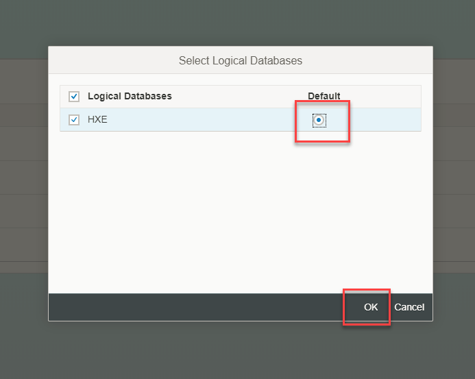

## Prerequisites  
 - You have created a tenant database as explained on [this guide](https://www.sap.com/developer/tutorials/hxe-ua-dbfundamentals-tenantdb.html).
 - You have a space to assign the tenant database to or created one as explained on [this tutorial](https://www.sap.com/developer/tutorials/xsa-setup-new-space.html).
 - You have the proper administration rights.

## Details
### You will learn  
  - How to assign a tenant database to a space using the SAP HANA Service Broker in the Administration Cockpit

---

[ACCORDION-BEGIN [Step 1: ](Log in to the XS Advanced Administration)]

If you are using SAP HANA, express edition, go into `https://hxehost:51036` or `https://hxehost:39030` to access the `xsa-cockpit` app.

Click on the button to open and log in to the XSA Cockpit

>If you are not using SAP HANA, express edition, or you have changed the ports, you can find out the right URL using command `xs apps` on the Command Line Interface and look for the URL for application `xsa-cockpit`. You can access the CLI directly from an SSH console on the server or download it using the Download Manager. You can get the Download Manager after registering at the [Download site](https://www.sap.com/developer/topics/sap-hana-express.html)

&nbsp;

You need a user with administration rights, such as `XSA_ADMIN`. Log in to the Administration tool with it

[DONE]

[ACCORDION-END]

[ACCORDION-BEGIN [Step 2: ](Enable the tenant DB)]

Click on **Enable**

You will be prompted for the credentials to the tenant database

After a couple of seconds you will see the database is enabled

[DONE]

[ACCORDION-END]

[ACCORDION-BEGIN [Step 3: ](Assign the tenant to the space)]

Click **Map**

Select the space you want to map to the tenant database and click on **Map**

Select the tenant database as `default` and click **OK**

You can now use the space mapped to a tenant database in your Multi Target Applications.

[DONE]
[ACCORDION-END]
