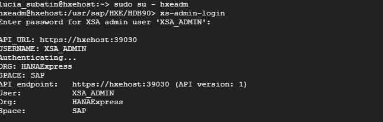
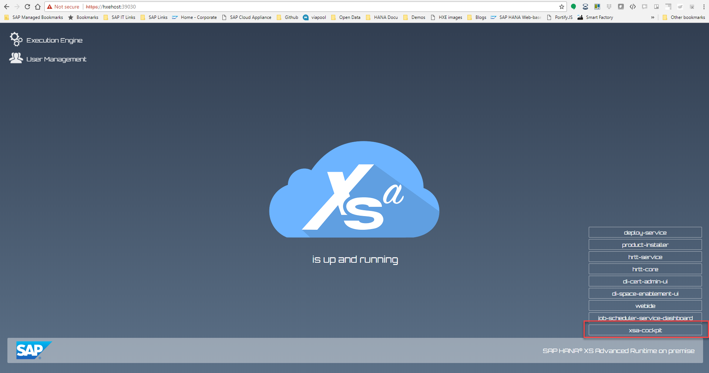
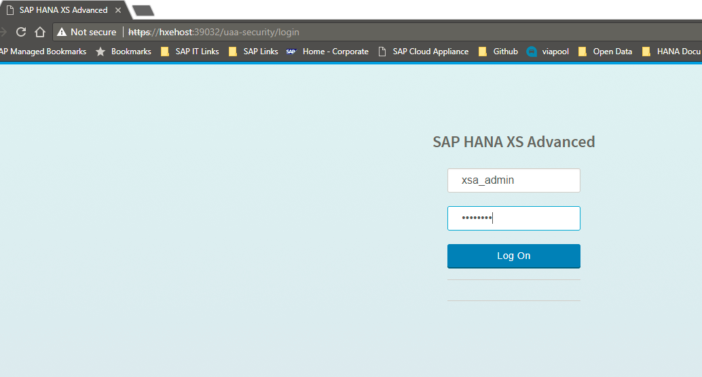
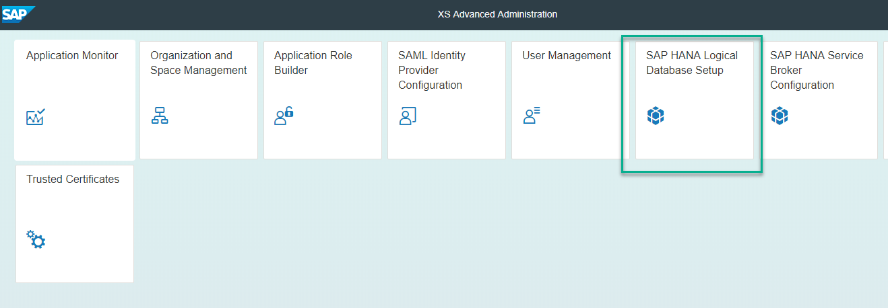
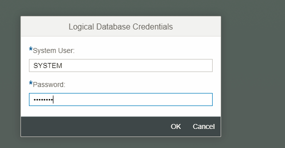
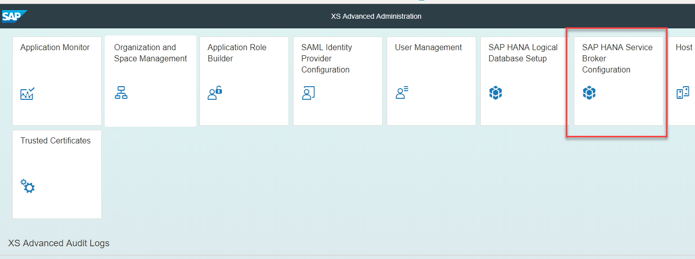
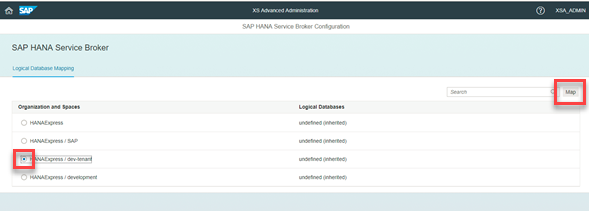

## Prerequisites  

 - **Proficiency:** Beginner
 - You have access to SAP HANA on premise or SAP HANA Express -- This tutorial will not work with HANA Cloud
 - SAP HANA, express edition already comes with a tenant database called `HXE`. If you are using **a different deployment**, you can create a tenant database following [this guide](hxe-ua-dbfundamentals-tenantdb)
 - SAP HANA, express edition already comes with a development space. If you want to create a separate one or are using another deployment, you can create a space as explained on [this tutorial](xsa-setup-new-space).
 - You have the proper administration rights

## Details
### You will learn  
This tutorial will show you how to assign a tenant database to a space using the SAP HANA Service Broker in the Administration Cockpit.

> **Note:** SAP HANA, express edition, comes with a default first tenant called `HXE` and an XS Advanced space called `development`.
> If you are already using the development space, make sure you re-create the database services to point at the tenant database.

---

[ACCORDION-BEGIN [Step 1: ](Option 1: Using the command line)]

Log in to the XS Advanced CLI as `XSA_ADMIN`. Use command `xs-admin-login` from the prompt in the virtual machine as `hxeadm`



> **Note**: If you are not using the command line from the operating system in the virtual machine, use command `xs login -a <https://hxehost:39030> --skip-ssl-validation` or adapt it to your deployment.


Use the following commands to map the `HXE` tenant to the `development` space in the organization `HANAexpress`. Replace the values with the appropriate ones if you are using a different deployment

```text
xs enable-tenant-database HXE

```
Once you get confirmation of the mapping, use the following command to complete the mapping:

```text
xs map-tenant-database -o HANAExpress -s development HXE
```

> **Note**: Unless you have changed them, the passwords for the user SYSTEM in both SYSTEMDB and the tenant are the master password you set during setup.

###Mark the rest of the steps as done and complete the validation in step 5.

[DONE]

[ACCORDION-END]


[ACCORDION-BEGIN [Step 2: ](Option 2: Log in to the XS Advanced Administration)]

**Do NOT perform these steps if you performed option 1**.

If you are using SAP HANA, express edition, go into `https://hxehost:51036` or `https://hxehost:39030` to access the `xsa-cockpit` app.



Click on the button to open and log in to the XSA Cockpit



>If you are not using SAP HANA, express edition, or you have changed the ports, you can find out the right URL using command `xs apps` on the Command Line Interface and look for the URL for application `xsa-cockpit`. You can access the CLI directly from an SSH console on the server or download it using the Download Manager. You can get the Download Manager after registering at the [Download site](https://developers.sap.com/topics/hana.html)

&nbsp;

You need a user with administration rights, such as `XSA_ADMIN`. Log in to the Administration tool with it

[DONE]

[ACCORDION-END]

[ACCORDION-BEGIN [Step 3: ](Enable the tenant DB)]

Click on **Enable**



You will be prompted for the credentials to the tenant database



**Wait** until you will see the database is enabled. **Do not refresh or navigate away from this site. You will see a success message**


[DONE]

[ACCORDION-END]


[ACCORDION-BEGIN [Step 4: ](Assign the tenant to the space)]

Click **Map**



Select the space you want to map to the tenant database and click on **Map**



**Wait** until you get a response that the database has been mapped.

You can now use the space mapped to a tenant database in your Multi Target Applications.

[DONE]
[ACCORDION-END]

[ACCORDION-BEGIN [Step 5: ](Validation)]

What do you see under `Mapped spaces` for the tenant you have just mapped in the XS Advanced Cockpit (default, `https://hxehost:51036/cockpit#/xsa/logicalDatabases` )

[VALIDATE_1]
[ACCORDION-END]
