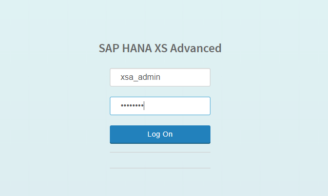
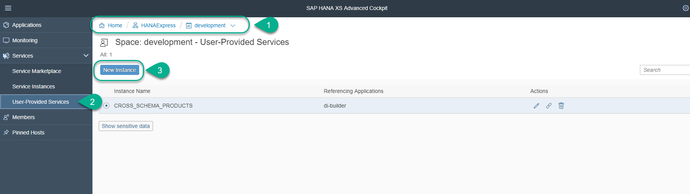
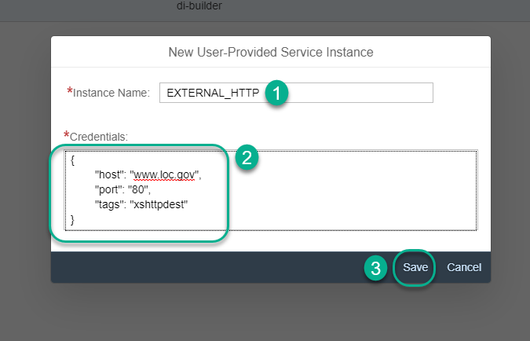
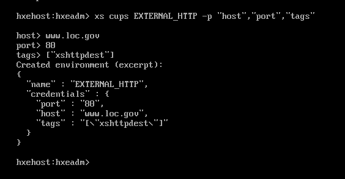
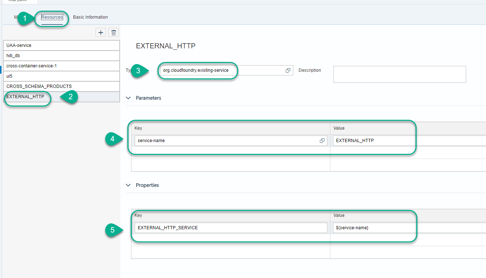
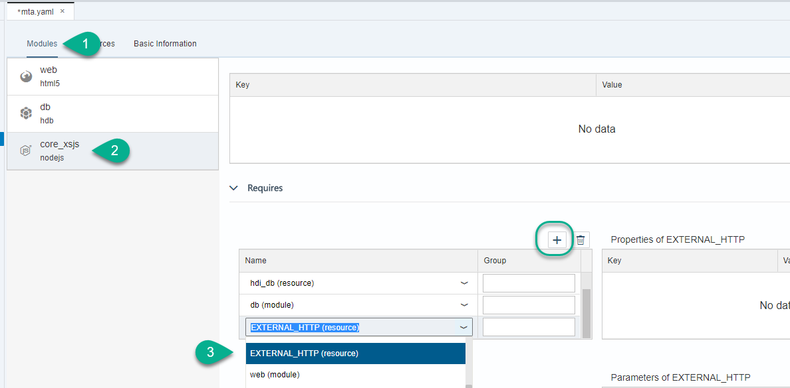
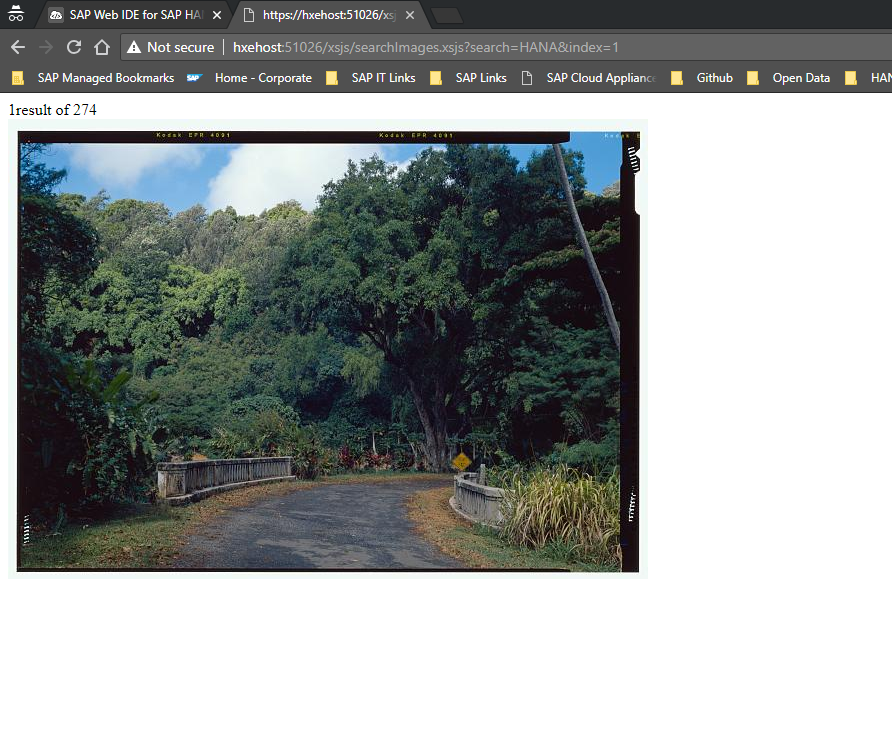

## Prerequisites  
 - This tutorial is designed for SAP HANA on premise and SAP HANA, express edition. It is not designed for SAP HANA Cloud.
 
## Details
### You will learn  
How to create a user-provided service to perform and outbound HTTP request to an external system in an XSJS service. This tutorial assumes you have completed the [basic end-to-end group](https://developers.sap.com/group.hana-xsa-get-started.html), as it requires an [existing database module](xsa-hdi-module) and [Node.js module](xsa-xsjs-xsodata) with XSJS support.


---

[ACCORDION-BEGIN [Step 1: ](Create a user-provided service)]

If you are using SAP HANA, express edition 2.0 SPS03 or higher, you can do this from the XS Advanced Cockpit. If you are using a lower version or do not have access to the XS Advanced Cockpit, scroll down.

Alternate between incognito and normal mode in your browser or use a different browser to open a new window and log in with `XSA_ADMIN`. In SAP HANA, express edition the default URL for the XS Advanced Cockpit is `https://hxehost:51036`.

> You can use the XS CLI and commands `xs a | grep xsa-cockpit` to see the status and URL for the XS Advanced cockpit



Navigate into the `HANAExpress` organization (or the organization where your development space is) and into the User Provided services in the development space. Click **New Instance**.



Call the service `EXTERNAL_HTTP` and replace the `JSON` definition with the following set

```JSON
{
	"host": "www.loc.gov",
	"port": "80",
	"tags": ["xshttpdest"]
}

```

Click **Save**




If you do not have access to the XS Advanced cockpit, you can use the following command from the XS CLI.

> Make sure you are in the same space as in the application in SAP Web IDE for SAP HANA. You can use command `xs target -s development` to switch to the development space.

```
xs cups EXTERNAL_HTTP -p  "host","port","tags"
```

You will be prompted for the values. Use the same as in the `JSON` definition above.




[DONE]

[ACCORDION-END]

[ACCORDION-BEGIN [Step 2: ](Add the dependency to the Node.js module)]

Back in SAP Web IDE for SAP HANA, open the `MTA.yaml` editor in graphical mode. Add a new resource in the `Resources` tab.

Call the resource `EXTERNAL_HTTP` and set the type to
```txt
org.cloudfoundry.existing-service
```

Under `Parameters`, add the following key value pair:

```txt
service-name  : EXTERNAL_HTTP
```

Under `Properties`, set the following key value pair:

```txt
EXTERNAL_HTTP_SERVICE  : ${service-name}
```



**Save** the `MTA.yaml` file.

Go into the `Modules` tab. Add the `EXTERNAL_HTTP` service as a dependency to the Node.js module



[DONE]

[ACCORDION-END]


[ACCORDION-BEGIN [Step 3: ](Create an HTTP destination)]

Within the Node.js module with `XSJS` compatibility, within the `lib` folder, create a file called `EXTERNAL_HTTP.xshttpdest`.

Paste the following code in it:

```json
description = "Library of Congress Images";
host = "www.loc.gov";
port = 80;
proxyType = none;
proxyHost = "proxy";
proxyPort = 8080;
authType = none;
timeout = 0;
```

> Edit the proxy configuration if applicable

[DONE]

[ACCORDION-END]

[ACCORDION-BEGIN [Step 4: ](Call the service in an `XSJS` service)]

Create a new file in the `lib` folder called `searchImages.xsjs`. Add the following code into it.

```javascript
var search = $.request.parameters.get("search");
var index = $.request.parameters.get("index");
if (index === undefined) {
    index = 0;
}
var dest = $.net.http.readDestination("EXTERNAL_HTTP");

var client = new $.net.http.Client();
var req = new $.web.WebRequest($.net.http.GET, "/pictures/search/?fo=json&q=" + search );
client.request(req, dest);

var response = client.getResponse();

console.log("response " + response.status);

var body = null;
if (response.body) {
    body = response.body.asString();
    console.log(body);
}
$.response.status = response.status;

if (response.status === $.net.http.INTERNAL_SERVER_ERROR) {
    $.response.contentType = "application/json";
    $.response.setBody("body");
} else {
    $.response.contentType = "text/html";
    var searchDet = JSON.parse(body);
    var outBody =
        index + " result of " + encodeURIComponent(searchDet.search.hits) + "</br>" +
        "";
    $.response.setBody(outBody);
}

```

**Run** the Node.js module and the web module. Append the following to the URL:

```txt
/xsjs/searchImages.xsjs?search=HANA&index=1
```



Change the search parameter to `chocolate` and the index to 7 to complete the validation below. What number is shown on the top left side of the picture?

[VALIDATE_2]

[ACCORDION-END]


---
