## Prerequisites  
 - **Proficiency:** beginner
 - **Tutorials:** [SAP HANA XS Advanced, Creating an HDI Module](http://www.sap.com/developer/tutorials/xsa-hdi-module.html)

## Next Steps
 - [Create a simple OData service](http://www.sap.com/developer/tutorials/xsa-xsodata.html)

## Details
### You will learn  
You will learn how to build the XSJS and XSODATA services used to expose your data model to the user interface. Although XS Advanced runs on Node.js, SAP has added modules to Node.js to provide XSJS and XSODATA backward compatibility. Therefore you can use the same programming model and much of the same APIs from XS, classic even within this new environment.

### Time to Complete
**15 Min**.

---

[ACCORDION-BEGIN [Step 1: ](Create node.js module)]
Like the previous exercises, you will start by creating a new module.  `New->Node.js Module`

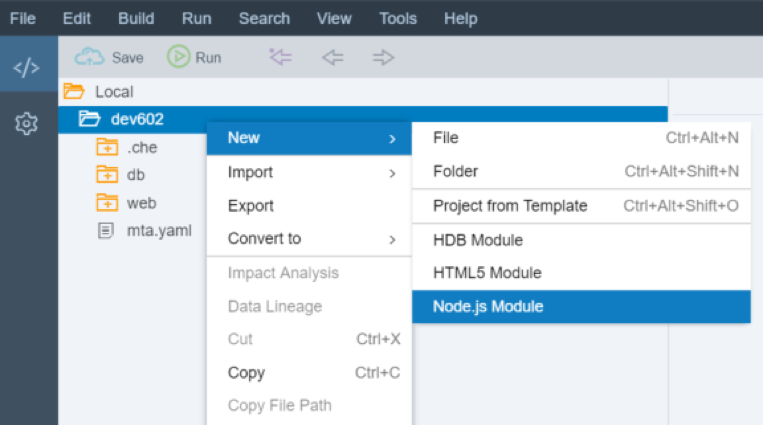

Name the module `js` and press Next.

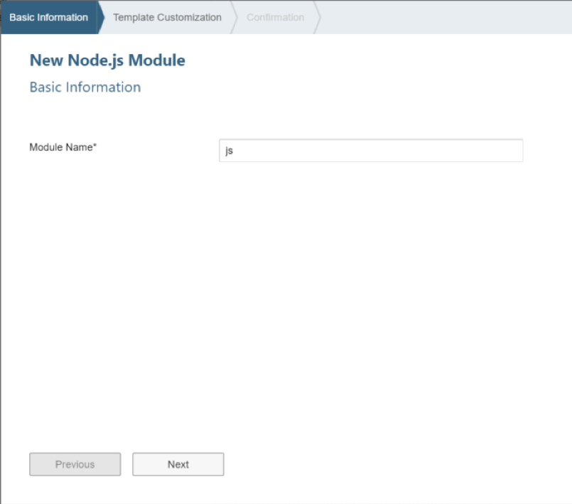

Be sure to check the box Enable XSJS support. Then press Next. Then press Finish.

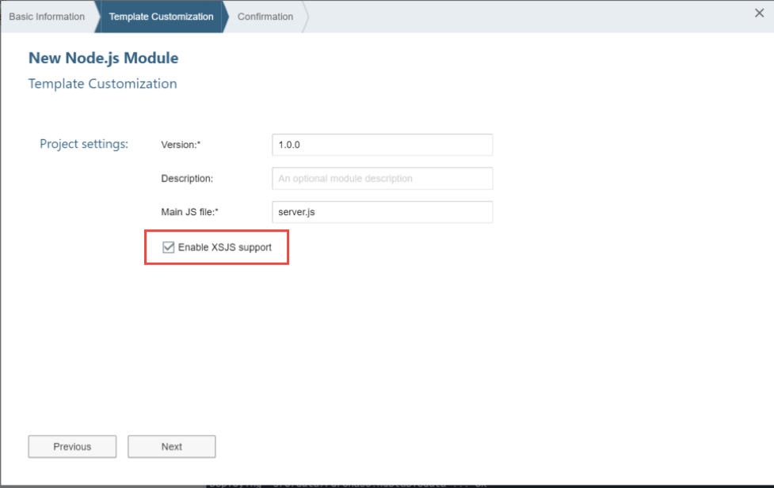

Once again the `mta.yaml` file has been extended to add the `js` module.


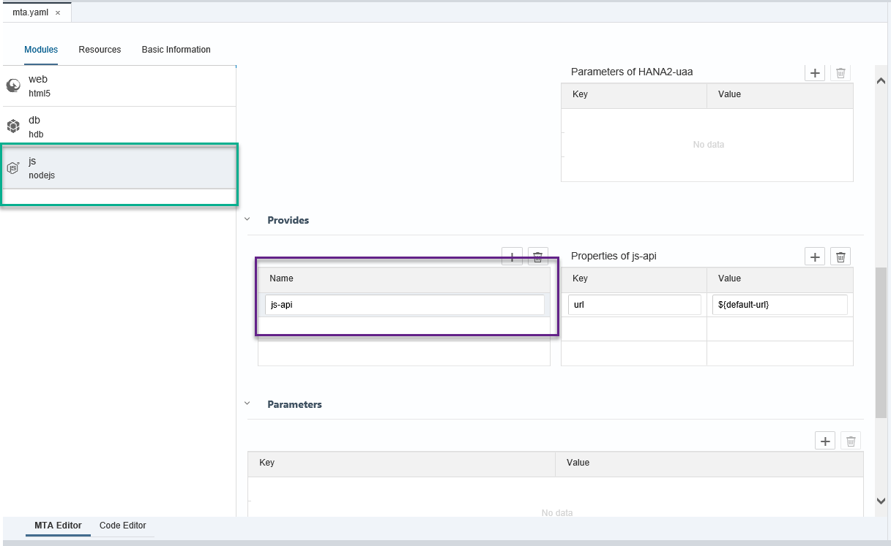

Now you need to add the dependency from the web module to this new Node.js module and a destination route to it as well.

In the `Requires` section, add a `js-api` (this should match the name of the value under `Provides` in the new `js` module) module with group `destinations`. Add the following key-value pairs as the properties for the `js-service` module:

```
name: core-backend
url: ~{url}
forwardAuthToken: true
```

The complete section for the web module should now look like this:

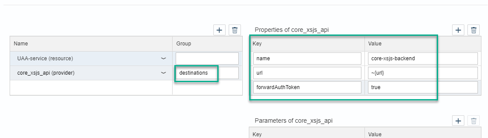


You also need to extend the new `js` module that was just created. It will need a dependency to both the `uaa` and `hdi` resource. You also need to make sure the module is exposed for use in the destination route.
Under `requires` in the `js` service, add the `uaa` service, the HDI container and db module:

```
HANA2-uaa
hdi-container
db

```

The complete section for the `js` module should now look like this:

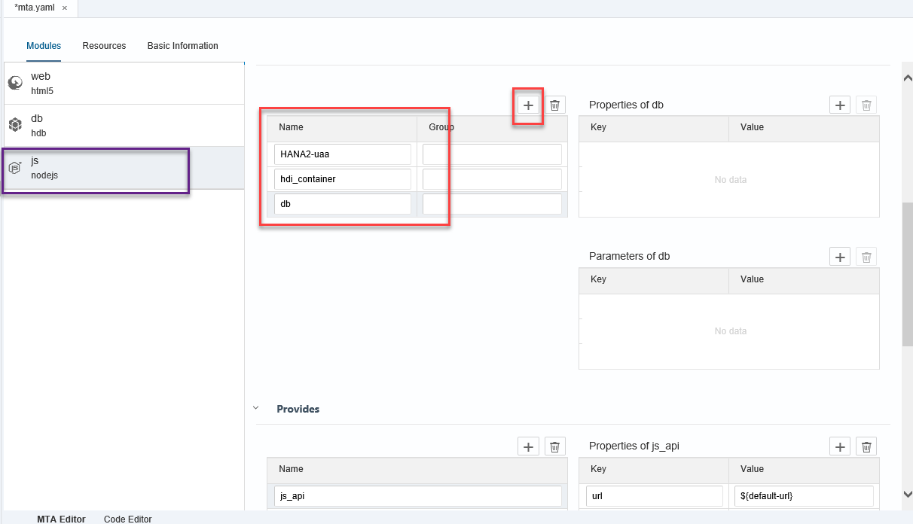

> Hint: Take a look at the Code Editor tab at the bottom. You will see the actual contents of the `MTA.yaml` file. This file is very sensitive to spaces and indentation, so the MTA Editor simplifies edition.

Later at deploy, the destination routing builds a dependency and navigation ability between the two services without ever having to hard code the URLs or ports. They are assigned at deploy time and all references are automatically updated.


If you remember back, you maintained the `xs-app.json` of the App Router [web module](http://www.sap.com/developer/tutorials/xsa-html5-module.html). Now you can add rules for redirecting certain requests to the web module into other modules in this project.

This is where you are configuring that any file request with the extension `.xsjs` or `.xsodata` should be rerouted internally to the Node.js destination that you defined in the `mta.yaml` file.

```
{
  "welcomeFile": "index.html",
  "authenticationMethod": "route",
  "routes": [{
  		"source": "(.*)(.xsjs)",
		"destination": "core-backend",
		"csrfProtection": false,
		"authenticationType": "xsuaa"
		}, {
		"source": "(.*)(.xsodata)",
		"destination": "core-backend",
		"authenticationType": "xsuaa"
  }]
}
```

[DONE]
[ACCORDION-END]  

[ACCORDION-BEGIN [Step 2: ](Enable authentication in your service)]

Return to the `js` folder that you created in this exercise. Like the other applications, this one also starts with a `package.json` file. Different this time is the fact that the startup script is not an SAP provided central node application, but one that you have created via the module creation wizard.

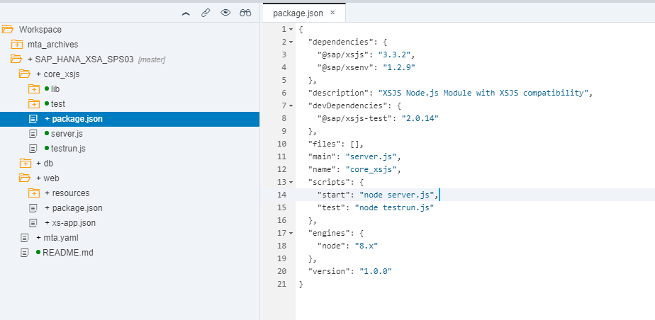

This `server.js` is the Node.js `bootstrap` for XSJS compatibility mode. It uses the SAP provided `xsjs` module and starts it with a few basic parameters. However, remember all the HANA database connectivity options come from the HDI container which you bound to this service via the `mta.yaml` file.  You want to make a few changes to what the wizard has generated. You want authentication on your service, so comment out the `anonymous: true` line. Also uncomment the configure HANA and UAA lines as you will need to load the resource configuration for both of these brokered services. The complete implementation of `server.js` should look like this now:

```
/*eslint no-console: 0, no-unused-vars: 0*/
"use strict";

var xsjs  = require("@sap/xsjs");
var xsenv = require("@sap/xsenv");
var port  = process.env.PORT || 3000;

var options = {
//	anonymous : true, // remove to authenticate calls
	redirectUrl : "/index.xsjs"
};

// configure HANA
try {
	options = Object.assign(options, xsenv.getServices({ hana: {tag: "hana"} }));
} catch (err) {
	console.log("[WARN]", err.message);
}

// configure UAA
try {
	options = Object.assign(options, xsenv.getServices({ uaa: {tag: "xsuaa"} }));
} catch (err) {
	console.log("[WARN]", err.message);
}

// start server
xsjs(options).listen(port);

console.log("Server listening on port %d", port);

```

Remember to **Save.**

[DONE]
[ACCORDION-END]

[ACCORDION-BEGIN [Step 3: ](Create oData service)]

In the lib folder, create a sub-folder called `xsodata`. Create a file named `purchaseOrder.xsodata`.  

```
service {
    "PurchaseOrder.Header"
	  as "POHeader" navigates ("Items" as "POItem");

	"PurchaseOrder.Item"
	  as "POItem";

	association "Items" principal  "POHeader"("PURCHASEORDERID")
	multiplicity "1" dependent "POItem"("PURCHASEORDERID") multiplicity "*";
}


```

Here you expose both the Header and Item tables from your HDI container as separate entities and build a navigation association between the two.

[ACCORDION-END]

[ACCORDION-BEGIN [Step 4: ](Create xsjs services)]
In the lib folder, create a sub-folder called `xsjs`.  Create a file named `hdb.xsjs`.  Here is the source code for this file.

```
/*eslint no-console: 0, no-unused-vars: 0, dot-notation: 0*/
"use strict";

var conn = $.hdb.getConnection();
var query = "SELECT FROM PurchaseOrder.Item { " +
        " PURCHASEORDERID as \"PurchaseOrderItemId\", " +
          " PURCHASEORDERITEM as \"ItemPos\", " +
          " PRODUCT as \"ProductID\", " +
          " GROSSAMOUNT as \"Amount\" " +
          " } ";
var rs = conn.executeQuery(query);

var body = "";

for(var i = 0; i < rs.length; i++){
 if(rs[i]["Amount"] >= 500){
body += rs[i]["PurchaseOrderItemId"] + "\t" + rs[i]["ItemPos"] + "\t" +
    rs[i]["ProductID"] + "\t" + rs[i]["Amount"] + "\n";
 }
}


$.response.setBody(body);
$.response.contentType = "application/vnd.ms-excel; charset=utf-16le";
$.response.headers.set("Content-Disposition",
  "attachment; filename=Excel.xls");
$.response.status = $.net.http.OK;

```
This logic reads data from your item table, formats it as text table delimited and then sends it out in a way that the browser will treat it as an Excel download.

Create a second file named `exercisesMaster.xsjs`.  Here is the source code for this file.  It sends the current user and language back to the client for filling in the header of the UI.

```
/*eslint no-console: 0, no-unused-vars: 0, dot-notation: 0*/
"use strict";

function fillSessionInfo(){
	var body = "";
	body = JSON.stringify({
		"session" : [{"UserName": $.session.getUsername(), "Language": $.session.language}]
	});
	$.response.contentType = "application/json";
	$.response.setBody(body);
	$.response.status = $.net.http.OK;
}


var aCmd = $.request.parameters.get("cmd");
switch (aCmd) {
case "getSessionInfo":
	fillSessionInfo();
	break;
default:
	$.response.status = $.net.http.INTERNAL_SERVER_ERROR;
	$.response.setBody("Invalid Request Method");
}

```

Create a third file named `csrf.xsjs`.  This is an empty file which you can use to request a `CSRF` token for update/insert/delete operations.


Create a forth file named `procedures.xsjs`.  This example shows you how to call a stored procedure from XSJS.

```
/*eslint no-console: 0, no-unused-vars: 0, dot-notation: 0, no-use-before-define: 0*/
"use strict";

/**
@function JSON as returned by hdb
*/
function hdbDirectTest(){
  var results = _selection();
//Pass output to response		
$.response.status = $.net.http.OK;
$.response.contentType = "application/json";
$.response.setBody(JSON.stringify(results));

}

/**
@function Flattended JSON structure
*/
function hdbFlattenedTest(){
	outputJSON(_selection().EX_TOP_3_EMP_PO_COMBINED_CNT);
}

/**
@function load/call the procedure
*/
function _selection(){
	var connection = $.hdb.getConnection();

	var getPOHeaderData = connection.loadProcedure(
		"get_po_header_data");

	var results = getPOHeaderData();
	return results;
}

/**
@function Puts a JSON object into the Response Object
@param {object} jsonOut - JSON Object
*/
function outputJSON(jsonOut){
	var out = [];
	for(var i=0; i<jsonOut.length;i++){
		out.push(jsonOut[i]);
	}
	$.response.status = $.net.http.OK;
	$.response.contentType = "application/json";
	$.response.setBody(JSON.stringify(out));
}


var aCmd = $.request.parameters.get("cmd");
switch (aCmd) {
case "direct":
	hdbDirectTest();
	break;
case "flattened":
	hdbFlattenedTest();
	break;
default:
	hdbDirectTest();
	break;
}

```

[ACCORDION-BEGIN [Step 5: ](Call node.js from XSJS)]
Create a 5th file called `os.xsjs`. This example shows you how you can call Node.js from XSJS.

```
/*eslint no-console: 0, no-unused-vars: 0*/
"use strict";

var os = $.require("os");
var output = {};

output.tmpdir = os.tmpdir();
output.endianness = os.endianness();
output.hostname = os.hostname();
output.type = os.type();
output.platform = os.platform();
output.arch = os.arch();
output.release = os.release();
output.uptime = os.uptime();
output.loadavg = os.loadavg();
output.totalmem = os.totalmem();
output.freemem = os.freemem();
output.cpus = os.cpus();
output.networkInfraces = os.networkInterfaces();


$.response.status = $.net.http.OK;
$.response.contentType = "application/json";
$.response.setBody(JSON.stringify(output));

```
[DONE]
[ACCORDION-END]  

[ACCORDION-BEGIN [Step 5: ](Execute the js module)]

**Build** the entire project.

You can now run the `js` module.


You should see that the build and deploy was successful and the JS module is running.

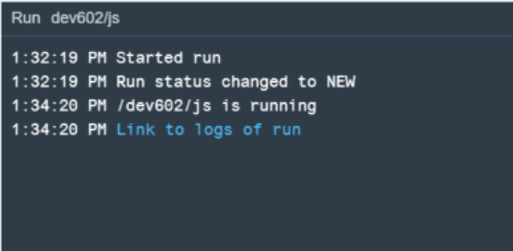


So now run the `web` module. It will need to rebuild and redeploy due to the added dependency to the `js` module.

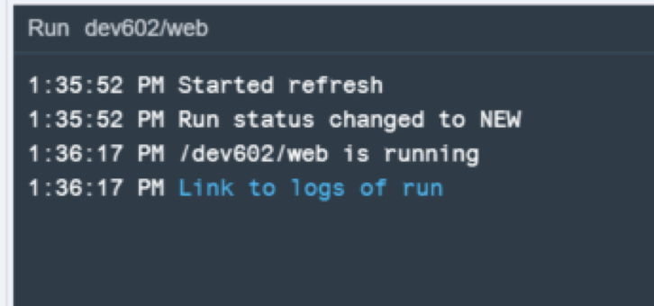

In the running tab, you should see the `index.html` from earlier. You can add the URL to your `xsjs` service `/index.xsjs` in the browser. You will see that your `xsjs` service is accessible via the HTML5 module runtime. The HTML5 module functions as a proxy and performs the routing to the other service internally.

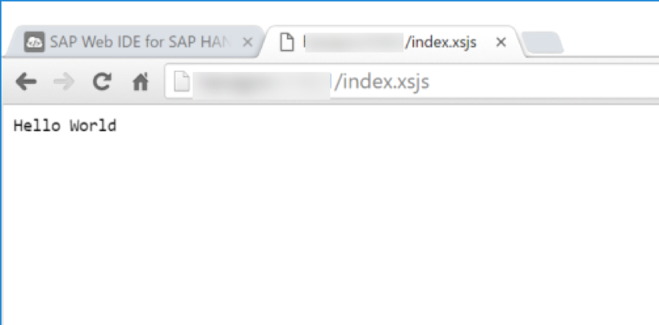


`/xsjs/hdb.xsjs` reads data from our new Purchase Order table you created in HANA in the previous exercise and exports it as an Excel text file. Feel free to test the other example `xsjs` files you created in this exercise as well.

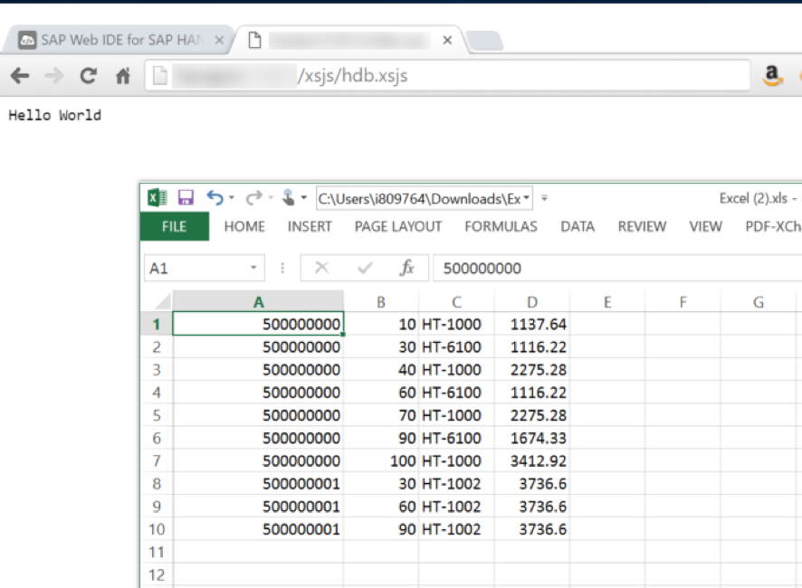

`/xsodata/purchaseOrder.xsodata` gives you access to a full OData service for the Purchase Order header and item tables you created in the previous exercise.

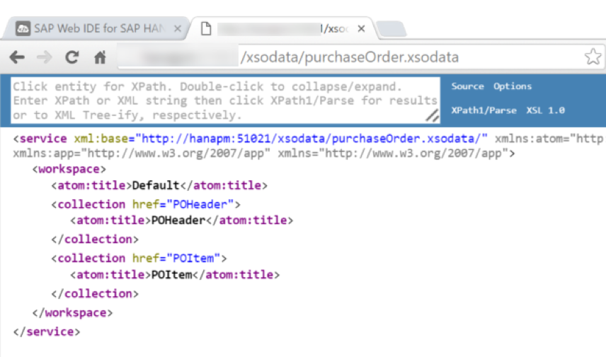

[DONE]
[ACCORDION-END]  

## Next Steps
 - [Create a simple OData service](http://www.sap.com/developer/tutorials/xsa-xsodata.html)
