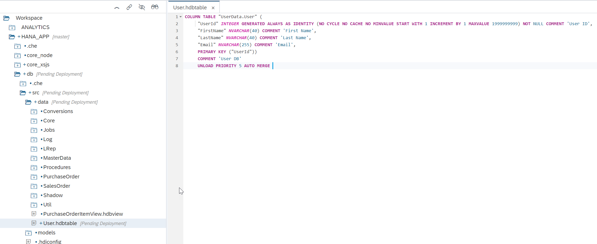
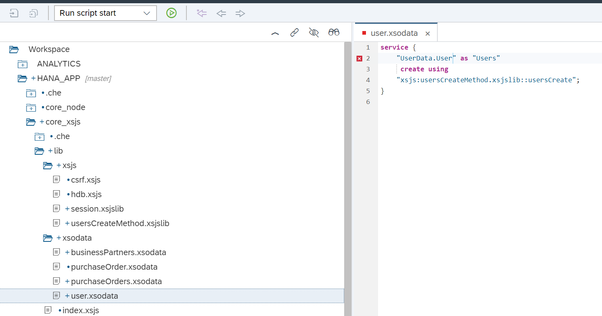
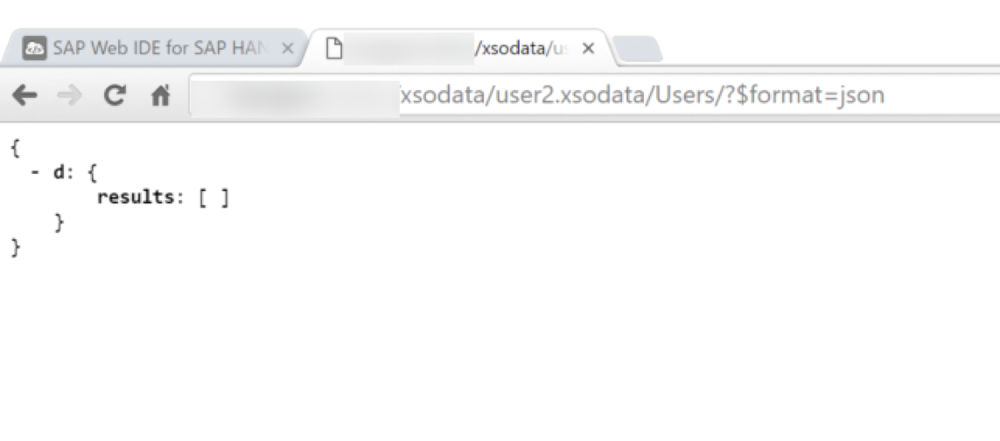

## Prerequisites  
- **Proficiency:** Intermediate
- **Tutorials:** [Creating an OData Service with an Entity Relationship](http://www.sap.com/developer/tutorials/xsa-xsodata-entity.html)

## Next Steps
- [Tutorial Catalog](http://www.sap.com/developer/tutorial-navigator.html)

## Details
### You will learn  
Now to expand your code to include an XSJS exit.

### Time to Complete
**15 Min**.

---

[ACCORDION-BEGIN [Step 1: ](Create User entity and DB artifacts)]

You will first create the entities that will be modified by the XSJS exit in your OData service. The exit will create a new User in the User table.

In your `scr\data` folder, create a file called `UserData.hdbcds`. The editor may automatically open the Graphical Editor, in that case, right-click on the new file and Open with the `Code Editor`.



Delete any existing content and paste the following entities definition:

```
using Core;

@OData.publish : true
context UserData {
   entity User {
      key UserId    : Integer;
          FirstName : String(40);
          LastName  : String(40);
          Email     : String(255);
   };
   entity User2 {
      key UserId    : Integer;
          FirstName : String(40);
          LastName  : String(40);
          Email     : String(255);
   };
};

```

Additionally, if you have not done so yet, under `src`, create a folder called `sequences` and add a file called `userSeqId.hdbsequence` with the following code:

```
SEQUENCE "userSeqId" START WITH 1000000225 MAXVALUE 1999999999
RESET BY SELECT IFNULL(MAX("UserId"), 1000000225) + 1 FROM "UserData.User"
```

This sequence will serve the auto-increment id for the new entries in the User table.

**Build the `src` folder**.


[DONE]
[ACCORDION-END]  

[ACCORDION-BEGIN [Step 2: ](Create the first XSJS library)]

In the `xsjs` folder create the file `usersCreateMethod.xsjslib`. This is a server-side JavaScript library. This will be the exit code that performs the validation before the insert of the new record. Here is the code for this file.

```
/*eslint no-console: 0, no-unused-vars: 0, dot-notation: 0, no-use-before-define: 0, no-redeclare: 0*/
"use strict";

$.import("user.xsjs", "session");
var SESSIONINFO = $.user.xsjs.session;

/**
@param {connection} Connection - The SQL connection used in the OData request
@param {beforeTableName} String - The name of a temporary table with the single entry before the operation (UPDATE and DELETE events only)
@param {afterTableName} String -The name of a temporary table with the single entry after the operation (CREATE and UPDATE events only)
*/
function usersCreate(param){
	var after = param.afterTableName;    

	//Get Input New Record Values
	var	pStmt = param.connection.prepareStatement("select * from \"" + after + "\"");	 
	var User = SESSIONINFO.recordSetToJSON(pStmt.executeQuery(), "Details");
	pStmt.close();


	//Validate Email
	if(!validateEmail(User.Details[0].Email)){
		throw "Invalid email for "  + User.Details[0].FirstName +  
        " No Way! E-Mail must be valid and " + User.Details[0].Email + " has problems";
	}

	//Get Next Personnel Number
	pStmt = param.connection.prepareStatement("select \"userSeqId\".NEXTVAL from dummy");
	var rs = pStmt.executeQuery();
	var PersNo = "";
	while (rs.next()) {
		PersNo = rs.getString(1);
	}
	pStmt.close();
	//Insert Record into DB Table and Temp Output Table
	for( var i = 0; i<2; i++){
		var pStmt;
		if(i<1){
			pStmt = param.connection.prepareStatement("insert into \"UserData.User\" values(?,?,?,?,?)" );			
		}else{
			pStmt = param.connection.prepareStatement("TRUNCATE TABLE \"" + after + "\"" );
			pStmt.executeUpdate();
			pStmt.close();
			pStmt = param.connection.prepareStatement("insert into \"" + after + "\" values(?,?,?,?,?)" );		
		}
		pStmt.setString(1, PersNo.toString());
		pStmt.setString(2, User.Details[0].FirstName.toString());		pStmt.setString(3, User.Details[0].LastName.toString());
		pStmt.setString(4, User.Details[0].Email.toString());
		pStmt.setString(5, "");
		pStmt.executeUpdate();
		pStmt.close();
	}
}

function validateEmail(email) {
    var re = /^(([^<>()[\]\\.,;:\s@\"]+(\.[^<>()[\]\\.,;:\s@\"]+)*)|(\".+\"))@((\[[0-9]{1,3}\.[0-9]{1,3}\.[0-9]{1,3}\.[0-9]{1,3}\])|(([a-zA-Z\-0-9]+\.)+[a-zA-Z]{2,}))$/;
    return re.test(email);
}

```

[DONE]
[ACCORDION-END]  


[ACCORDION-BEGIN [Step 3: ](Create new OData service)]

Create another OData service named `user.xsodata` for `User.Details`. You will link the **Create** operation to the `usersCreate` function on the server-side JavaScript library you have just created.

```
service {
	"User.Details" as "Users"
	  create using "xsjs:usersCreateMethod.xsjslib::usersCreate";
}
```

And it should look like this:


[DONE]
[ACCORDION-END]  


[ACCORDION-BEGIN [Step 4: ](Create the second XSJS library)]

Create another file in the `xsjs` folder named `session.xsjslib`. Here is the code for this file.

```
/**  
@function Outputs the Session user and Language as JSON in the Response body
*/
function fillSessionInfo(){
	var body = '';
	body = JSON.stringify({
		"session" : [{"UserName": $.session.getUsername(), "Language": $.session.language}]
	});
	$.response.contentType = 'application/json';
	$.response.setBody(body);
	$.response.status = $.net.http.OK;
}

/**
@function Escape Special Characters in JSON strings
@param {string} input - Input String
@returns {string} the same string as the input but now escaped
*/
function escapeSpecialChars(input) {
	if(typeof(input) != 'undefined' && input != null)
	{
	return input
    .replace(/[\\]/g, '\\\\')
    .replace(/[\"]/g, '\\\"')
    .replace(/[\/]/g, '\\/')
    .replace(/[\b]/g, '\\b')
    .replace(/[\f]/g, '\\f')
    .replace(/[\n]/g, '\\n')
    .replace(/[\r]/g, '\\r')
    .replace(/[\t]/g, '\\t'); }
	else{

		return "";
	}
}

/**
@function Escape Special Characters in Text strings (CSV and Tab Delimited)
@param {string} input - Input String
@returns {string} the same string as the input but now escaped
*/
function escapeSpecialCharsText(input) {
	if(typeof(input) != 'undefined' && input != null)
	{
	input.replace(/[\"]/g, '\"\"');
	if(input.indexOf(",") >= 0 ||
	   input.indexOf("\t") >= 0 ||
	   input.indexOf(";") >= 0 ||
	   input.indexOf("\n") >= 0 ||
	   input.indexOf('"') >= 0 )
	{input = '"'+input+'"';}

	return input;
	}
	else{

		return "";
	}
}

/**
@function Converts any XSJS RecordSet object to a Text String output
@param {object} rs - XSJS Record Set object
@param {optional Boolean} bHeaders - defines if you want column headers output as well; defaults to true
@param {optional String} delimiter - supplies the delimiter used between columns; defaults to tab (\\t)
@returns {String} The text string with the contents of the record set
*/
function recordSetToText(rs,bHeaders,delimiter){
	bHeaders = typeof bHeaders !== 'undefined' ? bHeaders : true;
	delimiter = typeof delimiter !== 'undefined' ? delimiter : '\t'; //Default to Tab Delimited

	var outputString = '';
	var value = '';
	var meta = rs.getMetaData();
	var colCount = meta.getColumnCount();

	//Process Headers
	if(bHeaders){
		for (var i=1; i<=colCount; i++) {
			outputString += escapeSpecialCharsText(meta.getColumnLabel(i)) + delimiter;			
		}
		outputString += '\n';  //Add New Line
	}
	while (rs.next()) {
		for (var i=1; i<=colCount; i++) {
		     switch(meta.getColumnType(i)) {
		     case $.db.types.VARCHAR:
		     case $.db.types.CHAR:
		          value += rs.getString(i);
		          break;
		     case $.db.types.NVARCHAR:
		     case $.db.types.NCHAR:
		     case $.db.types.SHORTTEXT:
		          value += rs.getNString(i);
		          break;
		     case $.db.types.TINYINT:
		     case $.db.types.SMALLINT:
		     case $.db.types.INT:
		     case $.db.types.BIGINT:
		          value += rs.getInteger(i);
		          break;
		     case $.db.types.DOUBLE:
		          value += rs.getDouble(i);
		          break;
		     case $.db.types.DECIMAL:
		          value += rs.getDecimal(i);
		          break;
		     case $.db.types.REAL:
		          value += rs.getReal(i);
		          break;
		     case $.db.types.NCLOB:
		     case $.db.types.TEXT:
		          value += rs.getNClob(i);
		          break;
		     case $.db.types.CLOB:
		          value += rs.getClob(i);
		          break;	          
		     case $.db.types.BLOB:
		    	  value += $.util.convert.encodeBase64(rs.getBlob(i));
		          break;	          
		     case $.db.types.DATE:
		          value += rs.getDate(i);
		          break;
		     case $.db.types.TIME:
		          value += rs.getTime(i);
		          break;
		     case $.db.types.TIMESTAMP:
		          value += rs.getTimestamp(i);
		          break;
		     case $.db.types.SECONDDATE:
		          value += rs.getSeconddate(i);
		          break;
		     default:
		          value += rs.getString(i);
		     }
			   outputString += escapeSpecialCharsText(value) + delimiter;
			   value = '';
		     }
			outputString += '\n';  //Add New Line
		}


	return outputString;
}

/**
@function Converts any XSJS RecordSet object to a JSON Object
@param {object} rs - XSJS Record Set object
@param {optional String} rsName - name of the record set object in the JSON
@returns {object} JSON representation of the record set data
*/
function recordSetToJSON(rs,rsName){
	rsName = typeof rsName !== 'undefined' ? rsName : 'entries';

	var meta = rs.getMetaData();
	var colCount = meta.getColumnCount();
	var values=[];
	var table=[];
	var value="";
	while (rs.next()) {
	for (var i=1; i<=colCount; i++) {
		value = '"'+meta.getColumnLabel(i)+'" : ';
	     switch(meta.getColumnType(i)) {
	     case $.db.types.VARCHAR:
	     case $.db.types.CHAR:
	          value += '"'+ escapeSpecialChars(rs.getString(i))+'"';
	          break;
	     case $.db.types.NVARCHAR:
	     case $.db.types.NCHAR:
	     case $.db.types.SHORTTEXT:
	          value += '"'+escapeSpecialChars(rs.getNString(i))+'"';
	          break;
	     case $.db.types.TINYINT:
	     case $.db.types.SMALLINT:
	     case $.db.types.INT:
	     case $.db.types.BIGINT:
	          value += rs.getInteger(i);
	          break;
	     case $.db.types.DOUBLE:
	          value += rs.getDouble(i);
	          break;
	     case $.db.types.DECIMAL:
	          value += rs.getDecimal(i);
	          break;
	     case $.db.types.REAL:
	          value += rs.getReal(i);
	          break;
	     case $.db.types.NCLOB:
	     case $.db.types.TEXT:
	          value += '"'+ escapeSpecialChars(rs.getNClob(i))+'"';
	          break;
	     case $.db.types.CLOB:
	          value += '"'+ escapeSpecialChars(rs.getClob(i))+'"';
	          break;	          
	     case $.db.types.BLOB:
	    	  value += '"'+ $.util.convert.encodeBase64(rs.getBlob(i))+'"';
	          break;	          
	     case $.db.types.DATE:
	    	 var dateTemp = new Date();
	    	 dateTemp.setDate(rs.getDate(i));
	    	 var dateString = dateTemp.toJSON();
	         value += '"'+dateString+'"';
	          break;
	     case $.db.types.TIME:
	    	 var dateTemp = new Date();
	    	 dateTemp.setDate(rs.getTime(i));
	    	 var dateString = dateTemp.toJSON();
	         value += '"'+dateString+'"';
	          break;
         case $.db.types.TIMESTAMP:
             var dateTemp = new Date();
             dateTemp.setDate(rs.getTimestamp(i));
             var dateString = dateTemp.toJSON();
             value += '"'+dateString+'"';
             break;
	     case $.db.types.SECONDDATE:
	    	 var dateTemp = new Date();
	    	 dateTemp.setDate(rs.getSeconddate(i));
	    	 var dateString = dateTemp.toJSON();
	         value += '"'+dateString+'"';
	          break;
	     default:
	          value += '"'+escapeSpecialChars(rs.getString(i))+'"';
	     }
	     values.push(value);
	     }
	   table.push('{'+values+'}');
	}
	return 	JSON.parse('{"'+ rsName +'" : [' + table	+']}');

}
```

[DONE]
[ACCORDION-END]  

[ACCORDION-BEGIN [Step 5: ](Save and run)]

Save and run the Node.js and then run the web module. Change the URL to `/xsodata/user.xsodata` to see if the service is available.



 Unfortunately its much more complicated to test Create/Update/Delete methods from the browser as they create other HTTP verbs. Browse into the next steps in the XS Advanced tutorials for SAPUI5 interfaces to employ these services.
[DONE]
[ACCORDION-END]  


## Next Steps
- [Tutorial Catalog](http://www.sap.com/developer/tutorial-navigator.html)
