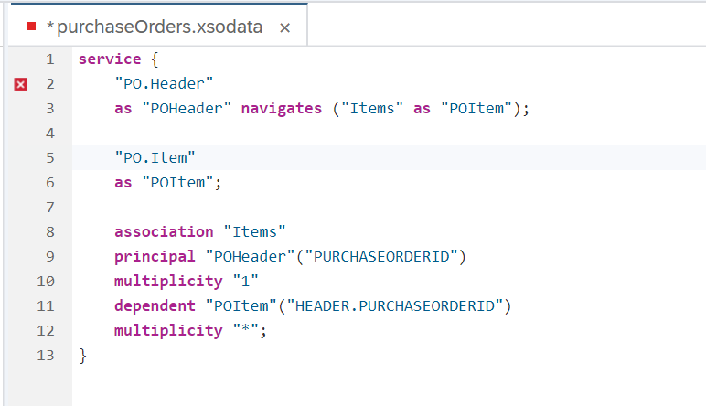
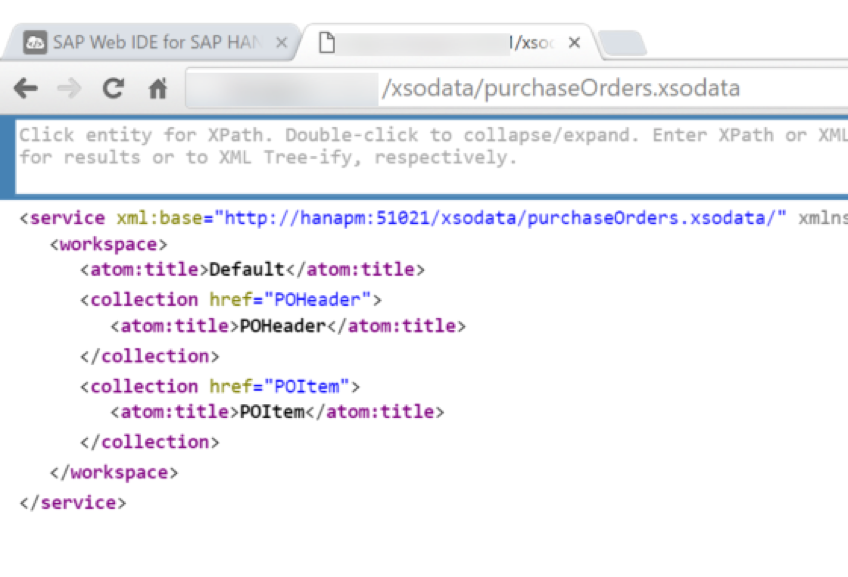
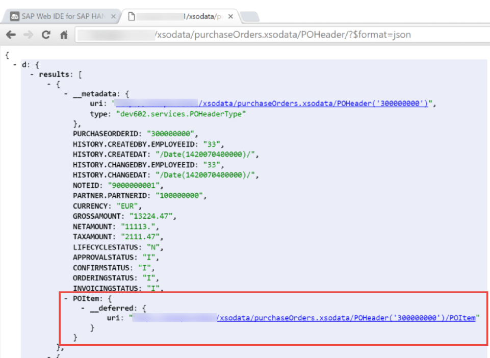
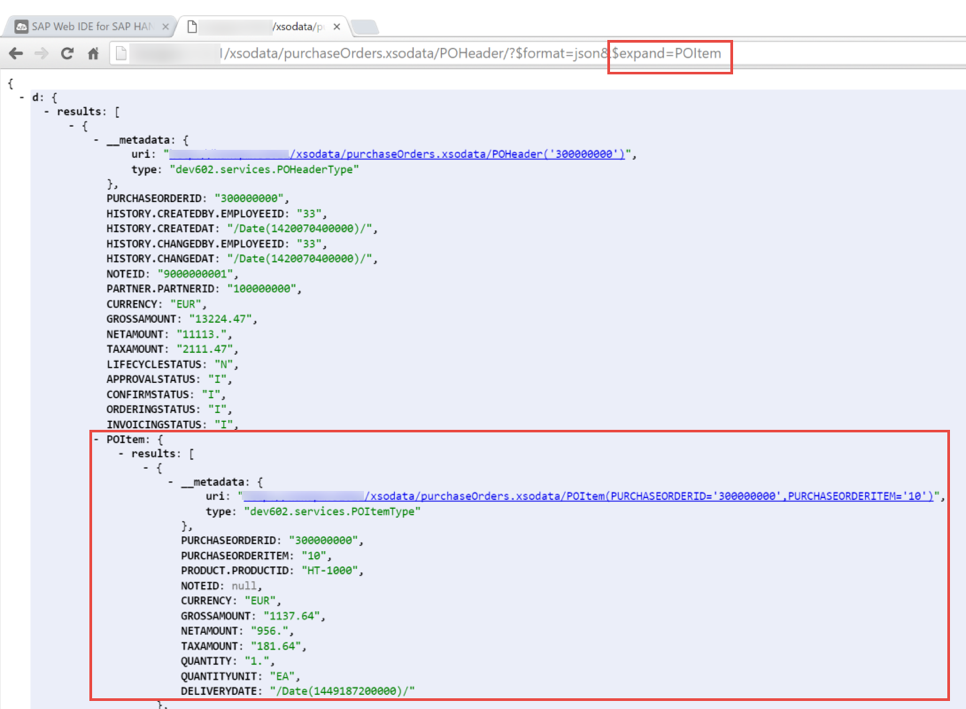

## Prerequisites  
- This tutorial is designed for SAP HANA on premise and SAP HANA, express edition. It is not designed for SAP HANA Cloud.
- **Proficiency:** Intermediate
- **Tutorials:** [Create a Simple OData Service](https://developers.sap.com/tutorials/xsa-xsodata.html)

## Next Steps
- [Creating an OData Service with Create Operation and XSJS Exit](https://developers.sap.com/tutorials/xsa-xsodata-create.html)

## Details
### You will learn  
The first example of this exercise was very simplistic because it only exposed one database table as a single entity. Often you need to also represent relationships between multiple entities. For example you might want to build an OData service which has both the Purchase Order Header and Items. For this you would build a 1:many relationship between the two entities.


### Time to Complete
**10 Min**.

---


[ACCORDION-BEGIN [Step 1: ](Create new OData service)]

Create an OData service called `purchaseOrders.xsodata`

```text
service {
	"PO.Header"
	as "POHeader" navigates ("Items" as "POItem");

	"PO.Item"
	as "POItem";

	association "Items"
	principal "POHeader"("PURCHASEORDERID")
	multiplicity "1"
	dependent "POItem"("HEADER.PURCHASEORDERID")
	multiplicity "*";
}
```

And looks like this:



And if you see the error marker, you can safely ignore it. It is unfortunately a false error.

[DONE]

[ACCORDION-END]  

[ACCORDION-BEGIN [Step 2: ](Save, run, and test)]

Run the `core_xsjs` module first, and then the `web` module. Replace the end of the URL to access the OData service and notice that the base service definition now has two entities.



The PO Header data now has a hyperlink relationship to the item entity.



[DONE]

[ACCORDION-END]  

[ACCORDION-BEGIN [Step 4: ](Expand the child elements)]

Associations can be an excellent way to load child elements on demand; however there is also an option to expand the children details in place so that all levels can be retrieved with one request.  Test the service again using the same steps as in the previous section of this exercise. This time add `$expand=POItem` to the end of the URL. You will then see that all the items are embedded within each header record (i.e., it is no longer `deferred` as in the previous test).



[DONE]

[ACCORDION-END]  
